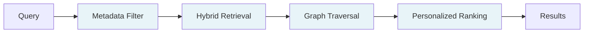

# Introduction

> HydraDB is a graph-first, unified state infrastructure for AI—one API for memory, knowledge, and everything in between.

## What HydraDB is

AI agents are stateless by default. Every session starts from zero. The field of memory and context infrastructure exists to fix this, but most of today's stack does it badly.

HydraDB is a retrieval API for stateful AI agents. You ingest your documents, messages, user preferences, and workflows, and HydraDB autonomously prepares a context graph that captures entities and relationships. HydraDB returns the *useful* context whenever your agent requests it.

> *VectorDBs find what's similar. HydraDB finds what's useful.*

HydraDB is best for teams building scalable, stateful AI agents, whether you're at 10K documents or 10M.

Moreover, **HydraDB** is built as a developer-first plug-and-play context infrastructure. Imagine Stripe for context, instead of payments. Now, rather than hacking together brittle pipelines for embedding tools, vector databases, ranking tweaks, and caching layers, HydraDB can do all of that in a single API call, with better retrieval compared to traditional VectorDB.

**Some use cases:**

- Customer support agents grounded in real customer history and preferences
- Coding agents with persistent memory of a codebase and team conventions
- Clinical companions tracking patient context across visits
- Research copilots reasoning across papers, authors, findings
- Internal knowledge assistants spanning Slack, Notion, Drive, and email
- Consumer AI apps where every user gets a "second brain" that evolves over time

Find more brilliant use cases at [Cookbooks](/cookbooks)

**Skip ahead:** [Quickstart](/quickstart) · [API Reference](/api-reference) · [SDKs](/sdk/overview)

---

## Why vector search breaks for stateful AI

Vector databases are search engines. They answer one question well: *"What's most similar to this query?"*

That's enough for static retrieval, but it breaks for **stateful agents**. The reason is structural: vector search treats every chunk as an isolated point. There's no concept of who said what, what's contradicted later, what's stale, or how an entity has evolved.

Embeddings can't tell a Q3 renewal clause from a Q1 termination notice when the language is close enough. Ask your AI about a contract, and at 10M+ documents, it will confidently return an answer pulled from a completely different client's file. The vector similarity might read 0.94. The answer is still wrong.

The failure mode isn't the embedding model. It's the assumption that semantic similarity equals relevance.

## How HydraDB is different

HydraDB is **graph-first, not graph-optional**. Most other tools are vector-first with a graph layer bolted on. HydraDB inverts that. For us, the graph is the primary substrate, with vectors as one of several signals feeding into it.

It builds an **ontology-first context graph** over your data. Entities, relationships, and temporal signals are extracted automatically. When you ask about "Apple," HydraDB knows you mean the company, not the fruit.

Every retrieval runs through a multi-stage pipeline:

Each stage adds a signal that vector search cannot provide. Metadata filters scope the search deterministically. Graph traversal surfaces structural relationships. Personalized ranking adapts to the user, the agent, and the task by weighting recency, frequency, semantic similarity, and forced relations.

## What truly sets HydraDB apart

**One endpoint, one stack.** 
HydraDB replaces the common stack of separate embedders, graph builders, vector stores, and retrieval layers. One API manages memories, preferences, semantic knowledge, and relational context, all bundled together.

**Memory and Knowledge as distinct primitives.** 
Other tools treat all stored data the same way. HydraDB separates them at the infrastructure level: memory is dynamic with interaction-level state (user preferences, conversation history, evolving facts), while knowledge is static and contains document-level context (enterprise documents, product specs, codebases), which is stored across different storage layers and retrieval paths, but with a unified API.

**Composable and unopinionated.**
HydraDB provides the infrastructure and gets out of the way. You control what gets stored as vectors, what becomes graph nodes, which relationships matter, and how retrieval is parameterized by the recency alpha, forced relations, custom embeddings, and custom metadata. The Stripe philosophy applied to AI state: We handle the layers, while you decide the icing.

## Key features

- **Ontology-first context graph** - entities and relationships extracted automatically
- **Plug-and-play SDK** - TypeScript and Python with full type safety
- **Multi-tenant by default** - isolated workspaces at tenant and sub-tenant levels
- **Memory + Knowledge primitives** - separated storage, unified API
- **Hybrid retrieval** - semantic, keyword, graph, and metadata signals in one API call
- **Bring-your-own embeddings** - plug in fine-tuned models when needed
- **One-click self-hosting** - deploy your own instance with a single Docker command

## Get started

1. Sign up at [app.hydradb.com](https://app.hydradb.com) for your API key
2. Follow the [Quickstart](/quickstart) and get your first recall in five minutes
3. Explore [Core Concepts](/core-concepts) and the [API Reference](/api-reference) for detailed steps to use HydraDB.

For enterprise onboarding, contact [founders@hydradb.com](mailto:founders@hydradb.com).
