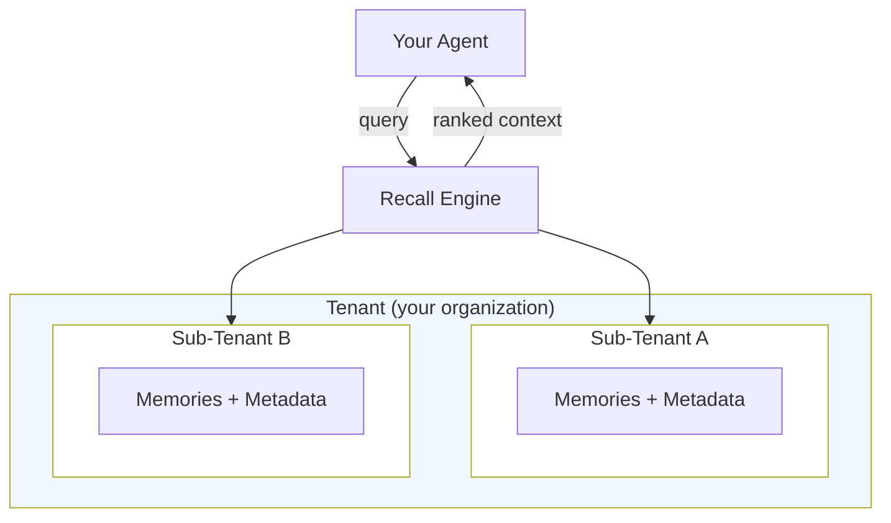

# Core Concepts

> A tour of the four primitives that make HydraDB work. Each section is a short overview that links to its deeper [Essentials](/essentials) page.

## The four primitives

| Primitive | What it is | Deep dive |
|---|---|---|
| **Memories** | Stored context an agent can write and recall later | [Essentials → Memories](/essentials/memories) |
| **Recall** | How agents read context from HydraDB | [Essentials → Recall](/essentials/recall) |
| **Tenants** | Isolated workspaces with sub-tenant hierarchy | [Essentials → Multi-Tenant](/essentials/multi-tenant) |
| **Metadata** | Structured filters for deterministic retrieval | [Essentials → Metadata](/essentials/metadata) |

**Looking for something else?** [API Reference](/api-reference) · [Quickstart](/quickstart) · [Architecture](/architecture)

---

## The mental model

Memories live inside sub-tenants. Sub-tenants live inside the tenants. Metadata scopes and filters them. Recall is how your agent reads across the whole structure.



---

## Memories

Memories are the atoms of HydraDB. Any piece of unstructured content that carries meaning — documents, PDFs, emails, messages, webpages, presentations, reports, user preferences, past conversations, or CSVs — becomes a memory.

HydraDB parses, chunks, embeds, and links each memory into a shared context graph.

HydraDB treats memory and knowledge as **distinct primitives**, which is one of the things that sets it apart from other tools. Memory is dynamic, interaction-level state that evolves with every interaction; knowledge is static, document-level context that gets versioned and replaced. Same retrieval pipeline, different storage layers.

There are three classes you'll work with:

- **User memories** - personal preferences and interaction history (dynamic memory)
- **Knowledge memories** - organizational content like Slack, PDFs, Notion (static knowledge)
- **Organizational memories** - team roles, departments, and shared policies available to all agents

Read More: [Essentials → Memories](/essentials/memories)

---

## Recall

Recall is how agents read from HydraDB. Storing data is easy; knowing *what* to retrieve, *when*, and *why* is the hard part.

HydraDB's recall is not a vector search. It's a multi-stage pipeline that combines metadata filtering, semantic and keyword retrieval, graph traversal, and personalized ranking based on the user, agent, and task. All of this, in a single API call.

The pipeline makes graph-first retrieval feel like a single call rather than a series of five separate services. Vector search asks *"what's similar to my query?"* while graph traversal asks *"what's structurally connected to it?"* HydraDB does both, weighting the results by usefulness for the current task.

Read More: [Essentials → Recall](/essentials/recall)

---

## Tenants and Sub-Tenants

A **Tenant** is a workspace. Each Tenant is completely isolated from any other. In most cases, each organization has a single Tenant.

A **sub-tenant** is a subdivision inside a tenant. It may represent a team, a project, or an individual user, depending on your use case.

- **B2B** - each customer is a tenant; their departments are sub-tenants
- **B2C** - one tenant for the organisation; each end user is a sub-tenant

Read More: [Essentials → Multi-Tenant Support](/essentials/multi-tenant)

---

## Metadata

Metadata makes recall deterministic. Semantic search is powerful, but production systems need hard filters like "only Engineering docs," "only last 30 days," "only approved policies."

Two tiers:

- **`metadata`** - organizational fields defined at tenant creation. These are immutable schemas.
- **`additional_metadata`** - per-document fields attached at ingestion of memories. Fully flexible.

At ingestion:

```json
{
  "metadata": { "compliance_framework": "SOC2", "region": "us" },
  "additional_metadata": {
    "project": "phoenix",
    "owner": "sarah.chen@acme.com",
    "status": "approved",
    "tags": ["security", "api"]
 }
}
```

At query time:

```json
{
  "query": "latest pricing strategy",
  "metadata_filters": { "project": "phoenix", "status": "approved" }
}
```

Filters apply *before* semantic ranking, which turns "semantically similar" into "semantically similar *and* properly scoped."

Read More: [Essentials → Metadata](/essentials/metadata)

---

## What's next

- [Architecture Overview](/architecture) - how the graph, vector store, and ranking layers fit together
- [Quickstart](/quickstart) - build your first integration in five minutes
- [Essentials](/essentials) - deeper coverage of every concept on this page