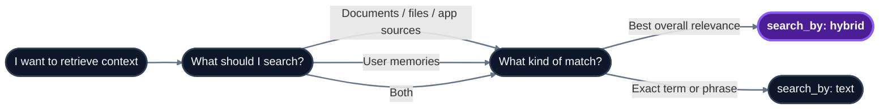

\[todo\]: change the `search_by` to `retrieve_by`

Use this page to choose the right retrieval strategy before opening the full endpoint reference. Retrieval has three main decisions: what to search (`type`), how to match (`search_by`), and how much retrieval work to spend (`mode`).

## Common use-cases and their configurations

<AccordionGroup>
  <Accordion title="1. Knowledge - retrieval from documents">
    <CodeGroup>

    ```bash cURL
    curl -X POST 'https://api.hydradb.com/search' \
      -H "Authorization: Bearer <your_api_key>" \
      -H "API-Version: 2" \
      -H "Content-Type: application/json" \
      -d '{
        "tenant_id": "acme_corp",
        "query": "What is our refund policy?",
        "type": "knowledge",
        "search_by": "hybrid",
        "mode": "thinking",
        "max_results": 10,
        "graph_context": true
      }'
    ```

    ```typescript TypeScript SDK
    const result = await client.search.query({
      tenant_id: "acme_corp",
      query: "What is our refund policy?",
      type: "knowledge",
      search_by: "hybrid",
      mode: "thinking",
      max_results: 10,
      graph_context: true,
    });
    ```

    ```python Python SDK
    result = client.search.query(
        tenant_id="acme_corp",
        query="What is our refund policy?",
        type="knowledge",
        search_by="hybrid",
        mode="thinking",
        max_results=10,
        graph_context=True,
    )
    ```

    </CodeGroup>
  </Accordion>

  <Accordion title="2. Personalized answer - combine knowledge with user memories">
    <CodeGroup>

    ```bash cURL
    curl -X POST 'https://api.hydradb.com/search' \
      -H "Authorization: Bearer <your_api_key>" \
      -H "API-Version: 2" \
      -H "Content-Type: application/json" \
      -d '{
        "tenant_id": "acme_corp",
        "sub_tenant_id": "user_alex",
        "query": "What is our refund policy, and how should I explain it to this user?",
        "type": "all",
        "search_by": "hybrid",
        "mode": "thinking"
      }'
    ```

    ```typescript TypeScript SDK
    const result = await client.search.query({
      tenant_id: "acme_corp",
      sub_tenant_id: "user_alex",
      query: "What is our refund policy, and how should I explain it to this user?",
      type: "all",
      search_by: "hybrid",
      mode: "thinking",
    });
    ```

    ```python Python SDK
    result = client.search.query(
        tenant_id="acme_corp",
        sub_tenant_id="user_alex",
        query="What is our refund policy, and how should I explain it to this user?",
        type="all",
        search_by="hybrid",
        mode="thinking",
    )
    ```

    </CodeGroup>
  </Accordion>

  <Accordion title="3. Retrieve user preferences - retrieve only configured memories">
    <CodeGroup>

    ```bash cURL
    curl -X POST 'https://api.hydradb.com/search' \
      -H "Authorization: Bearer <your_api_key>" \
      -H "API-Version: 2" \
      -H "Content-Type: application/json" \
      -d '{
        "tenant_id": "acme_corp",
        "sub_tenant_id": "user_alex",
        "query": "Does the user have any specific preferences for tone or response length?",
        "type": "memory",
        "search_by": "hybrid",
        "search_apps": true
      }'
    ```

    ```typescript TypeScript SDK
    const result = await client.search.query({
      tenant_id: "acme_corp",
      sub_tenant_id: "user_alex",
      query: "Does the user have any specific preferences for tone or response length?",
      type: "memory",
      search_by: "hybrid",
      search_apps: true,
    });
    ```

    ```python Python SDK
    result = client.search.query(
        tenant_id="acme_corp",
        sub_tenant_id="user_alex",
        query="Does the user have any specific preferences for tone or response length?",
        type="memory",
        search_by="hybrid",
        search_apps=True,
    )
    ```

    </CodeGroup>
  </Accordion>

  <Accordion title="4. Exact phrase lookup - BM25 for legal terms, SKUs, or IDs">
    <CodeGroup>

    ```bash cURL
    curl -X POST 'https://api.hydradb.com/search' \
      -H "Authorization: Bearer <your_api_key>" \
      -H "API-Version: 2" \
      -H "Content-Type: application/json" \
      -d '{
        "tenant_id": "acme_corp",
        "query": "GDPR Article 17",
        "type": "knowledge",
        "search_by": "text",
        "operator": "phrase"
      }'
    ```

    ```typescript TypeScript SDK
    const result = await client.search.query({
      tenant_id: "acme_corp",
      query: "GDPR Article 17",
      type: "knowledge",
      search_by: "text",
      operator: "phrase",
    });
    ```

    ```python Python SDK
    result = client.search.query(
        tenant_id="acme_corp",
        query="GDPR Article 17",
        type="knowledge",
        search_by="text",
        operator="phrase",
    )
    ```

    </CodeGroup>
  </Accordion>
</AccordionGroup>

## Configurations Summary

| User intent | Recommended config |
| --- | --- |
| Personalized context retrieval | `type="all"`, include `sub_tenant_id`, `search_by="hybrid"`, `mode="thinking"` |
| Fast retrieval | `type="knowledge"`, `search_by="hybrid"`, `mode="fast"`, `max_results=5-10`, `graph_context=false` |
| Highest-quality context w/o personalization<br />\[For retrieving knowledge only\] | `type="knowledge"`, `search_by="hybrid"`, `mode="thinking"`, `graph_context=true`, `alpha="auto"` |
| User preferences only | `type="memory"`, include `sub_tenant_id`, `search_by="hybrid"` |
| Exact keyword or phrase match | `type="knowledge"`, `search_by="text"`, `operator="phrase"` |
| Recent operational updates | `search_by="hybrid"`, `recency_bias=0.2-0.4`, filter to the right document type |

## Response summary

\[todo\]:  Write one paragraph on how to use API results over here. We don't need a separate page for teaching how to use API results. Add important (up to 3) code examples if important. 

`POST /search` returns ranked `data.chunks[]`, deduplicated `data.sources[]`, optional `data.graph_context`, and optional `data.additional_context` from forceful relations. Preserve `data.chunks[]` order when building prompts; HydraDB has already ranked the results. For prompt formatting and citation patterns, see [How to Use API Results](/essentials/v2/api-results).

