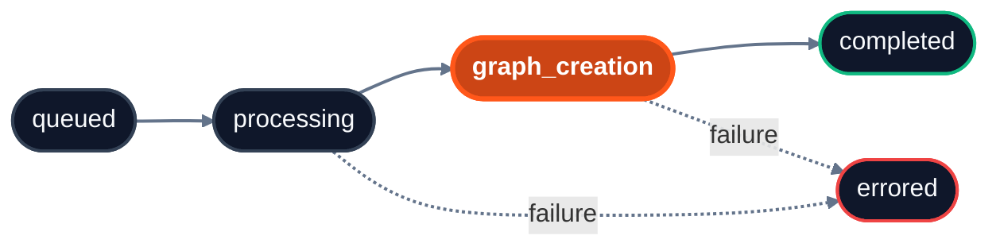

import { Field } from "/snippets/field.jsx";

Ingestion is asynchronous. Poll this endpoint with the IDs from ingest to learn when each item is ready to query. It works for documents, app sources, and memories.

<Info>
  **Prefer webhooks over polling?** Register a webhook for `indexing.status_changed` events and HydraDB will `POST` to your endpoint when content reaches `completed` or `errored`. See [Webhooks](/essentials/v2/webhooks) for setup and receiver examples.
</Info>

<RequestExample>

```python Python SDK
status = client.context.status(
    database="acme_corp",
    collection="team_docs",
    ids=["policy_main", "runbook_deploy"],
)
```

```typescript TypeScript SDK
const status = await client.context.status({
  database: "acme_corp",
  collection: "team_docs",
  ids: ["policy_main", "runbook_deploy"],
});
```

```bash cURL
curl -G 'https://api.hydradb.com/context/status' \
  -H "Authorization: Bearer <your_api_key>" \
  -H "API-Version: 2" \
  --data-urlencode "database=acme_corp" \
  --data-urlencode "collection=team_docs" \
  --data-urlencode "ids=policy_main,runbook_deploy"
```

</RequestExample>

## Query parameters

| Name | Description |
| --- | --- |
| <Field name="ids" type="string[]" /> | One or more `id` values returned at ingestion, for documents, app sources, or memories. Pass repeated params (`ids=a&ids=b`), a single comma-joined value (`ids=a,b`), or a mix of both. Whitespace around each ID is trimmed, empty entries are dropped, and duplicates are removed. IDs never contain commas (ingest rejects them), so the comma-joined form always splits cleanly. |
| <Field name="id" type="string" /> | A single ID. Merged with `ids` when you send both. At least one ID across `id` and `ids` is required. |
| <Field name="database" type="string" required /> | Database the items belong to. Deprecated alias: `tenant_id`. |
| <Field name="collection" type="string or null" /> | Collection scope. If omitted, the default collection is used. Deprecated alias: `sub_tenant_id`. (default=`null`) |

<ResponseExample>

```json Success
{
  "success": true,
  "data": {
    "statuses": [
      {
        "id": "policy_main",
        "indexing_status": "completed",
        "error_code": "",
        "success": true,
        "message": "Processing status retrieved successfully"
      },
      {
        "id": "runbook_deploy",
        "indexing_status": "graph_creation",
        "error_code": "",
        "success": true,
        "message": "Processing status retrieved successfully"
      },
      {
        "id": "typo_in_id",
        "indexing_status": "errored",
        "error_code": "FILE_NOT_FOUND",
        "error_message": "",
        "success": false,
        "message": "ID not found"
      }
    ]
  },
  "error": null,
  "meta": {
    "request_id": "9d13aef4-02f4-4e73-8c62-4c2601d04f9d",
    "latency_ms": 12.3
  }
}
```

```json Failure
{
  "success": false,
  "data": null,
  "error": {
    "code": "DATABASE_NOT_FOUND",
    "message": "Database not found"
  },
  "meta": {
    "request_id": "9d13aef4-02f4-4e73-8c62-4c2601d04f9d",
    "latency_ms": 4.8
  }
}
```

</ResponseExample>

## Status item fields

Each entry in `data.statuses` describes one requested `id`:

| Field | Type | Description |
| --- | --- | --- |
| `id` | string | The source, app-source, or memory ID you asked about (echoed back). |
| `indexing_status` | string | One of the [status values](#status-values) below. `errored` is terminal. |
| `error_code` | string | Machine-readable reason an entry is `errored`; **empty string (`""`) when the entry is not errored.** See [`error_code` values](#error-code-values). |
| `error_message` | string | Human-readable explanation of a pipeline `error_code`. Empty otherwise, including for `FILE_NOT_FOUND`. |
| `success` | boolean | Deprecated. `false` when `indexing_status` is `errored`, otherwise `true`. Describes the item, **not** the HTTP request: a `200` response can contain `errored` items. Read `indexing_status` instead. |
| `message` | string | Status of the *lookup* itself, usually "Processing status retrieved successfully". For an unknown `id` it is "ID not found". It does **not** describe the ingestion outcome; read `indexing_status` and `error_code` for that. |

### Error code values

`error_code` tells a **caller mistake** apart from a **real ingestion failure**, which `indexing_status: "errored"` alone cannot.

| `error_code` | Meaning | What to do |
| --- | --- | --- |
| `FILE_NOT_FOUND` | No source with this `id` exists in the given `database` and `collection`. Usually a typo, an `id` that was never ingested, or a source you deleted. HydraDB returns an entry for it instead of dropping it. | Fix the `id`, or ingest the source again. This is not a processing failure, so retrying the status call will not change it. |
| *ingestion-pipeline codes* | A genuine processing failure, as a numeric `E####` code (for example `E1001` parse failed, `E2002` no text extracted, `E4001` embedding failed). | Act on the specific code; see [Ingestion error codes](/api-reference/v2/error-responses#ingestion-error-codes). Many clear on re-ingest and retry; some are terminal (unsupported format, empty content). |

Status records can expire. A source that completed still reports `completed` after its record expires. A source that never finished before its record expired reports `errored` with `E9004`; ingest it again.

<Info>
  Branch on `error_code`, not on the text in `message` or `error_message`. Human-readable text may change.
</Info>

## Status values



| Status | Searchable? | Meaning |
| --- | --- | --- |
| `queued` | No | Accepted by the server, not yet picked up by a worker. |
| `processing` | No | Content is being parsed, chunked, and embedded. |
| `graph_creation` | **Yes** | Indexed and retrievable; the knowledge graph is still being built. Already searchable via `/query`, but graph context may still be incomplete. |
| `completed` | Yes | Fully indexed and graphed. Ready for all retrieval modes. |
| `errored` | No | Processing failed. Inspect `error_code` and `error_message`. |

The normal order is `queued`, then `processing`, then `graph_creation`, then `completed`. Treat `errored` as terminal.

## Polling patterns

### Stop when content is searchable

Use this for normal RAG and search flows. At `graph_creation`, chunks are indexed and retrievable via `/query`.

<CodeGroup>

```python Python
import time

ids = ["policy_main", "runbook_deploy"]

while True:
    response = client.context.status(
        database="acme_corp",
        collection="team_docs",
        ids=ids,
    )
    statuses = [s.indexing_status for s in response.data.statuses]

    if all(s in ("graph_creation", "completed") for s in statuses):
        break
    if any(s == "errored" for s in statuses):
        raise RuntimeError("Context processing failed")

    time.sleep(5)
```

```typescript TypeScript
const ids = ["policy_main", "runbook_deploy"];

while (true) {
  const response = await client.context.status({
    database: "acme_corp",
    collection: "team_docs",
    ids: ids,
  });

  const statuses = response.data.statuses.map((s) => s.indexingStatus);
  if (statuses.every((s) => s === "graph_creation" || s === "completed")) break;
  if (statuses.some((s) => s === "errored")) throw new Error("Context processing failed");

  await new Promise((r) => setTimeout(r, 5000));
}
```

</CodeGroup>

### Stop when graph processing is complete

Wait for `completed` only when you need the full graph: before graph-heavy calls such as `/context/relations`, or when a query needs complete `graph_context` (`graph_context: true`).

```python
while True:
    response = client.context.status(
        database="acme_corp",
        collection="team_docs",
        ids=["policy_main", "runbook_deploy"],
    )
    statuses = [s.indexing_status for s in response.data.statuses]

    if all(s == "completed" for s in statuses):
        break
    if any(s == "errored" for s in statuses):
        raise RuntimeError("Graph processing failed")

    time.sleep(5)
```

Typical processing time:

- **Memories** (text, Markdown, conversation pairs): seconds
- **Small documents** (under 50 pages): 1 to 5 minutes
- **Large documents** (50\+ pages): 5 to 15 minutes

## Errors

Common codes: `400 INVALID_INPUT` (for example `database` and `tenant_id` both sent with different values), `404 DATABASE_NOT_FOUND`, `422 VALIDATION_ERROR` (missing `database`, or no ID). See [Error Responses](/api-reference/v2/error-responses) for the full list.

<div className="api-before-related-resources" />

<Tip>
  **Related Resources**

  - **Before this:** [Ingest Context](/api-reference/v2/endpoint/ingest-context), which returns the IDs
  - **After completion:** [Query](/api-reference/v2/endpoint/query)
  - **After completion:** [Inspect Context](/api-reference/v2/endpoint/fetch-content)
  - **After completion:** [Context Relations](/api-reference/v2/endpoint/source-relations)
  - **Read more:** [Knowledge](/essentials/v2/knowledge)
  - **Read more:** [Memories](/essentials/v2/memories)
</Tip>
