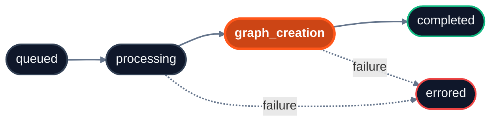

Ingestion is asynchronous. Call this endpoint with the IDs returned by [Ingest Context](/api-reference/v2/endpoint/ingest-context) to learn when each document, app source, or memory is ready to query.

To be notified instead of polling, register a webhook for `indexing.status_changed` events. HydraDB sends a `POST` to your endpoint when a source reaches a terminal state (`completed` or `errored`). See [Webhooks](/api-reference/v2/endpoint/webhooks-overview) for setup and receiver examples.

<RequestExample>

```python Python SDK
status = client.context.status(
    database="acme_corp",
    collection="team_docs",
    ids=["policy_main", "runbook_deploy", "typo_in_id"],
)
```

```typescript TypeScript SDK
const status = await client.context.status({
  database: "acme_corp",
  collection: "team_docs",
  ids: ["policy_main", "runbook_deploy", "typo_in_id"],
});
```

```bash cURL
curl -G 'https://api.hydradb.com/context/status' \
  -H "Authorization: Bearer <your_api_key>" \
  -H "API-Version: 2" \
  --data-urlencode "database=acme_corp" \
  --data-urlencode "collection=team_docs" \
  --data-urlencode "ids=policy_main,runbook_deploy,typo_in_id"
```

</RequestExample>

<ResponseExample>

```json Success
{
  "success": true,
  "data": {
    "statuses": [
      {
        "id": "policy_main",
        "indexing_status": "completed",
        "error_code": "",
        "message": "Processing status retrieved successfully"
      },
      {
        "id": "runbook_deploy",
        "indexing_status": "graph_creation",
        "error_code": "",
        "message": "Processing status retrieved successfully"
      },
      {
        "id": "typo_in_id",
        "indexing_status": "errored",
        "error_code": "FILE_NOT_FOUND",
        "error_message": "",
        "message": "ID not found"
      }
    ]
  },
  "error": null,
  "meta": {
    "request_id": "9d13aef4-02f4-4e73-8c62-4c2601d04f9d",
    "latency_ms": 12.3
  }
}
```

```json Failure
{
  "success": false,
  "data": null,
  "error": {
    "code": "DATABASE_NOT_FOUND",
    "message": "Database not found"
  },
  "meta": {
    "request_id": "9d13aef4-02f4-4e73-8c62-4c2601d04f9d",
    "latency_ms": 4.8
  }
}
```

</ResponseExample>

## Passing IDs

- Send IDs in `ids`, a single ID in `id`, or both. HydraDB merges them. At least one ID is required.
- `ids` accepts repeated parameters (`ids=a&ids=b`) or one comma-joined value (`ids=a,b`). Source IDs never contain commas (ingest rejects them), so the comma-joined form always splits unambiguously.
- Whitespace is trimmed, empty entries are dropped, and duplicates are removed.

## Status values

Each entry in `data.statuses` describes one requested ID. Read its `indexing_status`:


```mermaid
flowchart LR
    classDef standard fill:#0f172a,stroke:#334155,stroke-width:2px,color:#f8fafc;
    classDef innovation fill:#CC4515,stroke:#FF571A,stroke-width:3px,color:#ffffff,font-weight:bold;
    classDef success fill:#0f172a,stroke:#10b981,stroke-width:2px,color:#f8fafc;
    classDef failure fill:#0f172a,stroke:#ef4444,stroke-width:2px,color:#f8fafc;

    Q([queued])
    P([processing])
    G([graph_creation])
    C([completed])
    E([errored])

    Q --> P
    P --> G
    G --> C
    P -.failure.-> E
    G -.failure.-> E

    class Q,P standard;
    class G innovation;
    class C success;
    class E failure;

    linkStyle default stroke:#64748b,stroke-width:2px;
```

| Status | Searchable? | Meaning |
| --- | --- | --- |
| `queued` | No | Accepted by the server, not yet picked up by a worker. |
| `processing` | No | Content is being parsed, chunked, and embedded. |
| `graph_creation` | **Yes** | Searchable through `/query`. Graph creation is still in progress. |
| `completed` | Yes | Fully indexed and graphed. Ready for all retrieval modes. |
| `errored` | No | Indexing failed. Inspect `error_code` and `error_message`. Terminal. |

## Error code values

`error_code` explains why an ID was not found or ingestion failed. It is empty unless `indexing_status` is `errored`.

| `error_code` | Meaning | What to do |
| --- | --- | --- |
| `FILE_NOT_FOUND` | The ID was not found in this database and collection. | Check the ID and scope, or ingest the source. |
| `E####` | Ingestion failed. | Follow the [error code guidance](/api-reference/v2/error-responses#ingestion-error-codes). |

- `error_message` explains an ingestion failure. It is empty otherwise, including for `FILE_NOT_FOUND`.
- `message` describes the lookup, not indexing. Use `indexing_status` and `error_code` in your application logic. Message text may change.
- Status records can expire. A source that completed still reports `completed` after its record expires. A source that never finished before its record expired reports `errored` with `E9004`; ingest it again.

## Polling patterns

### Stop when content is searchable

Use this for most retrieval flows. At `graph_creation`, chunks are indexed and a query can return them.

<CodeGroup>

```python Python
import time

ids = ["policy_main", "runbook_deploy"]

while True:
    response = client.context.status(
        database="acme_corp",
        collection="team_docs",
        ids=ids,
    )
    statuses = [s.indexing_status for s in response.data.statuses]

    if len(statuses) == len(ids) and all(s in ("graph_creation", "completed") for s in statuses):
        break
    if any(s == "errored" for s in statuses):
        raise RuntimeError("Context processing failed")

    time.sleep(5)
```

```typescript TypeScript
const ids = ["policy_main", "runbook_deploy"];

while (true) {
  const response = await client.context.status({
    database: "acme_corp",
    collection: "team_docs",
    ids: ids,
  });

  const statuses = response.data?.statuses?.map((s) => s.indexingStatus) ?? [];
  if (statuses.length === ids.length && statuses.every((s) => s === "graph_creation" || s === "completed")) break;
  if (statuses.some((s) => s === "errored")) throw new Error("Context processing failed");

  await new Promise((r) => setTimeout(r, 5000));
}
```

</CodeGroup>

### Stop when graph processing is complete

Use this before graph-heavy operations such as `/context/relations`, or when you require complete `graph_context`.

```python
import time

ids = ["policy_main", "runbook_deploy"]

while True:
    response = client.context.status(
        database="acme_corp",
        collection="team_docs",
        ids=ids,
    )
    statuses = [s.indexing_status for s in response.data.statuses]

    if len(statuses) == len(ids) and all(s == "completed" for s in statuses):
        break
    if any(s == "errored" for s in statuses):
        raise RuntimeError("Graph processing failed")

    time.sleep(5)
```

Typical indexing time:

- **Memories** (text, markdown, conversation pairs): seconds
- **Small documents** (under 50 pages): 1 to 5 minutes
- **Large documents** (50\+ pages): 5 to 15 minutes

## Errors

Common codes: `400 INVALID_INPUT` (for example `database` and `tenant_id` both sent with different values), `404 DATABASE_NOT_FOUND`, `422 VALIDATION_ERROR` (missing `database`, or no ID). See [Error Responses](/api-reference/v2/error-responses) for the full list.

<div className="api-before-related-resources" />

## Related resources

- **Before this:** [Ingest Context](/api-reference/v2/endpoint/ingest-context): returns the IDs to check
- **After this:** [Query](/api-reference/v2/endpoint/query): once sources are searchable
- **After this:** [Inspect Context](/api-reference/v2/endpoint/fetch-content): read a source's stored content
- **After this:** [Inspecting Context Relations](/api-reference/v2/endpoint/source-relations): once sources are `completed`
- **Guide:** [Context](/essentials/v2/context)
