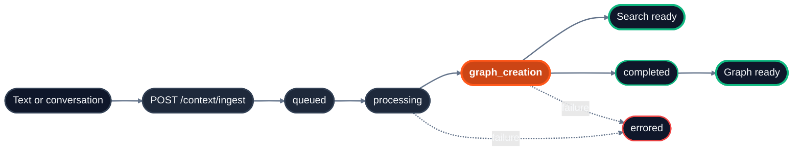

## Endpoint references

| Task | Endpoint |
| :-- | :-- |
| Send text and conversations as context | `POST /context/ingest` with `context[]` |
| Poll indexing progress | `GET /context/status` |
| Browse stored context | `POST /context/list` |
| Read an item's stored content | `GET /context/inspect` |
| Delete context | `DELETE /context` |
| Inspect graph relations | `GET /context/relations` |
| Walk everything connected to one item | `GET /context/{id}/subgraph` |
| Update an item's metadata without re-ingesting | `PATCH /context/{id}/metadata` |

Ingest is text only: to add a file, extract its text and send it as an item. Content from connected apps arrives through [connectors](/essentials/v2/connectors) rather than this endpoint.

## Lifecycle



## Core concepts

- **Context**: everything you ingest is a piece of context, a `text` or a `conversation`. One database holds all of them; collections partition them per user, team or project. See [Ingest context](/essentials/v2/ingest).
- **IDs**: each context has a `context_id`, yours or generated. The ingest response reports it as `results[].id`. Use it for polling status, inspecting content, deleting, and inspecting relations.
- **Attributes**: `attributes` are the declared, filterable fields from `database_metadata_schema`; `custom_attributes` are free-form and stored with the context. Filter queries with `attributes`. See [Attributes](/essentials/v2/attributes).
- **Enrichment**: on by default (`enrich: true`). HydraDB extracts entities, relations and preferences from each context into the [context graph](/essentials/v2/context-graphs); the extracted text comes back on query as `enrichment`, separate from its own `content`.
- **Declared relations**: any context can name the contexts it relates to with `forceful_relations`, so they surface together in `forceful_relations[]` on a `thinking` query.

## Declared relations and attributes

Declared relations pre-wire relationships at ingestion time so that related contexts surface together during retrieval, before the graph layer discovers connections on its own. Think of them as explicit "see also" links between your contexts.

Declared attributes, sent on the same context, decide which context an `attributes` filter lets a query return.

```json
{
  "database": "acme_corp",
  "collection": "ops",
  "context": [
    {
      "context_id": "runbook_deploy",
      "title": "Deploy runbook",
      "text": "1. Merge to main. 2. Wait for the image build. 3. Promote in ArgoCD.",
      "attributes": { "department": "ops" },
      "custom_attributes": { "owner": "platform-team" },
      "forceful_relations": { "context_ids": ["monitoring_guide"] }
    }
  ]
}
```

## Related sections

- [Ingest Context](/api-reference/v2/endpoint/ingest-context): the field reference
- [Usage: Ingest context](/essentials/v2/ingest): every context field, conversations, enrichment, declared relations
- [Query](/api-reference/v2/endpoint/query-overview): retrieve ingested content

<Tip>
  Related Resources

  - [Usage: Attributes](/essentials/v2/attributes): declared versus free-form fields
</Tip>
