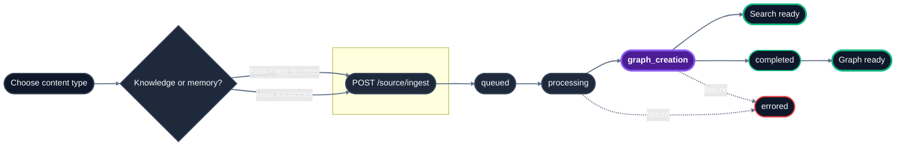

\[todo\]: change the api endpoint reference from docs.json from /sources to /context

\[todo\]: rename 'sources' to context

\[todo\]: always call files → documents everywhere in the documentation

\[todo\]: we need a dedicated section for forceful relations and metadata in this overview section. Just one paragraph: 

- one line to tell engineers why its important / how to think of these concepts 
- code example on how to implement it 

## Endpoint references

| Task | Endpoint |
| :-- | :-- |
| Upload PDFs, DOCX, CSVs, and other documents HydraDB should parse | `/source/ingest` with `type=knowledge` and `files` |
| Upload Slack messages, Notion pages, Gmail threads, or webpages with pre-extracted text | `/source/ingest` with `type=knowledge` and `app_knowledge` |
| Upload user preferences, conversation history, or inline notes | `/source/ingest` with `type=memory` and `memories` |
| Poll indexing progress | `/source/status` |
| Browse stored sources or memories | `/source/list` |
| Retrieve original source content | `/source/fetch` |
| Delete sources or memories | `DELETE /source` |
| Inspect graph relations | `/source/relations` |

## Lifecycle

\[todo\]: change files to documents

<Note>
  **Why both** `type=knowledge `**and** `app_knowledge`**?** They have a theoretical differentiation.

  - `type` picks the **bucket**: `knowledge` (shared documents) or `memory` (per-user context). It routes the ingest to the right store.
  - Within `type=knowledge`, you pick the **payload shape**: `files` (binary uploads HydraDB will parse  -  PDFs, DOCX, CSV) or `app_knowledge` (a JSON array of already-extracted content from your app  -  Slack messages, Notion pages, web pages). You can send both in the same request.
</Note>

## Core Ingestion Concepts

- **Knowledge vs. Memories**: [Knowledge](/essentials/v2/knowledge) is shared, tenant-wide content (files, app pages, Slack messages). [Memories](/essentials/v2/memories) are user-specific preferences and conversational traits scoped by `sub_tenant_id`. Both can be searched together via `type: "all"` on `POST /search`.
- **Source IDs**: Unique identifiers returned by `/source/ingest`. You can assign custom IDs using `source_id` in metadata or `id` in app knowledge. Use them for polling status, fetching content, and deleting sources.
- **Metadata Filtering**: You can scope queries using `tenant_metadata` (structured fields defined in your tenant schema) or `additional_metadata` (free-form per-document JSON). For detailed guidelines on structuring metadata, see the [Scoping using metadata](/essentials/v2/metadata) guide.
- **Forceful Relations**: Relationships between sources can be declared at ingestion time to construct a robust knowledge graph. For more details on the graph layer, see the [Context Graphs](/essentials/v2/context-graphs) guide.

## Related sections

- [Usage - Forceful Relations](/essentials/v2/knowledge) - linking sources at ingestion (see §7)
- [Search](/api-reference/v2/endpoint/search-overview) - retrieve ingested content

<Tip>
  Related Resources

  - [Usage - Memories](/essentials/v2/memories) - memories vs knowledge, when to use which

  - [Usage - Metadata](/essentials/v2/metadata) - tenant-level vs document-level metadata
</Tip>