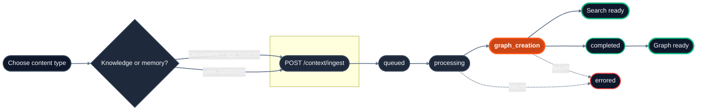

## Endpoints

- Upload content with [`POST /context/ingest`](/api-reference/v2/endpoint/ingest-context). `type` picks the store: `knowledge` (shared) or `memory` (one user).
  - Files HydraDB parses (PDF, DOCX, CSV): `type=knowledge` with `documents`.
  - JSON you already extracted (Slack messages, Notion pages, Gmail threads, web pages): `type=knowledge` with `app_knowledge`. You can send it and `documents` in one request.
  - User preferences, conversation history, or notes: `type=memory` with `memories`.
- Poll indexing progress: [`GET /context/status`](/api-reference/v2/endpoint/source-status).
- Browse stored sources or memories: [`POST /context/list`](/api-reference/v2/endpoint/list-documents).
- Read a source's original content: [`GET /context/inspect`](/api-reference/v2/endpoint/fetch-content).
- Change a source's metadata without re-ingesting: [`PATCH /context/{id}/metadata`](/api-reference/v2/endpoint/update-source-metadata).
- Delete sources or memories: [`DELETE /context`](/api-reference/v2/endpoint/delete-source).
- Inspect graph relations: [`GET /context/relations`](/api-reference/v2/endpoint/source-relations).
- Get everything connected to one item: [`GET /context/{id}/subgraph`](/api-reference/v2/endpoint/subgraph).

## Lifecycle


```mermaid
flowchart LR
    A([Choose content type]) --> B{Knowledge or memory?}

    subgraph Ingestion [" "]
      direction LR
      SI([POST /context/ingest])
    end

    B -- Documents / app sources --> SI
    B -- User memories --> SI

    SI --> Q([queued])
    Q --> P([processing])
    P --> G([graph_creation])
    G --> R([Search ready])
    G --> C([completed])
    C --> GR([Graph ready])

    P -. failure .-> E([errored])
    G -. failure .-> E

    linkStyle default stroke:#64748b,stroke-width:2px,color:#f8fafc
    style A fill:#0f172a,stroke:#334155,stroke-width:2px,color:#f8fafc
    style B fill:#1e293b,stroke:#334155,stroke-width:2px,color:#f8fafc
    style SI fill:#1e293b,stroke:#334155,stroke-width:2px,color:#f8fafc
    style Q fill:#1e293b,stroke:#334155,stroke-width:2px,color:#f8fafc
    style P fill:#1e293b,stroke:#334155,stroke-width:2px,color:#f8fafc
    style G fill:#CC4515,stroke:#FF571A,stroke-width:3px,color:#ffffff,font-weight:bold
    style C fill:#0f172a,stroke:#10b981,stroke-width:2px,color:#f8fafc
    style R fill:#0f172a,stroke:#10b981,stroke-width:3px,color:#f8fafc
    style GR fill:#0f172a,stroke:#10b981,stroke-width:3px,color:#f8fafc
    style E fill:#0f172a,stroke:#ef4444,stroke-width:2px,color:#f8fafc
```

## Concepts

- **Knowledge vs. memories:** [Knowledge](/essentials/v2/knowledge) is shared across the database. [Memories](/essentials/v2/memories) are one user's preferences and conversation traits, scoped by `collection`. Search both with `type: "all"` on `POST /query`.
- **IDs:** ingest returns an ID for each item, or you set your own with `id` in a `document_metadata`, `app_knowledge`, or `memories` item. Use IDs to poll status, inspect content, and delete.
- **Metadata filtering:** scope queries with `metadata` (fields declared in your database schema) or `additional_metadata` (free-form JSON per document). See [Scoping using metadata](/essentials/v2/metadata).

## Relations and metadata at ingest

Set `relations` on a source to add "see also" links to other sources. Linked sources surface together at query time, even before the extracted graph ([Context Graphs](/essentials/v2/context-graphs)) connects them. Add `metadata` and `additional_metadata` in the same item to control filtering and ranking.

```python Python SDK
result = client.context.ingest(
    type="knowledge",
    database="acme_corp",
    documents=[("runbook.pdf", f, "application/pdf")],
    document_metadata=json.dumps([{
        "id": "runbook_deploy",
        "metadata": {"department": "ops"},
        "additional_metadata": {"owner": "platform-team"},
        "relations": {"ids": ["monitoring_guide"]},
    }]),
)
```

<Tip>
  **Related resources**

  - [Knowledge](/essentials/v2/knowledge): linking sources at ingest.
  - [Memories](/essentials/v2/memories): memories vs. knowledge, and when to use which.
  - [Scoping using metadata](/essentials/v2/metadata): database-level vs. document-level metadata.
  - [Query overview](/api-reference/v2/endpoint/query-overview): retrieve what you ingested.
</Tip>
