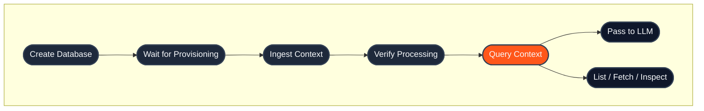

## Quick links

- **New to HydraDB?** Start with the [Quickstart](/get-started/v2/quickstart)
- **Prefer SDKs?** See [SDKs for Node and Python](/api-reference/v2/sdks)
- **Authentication:** Every endpoint requires `Authorization: Bearer <your_api_key>`
- **Base URL:** `https://api.hydradb.com`
- **Errors:** See [Error Responses](/api-reference/v2/error-responses)
- **For AI agents:** See the [Agent Integration Guide](/AGENTS) and [v2 OpenAPI spec](/api-reference/v2/openapi.json)

## Endpoint groups

| Group | Purpose | When to reach for it |
|---|---|---|
| [Databases](/api-reference/v2/endpoint/tenants-overview) | Create, monitor, and manage isolated workspaces | First step in any integration, and any time you need usage stats, provisioning status, or to tear down a workspace |
| [Context](/api-reference/v2/endpoint/sources-overview) | Ingest, list, fetch, delete, and inspect context | Every time data flows into HydraDB: text, conversations, and lifecycle ops |
| [Query](/api-reference/v2/endpoint/query-overview) | Retrieve context with hybrid or text query | At query time: the only endpoint you call to feed an LLM |

## Core concepts

| Concept | What it means | When you use it |
|---|---|---|
| `database` | Your isolated workspace for data, metadata schema, and query. | Send it on every API call so HydraDB knows which workspace to read or write. Formerly `tenant_id`; the `tenant_id` alias is still accepted (deprecated). |
| `collection` | Optional partition inside a database, often a user, team, account, or customer. | Use it when one database contains data for multiple users or customers. Formerly `sub_tenant_id`; the `sub_tenant_id` alias is still accepted (deprecated). Read more about our [multi-tenant architecture](/essentials/v2/databases-and-collections) |
| [Context](/essentials/v2/ingest) | A `text` or a `conversation`, sent in the `context` list of `POST /context/ingest`. | Everything you ingest. Shared context goes in a shared collection; a person's preferences go in their own. |
| `database_metadata_schema` | Database-level fields you define up front so metadata can be filtered or queried consistently. | Use it for stable fields like department, customer, region, plan, category, or compliance label. |
| `attributes` | Declared, filterable fields on a context, matching `database_metadata_schema`; `custom_attributes` are free-form. | Send them at ingest; filter with `attributes` on `/query`. |
| `ids` | IDs returned by ingestion or visible from `/context/list`. | Use them when polling processing status, inspecting content, listing a specific subset, deleting context, or inspecting relations. |

## End-to-end lifecycle



## SDKs

HydraDB publishes official SDKs for Python and TypeScript/Node. They wrap every endpoint in this reference with typed methods and IDE autocomplete.

| Language | Package | Install |
|---|---|---|
| **Python** | [`hydradb-sdk` on PyPI](https://pypi.org/project/hydradb-sdk/) | `pip install hydradb-sdk` |
| **TypeScript / Node** | [`@hydradb/sdk` on npm](https://www.npmjs.com/package/@hydradb/sdk) | `npm install @hydradb/sdk` |

**Quick init:**

<CodeGroup>

```python Python
import os
from hydra_db import HydraDB, AsyncHydraDB

client = HydraDB(token=os.environ["HYDRA_DB_API_KEY"])
async_client = AsyncHydraDB(token=os.environ["HYDRA_DB_API_KEY"])
```

```typescript TypeScript
import { HydraDBClient } from "@hydradb/sdk";

const client = new HydraDBClient({
  token: process.env.HYDRA_DB_API_KEY,
});
```

</CodeGroup>

SDK methods mirror the API: `client.<group>.<method>()` maps to the corresponding endpoint. The SDKs are generated from the OpenAPI contract and set `API-Version: 2` automatically.

## Full endpoint inventory

| Endpoint | Method | SDK method | Purpose | Use when |
|---|---|---|---|---|
| [`/databases`](/api-reference/v2/endpoint/create-tenant) | `POST` | `databases.create` | Create a database | You are setting up a new isolated workspace and optional metadata schema. |
| [`/databases/{database}/metadata-schema`](/api-reference/v2/endpoint/update-metadata-schema) | `PATCH` | `databases.update_metadata_schema` | Add metadata schema fields | You need to add filterable metadata fields after database creation. |
| [`/databases`](/api-reference/v2/endpoint/list-tenants) | `GET` | `databases.list` | List databases | You need to discover database IDs available to the current API key. |
| [`/databases`](/api-reference/v2/endpoint/delete-tenant) | `DELETE` | `databases.delete` | Delete a database | You need to permanently remove a workspace and its data. |
| [`/databases/status`](/api-reference/v2/endpoint/tenant-status) | `GET` | `databases.status` | Check provisioning readiness | You just created a database and need to wait before ingesting data. |
| [`/databases/collections`](/api-reference/v2/endpoint/list-sub-tenants) | `GET` | `databases.collections` | List active collections | You partition data by user, team, customer, or account and need to inspect those partitions. |
| [`/databases/collections`](/api-reference/v2/endpoint/delete-collection) | `DELETE` | `databases.delete_collection` | Delete a collection | You need to permanently remove one collection and its data. |
| [`/databases/stats`](/api-reference/v2/endpoint/tenant-stats) | `GET` | `databases.stats` | Get usage statistics | You want to monitor object counts for a database. |
| [`/context/ingest`](/api-reference/v2/endpoint/ingest-context) | `POST` | `context.ingest` | Ingest context | You are sending text or conversations. |
| [`/context/status`](/api-reference/v2/endpoint/source-status) | `GET` | `context.status` | Check processing status | You have IDs from ingestion and need to know when they are queryable. |
| [`/context/inspect`](/api-reference/v2/endpoint/fetch-content) | `GET` | `context.inspect` | Read a context's stored content | You need the full stored content behind a `context_id`, such as the context a query chunk came from. For its title and attributes, use `POST /context/list` with `ids`. |
| [`/context/list`](/api-reference/v2/endpoint/list-documents) | `POST` | `context.list` | Browse context | You need pagination, filters, field projection, or a specific subset by `ids`. |
| [`/context/{id}/metadata`](/api-reference/v2/endpoint/update-source-metadata) | `PATCH` | `context.update_source_metadata` | Update a context's metadata | You need to change one existing context's attributes (`database_metadata`) or custom attributes (`additional_metadata`) without re-ingesting. |
| [`/context`](/api-reference/v2/endpoint/delete-source) | `DELETE` | `context.delete` | Delete context | You need to remove context by ID. |
| [`/context/relations`](/api-reference/v2/endpoint/source-relations) | `GET` | `context.relations` | Inspect entity relationships | You need graph relations for a context or collection. |
| [`/context/{id}/subgraph`](/api-reference/v2/endpoint/subgraph) | `GET` | `context.subgraph` | Walk everything connected to one context | You need a context's thread, replies, parents, children and linked context. |
| [`/query`](/api-reference/v2/endpoint/query) | `POST` | `query` | Retrieve context | You need ranked chunks, graph paths, declared relations and a prompt-ready `llm_prompt`, with `hybrid` or `text` matching across one or more collections. |

SDK method names are the Python names; TypeScript camelCases the multi-word ones (`update_metadata_schema` is `updateMetadataSchema`). Connector, webhook and feedback endpoints have their own pages: [Connectors](/api-reference/v2/endpoint/connectors-overview), [Register Webhook](/api-reference/v2/endpoint/register-webhook) and [Submit Feedback](/api-reference/v2/endpoint/submit-feedback).

## Conventions

**Authentication:** Every endpoint requires `Authorization: Bearer <your_api_key>` in the request header. Get your key at [app.hydradb.com](https://app.hydradb.com).

**Versioning:** Send `API-Version: 2` with every request.

```bash
curl -X POST 'https://api.hydradb.com/query' \
  -H "Authorization: Bearer <your_api_key>" \
  -H "API-Version: 2" \
  -H "Content-Type: application/json" \
  -d '{
    "database": "my_first_database",
    "query": "What are the pricing tiers?",
    "query_by": "hybrid"
  }'
```

**Response envelope:** Core v2 endpoints (`/databases`, `/context/*`, and `/query`) return a consistent envelope. Endpoint pages show the full envelope; the resource-specific payload lives under `data`. Webhook management endpoints (`/webhooks/indexing*`) are the exception: they return their documented response object directly.

```json
{
  "success": true,
  "data": {},
  "error": null,
  "meta": {
    "request_id": "request-id",
    "latency_ms": 12.3
  }
}
```

Errors use the same envelope with `success: false`, `data: null`, and an `error` object containing `code` and `message`.

`meta` may also include a `deprecation` list when a request uses a legacy `/tenants` route or a deprecated field (`tenant_id`/`sub_tenant_id`, or `sub_tenant_ids` on `/query`); each entry carries `deprecated`, a `message`, and `deprecated_since` (field-level notices also add `deprecated_field` and `preferred_field`). It is a non-breaking migration nudge (the status code is unchanged) and is accompanied by a `Deprecation: true` response header. See [Migrating from `tenant_id` and `sub_tenant_id`](/essentials/v2/databases-and-collections#7-migrating-from-the-legacy-tenant-and-sub-tenant-fields).

- **Database scoping.** Most database-scoped endpoints require a `database` (formerly `tenant_id`). Many source and query endpoints also accept an optional `collection` (formerly `sub_tenant_id`) for finer-grained scoping. If omitted, the default collection is used. The old `tenant_id`/`sub_tenant_id` names (and the old `/tenants` routes) remain accepted as deprecated aliases; sending a canonical name and its alias with **different** values returns `400`. See [Migrating from `tenant_id` and `sub_tenant_id`](/essentials/v2/databases-and-collections#7-migrating-from-the-legacy-tenant-and-sub-tenant-fields).

- **Async operations.** Database creation, deletion, and content ingestion are asynchronous. They return immediately after queuing. Use the relevant status endpoint to confirm completion before downstream operations.

- **Pagination.** Listing endpoints (`/context/list`) return pagination fields for browsing large result sets.

- **Parameter casing.** The REST API uses snake_case (`max_results`). The Python SDK uses snake_case throughout; the TypeScript SDK uses camelCase for method names, parameters and response fields (`maxResults`, `llmPrompt`). Keys inside the JSON `context` string sent to `context.ingest` stay snake_case in every language.

- **Query modes.** `POST /query` supports `query_by: "hybrid"` or `"text"` and `mode: "auto"`, `"fast"` or `"thinking"`.

**Status codes:** Successful responses return `200` (or `202` for async accepts). Errors follow standard HTTP semantics:

| Code | Meaning |
|---|---|
| `200` | Success |
| `202` | Accepted (async operation queued) |
| `400` | Invalid parameters |
| `401` | Authentication required |
| `403` | Forbidden |
| `404` | Resource not found |
| `409` | Conflict (e.g., database already exists) |
| `422` | Validation error |
| `429` | Rate limit exceeded |
| `500` | Internal server error |
| `503` | Service unavailable |

See [Error Responses](/api-reference/v2/error-responses) for response shapes, error codes, and retry patterns.

## Rate limits

Rate limits apply per API key. For production deployments, build retry logic with exponential backoff against the `429` response. Contact [founders@hydradb.com](mailto:founders@hydradb.com) for current limit values.

## Next steps

- **Build something:** [Quickstart](/get-started/v2/quickstart) walks through your first integration in five minutes
- **Understand the model:** [Core Concepts](/get-started/v2/core-concepts) explains databases, context, query and attributes
- **Go deeper:** [Usage](/essentials/v2/query) covers each primitive in depth
- **Install an SDK:** [Python](https://pypi.org/project/hydradb-sdk/) · [TypeScript](https://www.npmjs.com/package/@hydradb/sdk)
