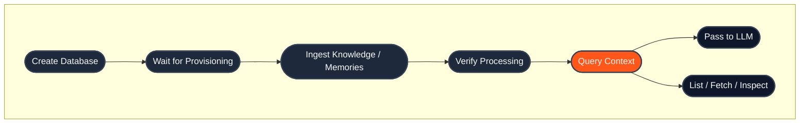

Use this reference to look up request fields and response formats. New to HydraDB? The [Quickstart](/get-started/v2/quickstart) gets you to a first query in five minutes, and [Core Concepts](/get-started/v2/core-concepts) explains databases, context, and queries. AI agents can start from the [Agent Integration Guide](/AGENTS) and the [v2 OpenAPI spec](/api-reference/v2/openapi.json).

## The four calls

Most integrations are these four requests, in this order. Everything else in this reference manages what they create.

1. [Create Database](/api-reference/v2/endpoint/create-tenant): `POST /databases`. One isolated workspace per customer, environment, or product. Creation runs in the background, so poll [Database Status](/api-reference/v2/endpoint/tenant-status) until `ready_for_ingestion` is `true`.
2. [Ingest Context](/api-reference/v2/endpoint/ingest-context): `POST /context/ingest`. Files, app sources, or memories, in one multipart request.
3. [Ingestion Status](/api-reference/v2/endpoint/source-status): `GET /context/status`. Poll the returned ids until `indexing_status` is `completed`, or [register a webhook](/essentials/v2/webhooks) instead.
4. [Query](/api-reference/v2/endpoint/query): `POST /query`. Retrieve the context your model needs, from knowledge, memories, or both.


```mermaid
flowchart LR

    subgraph Database Lifecycle [" "]
      direction LR
      A([Create Database])-->B([Wait for Provisioning])
      B-->C([Ingest Knowledge / Memories])
      C-->D([Verify Processing])
      D-->E([Query Context])
      E-->F([Pass to LLM])
      E-->G([List / Fetch / Inspect])
    end

    style A fill:#1e293b,stroke:#334155,stroke-width:2px,color:#f8fafc
    style B fill:#1e293b,stroke:#334155,stroke-width:2px,color:#f8fafc
    style C fill:#1e293b,stroke:#334155,stroke-width:2px,color:#f8fafc
    style D fill:#1e293b,stroke:#334155,stroke-width:2px,color:#f8fafc
    style E fill:#FF571A,stroke:#334155,stroke-width:2px,color:#f8fafc
    style F fill:#0f172a,stroke:#334155,stroke-width:2px,color:#f8fafc
    style G fill:#0f172a,stroke:#334155,stroke-width:2px,color:#f8fafc
```

## Every endpoint

The Python SDK method is listed for each endpoint; the TypeScript SDK uses the same names in camelCase, such as `deleteCollection`. Every endpoint page shows Python, TypeScript, and cURL.

### Databases

Create and manage the isolated workspaces your data lives in. [Overview](/api-reference/v2/endpoint/tenants-overview).

| Endpoint | Method | SDK method | Purpose | Use when |
|---|---|---|---|---|
| [`/databases`](/api-reference/v2/endpoint/create-tenant) | `POST` | `databases.create` | Create a database | You are setting up a new isolated workspace and optional metadata schema. |
| [`/databases/{database}/metadata-schema`](/api-reference/v2/endpoint/update-metadata-schema) | `PATCH` | `databases.update_metadata_schema` | Add metadata schema fields | You need to add filterable metadata fields after database creation. |
| [`/databases`](/api-reference/v2/endpoint/list-tenants) | `GET` | `databases.list` | List databases | You need to discover database IDs available to the current API key. |
| [`/databases`](/api-reference/v2/endpoint/delete-tenant) | `DELETE` | `databases.delete` | Delete a database | You need to permanently remove a workspace and its data. |
| [`/databases/status`](/api-reference/v2/endpoint/tenant-status) | `GET` | `databases.status` | Check provisioning readiness | You just created a database and need to wait before ingesting data. |
| [`/databases/collections`](/api-reference/v2/endpoint/list-sub-tenants) | `GET` | `databases.collections` | List active collections | You partition data by user, team, customer, or account and need to inspect those partitions. |
| [`/databases/collections`](/api-reference/v2/endpoint/delete-collection) | `DELETE` | `databases.delete_collection` | Delete a collection | You need to permanently remove one collection and its data without deleting the database. |
| [`/databases/stats`](/api-reference/v2/endpoint/tenant-stats) | `GET` | `databases.stats` | Get usage statistics | You want to monitor object counts for a database. |

### Context

Ingest, check, list, inspect, edit, and delete what you store. [Overview](/api-reference/v2/endpoint/sources-overview).

| Endpoint | Method | SDK method | Purpose | Use when |
|---|---|---|---|---|
| [`/context/ingest`](/api-reference/v2/endpoint/ingest-context) | `POST` | `context.ingest` | Ingest knowledge or memories | You are uploading documents, app sources, or user memories. |
| [`/context/status`](/api-reference/v2/endpoint/source-status) | `GET` | `context.status` | Check processing status | You have IDs from ingestion and need to know when they are queryable. |
| [`/context/inspect`](/api-reference/v2/endpoint/fetch-content) | `GET` | `context.inspect` | Inspect original source content or presigned URL | You need to display or inspect the original ingested content. |
| [`/context/list`](/api-reference/v2/endpoint/list-documents) | `POST` | `context.list` | Browse knowledge or memories | You need pagination, filters, field projection, or a specific subset by `ids`. |
| [`/context/{id}/metadata`](/api-reference/v2/endpoint/update-source-metadata) | `PATCH` | `context.update_source_metadata` | Update source metadata | You need to merge `metadata` or `additional_metadata` onto one existing source without re-ingesting. |
| [`/context`](/api-reference/v2/endpoint/delete-source) | `DELETE` | `context.delete` | Delete sources or memories | You need to remove one or more knowledge sources or memories by ID. |
| [`/context/relations`](/api-reference/v2/endpoint/source-relations) | `GET` | `context.relations` | Inspect entity relationships | You need graph relations for a source or collection. |
| [`/context/{id}/subgraph`](/api-reference/v2/endpoint/subgraph) | `GET` | `context.subgraph` | Get the connected subgraph | You need the connected subgraph around one source. |

### Query

Retrieve context, and tell HydraDB how a query performed. [Overview](/api-reference/v2/endpoint/query-overview).

| Endpoint | Method | SDK method | Purpose | Use when |
|---|---|---|---|---|
| [`/query`](/api-reference/v2/endpoint/query) | `POST` | `query` | Unified query over knowledge, memories, or both | You need retrieval with `hybrid` or `text` query across `type: "knowledge"`, `type: "memory"`, or `type: "all"`. |
| [`/feedback`](/api-reference/v2/endpoint/submit-feedback) | `POST` | `feedback.submit` | Submit query feedback | You want to tell HydraDB whether a query returned what you needed. |

### Connectors

Sync data from 70 apps without writing ingestion code. [Overview](/api-reference/v2/endpoint/connectors-overview).

| Endpoint | Method | SDK method | Purpose | Use when |
|---|---|---|---|---|
| [`/connectors/providers`](/api-reference/v2/endpoint/list-connector-providers) | `GET` | `list_providers` | List connector providers | You need the providers you can connect, or the credentials one provider needs. |
| [`/connectors`](/api-reference/v2/endpoint/create-connector) | `POST` | `connectors.create` | Create a connector | You are storing credentials for one provider account. |
| [`/connectors/{id}/discover`](/api-reference/v2/endpoint/discover-connector-resources) | `GET` | `connectors.discover` | Discover resources | You need the resources the connector's credentials can reach. |
| [`/connectors/{id}/configure`](/api-reference/v2/endpoint/configure-connector) | `POST` | `connectors.configure` | Configure a connector | You are activating resources and starting the first sync. |
| [`/connectors/{id}/status`](/api-reference/v2/endpoint/get-connector-status) | `GET` | `connectors.status` | Get connector status | You need to know whether the connector and each resource are working. |
| [`/connectors`](/api-reference/v2/endpoint/list-connectors) | `GET` | `connectors.list` | List connectors | You need your connectors and their sync state. |
| [`/connectors/{id}`](/api-reference/v2/endpoint/get-connector) | `GET` | `connectors.get` | Get a connector | You need one connector's settings. |
| [`/connectors/{id}/resources`](/api-reference/v2/endpoint/connector-resources) | `GET` | `connectors.list_resources` | List connector resources | You need each resource's settings. |
| [`/connectors/{id}/sync`](/api-reference/v2/endpoint/sync-connector) | `POST` | `connectors.sync` | Sync a connector | You want to sync now instead of waiting for the schedule. |
| [`/connectors/{id}/pause`](/api-reference/v2/endpoint/pause-connector) | `POST` | `connectors.pause` | Pause a connector | You want to turn scheduled syncs off. |
| [`/connectors/{id}/resume`](/api-reference/v2/endpoint/resume-connector) | `POST` | `connectors.resume` | Resume a connector | You want to turn scheduled syncs back on. |
| [`/connectors/{id}`](/api-reference/v2/endpoint/update-connector) | `PATCH` | `connectors.update` | Update a connector | You need to change the sync interval, connector-level instructions, or credentials. |
| [`/connectors/{id}/resources/{resource_id}`](/api-reference/v2/endpoint/update-connector-resource) | `PATCH` | `connectors.update_resource_acl` | Update a connector resource | You need to change one resource's instructions or access rule. |
| [`/connectors/{id}/resources`](/api-reference/v2/endpoint/add-connector-resource) | `POST` | `connectors.create_resource` | Add a connector resource | You want to add one new resource to an existing connector. |
| [`/connectors/{id}/resources/{resource_id}`](/api-reference/v2/endpoint/delete-connector-resource) | `DELETE` | `connectors.delete_resource` | Delete a connector resource | You want to stop syncing one resource. |
| [`/connectors/{id}`](/api-reference/v2/endpoint/delete-connector) | `DELETE` | `connectors.delete` | Delete a connector | You need to remove a connector. |

### Webhooks

Get notified when indexing finishes instead of polling. [Overview](/api-reference/v2/endpoint/webhooks-overview).

| Endpoint | Method | SDK method | Purpose | Use when |
|---|---|---|---|---|
| [`/webhooks/indexing`](/api-reference/v2/endpoint/register-webhook) | `POST` | `webhooks.register` | Register a webhook | You want a `POST` to your URL when indexing finishes, instead of polling. |
| [`/webhooks/indexing`](/api-reference/v2/endpoint/get-webhook) | `GET` | `webhooks.get` | Get the webhook | You need the current webhook configuration. |
| [`/webhooks/indexing`](/api-reference/v2/endpoint/delete-webhook) | `DELETE` | `webhooks.delete` | Delete the webhook | You want to stop receiving indexing notifications. |
| [`/webhooks/indexing/test`](/api-reference/v2/endpoint/test-webhook) | `POST` | `webhooks.test` | Send a test delivery | You want to check that your endpoint receives and verifies deliveries. |
| [`/webhooks/indexing/deliveries`](/api-reference/v2/endpoint/list-webhook-deliveries) | `GET` | `webhooks.list_deliveries` | List deliveries | You need recent delivery attempts and their status. |
| [`/webhooks/indexing/deliveries/{delivery_id}`](/api-reference/v2/endpoint/get-webhook-delivery) | `GET` | `webhooks.get_delivery` | Get a delivery | You need the details of one delivery. |
| [`/webhooks/indexing/deliveries/{delivery_id}/retry`](/api-reference/v2/endpoint/retry-webhook-delivery) | `POST` | `webhooks.retry_delivery` | Retry a delivery | You want to resend a `failed` or `permanently_failed` delivery. |

## Conventions

**Authentication:** Every endpoint requires `Authorization: Bearer <your_api_key>`. Get your key at [app.hydradb.com](https://app.hydradb.com). The [SDKs](/api-reference/v2/sdks) set it, and the version header, for you.

**Versioning:** Send `API-Version: 2` with every request.

```bash
curl -X POST 'https://api.hydradb.com/query' \
  -H "Authorization: Bearer <your_api_key>" \
  -H "API-Version: 2" \
  -H "Content-Type: application/json" \
  -d '{
    "database": "my_first_database",
    "query": "What are the pricing tiers?",
    "type": "knowledge",
    "query_by": "hybrid"
  }'
```

**Response envelope:** Core v2 endpoints (`/databases`, `/context/*`, `/query`, `/feedback`, and `/webhooks/indexing*`) return a consistent envelope. Endpoint pages show the full envelope; the resource-specific payload lives under `data`. Connector endpoints (`/connectors*`) and `PATCH /databases/{database}/metadata-schema` are the exception: they return their success body without the envelope.

```json
{
  "success": true,
  "data": {},
  "error": null,
  "meta": {
    "request_id": "request-id",
    "latency_ms": 12.3
  }
}
```

Errors use the same envelope on every endpoint, including the exceptions above, with `success: false`, `data: null`, and an `error` object containing `code` and `message`.

`meta` may also include a `deprecation` list when a request uses a legacy `/tenants` route or a deprecated field (`tenant_id`/`sub_tenant_id`, or `sub_tenant_ids` on `/query`); each entry carries `deprecated`, a `message`, and `deprecated_since` (field-level notices also add `deprecated_field` and `preferred_field`). It is a non-breaking migration nudge (the status code is unchanged) and is accompanied by a `Deprecation: true` response header. See [Migrating from `tenant_id` and `sub_tenant_id`](/essentials/v2/multi-tenant#7-migrating-from-the-legacy-tenant-and-sub-tenant-fields).

- **Database scoping:** Most database-scoped endpoints require a `database` (formerly `tenant_id`). Many source and query endpoints also accept an optional `collection` (formerly `sub_tenant_id`) for finer-grained scoping. If omitted, the default collection is used. The old `tenant_id`/`sub_tenant_id` names (and the old `/tenants` routes) remain accepted as deprecated aliases; sending a canonical name and its alias with **different** values returns `400`. See [Migrating from `tenant_id` and `sub_tenant_id`](/essentials/v2/multi-tenant#7-migrating-from-the-legacy-tenant-and-sub-tenant-fields).

- **Async operations:** Database creation, database and collection deletion, and content ingestion are asynchronous. They return immediately after queuing. Use the relevant status endpoint to confirm completion before downstream operations.

- **Pagination:** Listing endpoints (`/context/list`) return pagination fields for browsing large result sets.

- **Parameter casing:** The REST API uses snake_case (`database`, `max_results`). The TypeScript SDK uses camelCase keys and method names (`maxResults`, `deleteCollection`) and ignores request keys it does not recognize, including snake_case ones. The Python SDK uses snake_case throughout. See [SDKs](/api-reference/v2/sdks#naming-conventions).


**Status codes:** `200` for success and `202` when an async operation is queued. See [Error Responses](/api-reference/v2/error-responses) for response shapes, error codes, and retry patterns.

## Rate limits

Rate limits apply per API key. For production deployments, build retry logic with exponential backoff against the `429` response. Contact [founders@hydradb.com](mailto:founders@hydradb.com) for current limit values.

## Next steps

Existing v1 endpoints remain available under the v1 API Reference.

- **Build something:** [Quickstart](/get-started/v2/quickstart) walks through your first integration in five minutes
- **Understand the model:** [Core Concepts](/get-started/v2/core-concepts) explains databases, context, and queries
- **Go deeper:** [Usage](/essentials/v2/query) covers each primitive in depth
- **Install an SDK:** [Python](https://pypi.org/project/hydradb-sdk/) · [TypeScript](https://www.npmjs.com/package/@hydradb/sdk)
