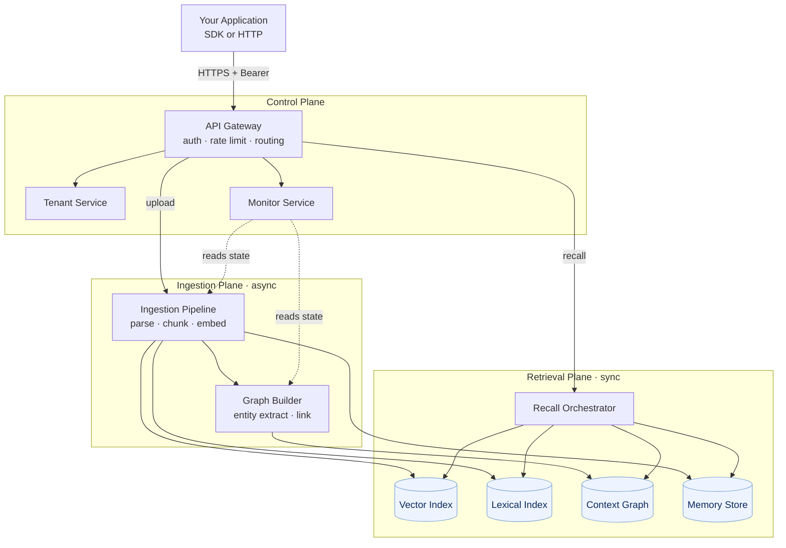
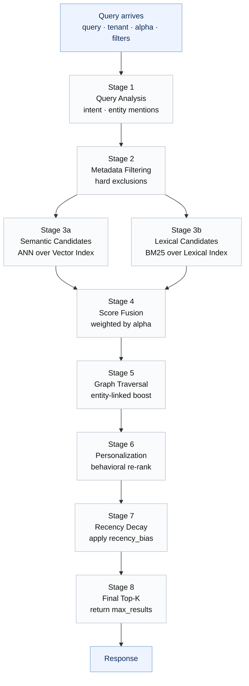
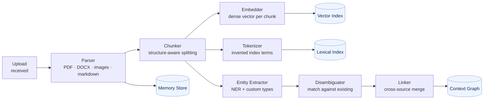

This page is for developers who want to understand *how* HydraDB works, not just how to call it. It's organized in two layers: the first half is the mental model: components, data flow, where things live. The second half goes deeper into the pipelines that actually run inside the system.

Neither half requires you to read the other. If you just want to reason about latency, costs, or failure surfaces, the high-level view is enough. If you're debugging unexpected recall behavior or planning a heavy ingestion workload, the internals matter.

---

# Part 1 —> The high-level view

## What HydraDB actually is

HydraDB is a **context infrastructure service** for AI applications. From the outside, it looks like one HTTP API. Inside, it's a small number of coordinated subsystems, each solving a distinct problem that's usually hand-rolled in AI stacks:

- Storing and versioning memories (documents, conversations, preferences)
- Building embeddings for semantic retrieval
- Extracting entities and relationships into a graph
- Running hybrid retrieval (semantic + lexical + graph + personalization)
- Enforcing tenant isolation and access control

You call one SDK method, `full_recall`, and all of these are working under the hood.

## The components at a glance

Eight logical components, grouped into three planes:

**Control plane**
- **API Gateway** : authentication, rate limiting, request routing
- **Tenant Service** : tenant and sub-tenant lifecycle, isolation enforcement
- **Monitor Service** : health and processing state reporting

**Ingestion plane**
- **Ingestion Pipeline** : parse → chunk → embed → enrich (async)
- **Graph Builder** : entity extraction, disambiguation, relationship linking

**Retrieval plane**
- **Recall Orchestrator** : the multi-stage pipeline that runs on every query
- **Vector Index** : dense embedding storage and ANN search
- **Lexical Index** : inverted index for BM25 / keyword recall
- **Context Graph Store** : entities, relationships, and metadata
- **Memory Store** : the source of truth for raw memory content and metadata

Your client only ever talks to the API Gateway. Everything else is internal.

## A diagram worth a thousand words

Here's how the components sit relative to each other and how a request flows through them:



A few things to notice:

- **Ingestion is asynchronous.** When you upload a document, the HTTP response comes back from the API Gateway as soon as the Ingestion Pipeline has accepted the file. Parsing, embedding, entity extraction, and graph linking all happen afterward. This is why `verify_processing` exists, it's your window into async state.
- **Recall is synchronous.** Every `full_recall` call runs the Orchestrator end-to-end and blocks the response until done. Sub-second latency is the target.
- **The four stores are specialized.** Vector, lexical, graph, and raw memory each live in a system optimized for its access pattern. They're kept consistent by the ingestion pipeline; you never have to reconcile them manually.
- **The control plane sits in front of everything.** Tenant isolation and auth happen before your request reaches any data-plane component, not inside them.

## The lifecycle of a memory

To make the diagram concrete, here's what happens end-to-end when you call `client.upload.knowledge({...})` with a PDF and then, a minute later, call `client.recall.fullRecall({...})`.

### Phase 1: Upload (synchronous, ~hundreds of ms)

1. Client sends a multipart POST to the API Gateway with the file and `tenant_id`.
2. Gateway authenticates the bearer token and resolves the tenant. If the tenant doesn't exist, returns `TENANT_NOT_FOUND` immediately.
3. Gateway hands the file to the Ingestion Pipeline, which persists the raw bytes to the Memory Store and enqueues a processing job.
4. Gateway returns `200 OK` with a `file_id`. Your client now holds a reference to something that isn't yet queryable.

### Phase 2: Processing (asynchronous, seconds to minutes)

5. A worker picks up the job and **parses** the file, extracting text from PDFs, DOCXs, images (via OCR), slides, etc.
6. The extracted text is **chunked** into retrieval-sized pieces. Chunk boundaries respect document structure (paragraphs, sections) rather than cutting mid-sentence.
7. Each chunk is **embedded** into a dense vector. Vectors are written to the Vector Index.
8. Each chunk is also tokenized and written to the Lexical Index for BM25 retrieval.
9. The Graph Builder runs **entity extraction** over the chunks — identifying people, organizations, projects, products, systems, concepts and writes nodes and edges into the Context Graph. Entities are disambiguated against existing graph nodes using surrounding context and cross-source identifiers (emails, URLs, IDs).
10. The Monitor Service updates processing status. `verify_processing` now reports the file as `processed`.

### Phase 3: Recall (synchronous, sub-second)

11. Client sends `full_recall` with query, tenant, and scoring parameters.
12. Gateway authenticates and routes to the Recall Orchestrator.
13. The Orchestrator runs its multi-stage pipeline (detailed in Part 2 below) against the four stores in parallel.
14. Ranked chunks are returned, each with its `relevancy_score`, `source_title`, metadata, and graph context (relationships, entity paths).

The whole round-trip from the user's question to the ranked chunks is typically under a second, even for tenants with millions of memories. How that's achieved is what Part 2 is about.

## Where your data lives

Four stores, four purposes. None of them is exposed directly — all access is mediated by the Orchestrator, but knowing what each does helps when you're reasoning about performance:

| Store | Contains | Optimized for | Consistency |
|---|---|---|---|
| **Memory Store** | Raw content, source metadata, upload timestamps | Durable retrieval by ID | Source of truth |
| **Vector Index** | Dense embeddings of every chunk | Approximate nearest-neighbor search at scale | Eventually consistent with Memory Store |
| **Lexical Index** | Tokenized chunks, term frequencies | BM25 / exact-match lookup | Eventually consistent with Memory Store |
| **Context Graph** | Entities, relationships, temporal signals | Multi-hop traversal, relationship queries | Eventually consistent with Memory Store |

"Eventually consistent" here means what it usually means in distributed systems: the indexes and graph catch up with the Memory Store asynchronously, which is exactly the lag that `verify_processing` reports. Once a memory is fully processed, the four stores agree and recall returns complete results.

## Isolation and the tenant model

Tenant isolation is not a filter applied at query time it's enforced at multiple layers:

1. **Storage partitioning.** Each tenant's data lives in its own logical partition. The Vector Index, Lexical Index, and Graph Store are all tenant-scoped; a query for tenant `acme` can't see tenant `globex` data even if the Orchestrator had a bug that tried to.
2. **Sub-tenant scoping.** Within a tenant, sub-tenants (`sub_tenant_id`) add another layer. B2C products typically use one sub-tenant per user; B2B products use them per team or department.
3. **Metadata filters.** On top of that, you can apply arbitrary metadata filters (`project: phoenix`, `source: notion`) which are evaluated deterministically before any scoring happens.

Layers 1 and 2 are enforced by the system regardless of what your code does. Layer 3 is under your control, use it to constrain scope within a legitimate isolation boundary, not as a substitute for one.

## Compute–storage separation

HydraDB separates compute (the Orchestrator, the Ingestion Pipeline, the Graph Builder) from storage (the four stores). This matters for two reasons:

- **Cost.** Storage grows with your data; compute scales with your query volume. Decoupling them means you don't pay for idle compute to hold cold data, and you don't pay for massive provisioned storage to serve spiky query workloads.
- **Elasticity.** Compute scales horizontally per subsystem. A tenant running a big ingestion job doesn't slow down another tenant's recall, because they're hitting different pools.

For most users this is invisible, it just means things stay fast. For very large tenants (tens of millions of memories or higher), it's why HydraDB stays sub-second where naive architectures would have started degrading.

---

# Part 2 —> Internals

Everything above is enough to reason about HydraDB as a user. The rest of this page is for when you need to debug unexpected recall behavior, plan around large workloads, or just satisfy curiosity about how the pipeline actually runs.

## The recall pipeline, expanded

The Recall Orchestrator is the most interesting component in the system. Here's what actually runs on every `full_recall` call:



Stages 3a and 3b run in **parallel** both candidate lists are being produced while the Orchestrator waits for whichever returns slower. This is a big part of why hybrid retrieval isn't meaningfully slower than pure semantic.

### Stage 1 —> Query analysis

The raw query string gets parsed for two things: the *intent* of the query (is it a lookup, a question, a command?) and any *entity mentions* it contains (does the query name a specific project, person, or system that exists in the graph?).

Entity mentions matter because they change what Stage 5 does. A query like "what's the status of Project Phoenix?" has an entity anchor; "how do I refund a customer?" doesn't.

### Stage 2 —> Metadata filtering

This stage is purely deterministic. It takes your metadata filters (`document_metadata`, `tenant_metadata`) and produces a *candidate pool*, the subset of memories that are *allowed* to be returned.

Everything that follows operates only within this pool. If your filter is tight (`project: phoenix` AND `source: notion`), the pool might be tiny and the whole pipeline runs much faster. If you have no filter, the pool is the entire tenant.

This is why metadata filters are also a *performance* knob, not just a *correctness* knob.

### Stages 3a and 3b Parallel candidate retrieval

**Semantic (3a):** The query is embedded into the same vector space as the chunks. The Vector Index does an approximate nearest-neighbor (ANN) search; typically HNSW or an IVF-based index under the hood and returns the top `N` nearest chunks with similarity scores. `N` is usually several times larger than your requested `max_results` because fusion and later stages will re-rank.

**Lexical (3b):** The query is tokenized and run against the Lexical Index. BM25 scores each chunk based on term frequency, inverse document frequency, and document length normalization. This also returns a top-`N` list.

Both lists now exist, with scores on different scales. Stage 4 fixes that.

### Stage 4 —> Score fusion

The semantic and lexical score distributions are very different (cosine similarity is 0–1 and roughly uniform, BM25 is unbounded and heavy-tailed). Fusion normalizes both, then combines:

```
fused_score(chunk) = alpha * semantic_norm(chunk) + (1 - alpha) * lexical_norm(chunk)
```

Chunks that appeared in only one of the two candidate lists still get a score on the other dimension (usually zero or a floor value). Chunks that appeared in both tend to rise to the top, a form of reciprocal rank fusion in spirit, though the exact algorithm is implementation detail.

This is the stage `alpha` controls directly.

### Stage 5 —> Graph traversal

If Stage 1 detected entity mentions, this is where the Context Graph earns its keep. The Orchestrator walks outward from matched entities, typically one or two hops finding chunks that are linked to those entities through the graph, even if those chunks weren't in the semantic or lexical candidate pools.

Example: query "Project Phoenix budget" mentions entity `Project:Phoenix`. The graph has edges from `Project:Phoenix` to chunks about `Sarah Chen` (lead), `Authentication Service` (dependency), `Engineering VP` (approver). Some of those chunks might have low cosine similarity to the literal word "budget" but are genuinely relevant because of their relationship to the project.

Graph-surfaced chunks get a score boost proportional to the strength and recency of the relationship. For queries with no entity mentions, this stage is a no-op.

### Stage 6 —> Personalization

If HydraDB has behavioral history for this `sub_tenant_id` (which user, which agent), it re-ranks based on:

- Which memories this user has successfully used in the past
- Which formats and sources they engage with
- Which content has been implicitly endorsed (longer dwell, downstream success signals)

This is why two users can run the identical query and get different top results. The effect is subtle on day one and compounds over weeks of interaction.

For brand-new tenants or cold users, this stage is effectively a no-op and you're getting pure hybrid + graph ranking.

### Stage 7 —> Recency decay

The simplest stage. A time-based decay factor is applied based on each chunk's `source_upload_time` and your `recency_bias` parameter. Older chunks get scaled down; newer chunks are unaffected or slightly boosted.

The decay function is monotonic, there's no "older is suddenly better" so this stage can only move older chunks down the ranking, never up.

### Stage 8 —> Final top-K

The fully-scored candidate set is sorted and truncated to `max_results`. Graph context (the `graph_context` object in the response `query_paths`, `chunk_relations`, `chunk_id_to_group_ids`) is attached. The response goes back up through the Gateway.

## How the ingestion pipeline actually runs

Upload side, with equal rigor:



The three writes to Vector, Lexical, and Graph are independent. If embedding fails for one chunk, the lexical and graph writes can still succeed for that same chunk so you'll see partial coverage rather than total failure. `verify_processing` reports overall file state, not per-subsystem state.

### Entity disambiguation in detail

The graph's value depends on correctly resolving that "Mercury" in email A is the same Mercury as in doc B and different from Mercury in ticket C. The disambiguator uses a combination of:

- **Local context** -> surrounding words, section headers, document type
- **Source type** -> an email thread mentioning "Mercury" in a project context is different from a CRM entry
- **Unique identifiers** -> emails, URLs, employee IDs, customer IDs. These are the strongest signal; when present, disambiguation is near-deterministic.
- **Relationship patterns** -> a "Mercury" connected to the same people as an existing graph node is very likely the same entity

This is why the best practice of including unique identifiers in your content pays off: it dramatically improves graph quality, which dramatically improves relational recall.

### Cross-source linking

Once an entity is disambiguated within a single document, linking extends it across documents. A Slack thread and a Notion page both mentioning "Project Phoenix" become connected through the same graph node. CRM records and support tickets sharing a `customer_id` get unified. Over time, the graph becomes a cross-tool index of everything the tenant knows.

The practical effect: a query that mentions "Sarah's project" can traverse from `User:Sarah` → `leads` → `Project:Phoenix` → `references` → chunks from three different source systems, all in one retrieval call.

## Failure domains and blast radius

Understanding what can fail, and what else gets affected when it does, is useful for capacity planning:

| Failure | Blast radius | Recovery path |
|---|---|---|
| Vector Index unavailable | Semantic recall degraded; lexical still works | Orchestrator automatically weights lexical higher |
| Lexical Index unavailable | Lexical recall degraded; semantic still works | Same — automatic fallback |
| Graph Store unavailable | Graph traversal skipped; hybrid recall unaffected | Graph queries return empty `graph_context` |
| Memory Store unavailable | Reads blocked (can't return raw content) | Full recall unavailable until restored |
| Ingestion Pipeline lagging | New uploads remain in `processing` state | Existing queryable data unaffected |
| Graph Builder lagging | New entities don't link; graph queries incomplete | Semantic + lexical recall unaffected |

The design goal visible here: **no single component failure should take down recall entirely**. Partial degradation is always preferred over total unavailability.

## Latency budget for a typical recall

Where does the time go on a sub-second `full_recall`? Rough order of magnitude:

| Stage | Typical time |
|---|---|
| Gateway auth + routing | 5–15 ms |
| Query analysis (Stage 1) | 10–30 ms |
| Metadata filter resolution (Stage 2) | 5–20 ms |
| Parallel candidate retrieval (3a + 3b) | 50–200 ms |
| Score fusion (Stage 4) | 2–10 ms |
| Graph traversal (Stage 5) | 20–100 ms |
| Personalization (Stage 6) | 10–40 ms |
| Recency + final sort (7, 8) | 2–10 ms |
| Response serialization + network | 10–30 ms |
| **Total** | **~100–450 ms** |

Tail latencies go higher on cold tenants (no warm caches), very broad queries (no metadata filter, huge candidate set), or entity-heavy queries that trigger deep graph walks. The timeout threshold that produces `SEARCH_TIMEOUT` kicks in well above the p99 of normal traffic when you see one, something structural is off, not just slow.

## Custom embeddings: the escape hatch

The Custom Embeddings endpoints (`/embeddings/add`, `/embeddings/search`, `/embeddings/filter`) let you bypass most of the pipeline and work with vectors directly. You provide embeddings you've computed yourself, and HydraDB stores them and serves nearest-neighbor queries over them.

Use these when:

- You have a domain-specific embedding model that outperforms a general one
- You need to control chunk boundaries and semantics precisely
- You're building an analysis tool where the hybrid pipeline is overkill

Use the standard `full_recall` otherwise. Custom embeddings trade the graph, personalization, and lexical fusion for raw control, which is the right tradeoff only sometimes.

## A final mental model

HydraDB's architecture makes sense if you hold one principle in mind:

> Semantic similarity is one signal. Lexical match is another. Graph structure is a third. User behavior is a fourth. A real memory system combines all of them, in that order, on every query and does it fast enough that your agent doesn't feel slow.

The components, the planes, the pipelines, every piece of the system is there to make that combination efficient, consistent across millions of memories, and isolated across tenants.

Once you see the architecture through that lens, the API surface stops feeling like a set of arbitrary endpoints and starts feeling like a natural expression of what the system is doing underneath.
