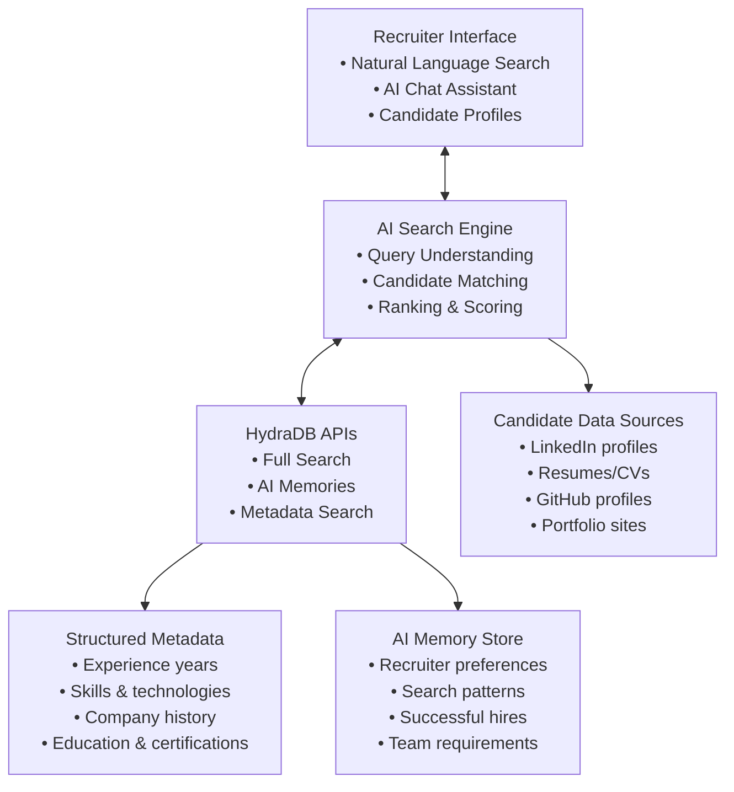

This guide shows how to build an AI hiring platform where recruiters and hiring managers find candidates by describing them. Instead of keyword searches, your platform takes natural language queries and matches candidates with HydraDB search.

> **Note:** All code in this guide uses the official HydraDB TypeScript SDK (`@hydradb/sdk`). Base URL: `https://api.hydradb.com`. Get your API key at [app.hydradb.com](https://app.hydradb.com).

## Prerequisites

**Required knowledge:** TypeScript/JavaScript basics, REST APIs, environment variables  
**Required tools:**
- HydraDB API key
- Node.js 18+ (`node --version`)
- `npm install @hydradb/sdk`

## What You'll Build

By the end of this cookbook, you'll be able to:
- Upload structured candidate profiles into HydraDB with rich metadata (experience, skills, company history, education)
- Search candidates using natural language queries like "Find me someone who has 5+ years of ML experience and worked at Apple"
- Rank candidates by fit score and generate personalized interview questions per candidate
- Personalize candidate suggestions with each recruiter's preferences and past successful hires

## The Problem with Traditional Hiring Platforms

Traditional hiring platforms force recruiters to think like databases:

- **Keyword matching:** “Machine Learning OR Apple OR 5 years”
- **Boolean operators:** Complex database-style search syntax
- **Manual screening:** Hours spent reviewing irrelevant profiles
- **Missed candidates:** Great candidates who don't match exact keywords

## The AI-Powered Solution

With HydraDB, recruiters can search naturally:

- **“Find me someone who has 5+ years of experience in machine learning and has worked at Apple before”**
- **“I need a senior frontend developer who has experience scaling React applications at a startup”**
- **“Show me candidates who transitioned from consulting to product management at a tech company”**
- **“Fetch the essays for the candidates that have gone to Harvard for their masters in computer science”**

## Architecture Overview




## Step 1: Data Ingestion Strategy

### Understanding Candidate Data Structure

Good search starts with well-structured candidate data. Here's how to organize a profile:

#### Core Candidate Profile Structure


```javascript
const candidateProfile = {
  // Required fields for HydraDB
  id: 'candidate_123456',
  database: 'recruiting_database',
  collection: 'ml_engineering',
  title: 'Senior Machine Learning Engineer - John Smith',
  type: 'candidate_profile', // Type app identifier
  timestamp: '2024-01-15T10:30:00Z', // Profile last updated

  // Main content for AI search
  content: {
    text: `# John Smith - Senior ML Engineer

    ## Experience
    - **Apple Inc.** (3 years) - Senior ML Engineer, Siri Team
    - **StartupXYZ** (2 years) - ML Engineer, Recommendations
    - **Research Lab** (1 year) - ML Research Intern

    ## Skills
    - Machine Learning & Deep Learning
    - Python, TensorFlow, PyTorch
    - Natural Language Processing
    - Distributed Systems

    ## Education
    - MS Computer Science, Stanford University
    - BS Mathematics, UC Berkeley

    John Smith is a Senior Machine Learning Engineer with 6 years of experience in developing
    and deploying ML models at scale. He worked at Apple for 3 years on the Siri team,
    focusing on natural language processing and speech recognition. Prior to Apple, he spent
    2 years at a startup building recommendation systems. John has a Master's in Computer
    Science from Stanford and specializes in deep learning, Python, TensorFlow, and
    distributed systems. He has published 5 papers on neural networks and holds 2 patents
    in speech processing.`
  },

  // Database-level metadata (searchable/filterable fields defined in database schema)
  metadata: {
    total_years_experience: 6,
    years_at_current_role: 3,
    career_level: 'senior',
    primary_skills: ['machine_learning', 'deep_learning', 'nlp'],
    job_search_status: 'actively_looking'
  },

  // Document-specific metadata
  additional_metadata: {
    // Company history (roles, teams and tenure live in content.text)
    companies: ['Apple Inc.', 'StartupXYZ'],
    company_sizes: ['large_tech', 'startup'],

    // Skills and technologies
    technologies: ['python', 'tensorflow', 'pytorch', 'kubernetes'],
    programming_languages: ['python', 'java', 'scala'],

    // Education
    education: ['MS Computer Science, Stanford University', 'BS Mathematics, UC Berkeley'],

    // Location and preferences
    location: {
      current: 'San Francisco, CA',
      willing_to_relocate: false,
      remote_preference: 'hybrid'
    },

    // Availability and preferences
    desired_salary_range: '200k-300k',
    desired_role_level: 'senior',

    // Performance indicators
    publications_count: 5,
    patents_count: 2,
    github_stars: 1250,
    conferences_spoken: 3
  },

  // Profile URL and additional info
  url: 'https://linkedin.com/in/johnsmith-ml',
  description: 'Senior ML Engineer with Apple experience, specializing in NLP and speech recognition'
};
```

Per item, `metadata` is capped at 16 KiB and `additional_metadata` at 1 KiB. A metadata value can nest one level (a list of strings, or a flat object), so a list of company objects is rejected. Put long history in `content.text`.

Upload the profile as an app source. Ingestion is asynchronous: poll [`GET /context/status`](/api-reference/v2/endpoint/source-status) until its `indexing_status` is `completed` (or `errored`) before you rely on search results.

```javascript
import { HydraDBClient } from "@hydradb/sdk";

const client = new HydraDBClient({ token: process.env.HYDRA_DB_API_KEY });

await client.context.ingest({
  type: "knowledge",
  database: "recruiting_database",
  collection: "ml_engineering",
  appKnowledge: JSON.stringify([candidateProfile]),
});
```


### Critical Metadata Fields for Hiring Success

#### Experience Metadata


```javascript
const experienceMetadata = {
  // Quantitative experience
  total_years_experience: 6,
  years_in_current_role: 3,
  years_in_field: 6, // Different from total if career switcher
  
  // Career progression
  career_level: 'senior', // intern, junior, mid, senior, staff, principal, director
  promotion_velocity: 'fast', // slow, average, fast
  role_progression: ['engineer', 'senior_engineer'], // Career path
  
  // Management experience
  has_management_experience: false,
  team_size_managed: 0,
  years_managing: 0,
  
  // Company context
  largest_company_size: 'large_tech', // startup, small, medium, large, large_tech
  startup_experience: true,
  public_company_experience: true,
  consulting_experience: false
};
```


#### Skills and Technology Metadata


```javascript
const skillsMetadata = {
  // Primary expertise areas
  primary_domains: ['machine_learning', 'artificial_intelligence'],
  secondary_domains: ['backend_development', 'data_engineering'],
  
  // Technical skills by category
  programming_languages: [
    { name: 'python', proficiency: 'expert', years: 6 },
    { name: 'java', proficiency: 'intermediate', years: 2 }
  ],
  
  frameworks_tools: [
    { name: 'tensorflow', proficiency: 'expert', years: 4 },
    { name: 'pytorch', proficiency: 'advanced', years: 3 },
    { name: 'kubernetes', proficiency: 'intermediate', years: 2 }
  ],
  
  // Specialized skills
  ai_ml_skills: ['deep_learning', 'nlp', 'computer_vision', 'reinforcement_learning'],
  cloud_platforms: ['aws', 'gcp'],
  databases: ['postgresql', 'mongodb', 'redis'],
  
  // Soft skills
  leadership_skills: ['mentoring', 'technical_leadership'],
  communication_skills: ['technical_writing', 'public_speaking'],
  
  // Certifications
  certifications: [
    { name: 'AWS Machine Learning Specialty', year: 2023 },
    { name: 'Google Cloud Professional ML Engineer', year: 2022 }
  ]
};
```


#### Education and Achievement Metadata


```javascript
const educationMetadata = {
  // Formal education
  highest_degree: 'masters',
  education_institutions: [
    {
      name: 'Stanford University',
      tier: 'tier_1', // tier_1, tier_2, tier_3, other
      degree: 'MS Computer Science',
      gpa: 3.8,
      graduation_year: 2018
    }
  ],
  
  // Research and publications
  publications_count: 5,
  citation_count: 150,
  h_index: 4,
  patents_count: 2,
  
  // Open source and community
  github_contributions: 500,
  github_stars_received: 1250,
  stackoverflow_reputation: 5000,
  conferences_spoken: 3,
  
  // Awards and recognition
  awards: ['Best Paper Award ICML 2023', 'Employee of the Year Apple 2022'],
  hackathon_wins: 2,
  competition_rankings: ['Kaggle Expert']
};
```


## Step 2: Natural Language Search Implementation

### Understanding Query Intent

The power of AI search lies in understanding what recruiters really mean:

#### Query Types and Patterns


```javascript
const queryPatterns = {
  // Experience-based queries
  experience_queries: [
    "Find me someone who has 5+ years of experience in machine learning",
    "I need a developer with at least 3 years of React experience",
    "Show me candidates who have worked with startups for more than 2 years"
  ],
  
  // Company-based queries
  company_queries: [
    "Find candidates who worked at Apple, Google, or Microsoft",
    "Show me people who have startup experience",
    "I want someone who has worked at a Series B startup"
  ],
  
  // Skill combination queries
  skill_combination_queries: [
    "Find a full-stack developer who knows React and Node.js",
    "I need someone with ML experience and strong Python skills",
    "Show me candidates with both technical and management experience"
  ],
  
  // Transition queries
  transition_queries: [
    "Find candidates who moved from consulting to product management",
    "Show me developers who transitioned into machine learning",
    "I need someone who went from startup to big tech"
  ],
  
  // Cultural fit queries
  cultural_fit_queries: [
    "Find candidates who thrive in fast-paced environments",
    "Show me people who have built teams from scratch",
    "I need someone who has experience with remote-first companies"
  ]
};
```


### Implementing HydraDB Search for Hiring

Send the same `collection` you ingested the profiles into; a query without `collection` reads only the database's default collection.

```javascript
import { HydraDBClient } from "@hydradb/sdk";

class AIRecruitingSearch {
  constructor() {
    this.client = new HydraDBClient({ token: process.env.HYDRA_DB_API_KEY });
    this.database = 'recruiting_database';
    this.collection = 'ml_engineering';
  }

  async findCandidates(query, recruiterContext = {}) {
    const { metadataFilters, additionalContext, ...roleContext } = recruiterContext;
    const hiringContext = [this.buildHiringContext(roleContext), additionalContext]
      .filter(Boolean)
      .join('\n');

    const results = await this.client.query({
      database: this.database,
      collection: this.collection,
      query,

      // Short factual hint about the role; guides retrieval without changing the query
      additionalContext: hiringContext || undefined,
      metadataFilters,

      // Hiring-specific configurations
      maxResults: 20, // More candidates for review
      mode: 'thinking', // Multi-query with reranking for better results

      // Search tuning for candidate discovery
      alpha: 0.6, // Below the 0.8 default: company names and skills are literal tokens
      recencyBias: 0.2 // Don't heavily favor recent profiles
    });

    return this.enhanceCandidateResults(results, query);
  }

  buildHiringContext(recruiterContext) {
    const parts = [];

    if (recruiterContext.role) {
      parts.push(`Hiring for a ${recruiterContext.role} position.`);
    }

    if (recruiterContext.company) {
      parts.push(`The role is at ${recruiterContext.company}.`);
    }

    if (recruiterContext.teamSize) {
      parts.push(`The team size is ${recruiterContext.teamSize}.`);
    }

    return parts.join(' ');
  }

  enhanceCandidateResults(results, originalQuery) {
    if (!results.data?.chunks) return results;

    // Add hiring-specific analysis to each candidate
    const enhancedSources = results.data.chunks.map(chunk => {
      // Merge both metadata layers so the helpers below read one object
      const candidate = {
        ...chunk,
        title: chunk.sourceTitle,
        metadata: { ...chunk.metadata, ...chunk.additionalMetadata }
      };
      return {
        ...candidate,
        fit_score: this.calculateFitScore(candidate, originalQuery),
        strengths: this.extractStrengths(candidate),
        potential_concerns: this.extractConcerns(candidate),
        interview_questions: this.suggestInterviewQuestions(candidate, originalQuery)
      };
    });

    // Sort by fit score
    enhancedSources.sort((a, b) => b.fit_score - a.fit_score);

    return {
      ...results,
      data: { ...results.data, chunks: enhancedSources },
      search_insights: this.generateSearchInsights(enhancedSources, originalQuery)
    };
  }

  extractStrengths(candidate) {
    const strengths = [];
    const meta = candidate.metadata || {};
    if (meta.total_years_experience >= 5) strengths.push("Extensive experience");
    if (meta.publications_count > 0) strengths.push("Published researcher");
    if (meta.career_level === "senior" || meta.career_level === "staff") strengths.push("Senior-level contributor");
    if ((meta.company_sizes || []).includes("large_tech")) strengths.push("Big-tech background");
    if (meta.has_management_experience) strengths.push("Proven leadership");
    return strengths;
  }

  extractConcerns(candidate) {
    const concerns = [];
    const meta = candidate.metadata || {};
    if (meta.total_years_experience < 3) concerns.push("Limited experience: verify depth of role");
    if ((meta.company_sizes || []).every(size => size === "large_tech")) {
      concerns.push("No startup experience: assess adaptability");
    }
    if (meta.job_search_status === "passively_looking") concerns.push("Not actively searching: expect longer close cycle");
    return concerns;
  }

  suggestInterviewQuestions(candidate, query) {
    const questions = [];
    const meta = candidate.metadata || {};
    if ((meta.companies || []).length > 0) {
      questions.push(`Walk me through your most impactful project at ${meta.companies[0]}.`);
    }
    if (query.toLowerCase().includes("machine learning") || (meta.primary_skills || []).includes("machine_learning")) {
      questions.push("Describe a model you shipped end-to-end, from data to production monitoring.");
    }
    if (meta.has_management_experience) {
      questions.push("Tell me about a time you had to let someone go. How did you handle it?");
    }
    questions.push("What does your ideal engineering culture look like?");
    return questions;
  }

  generateSearchInsights(candidates, query) {
    const avgYears = candidates.reduce((sum, c) => sum + (c.metadata?.total_years_experience || 0), 0) / (candidates.length || 1);
    const topCompanies = [...new Set(
      candidates.flatMap(c => c.metadata?.companies || [])
    )].slice(0, 5);
    return {
      total_candidates: candidates.length,
      average_experience_years: Math.round(avgYears * 10) / 10,
      top_company_backgrounds: topCompanies,
      query_summary: query.slice(0, 120)
    };
  }

  calculateFitScore(candidate, query) {
    // Simple scoring algorithm - in practice, you'd use more sophisticated ML
    let score = 0;
    
    // Experience relevance
    if (candidate.metadata?.total_years_experience) {
      const years = candidate.metadata.total_years_experience;
      if (query.includes('5+') && years >= 5) score += 30;
      if (query.includes('3+') && years >= 3) score += 25;
      if (query.includes('senior') && years >= 5) score += 20;
    }
    
    // Company match
    const queryLower = query.toLowerCase();
    if (candidate.metadata?.companies) {
      candidate.metadata.companies.forEach(company => {
        if (queryLower.includes(company.toLowerCase())) {
          score += 25;
        }
      });
    }
    
    // Skill relevance (simplified)
    if (candidate.metadata?.primary_skills) {
      const skills = candidate.metadata.primary_skills;
      if (queryLower.includes('machine learning') && skills.includes('machine_learning')) {
        score += 20;
      }
    }
    
    return Math.min(score, 100); // Cap at 100
  }
}
```


## Step 3: AI Memories for Personalized Recruiting

### Understanding Recruiter Patterns

A recruiter profile captures each recruiter's preferences and hiring patterns:

#### What AI Memories Capture


```javascript
const recruiterMemoryProfile = {
  // Search preferences
  search_patterns: {
    preferred_experience_levels: ['senior', 'staff'],
    frequently_searched_skills: ['react', 'nodejs', 'typescript'],
    preferred_company_types: ['startup', 'scale_up'],
    typical_salary_ranges: ['150k-250k'],
    location_preferences: ['san_francisco', 'remote']
  },
  
  // Successful hire patterns
  successful_hires: {
    common_backgrounds: ['apple', 'google', 'meta'],
    effective_skill_combinations: [
      ['react', 'nodejs', 'aws'],
      ['python', 'machine_learning', 'tensorflow']
    ],
    preferred_career_progressions: ['ic_to_senior_ic', 'startup_to_growth'],
    successful_education_backgrounds: ['computer_science', 'engineering']
  },
  
  // Team and role context
  hiring_context: {
    team_type: 'engineering',
    company_stage: 'series_b',
    team_size: 15,
    remote_policy: 'hybrid',
    common_interview_topics: ['system_design', 'coding', 'culture_fit']
  },
  
  // Communication preferences
  interaction_style: {
    detail_level: 'comprehensive', // brief, moderate, comprehensive
    preferred_format: 'structured_list',
    wants_interview_questions: true,
    wants_salary_insights: true
  }
};
```


### Implementing Personalized Search

Pass your profile lookup function to `new PersonalizedRecruitingSearch(getRecruiterProfile)`. To keep the profile in HydraDB, store it as [memories](/essentials/v2/memories) per recruiter and read it back with a `type: "memory"` query.

```javascript
class PersonalizedRecruitingSearch extends AIRecruitingSearch {
  constructor(getRecruiterProfile) {
    super();
    this.getRecruiterProfile = getRecruiterProfile;
  }

  async searchWithPersonalization(query, recruiterId, jobContext = {}) {
    const results = await this.findCandidates(query, jobContext);
    
    // Add personalized insights based on recruiter's history
    return this.addPersonalizedInsights(results, recruiterId);
  }

  async addPersonalizedInsights(results, recruiterId) {
    // Load the recruiter profile from your own store (see the note above)
    const recruiterProfile = await this.getRecruiterProfile(recruiterId);
    
    const personalizedResults = {
      ...results,
      personalized_insights: {
        recommended_candidates: this.getRecommendedCandidates(results.data?.chunks || [], recruiterProfile),
        interview_suggestions: this.generatePersonalizedInterviewQuestions(results.data?.chunks || [], recruiterProfile)
      }
    };

    return personalizedResults;
  }

  getRecommendedCandidates(candidates, recruiterProfile) {
    return candidates
      .filter(candidate => {
        // Check if candidate matches recruiter's successful hire patterns
        const companies = candidate.metadata?.companies?.map(c => c.toLowerCase()) || [];
        const skills = candidate.metadata?.primary_skills || [];
        
        // Match against successful hire patterns
        const hasSuccessfulCompanyBackground = companies.some(company => 
          recruiterProfile.successful_hires?.common_backgrounds?.includes(company)
        );
        
        const hasPreferredSkills = skills.some(skill => 
          recruiterProfile.search_patterns?.frequently_searched_skills?.includes(skill)
        );
        
        return hasSuccessfulCompanyBackground || hasPreferredSkills;
      })
      .slice(0, 5); // Top 5 recommendations
  }

  generatePersonalizedInterviewQuestions(candidates, recruiterProfile) {
    const questions = [];
    
    candidates.slice(0, 3).forEach(candidate => {
      const candidateQuestions = [];
      
      // Generate questions based on candidate's experience
      if (candidate.metadata?.companies) {
        candidate.metadata.companies.forEach(company => {
          candidateQuestions.push(
            `Tell me about your experience at ${company} and how it relates to our ${recruiterProfile.hiring_context?.team_type} team.`
          );
        });
      }
      
      // Add technical questions based on recruiter's preferences
      if (recruiterProfile.hiring_context?.common_interview_topics?.includes('system_design')) {
        candidateQuestions.push(
          "Can you walk me through how you'd design a system to handle [specific use case relevant to the role]?"
        );
      }
      
      questions.push({
        candidate_name: candidate.title?.split(' - ')[1] || 'Candidate',
        candidate_id: candidate.id,
        suggested_questions: candidateQuestions
      });
    });
    
    return questions;
  }
}
```


### Example: AI Memory in Action

Here's what a recruiter profile changes for the same query:

#### Without a Recruiter Profile

```

Recruiter Query: "Find me a senior React developer with startup experience"

Basic Results:
- 15 candidates with React experience
- Generic ranking by keyword match
- No context about recruiter preferences
```


#### With a Recruiter Profile

```

Recruiter Query: "Find me a senior React developer with startup experience"

AI-Enhanced Results:
- Prioritizes candidates from Series A/B startups (learned preference)
- Highlights candidates with Node.js experience (frequently paired skill)
- Suggests candidates with 4-6 years experience (recruiter's sweet spot)
- Includes salary expectations matching recruiter's budget
- Recommends candidates with remote experience (company is remote-first)

Personalized Insights:
"Based on your previous successful hires, I'm highlighting candidates who:
- Have experience at high-growth startups like your previous hires from Stripe and Airbnb
- Combine React with Node.js and TypeScript (your most successful tech stack combination)
- Are in the 4-6 year experience range where you've had the highest offer acceptance rate"
```


## Step 4: Advanced Search Features

### Complex Query Understanding

Real recruiter queries mix several requirements at once. Here is how they break down:

#### Multi-Criteria Searches


```javascript
const complexQueries = [
  {
    query: "Find me someone who has 5+ years of experience in machine learning and has worked at Apple before",
    breakdown: {
      experience_requirement: "5+ years",
      domain_requirement: "machine learning", 
      company_requirement: "Apple",
      intent: "Looking for proven ML expertise with big tech experience"
    }
  },
  
  {
    query: "I need a senior frontend developer who has experience scaling React applications at a startup and can lead a team",
    breakdown: {
      seniority: "senior",
      technical_skills: "React, frontend development",
      scaling_experience: "applications at scale",
      company_context: "startup",
      leadership_requirement: "team leadership"
    }
  },
  
  {
    query: "Show me candidates who transitioned from consulting to product management at a tech company and have an MBA",
    breakdown: {
      career_transition: "consulting to product management",
      industry_context: "tech company",
      education_requirement: "MBA",
      career_narrative: "Career switcher with business education"
    }
  }
];
```


### Metadata-assisted filtering

Use HydraDB metadata filters for exact hard requirements (for example `job_search_status: "actively_looking"`) on fields declared in the database metadata schema. Keep range requirements such as years of experience or salary in the natural-language query and in your own ranking step; `metadata_filters` support `equals`, `contains`, and `contains_any`, not range operators.


Pass an `acceptsCandidate(candidate, criteria)` function that checks salary, experience, and deal-breakers against your profile fields. Return `false` when a required value is missing. The method requires this function and returns only candidates it accepts.

```javascript
class AdvancedCandidateSearch extends PersonalizedRecruitingSearch {
  async searchWithComplexCriteria(query, criteria, acceptsCandidate) {
    if (typeof acceptsCandidate !== "function") {
      throw new TypeError("Pass your application criteria-checking function");
    }
    const { availabilityStatus } = criteria;

    // Build exact metadata filters for hard equality requirements.
    // Check ranges and exclusions with acceptsCandidate below.
    const metadataFilters = {};
    
    if (availabilityStatus) {
      metadataFilters.job_search_status = { equals: availabilityStatus };
    }

    // Use natural language query for soft requirements and range context.
    const enhancedQuery = this.enhanceQueryWithContext(query, criteria);

    const results = await this.findCandidates(enhancedQuery, {
      metadataFilters: Object.keys(metadataFilters).length ? metadataFilters : undefined,
      additionalContext: this.buildAdvancedInstructions(criteria)
    });

    const candidates = (results.data?.chunks || []).filter(candidate =>
      acceptsCandidate(candidate, criteria)
    );

    return {
      ...results,
      data: { ...results.data, chunks: candidates },
      search_insights: this.generateSearchInsights(candidates, enhancedQuery)
    };
  }

  enhanceQueryWithContext(originalQuery, criteria) {
    let enhancedQuery = originalQuery;
    
    if (criteria.teamContext) {
      enhancedQuery += ` for a ${criteria.teamContext.size}-person ${criteria.teamContext.type} team`;
    }
    
    if (criteria.companyContext) {
      enhancedQuery += ` at a ${criteria.companyContext.stage} ${criteria.companyContext.industry} company`;
    }
    
    if (criteria.urgency) {
      enhancedQuery += `. This is a ${criteria.urgency} priority hire`;
    }
    
    return enhancedQuery;
  }

  buildAdvancedInstructions(criteria) {
    let instructions = "";
    
    if (criteria.mustHave) {
      instructions += `Must have: ${criteria.mustHave.join(', ')}\n`;
    }
    
    if (criteria.niceToHave) {
      instructions += `Nice to have: ${criteria.niceToHave.join(', ')}\n`;
    }
    
    // Leave criteria.dealBreakers out: retrieval would match those terms, not avoid them.
    // acceptsCandidate rejects them after retrieval.
    
    return instructions.trim();
  }
}
```


## Step 5: Intelligent Candidate Matching

### Semantic Understanding vs. Keyword Matching

Traditional platforms rely on exact keyword matches. AI search understands concepts and relationships:

#### Traditional Keyword Search Limitations

```

Search: "Machine Learning Engineer Apple"
Results: Only candidates with exact terms "Machine Learning" AND "Apple"
Missed: 
- "ML Engineer at Apple" (ML != Machine Learning)
- "Data Scientist at Apple who built ML models"
- "AI Engineer at Apple working on neural networks"
- "Software Engineer at Apple, Siri team, NLP focus"
```


#### Semantic Search

```

Search: "Find me someone who has 5+ years of experience in machine learning and has worked at Apple before"
AI Understanding:
- "machine learning" includes: ML, AI, neural networks, deep learning, data science
- "worked at Apple" includes: current and former employees, contractors, interns
- "5+ years" is matched loosely as text: enforce it in your own ranking step
- Context understanding: Looking for proven ML expertise with big tech credibility

Enhanced Results:
- "Senior AI Engineer at Apple, 6 years in deep learning"
- "Data Scientist, former Apple ML intern, 5 years total ML experience"  
- "ML Engineer who worked on Siri team for 2 years, 6 years total ML"
- "Research Scientist at Apple AI/ML, PhD + 4 years industry experience"
```


### Smart Ranking and Scoring

This example scores experience against `searchContext.experience_requirements`. Add your own checks for skills, availability, and other job requirements. These scores are application rules, not HydraDB relevance scores.

```javascript
class IntelligentCandidateRanking {
  rankCandidates(candidates, searchContext) {
    return candidates.map(candidate => {
      const scores = {
        experience_fit: this.scoreExperienceFit(candidate, searchContext)
      };
      const overallScore = scores.experience_fit;
      
      return {
        ...candidate,
        ranking_scores: scores,
        overall_fit_score: overallScore,
        ranking_explanation: this.generateRankingExplanation(scores, candidate)
      };
    }).sort((a, b) => b.overall_fit_score - a.overall_fit_score);
  }

  scoreExperienceFit(candidate, context) {
    const years = candidate.metadata?.total_years_experience || 0;
    const required = context.experience_requirements || {};
    
    // Perfect match scoring
    if (required.min && years >= required.min) {
      const overQualified = required.max && years > required.max * 1.5;
      return overQualified ? 70 : 100; // Slight penalty for over-qualification
    }
    
    // Partial match scoring
    if (required.min && years >= required.min * 0.8) {
      return 60; // Close to requirement
    }
    
    return 20; // Significantly under-qualified
  }

  generateRankingExplanation(scores, candidate) {
    const explanations = [];
    
    if (scores.experience_fit > 80) {
      explanations.push("Strong experience match for the role requirements");
    }
    
    return explanations.join("; ");
  }
}
```


## Step 6: Real-World Search Examples

The examples below are illustrative output of the full pipeline: HydraDB retrieval plus the ranking and scoring code above.

### Example 1: Technical Role Search

```

Recruiter Query: "Find me a senior full-stack developer who has experience building scalable web applications at a growth-stage startup"

AI Understanding:
- Role: Senior full-stack developer
- Technical requirement: Scalable web applications
- Company context: Growth-stage startup
- Implied skills: Frontend, backend, scaling challenges
- Implied experience: 5+ years, startup environment

Top Results:
1. Sarah Chen - Senior Full-Stack Engineer at Stripe (Series C)
   - 6 years experience, React/Node.js expert
   - Built payment processing system handling 1M+ transactions/day
   - Previous startup experience at seed-stage company
   - Fit Score: 95% - "Perfect match for growth-stage technical challenges"

2. Mike Rodriguez - Lead Developer at Notion (Series B)
   - 7 years experience, TypeScript/Python specialist  
   - Architected real-time collaboration features for millions of users
   - Early employee (#15) who scaled with company growth
   - Fit Score: 92% - "Proven experience scaling web apps in growth environment"
```


### Example 2: Leadership Transition Search

```

Recruiter Query: "I need an engineering manager who transitioned from individual contributor and has experience growing teams at a tech company"

AI Understanding:
- Role: Engineering manager
- Career path: IC to manager transition
- Skill: Team building and growth
- Industry: Tech company
- Leadership style: Grown with teams

Enhanced Analysis:
The AI identifies candidates who:
- Started as engineers and moved into management
- Have experience hiring and growing teams
- Understand technical challenges from IC perspective
- Work at tech companies with engineering culture

Top Results:
1. David Park - Engineering Manager at Airbnb
   - IC for 4 years, then manager for 3 years
   - Grew team from 3 to 15 engineers
   - Still codes 20% of time, maintains technical credibility
   - Fit Score: 94% - "Classic IC-to-manager transition with proven team growth"

2. Jessica Liu - Senior Engineering Manager at Slack
   - Frontend engineer for 5 years, then manager for 2 years
   - Built hiring process that scaled team 300%
   - Known for developing junior engineers into senior roles
   - Fit Score: 89% - "Strong developer background with team development focus"
```


### Example 3: Specialized Domain Search

```

Recruiter Query: "Show me machine learning engineers who have experience with recommendation systems and have worked with large-scale data at a consumer internet company"

AI Understanding:
- Domain: Machine learning
- Specialization: Recommendation systems
- Scale requirement: Large-scale data
- Industry: Consumer internet
- Implied technologies: ML pipelines, data processing, personalization

Advanced Matching:
The AI connects related concepts:
- "Recommendation systems" includes: personalization, ranking, collaborative filtering
- "Large-scale data" includes: big data, distributed systems, real-time processing
- "Consumer internet" includes: social media, e-commerce, streaming, search

Top Results:
1. Alex Kim - Senior ML Engineer at Netflix
   - 5 years building recommendation algorithms
   - Handles 500M+ user interactions daily
   - Expert in collaborative filtering and deep learning
   - Published papers on large-scale recommendation systems
   - Fit Score: 98% - "Perfect domain expertise with proven large-scale impact"

2. Priya Patel - ML Engineer at Spotify
   - 4 years in music recommendation and discovery
   - Built real-time personalization for 400M+ users
   - Experience with A/B testing recommendation algorithms
   - Background in both content and collaborative filtering
   - Fit Score: 95% - "Strong recommendation system expertise in consumer domain"
```


## Step 7: AI-Powered Interview Preparation

### Intelligent Interview Question Generation

Use the retrieved profile to draft interview questions. This example takes a `role` with `title` and `min_experience`:


```javascript
class AIInterviewPrep {
  generatePersonalizedQuestions(candidate, role) {
    return {
      technical_questions: this.generateTechnicalQuestions(candidate, role),
      interview_strategy: this.generateInterviewStrategy(candidate, role)
    };
  }

  generateTechnicalQuestions(candidate, role) {
    const questions = [];
    
    // Questions based on candidate's specific experience
    if (candidate.metadata?.companies) {
      candidate.metadata.companies.forEach(company => {
        if (company.startsWith('Apple') && role.title.includes('ML')) {
          questions.push(
            "At Apple, you worked on the Siri team. Can you walk me through how you approached the challenge of improving speech recognition accuracy while maintaining low latency?"
          );
        }
      });
    }

    // Technology-specific questions
    if (candidate.metadata?.technologies?.includes('tensorflow')) {
      questions.push(
        "I see you have extensive TensorFlow experience. How would you design a training pipeline for a model that needs to process real-time data streams?"
      );
    }

    return questions;
  }

  generateInterviewStrategy(candidate, role) {
    const strategy = {
      focus_areas: [],
      potential_concerns: [],
      selling_points: [],
      follow_up_areas: []
    };

    // Analyze candidate strengths and gaps
    if (candidate.metadata?.total_years_experience < role.min_experience) {
      strategy.potential_concerns.push("Experience level slightly below target - explore depth of experience");
      strategy.focus_areas.push("Deep dive into specific projects and impact");
    }

    if (candidate.metadata?.company_sizes?.includes('large_tech')) {
      strategy.selling_points.push("Highlight startup agility and impact potential");
      strategy.follow_up_areas.push("Understand motivation for startup environment");
    }

    return strategy;
  }
}
```


## Step 8: Best Practices for AI-Powered Hiring

### Data Quality Guidelines

#### Essential Fields for Optimal Search Results


```javascript
const recommendedCandidateFields = {
  // Core identification (only id is required; the rest helps search and display)
  id: "unique_candidate_identifier",
  database: "recruiting_database",
  collection: "ml_engineering",
  title: "Descriptive candidate title with name and role",
  type: "candidate_profile", // Type app identifier
  timestamp: "2024-01-01T00:00:00Z", // Profile last updated

  // Rich content for AI understanding (Critical for good search)
  content: {
    text: `## Professional Summary
               ## Experience History
               ## Technical Skills
               ## Education & Certifications
               ## Key Achievements

               Comprehensive narrative covering:
               - Current role and responsibilities
               - Key achievements and quantified impact
               - Technology stack and expertise areas
               - Company context and team dynamics
               - Career progression and major transitions
               - Notable projects and their business impact
               - Leadership experience and team building
               - Industry recognition and community involvement`
  },

  // Database-level metadata (searchable/filterable fields defined in database schema)
  metadata: {
    total_years_experience: 6,
    years_in_current_role: 2,
    career_level: "senior",
    primary_skills: ["machine_learning", "python", "tensorflow"],
    secondary_skills: ["data_engineering", "aws", "kubernetes"]
  },

  // Document-specific metadata
  additional_metadata: {
    // Company history (flat lists; role details go in content.text)
    companies: ["Apple Inc."],
    company_sizes: ["large_tech"],

    // Performance indicators
    impact_metrics: {
      team_size_managed: 0,
      products_shipped: 5,
      users_impacted: 1000000,
      revenue_impact: "10M+",
      publications: 3,
      patents: 1
    }
  }
};
```


### Search Strategy Recommendations

#### Progressive Search Refinement


```javascript
const searchStrategy = {
  // Start broad, then narrow
  initial_search: "Find me machine learning engineers with 5+ years experience",
  
  // Add company context
  refined_search: "Find me machine learning engineers with 5+ years experience who have worked at tech companies",
  
  // Add specific requirements  
  targeted_search: "Find me senior machine learning engineers with 5+ years experience who have worked at Apple, Google, or similar tech companies and have deep learning expertise",
  
  // Add cultural/team fit
  final_search: "Find me senior machine learning engineers with 5+ years experience who have worked at Apple, Google, or similar tech companies, have deep learning expertise, and have experience mentoring junior engineers in a fast-paced environment"
};
```


#### Query Optimization Tips

1. **Use Natural Language:** Write queries as you would speak to a human recruiter
2. **Include Context:** Add company stage, team size, and cultural requirements
3. **Specify Experience:** Use ranges (3-5 years, 5+ years) rather than exact numbers
4. **Combine Hard and Soft Skills:** Technical requirements + leadership/communication needs
5. **Add Industry Context:** Startup vs. enterprise, B2B vs. consumer, etc.

### Performance Optimization

#### Search Efficiency Best Practices


```javascript
const optimizationTips = {
  // Batch candidate uploads for efficiency
  upload_strategy: {
    batch_size: 20, // No fixed cap, but a batch over your plan limit returns 413 (split it)
    interval_between_batches: 1000, // Back off further on 429 (honor Retry-After)
    // verify: always call GET /context/status after upload
  },
  
  // Cache frequent searches
  caching_strategy: {
    cache_duration: "5 minutes",
    cache_popular_queries: true,
    invalidate_on_new_candidates: true
  },
  
  // Optimize for recruiter workflows
  workflow_optimization: {
    save_search_filters: true,
    enable_search_alerts: true,
    batch_candidate_review: true
  }
};
```


## Step 9: Measuring Success

### Key Metrics for AI Hiring Platforms


```javascript
const hiringMetrics = {
  // Example values: measure your own baseline before and after launch

  // Search quality metrics
  search_effectiveness: {
    relevant_results_percentage: 85, // % of results marked as relevant
    average_time_to_find_candidate: "15 minutes",
    queries_per_successful_hire: 3.2
  },
  
  // Recruiter productivity
  recruiter_efficiency: {
    candidates_reviewed_per_hour: 12,
    interviews_scheduled_per_week: 8,
    time_saved_per_search: "45 minutes"
  },
  
  // Hiring quality
  hire_quality: {
    offer_acceptance_rate: 78, // %
    new_hire_performance_rating: 4.2, // /5 scale
    hiring_manager_satisfaction: 92 // % satisfied with candidates
  },
  
  // AI-specific metrics
  ai_adoption: {
    natural_language_query_usage: 89, // % of searches using NL
    ai_suggestion_acceptance: 67, // % of AI recommendations followed
    personalization_engagement: 84 // % finding personalized results helpful
  }
};
```


## Conclusion

HydraDB moves recruiting from a manual, keyword-based process to a conversational one. With natural language search, rich metadata, and recruiter memory, recruiters can:

- **Find better candidates faster:** AI understands intent beyond keywords
- **Improve matching accuracy:** Semantic search finds relevant candidates traditional systems miss
- **Personalize the experience:** Recruiter profiles capture each recruiter's preferences and successful patterns
- **Scale efficiently:** Handle complex queries that would require multiple traditional searches
- **Make data-driven decisions:** Rich insights and scoring help prioritize candidates

The key to success lies in:

1. **Rich data ingestion:** Comprehensive candidate profiles with structured metadata
2. **Natural language interface:** Let recruiters search as they think and speak
3. **Recruiter memory:** Keep each recruiter's preferences and past hires, and feed them into ranking
4. **Iterative refinement:** Improving search quality based on hiring outcomes

Start with core search functionality, gradually add AI memories and personalization, and continuously optimize based on recruiter feedback and hiring success metrics. The result will be a hiring platform that doesn't just find candidates; it understands what makes great hires.
