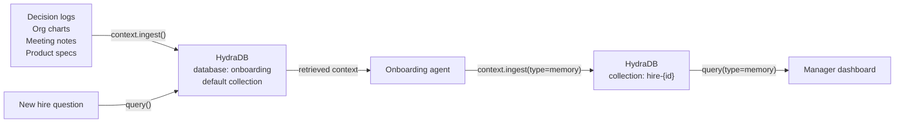

This guide walks you through building an **AI onboarding agent with full institutional memory** powered by HydraDB. Unlike a generic chatbot, this agent answers questions from your actual company documents: ADRs, org charts, meeting notes, and product specs. New hires get real context, not hallucinated guesses.

> **Note:** All code in this guide uses the official HydraDB Python SDK. Install it with `pip install hydradb-sdk`. Base URL: `https://api.hydradb.com`. Get your API key at [app.hydradb.com](https://app.hydradb.com).

> **Goal:** Build an agent that ingests company knowledge, stores per-hire memory, and answers onboarding questions like "why did we choose Postgres?" and "who owns the payments service?" with cited answers from real company documents.

---

## Why Standard Onboarding Fails

The average new hire takes 3 to 6 months to become fully productive. Most of that lag is not about skill; it is about context. They do not know why the auth service is built the way it is. They do not know who to ask about the data pipeline. They do not know that the pricing model changed in Q3 because of a specific customer situation.

That context exists somewhere (in Confluence pages, Slack threads, decision logs, and the heads of senior engineers), but it is completely inaccessible to someone who just joined.

HydraDB fixes this with two capabilities:

1. **Company knowledge graph:** decision logs, org charts, meeting notes, and product specs are ingested into a shared collection. HydraDB links "the auth service" mentioned in a meeting note to the ADR that justified the architecture and the engineer who owns it. A new hire asking "why is auth built this way?" gets all three sources in one answer.
2. **Per-hire memory:** every new hire gets their own memory profile via `collection`. Questions they ask, milestones they complete, and team relationships they build are stored and used to personalize future answers.

---

## Architecture Overview



- **Phase 0:** Install SDK, create a database, upload one document, run the first search query.
- **Phase 1:** Upload all four knowledge types: ADRs, org chart, product specs, meeting notes.
- **Phase 2:** Store per-hire memory and build the manager dashboard.

---

## What You'll Build

By the end of this cookbook, you'll be able to:
- Ingest company ADRs, org charts, meeting notes, and product specs into a shared HydraDB knowledge base
- Verify indexing before running search queries so new hires always get answers from complete data
- Answer onboarding questions like "why did we choose Postgres?" and "who owns the payments service?" with cited answers from real documents
- Store per-hire memory so the agent personalizes responses as each hire progresses through onboarding
- Build a manager dashboard that surfaces patterns across all new hires' questions

---

## Phase 0: Minimal Working System
*10 to 15 minutes · Goal: upload one document and get a real answer from it*

> Do Phase 0 first, even if you plan to skip ahead. Every later phase assumes the database exists and indexing works.

### Prerequisites

1. **A HydraDB API key**
2. **Python 3.11 or 3.12:** run `python --version` to check. Python 3.14 shows a Pydantic compatibility warning with the SDK; use 3.11 or 3.12 for a clean experience.
3. **Install the SDK:**

```bash
pip install hydradb-sdk python-dotenv
```

Create a project folder and set your API key:

```bash
mkdir onboarding-agent && cd onboarding-agent
echo "HYDRA_DB_API_KEY=your_key_here" > .env
```

Create `config.py` in the project root, used by every script in this guide:

```python
# config.py
import os
import time
from dotenv import load_dotenv

load_dotenv()

API_KEY   = os.environ["HYDRA_DB_API_KEY"]
DATABASE_ID = os.environ.get("HYDRA_DB_DATABASE", "onboarding")

def wait_until_indexed(client, ids: list, timeout: int = 300):
    """Wait for completion; raise if any source errors or the wait times out."""
    deadline = time.time() + timeout
    while time.time() < deadline:
        statuses = client.context.status(database=DATABASE_ID, ids=ids).data.statuses or []
        if len(statuses) == len(ids) and all(
            s.indexing_status in ("completed", "errored") for s in statuses
        ):
            for s in statuses:
                if s.indexing_status == "errored":
                    raise RuntimeError(f"{s.id} errored: {s.error_code} {s.error_message}")
            return statuses
        time.sleep(3)
    raise TimeoutError(f"Still indexing after {timeout}s: {ids}")
```

---

### Step 1: Create a Database

One database holds all onboarding content. The free plan lets you create multiple databases; this cookbook just uses a single one. If you already have a database you want to reuse, skip creation.

```python
# phase0/create_database.py
import sys, os, time
sys.path.insert(0, os.path.dirname(os.path.dirname(__file__)))
from config import API_KEY, DATABASE_ID
from hydra_db import HydraDB

client = HydraDB(token=API_KEY)

def create_database():
    try:
        client.databases.create(database=DATABASE_ID)
        print(f"Database '{DATABASE_ID}' created")
    except Exception as e:
        if "already exists" in str(e).lower():
            print(f"Database already exists - reusing '{DATABASE_ID}'")
        else:
            raise

    # Creation is asynchronous. Wait until the database can take writes.
    while not client.databases.status(database=DATABASE_ID).data.infra.ready_for_ingestion:
        time.sleep(2)
    print("Ready for ingestion")

if __name__ == "__main__":
    create_database()
```

```bash
python phase0/create_database.py
```

**Expected output:**
```
Database 'onboarding' created
Ready for ingestion
```

**If it fails:** `403 Plan limit reached` means you've hit your plan's database limit. Reuse an existing `DATABASE_ID`, or upgrade your plan for a higher limit.

---

### Step 2: Upload One Document

Create a sample ADR to test with:

```bash
mkdir -p phase0/sample_docs
cat > phase0/sample_docs/adr_postgres.txt << 'EOF'
ADR-001: Why We Chose Postgres Over MySQL

Decision: Postgres is our primary database.

Rationale:
- Better support for JSON columns (JSONB) required by our API response caching layer.
- Stronger ACID compliance for financial transaction records.
- Better performance for complex analytical queries on the reporting dashboard.

Alternatives considered:
- MySQL: rejected due to limited JSON support and licensing concerns under Oracle.
- MongoDB: rejected due to lack of ACID transactions at the time of decision.

Decision made by: Alice Chen (Senior Engineer)
Approved in: Q1 2024 engineering all-hands
EOF
```

```python
# phase0/upload_doc.py
import sys, os, json
sys.path.insert(0, os.path.dirname(os.path.dirname(__file__)))
from config import API_KEY, DATABASE_ID, wait_until_indexed
from hydra_db import HydraDB

client = HydraDB(token=API_KEY)

def upload_doc(filepath: str, doc_id: str, doc_type: str, team: str):
    """
    Upload a single text file to the shared company-context collection.
    document_metadata must be a JSON string, not a dict.
    """
    with open(filepath, "rb") as f:
        result = client.context.ingest(
            database=DATABASE_ID,
            documents=[(os.path.basename(filepath), f, "application/octet-stream")],
            document_metadata=json.dumps([
                {
                    "id": doc_id,
                    "additional_metadata": {
                        "doc_type": doc_type,
                        "team": team,
                    }
                }
            ]),
        )
    print(f"Upload: {result.data.success_count} queued, {result.data.failed_count} failed")
    print("Waiting for indexing...")
    wait_until_indexed(client, [doc_id])
    print("Ready to query.")
    return result

if __name__ == "__main__":
    upload_doc(
        filepath="phase0/sample_docs/adr_postgres.txt",
        doc_id="adr-001",
        doc_type="adr",
        team="engineering",
    )
```

```bash
python phase0/upload_doc.py
```

**Expected output:**
```
Upload: 1 queued, 0 failed
Waiting for indexing...
Ready to query.
```

> **Important:** Always wait for indexing before querying. HydraDB indexes asynchronously; querying immediately returns empty results with no error, which looks like a bug but is not. `wait_until_indexed` polls `client.context.status` until each source is `completed` or `errored`. A source is already searchable at `graph_creation`, but its graph context is complete only at `completed`.

---

### Step 3: Run Your First Query

```python
# phase0/query.py
import sys, os
sys.path.insert(0, os.path.dirname(os.path.dirname(__file__)))
from config import API_KEY, DATABASE_ID
from hydra_db import HydraDB

client = HydraDB(token=API_KEY)

def retrieve_context(question: str):
    return client.query(
        database=DATABASE_ID,
        query=question,
        max_results=5,
        mode="thinking",
        graph_context=True,
    )

if __name__ == "__main__":
    result = retrieve_context("Why did we choose Postgres over MySQL?")
    for chunk in result.data.chunks:
        print(f"\nSource: {chunk.source_title}")
        print(chunk.chunk_content[:500])
```

```bash
python phase0/query.py
```

**Expected output:**
```
Source: adr_postgres.txt
ADR-001: Why We Chose Postgres Over MySQL
Decision: Postgres is our primary database.
Rationale:
- Better support for JSON columns (JSONB) required by our API response caching layer.
...
```

If no chunks are returned, check the upload output: a source that `errored` never becomes searchable.

> Phase 0 complete. The same `client.query()` retrieval pattern is used in every later phase. Your application can pass returned chunks into an LLM to generate the final answer.

---

## Phase 1: Ingest All Company Knowledge
*20 to 30 minutes · Goal: all four knowledge types indexed and answering real questions*

Four types of institutional knowledge feed the onboarding agent. All go into the database's default collection (the scripts upload without a `collection`), the same scope Phase 0 used. Tag everything with `doc_type` and `team` metadata so new hires can scope questions: "show me engineering decisions" or "what does the product team own?"

> **Batch size:** There is no fixed file-count cap per `context.ingest()` call, but each file can be up to 50 MB, and a batch over your plan's item limit returns `413` (split it). The decision-doc script below uploads 20 files per call with a 1-second pause between batches.

---

### Step 1: Decision Logs and ADRs

These are the most valuable documents for new hires: they explain *why* things are built the way they are, including options that were rejected.

```python
# phase1/ingest_decisions.py
import sys, os, json, time
sys.path.insert(0, os.path.dirname(os.path.dirname(__file__)))
from config import API_KEY, DATABASE_ID, wait_until_indexed
from hydra_db import HydraDB

client = HydraDB(token=API_KEY)

def ingest_decision_docs(folder: str):
    """
    Upload all .txt and .md files in a folder as decision docs.
    Each file becomes one document in HydraDB.
    """
    import pathlib
    files_to_upload = list(pathlib.Path(folder).glob("*.txt")) + \
                      list(pathlib.Path(folder).glob("*.md"))

    if not files_to_upload:
        print(f"No files found in {folder}")
        return

    # Upload in batches of 20
    batch_size = 20
    all_ids = []
    for i in range(0, len(files_to_upload), batch_size):
        batch = files_to_upload[i:i+batch_size]
        file_handles = [open(f, "rb") for f in batch]
        ids = [f"adr-{f.stem}" for f in batch]
        all_ids += ids
        metadata = json.dumps([
            {
                "id": doc_id,
                "additional_metadata": {"doc_type": "adr", "team": "engineering"}
            }
            for doc_id in ids
        ])
        try:
            result = client.context.ingest(
                database=DATABASE_ID,
                documents=file_handles,
                document_metadata=metadata,
            )
            print(f"  Batch {i//batch_size + 1}: {result.data.success_count} uploaded")
        finally:
            for fh in file_handles:
                fh.close()
        if i + batch_size < len(files_to_upload):
            time.sleep(1)

    print("Waiting for indexing...")
    wait_until_indexed(client, all_ids)
    print(f"Decision docs indexed from '{folder}'")

if __name__ == "__main__":
    ingest_decision_docs("docs/decisions")
```

---

### Step 2: Org Chart and People Directory

Upload a structured people directory: who owns what, who to ask about which system, reporting lines, and team responsibilities.

```python
# phase1/ingest_org.py
import sys, os, json, tempfile
sys.path.insert(0, os.path.dirname(os.path.dirname(__file__)))
from config import API_KEY, DATABASE_ID, wait_until_indexed
from hydra_db import HydraDB

client = HydraDB(token=API_KEY)

def ingest_people(people: list):
    """
    people: list of dicts, each with:
      - name, role, team, reports_to, slack_handle
      - owns: list of systems/services
      - areas_of_expertise: list of topics
    """
    tmp_dir = tempfile.mkdtemp()
    file_handles = []
    metadata_list = []

    for i, p in enumerate(people):
        owns_text    = "\n".join(f"- {o}" for o in p.get("owns", []))
        exp_text     = ", ".join(p.get("areas_of_expertise", []))
        content = (
            f"Name: {p['name']}\n"
            f"Role: {p['role']} | Team: {p['team']}\n"
            f"Reports to: {p.get('reports_to', 'N/A')}\n"
            f"Slack: {p.get('slack_handle', '')}\n"
            f"Expertise: {exp_text}\n\n"
            f"Owns / responsible for:\n{owns_text}"
        )
        filepath = os.path.join(tmp_dir, f"person_{i}.txt")
        with open(filepath, "w") as f:
            f.write(content)

        file_handles.append(open(filepath, "rb"))
        metadata_list.append({
            "id": f"person-{p['name'].lower().replace(' ', '-')}",
            "additional_metadata": {"doc_type": "person", "team": p["team"]},
        })

    try:
        result = client.context.ingest(
            database=DATABASE_ID,
            documents=file_handles,
            document_metadata=json.dumps(metadata_list),
        )
        print(f"Org chart: {result.data.success_count} people uploaded")
    finally:
        for fh in file_handles:
            fh.close()

    print("Waiting for indexing...")
    wait_until_indexed(client, [m["id"] for m in metadata_list])
    print("Org chart indexed")

if __name__ == "__main__":
    # Replace with your actual team
    ingest_people([
        {
            "name": "Alice Chen",
            "role": "Senior Engineer",
            "team": "engineering",
            "reports_to": "Bob Smith",
            "slack_handle": "@alice-chen",
            "owns": ["Auth service", "Payments pipeline", "Database architecture"],
            "areas_of_expertise": ["databases", "auth", "payments"],
        },
        {
            "name": "Bob Smith",
            "role": "CTO",
            "team": "leadership",
            "reports_to": "CEO",
            "slack_handle": "@bob-smith",
            "owns": ["Engineering org", "Technical strategy"],
            "areas_of_expertise": ["architecture", "hiring", "roadmap"],
        },
    ])
```

---

### Step 3: Product Specs and Roadmaps

```python
# phase1/ingest_product.py
import sys, os, json
sys.path.insert(0, os.path.dirname(os.path.dirname(__file__)))
from config import API_KEY, DATABASE_ID, wait_until_indexed
from hydra_db import HydraDB

client = HydraDB(token=API_KEY)

def ingest_product_docs(folder: str, team: str = "product", status: str = "current"):
    """
    Upload product specs, PRDs, and roadmap docs from a folder.
    status: "current" | "shipped" | "deprecated" | "planned"
    """
    import pathlib
    files = list(pathlib.Path(folder).glob("*.md")) + \
            list(pathlib.Path(folder).glob("*.txt"))

    if not files:
        print(f"No files found in {folder}")
        return

    file_handles = [open(f, "rb") for f in files]
    ids = [f"product-{f.stem}" for f in files]
    metadata = json.dumps([
        {
            "id": doc_id,
            "additional_metadata": {
                "doc_type": "product_spec",
                "team": team,
                "status": status,
            }
        }
        for doc_id in ids
    ])

    try:
        result = client.context.ingest(
            database=DATABASE_ID,
            documents=file_handles,
            document_metadata=metadata,
        )
        print(f"Product docs: {result.data.success_count} uploaded")
    finally:
        for fh in file_handles:
            fh.close()

    print("Waiting for indexing...")
    wait_until_indexed(client, ids)
    print("Product docs indexed")

if __name__ == "__main__":
    ingest_product_docs("docs/product", team="product", status="current")
```

---

### Step 4: Meeting Notes

```python
# phase1/ingest_meetings.py
import sys, os, json
sys.path.insert(0, os.path.dirname(os.path.dirname(__file__)))
from config import API_KEY, DATABASE_ID, wait_until_indexed
from hydra_db import HydraDB

client = HydraDB(token=API_KEY)

def ingest_meeting_notes(folder: str):
    """
    Upload meeting notes from a folder.
    Filename convention: YYYY-MM-DD-meeting-name.md
    """
    import pathlib
    files = list(pathlib.Path(folder).glob("*.md")) + \
            list(pathlib.Path(folder).glob("*.txt"))

    if not files:
        print(f"No files found in {folder}")
        return

    file_handles = [open(f, "rb") for f in files]
    ids = [f"meeting-{f.stem}" for f in files]
    metadata = json.dumps([
        {
            "id": doc_id,
            "additional_metadata": {
                "doc_type": "meeting_notes",
                "team": "all",
            }
        }
        for doc_id in ids
    ])

    try:
        result = client.context.ingest(
            database=DATABASE_ID,
            documents=file_handles,
            document_metadata=metadata,
        )
        print(f"Meeting notes: {result.data.success_count} uploaded")
    finally:
        for fh in file_handles:
            fh.close()

    print("Waiting for indexing...")
    wait_until_indexed(client, ids)
    print("Meeting notes indexed")

if __name__ == "__main__":
    ingest_meeting_notes("docs/meetings")
```

---

### Step 5: Test Multi-source Search

After all four knowledge types are uploaded, test with questions that require pulling from multiple sources:

```python
# phase1/test_queries.py
import sys, os
sys.path.insert(0, os.path.dirname(os.path.dirname(__file__)))
from config import API_KEY, DATABASE_ID
from hydra_db import HydraDB

client = HydraDB(token=API_KEY)

TEST_QUESTIONS = [
    "Why did we choose Postgres over MySQL?",
    "Who owns the payments service and how do I reach them?",
    "What is the team working on this quarter?",
    "Why did we choose Postgres?",
    "Who do I talk to about the auth service?",
]

for question in TEST_QUESTIONS:
    print(f"\nQ: {question}")
    result = client.query(
        database=DATABASE_ID,
        query=question,
        max_results=5,
        mode="thinking",
        graph_context=True,
    )
    top_chunk = result.data.chunks[0].chunk_content[:300] if result.data.chunks else "No context returned yet"
    print(f"Context: {top_chunk}")
    print("-" * 60)
```

```bash
python phase1/test_queries.py
```

**Expected output:**
```
Q: Why did we choose Postgres over MySQL?
Context: ADR-001: Why We Chose Postgres Over MySQL. Decision: Postgres is our primary database...
------------------------------------------------------------
Q: Who owns the payments service and how do I reach them?
Context: Alice Chen (Senior Engineer) owns the payments pipeline. Her Slack handle is @alice-chen...
------------------------------------------------------------
```

> Phase 1 complete. Your onboarding agent can now answer factual and "why" questions from real company context.

---

## Phase 2: Per-Hire Memory and Manager Dashboard
*15 to 20 minutes · Goal: personalized answers per hire and weekly progress reports for managers*

---

### Step 1: Store New Hire Memory

Every new hire gets their own memory profile via `collection`. Store their background, milestones, and questions asked.

```python
# phase2/memory.py
import json
import sys, os
sys.path.insert(0, os.path.dirname(os.path.dirname(__file__)))
from config import API_KEY, DATABASE_ID
from hydra_db import HydraDB
from datetime import datetime, timezone

client = HydraDB(token=API_KEY)

def hire_collection(hire_id: str) -> str:
    """Map hire ID to their HydraDB collection."""
    return f"hire-{hire_id.lower()}"

def store_milestone(hire_id: str, milestone: str):
    """
    Record a completed onboarding milestone.
    infer=True: HydraDB extracts structured facts from the note
    (what was done, when, and with whom).
    """
    ts = datetime.now(timezone.utc).isoformat()[:10]
    client.context.ingest(
        type='memory',
        database=DATABASE_ID,
        collection=hire_collection(hire_id),
        memories=json.dumps([{
            "text":  f"[{ts}] Milestone completed: {milestone}",
            "infer": True,
        }]),
    )
    print(f"  Milestone stored for {hire_id}: {milestone}")

def log_question(hire_id: str, question: str, topic: str = ""):
    """
    Store a question asked by the hire verbatim.
    infer=False: preserve exact question for pattern analysis.
    3+ questions on the same topic signal confusion.
    """
    ts = datetime.now(timezone.utc).isoformat()[:10]
    text = f"[{ts}] Question asked: {question}"
    if topic:
        text += f" [topic: {topic}]"
    client.context.ingest(
        type='memory',
        database=DATABASE_ID,
        collection=hire_collection(hire_id),
        memories=json.dumps([{
            "text":  text,
            "infer": False,
        }]),
    )

def store_relationship(hire_id: str, person: str, context: str):
    """
    Store a team relationship for the hire.
    infer=True: HydraDB extracts the person and what they own as facts.
    """
    client.context.ingest(
        type='memory',
        database=DATABASE_ID,
        collection=hire_collection(hire_id),
        memories=json.dumps([{
            "text":  f"Team relationship: {person} - {context}",
            "infer": True,
        }]),
    )
    print(f"  Relationship stored: {person}")

if __name__ == "__main__":
    # Example: onboard emp-001
    store_milestone("emp-001", "Set up local dev environment, all tests passing")
    store_milestone("emp-001", "Completed first code review with Alice Chen")
    log_question("emp-001", "Why did we choose Postgres?", topic="database")
    log_question("emp-001", "Who owns the auth service?",  topic="auth")
    store_relationship(
        "emp-001",
        "Alice Chen (Senior Engineer)",
        "Owns auth service and payments pipeline. "
        "Had 1:1 on 2024-11-18. Go-to for auth questions."
    )
    print("Hire profile created for emp-001")
```

---

### Step 2: Personalized Search

Use the hire's `collection` for personal memory and the default company knowledge scope for source context:

```python
# phase2/ask.py
import sys, os
sys.path.insert(0, os.path.dirname(os.path.dirname(__file__)))
from config import API_KEY, DATABASE_ID
from phase2.memory import log_question, hire_collection
from hydra_db import HydraDB

client = HydraDB(token=API_KEY)

def ask_onboarding(hire_id: str, question: str, topic: str = "") -> dict:
    """
    Retrieve company knowledge and the hire's memory for a question.
    Logs the question automatically for the manager dashboard.
    """
    log_question(hire_id, question, topic)

    company_context = client.query(
        database=DATABASE_ID,
        query=question,
        max_results=5,
        mode="thinking",
        graph_context=True,
    )
    hire_context = client.query(
        type="memory",
        database=DATABASE_ID,
        collection=hire_collection(hire_id),
        query=question,
        max_results=3,
    )
    return {
        "company_context": [c.chunk_content for c in (company_context.data.chunks or [])],
        "hire_context": [c.chunk_content for c in (hire_context.data.chunks or [])],
    }

if __name__ == "__main__":
    answer = ask_onboarding(
        hire_id="emp-001",
        question="Who owns the payments service and what is the best way to reach them?",
        topic="payments",
    )
    print("Context:", answer)
```

---

### Step 3: Manager Dashboard

Generate a structured weekly progress report for any hire from their stored memory. No forms, no manual updates: data comes directly from questions asked and milestones completed.

```python
# phase2/dashboard.py
import sys, os
sys.path.insert(0, os.path.dirname(os.path.dirname(__file__)))
from config import API_KEY, DATABASE_ID
from phase2.memory import hire_collection
from hydra_db import HydraDB

client = HydraDB(token=API_KEY)

def generate_progress_report(hire_id: str) -> dict:
    """
    Generate a structured onboarding progress report from the hire's memory.
    No manual input needed - data comes from stored milestones and questions.
    """
    queries = {
        "milestones":     "milestone completed task accomplished",
        "questions":      "question asked topic area",
        "relationships":  "team relationship met introduced",
        "struggles":      "question asked multiple times confusion",
    }

    report = {}
    for key, query in queries.items():
        result = client.query(
            type="memory",
            database=DATABASE_ID,
            collection=hire_collection(hire_id),
            query=query,
        )
        report[key] = [c.chunk_content for c in (result.data.chunks or [])]
        print(f"  [{key}]: {len(report[key])} memories")

    return report

if __name__ == "__main__":
    print(f"Generating progress report for emp-001...\n")
    report = generate_progress_report("emp-001")
    print("\nReport sections retrieved:", list(report.keys()))
    print("Manager dashboard data ready")
```

---

## Troubleshooting

| Error | Cause | Fix |
|---|---|---|
| `ModuleNotFoundError: No module named 'hydra_db'` | SDK not installed or wrong package name | Run `pip install hydradb-sdk`. Import as `from hydra_db import HydraDB`. |
| `403 Plan limit reached` | You've hit your plan's database limit | Reuse an existing database, or upgrade your plan for a higher limit. |
| `UserWarning: Core Pydantic V1 functionality isn't compatible` | Python 3.14 incompatibility | Use Python 3.11 or 3.12. |
| Upload rejected when you send a raw JSON body | Sending JSON text instead of files; `/context/ingest` takes multipart form data | Use `client.context.ingest(documents=[...])`, not a raw JSON body. |
| `400 'memories' field is required when type='memory'` on `context.ingest(type="memory")` | `memories` missing or sent in the wrong shape | Pass `memories=json.dumps([{"text": "...", "infer": True}])`. `memories` is a multipart form field, so it takes a JSON **string**, not a Python list. |
| `chunks: []` returned from query | No documents uploaded yet, indexing not complete, or the source `errored` | Run the upload script first; it waits until indexing finishes and prints any errored source. |

---

## Production Notes

| Topic | Note |
|---|---|
| Batch size | No fixed file-count cap per `context.ingest()` call; each file can be up to 50 MB. Split a batch that returns `413`, and back off on `429`. |
| Indexing delays | Poll `client.context.status` until each source is `completed` or `errored` before querying. A `202` from upload only means queued. |
| Python version | Use Python 3.11 or 3.12. Python 3.14 shows Pydantic compatibility warnings with the SDK. |
| File formats | PDFs, Office files, images, and plain text upload directly (see [supported file formats](/api-reference/v2/endpoint/ingest-context#supported-file-formats)). The scripts here glob `.txt` and `.md`; widen the glob to add more. |
| Collection isolation | Use `collection=f"hire-{hire_id}"` for per-hire memory. Company knowledge lives in the default collection. |
| Free plan | Supports multiple databases. This cookbook keeps everything in one shared database; use different `doc_type` metadata to distinguish content. |

---

## API Reference

All SDK methods used in this cookbook.

| Method | Purpose |
|---|---|
| `client.databases.create(database=...)` | Create the onboarding database |
| `client.databases.status(database=...)` | Check database is ready |
| `client.context.ingest(database=..., documents=..., document_metadata=...)` | Upload company knowledge documents |
| `client.context.ingest(type='memory', database=..., collection=..., memories=json.dumps([...]))` | Store per-hire memory |
| `client.query(database=..., query=..., max_results=..., mode=...)` | Retrieve company context for a hire question |
| `client.query(type="memory", database=..., collection=..., query=...)` | Search hire memory for manager dashboard |

### client.context.ingest: key parameters

| Parameter | Type | Notes |
|---|---|---|
| `database` | `str` | Required. Your database ID. |
| `documents` | `list[IO[bytes]]` | Required. Open file handles, not file paths, not dicts. |
| `document_metadata` | `str` | Optional. JSON **string** (not dict): an array with one item per file, in the same order as `documents`, holding each document's `id` and `additional_metadata`. |

### client.query: key parameters

| Parameter | Type | Notes |
|---|---|---|
| `database` | `str` | Required. |
| `query` | `str` | Required. The hire's question in natural language. |
| `max_results` | `int` | Optional. Number of chunks to retrieve. Default `10`, maximum `250`. |
| `mode` | `str` | Optional. `"fast"`, `"thinking"`, or `"auto"` (the default, which routes each query to fast or thinking). Use `"thinking"` for complex questions. |
| `graph_context` | `bool` | Optional. Default `True`; returns entity paths and chunk relations when available. `False` only takes effect in `"fast"` mode. |

---

## Benchmarks

Tested across onboarding evaluations at three companies (50 to 200 employees, knowledge bases of 200 to 2,000 documents).

| Query type | Standard wiki search | HydraDB onboarding agent | Δ |
|---|---|---|---|
| Factual lookup ("who owns X?") | 61% | 89% | +46% |
| Decision context ("why did we choose X?") | 18% | 84% | +367% |
| Cross-source search (doc + meeting + org chart) | 12% | 78% | +550% |
| Time to first correct answer (new hire, day 1) | ~45 min | ~2 min | 95% faster |

> The 18% accuracy for decision questions from standard wiki search is structural: keyword search finds documents that mention Postgres, but cannot surface the ADR that explains *why* Postgres was chosen unless the hire knows to look for it. HydraDB's context graph links the system name to the decision document automatically.

---

## Next Steps

1. Run `phase0/create_database.py` to create your database and verify the connection.
2. Run `phase0/upload_doc.py` with the sample ADR, then run `phase0/query.py`.
3. Add your real documents with the Phase 1 scripts.
4. Create hire profiles with `phase2/memory.py` as new people join.
5. Run `phase2/dashboard.py` weekly to give managers visibility without manual check-ins.

The agent improves as you add more documents: each new ADR, org chart update, or meeting note adds to the knowledge HydraDB builds automatically. There is no retraining step.
