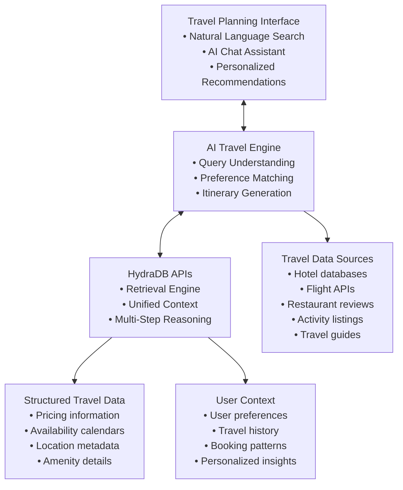

This guide demonstrates how to build an AI-powered travel planning platform that transforms how travelers discover, plan, and book their trips. Instead of traditional keyword searches and manual browsing, your platform will understand natural language queries and provide intelligent, personalized travel recommendations using HydraDB.

> **Note**: All code in this guide calls the HydraDB REST API directly with `fetch`. Base URL: `https://api.hydradb.com`. Get your API key at [app.hydradb.com](https://app.hydradb.com).

## Prerequisites

**Required knowledge**: TypeScript/JavaScript basics, REST APIs, environment variables  
**Required tools**:
- HydraDB API key
- Node.js 18+ (`node --version`)

## What You'll Build

By the end of this cookbook, you'll be able to:
- Upload hotel, flight, restaurant, and activity data into HydraDB with correct database scoping
- Answer complex natural language travel queries like "Plan a 5-day romantic trip to Italy for $3000" with `mode: "thinking"`
- Store per-user travel preferences and booking history as context for personalized recommendations
- Build family, business, and adventure trip planning flows using semantic search

## The Problem with Traditional Travel Planning

Traditional travel platforms force users to think like search engines:

- **Keyword matching**: “Hotels in Paris” or “Flights to Tokyo”
- **Filter-heavy interfaces**: Complex combinations of dates, prices, and amenities
- **Manual research**: Hours spent comparing options across multiple sites
- **Generic recommendations**: One-size-fits-all suggestions that ignore personal preferences
- **Fragmented experience**: Separate searches for flights, hotels, activities, and restaurants

## The AI-Powered Solution

With HydraDB, travelers can plan naturally and get personalized recommendations:

- **“Plan a 5-day romantic trip to Italy for my anniversary in September with a budget of \$3000”**
- **“Find me a family-friendly resort in Bali with a kids club and water sports activities”**
- **“I want to experience authentic local cuisine in Bangkok - suggest restaurants and food tours”**
- **“Plan a solo backpacking trip through Southeast Asia for 3 weeks, focusing on cultural experiences”**
- **“Find pet-friendly accommodations in San Francisco with easy access to dog parks”**

## Architecture Overview




## Step 1: Travel Data Ingestion Strategy

Create the database first. Declare a `category` field in the metadata schema so queries can filter by travel category later:


```javascript
const BASE_URL = "https://api.hydradb.com";
const HEADERS = {
  Authorization: `Bearer ${process.env.HYDRA_DB_API_KEY}`,
  "API-Version": "2",
  "Content-Type": "application/json",
};

const createDatabase = async (database) => {
  const res = await fetch(`${BASE_URL}/databases`, {
    method: "POST",
    headers: HEADERS,
    body: JSON.stringify({
      database,
      database_metadata_schema: [
        { name: "category", data_type: "VARCHAR" },
      ],
    }),
  });
  if (!res.ok) throw new Error(`create database failed: ${res.status}`);
  return res.json();
};

const ingestContext = async (body) => {
  const res = await fetch(`${BASE_URL}/context/ingest`, {
    method: "POST",
    headers: HEADERS,
    body: JSON.stringify(body),
  });
  if (!res.ok) throw new Error(`ingest failed: ${res.status}`);
  return (await res.json()).data;
};

const hydraQuery = async (body) => {
  const res = await fetch(`${BASE_URL}/query`, {
    method: "POST",
    headers: HEADERS,
    body: JSON.stringify(body),
  });
  if (!res.ok) throw new Error(`query failed: ${res.status}`);
  return (await res.json()).data;
};
```


### 1.1 Hotel and Accommodation Data

Start by uploading comprehensive hotel and accommodation data as context items:


```javascript
const uploadHotelData = async (hotels, database, collection) => {
  const items = hotels.map(hotel => ({
    context_id: `hotel_${hotel.id}`,
    title: hotel.name,
    text: `${hotel.name} - ${hotel.description}. Located in ${hotel.city}, ${hotel.country}.
           Amenities: ${hotel.amenities.join(', ')}.
           Average rating: ${hotel.rating}/5 from ${hotel.reviewCount} reviews.
           Price range: ${hotel.priceRange}.
           Room types: ${hotel.roomTypes.join(', ')}.`,
    attributes: { category: "accommodation" },
    custom_attributes: {
      location: hotel.coordinates,
      priceRange: hotel.priceRange,
      rating: hotel.rating,
      propertyType: hotel.propertyType
    }
  }));

  await ingestContext({
    database,
    collection,
    upsert: true,
    context: items,
  });
};
```


### 1.2 Flight and Transportation Data

Upload flight schedules, routes, and transportation options:


```javascript
const uploadFlightData = async (flights, database, collection) => {
  const items = flights.map(flight => ({
    context_id: `flight_${flight.id}`,
    title: `${flight.airline} ${flight.flightNumber}`,
    text: `${flight.airline} flight ${flight.flightNumber} from ${flight.origin} to ${flight.destination}.
           Duration: ${flight.duration}.
           Aircraft: ${flight.aircraft}.
           Departure: ${flight.departureTime}.
           Arrival: ${flight.arrivalTime}.`,
    attributes: { category: "transportation" },
    custom_attributes: {
      origin: flight.origin,
      destination: flight.destination,
      airline: flight.airline,
      price: flight.price,
      class: flight.class
    }
  }));

  await ingestContext({
    database,
    collection,
    upsert: true,
    context: items,
  });
};
```


### 1.3 Restaurant and Dining Data

Upload restaurant information with cuisine types and reviews:


```javascript
const uploadRestaurantData = async (restaurants, database, collection) => {
  const items = restaurants.map(restaurant => ({
    context_id: `restaurant_${restaurant.id}`,
    title: restaurant.name,
    text: `${restaurant.name} - ${restaurant.description}.
           Cuisine: ${restaurant.cuisine}.
           Location: ${restaurant.address}.
           Price range: ${restaurant.priceRange}.
           Rating: ${restaurant.rating}/5.
           Specialties: ${restaurant.specialties.join(', ')}.`,
    attributes: { category: "dining" },
    custom_attributes: {
      cuisine: restaurant.cuisine,
      priceRange: restaurant.priceRange,
      rating: restaurant.rating,
      dietaryOptions: restaurant.dietaryOptions
    }
  }));

  await ingestContext({
    database,
    collection,
    upsert: true,
    context: items,
  });
};
```


### 1.4 Activity and Attraction Data

Upload tourist attractions, activities, and experiences:


```javascript
const uploadActivityData = async (activities, database, collection) => {
  const items = activities.map(activity => ({
    context_id: `activity_${activity.id}`,
    title: activity.name,
    text: `${activity.name} - ${activity.description}.
           Category: ${activity.category}.
           Duration: ${activity.duration}.
           Difficulty: ${activity.difficulty}.
           Best time to visit: ${activity.bestSeason}.
           Price: ${activity.price}.`,
    attributes: { category: "activity" },
    custom_attributes: {
      duration: activity.duration,
      difficulty: activity.difficulty,
      price: activity.price,
      ageGroup: activity.ageGroup
    }
  }));

  await ingestContext({
    database,
    collection,
    upsert: true,
    context: items,
  });
};
```


## Step 2: Building the AI Travel Assistant

### 2.1 Natural Language Query Processing

Create a travel query handler that understands complex travel requests:


```javascript
class TravelAssistant {
  async planTrip(query, userProfile) {
    // Use HydraDB's thinking mode for complex travel planning
    const data = await hydraQuery({
      query,
      database: userProfile.database,
      collection: userProfile.collection,
      mode: "thinking",
      alpha: "auto",
      max_results: 20
    });

    return this.processResponse(data);
  }

  async processResponse(data) {
    // data.graph is a list of { origin, triplets, path_summary } paths
    return {
      chunks: data?.chunks,
      graphPaths: data?.graph,
      llmPrompt: data?.llm_prompt
    };
  }
}
```


### 2.2 Personalized Recommendation Engine

Store per-user context to remember preferences and past travel patterns:


```javascript
class PersonalizationEngine {
  async saveUserContext(userInteraction) {
    // Store the user's signals in their own collection
    await ingestContext({
      database: userInteraction.database,
      collection: `user-${userInteraction.userId}`,
      upsert: true,
      context: [{
        context_id: `signals_${Date.now()}`,
        title: "Travel preference signals",
        text: `User searched for: ${userInteraction.query}.
               They showed interest in: ${userInteraction.clickedItems.join(', ')}.
               They booked: ${userInteraction.bookedItems.join(', ')}.`,
        enrich: true,
        user_name: userInteraction.userName
      }]
    });
  }

  async getPersonalizedRecommendations(database, userId, destination) {
    // Retrieve the user's context to provide personalized recommendations
    const data = await hydraQuery({
      database,
      collection: `user-${userId}`,
      query: `travel preferences for ${destination}`,
      max_results: 10
    });

    // data.chunks contains the user's past preference signals ranked by relevance.
    // Pass these as context to your LLM to generate personalized recommendations.
    return data?.chunks;
  }
}
```


## Step 3: Advanced Search Capabilities

### 3.1 Semantic Search for Travel Experiences

Implement semantic search to understand complex travel desires:


```javascript
const searchTravelExperiences = async (query, database, collection, filters = {}) => {
  const searchQuery = `${query} ${filters.destination ? `in ${filters.destination}` : ''}
                       ${filters.budget ? `budget ${filters.budget}` : ''}
                       ${filters.travelStyle ? `${filters.travelStyle} travel` : ''}`;

  const data = await hydraQuery({
    query: searchQuery,
    database,
    collection,
    mode: "fast",
    alpha: 1.0,
    max_results: 20
  });

  return data;
};
```


### 3.2 Multi-Modal Travel Search

Support different types of travel queries:


```javascript
const handleTravelQuery = async (query, context) => {
  // HydraDB's semantic search handles all query types without manual classification.
  // Use mode: "thinking" for complex multi-part queries (full itineraries, comparisons).
  // Use mode: "fast" for single-category lookups (hotels only, flights only).
  const isComplex = /itinerary|plan|trip|vacation|week|days/i.test(query);

  const data = await hydraQuery({
    query,
    database: context.database,
    collection: context.collection,
    mode: isComplex ? "thinking" : "fast",
    max_results: isComplex ? 20 : 10
  });

  return data.chunks;
};
```


## Step 4: Real-World Implementation Examples

### 4.1 Family Vacation Planning

**User Query**: _“Plan a 7-day family vacation to Orlando with kids aged 8 and 12, budget \$4000, we love theme parks and want kid-friendly restaurants”_


```javascript
const planFamilyVacation = async (query, userProfile) => {
  // Query once per category using the `category` attribute declared at ingest.
  const itinerary = {};
  for (const [key, category] of Object.entries({
    accommodation: "accommodation",
    activities: "activity",
    dining: "dining",
    transportation: "transportation"
  })) {
    const data = await hydraQuery({
      query,
      database: userProfile.database,
      collection: userProfile.collection,
      mode: "thinking",
      max_results: 5,
      attributes: { category }
    });
    itinerary[key] = data.chunks;
  }

  return itinerary;
};
```


### 4.2 Business Travel Optimization

**User Query**: _“I need to travel to London for business next week, find hotels near financial district with good WiFi and meeting rooms”_


```javascript
const planBusinessTravel = async (query, userProfile) => {
  const data = await hydraQuery({
    query,
    database: userProfile.database,
    collection: userProfile.collection,
    mode: "fast",
    max_results: 10,
    attributes: { category: "accommodation" }
  });

  // Return ranked chunks directly.
  return data.chunks;
};
```


### 4.3 Adventure Travel Planning

**User Query**: _“I want to go trekking in Nepal for 2 weeks, suggest routes for intermediate hikers with cultural experiences”_


```javascript
const planAdventureTravel = async (query, userProfile) => {
  const data = await hydraQuery({
    query,
    database: userProfile.database,
    collection: userProfile.collection,
    mode: "thinking",
    max_results: 15,
    attributes: { category: "activity" }
  });

  // Return ranked chunks directly.
  return data.chunks;
};
```


## Step 5: Contextual Recommendations

### 5.1 Weather-Based Suggestions


```javascript
const getWeatherBasedRecommendations = async (destination, travelDate, database, collection) => {
  const weatherQuery = `What activities and attractions are best in ${destination} during ${travelDate} considering weather conditions?`;

  return hydraQuery({
    query: weatherQuery,
    database,
    collection,
    mode: "fast",
    max_results: 10
  });
};
```


### 5.2 Cultural Event Integration


```javascript
const getCulturalEventRecommendations = async (destination, travelDate, database, collection) => {
  const eventQuery = `What cultural events, festivals, or seasonal experiences are happening in ${destination} during ${travelDate}?`;

  return hydraQuery({
    query: eventQuery,
    database,
    collection,
    mode: "fast",
    max_results: 10
  });
};
```


## Step 6: Learning from User Behavior

### 6.1 Booking Pattern Analysis


```javascript
const analyzeBookingPatterns = async (database, collection, bookingData) => {
  const analysisText = `User has booked: ${bookingData.map(b => b.description).join(', ')}. What patterns can we identify about their travel preferences?`;

  // Store the booking summary for future personalization
  await ingestContext({
    database,
    collection,
    upsert: true,
    context: [{
      context_id: `booking_patterns_${bookingData[0].userId}`,
      title: "Booking pattern summary",
      text: analysisText,
      enrich: true,
      user_name: bookingData[0].userName
    }]
  });
};
```


### 6.2 Search Refinement


```javascript
const refineSearch = async (originalQuery, userFeedback, database, collection) => {
  const refinedQuery = `${originalQuery}. User feedback: ${userFeedback}. Please adjust recommendations accordingly.`;

  return hydraQuery({
    query: refinedQuery,
    database,
    collection,
    mode: "thinking",
    max_results: 10
  });
};
```


## Advanced Features

### Multi-Language Support


```javascript
const handleMultiLanguageQuery = async (query, language, destination, database, collection) => {
  const localizedQuery = `${query} (query in ${language} for ${destination})`;

  return hydraQuery({
    query: localizedQuery,
    database,
    collection,
    mode: "fast",
    max_results: 10
  });
};
```


### Real-Time Price Monitoring


```javascript
const monitorPriceChanges = async (travelPlan) => {
  const priceText = `Monitor price changes for: ${travelPlan.description}. Alert if prices drop by 10% or more.`;

  // Store the watch request in the user's collection
  await ingestContext({
    database: travelPlan.database,
    collection: `user-${travelPlan.userId}`,
    upsert: true,
    context: [{
      context_id: `price_watch_${travelPlan.userId}`,
      title: "Price watch",
      text: priceText,
      enrich: true
    }]
  });
};
```


## Example User Interactions

### Scenario 1: Spontaneous Weekend Trip

**User**: _“I want to go somewhere warm this weekend, budget \$800, flying from New York”_

**AI Response**: Based on your budget and preference for warm weather, I recommend:

- **Miami, Florida**: 3-day weekend package with beachfront hotel and flights for \$750
- **Austin, Texas**: Music and food scene with boutique hotel for \$680
- **Savannah, Georgia**: Historic charm with B&B accommodation for \$620

### Scenario 2: Anniversary Celebration

**User**: _“Plan a romantic anniversary trip to Paris for 5 days in May, we love art museums and fine dining”_

**AI Response**: For your romantic Paris anniversary:

- **Accommodation**: Hotel des Grands Boulevards in the 2nd arrondissement
- **Day 1**: Louvre Museum morning, Seine river cruise evening
- **Day 2**: Musée d'Orsay, dinner at L'Ambroisie (Michelin 3-star)
- **Day 3**: Montmartre walking tour, Picasso Museum
- **Day 4**: Versailles day trip, romantic dinner at Le Meurice
- **Day 5**: Rodin Museum, farewell lunch at L'Atelier de Joël Robuchon

### Scenario 3: Solo Adventure Planning

**User**: _“I'm planning a solo backpacking trip through Southeast Asia for a month, focusing on cultural immersion and budget-friendly options”_

**AI Response**: Your month-long Southeast Asia adventure:

- **Route**: Thailand → Vietnam → Cambodia → Laos
- **Budget**: \$2,000-2,500 total
- **Accommodation**: Mix of hostels and homestays
- **Cultural experiences**: Cooking classes, temple visits, local festivals
- **Transportation**: Buses and trains for authentic experience

## Integration with Booking Systems

### Real-Time Availability Checking


```javascript
const checkAvailability = async (hotelId, checkIn, checkOut, database, collection) => {
  const availabilityQuery = `Check availability for ${hotelId} from ${checkIn} to ${checkOut}`;

  return hydraQuery({
    query: availabilityQuery,
    database,
    collection,
    mode: "fast",
    max_results: 5
  });
};
```


### Dynamic Pricing Integration


```javascript
const getDynamicPricing = async (searchResults, userProfile) => {
  const pricingQuery = `Get current pricing for these travel options considering user's booking history and preferences`;

  return hydraQuery({
    query: pricingQuery,
    database: userProfile.database,
    collection: userProfile.collection,
    mode: "fast",
    max_results: 10
  });
};
```


## Conclusion

Building an AI travel planner with HydraDB transforms the travel planning experience from a tedious research process into an intelligent, conversational journey. With HydraDB's unified context, multi-step reasoning, and semantic search, you can create a platform that truly understands traveler intent and provides personalized recommendations.

Key benefits of this approach:

- **Natural Language Understanding**: Users can express complex travel desires in natural language
- **Personalized Recommendations**: Stored user context ensures recommendations improve over time
- **Contextual Awareness**: Multi-step reasoning considers all aspects of travel planning
- **Simple Integration**: Easy integration with existing booking systems and travel APIs

The result is a travel planning platform that feels more like having a knowledgeable travel advisor than using a search engine, creating higher user satisfaction and better conversion rates for travel businesses.
