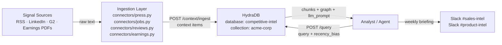

This guide walks you through building a **competitive intelligence agent with persistent context** powered by HydraDB. Unlike a static market research doc or a naive RAG pipeline, this agent continuously ingests competitor signals and answers both point-in-time questions ("What has Acme Corp announced about enterprise?") and trend questions ("How has their pricing messaging shifted since Q1?") - with full context across press releases, job postings, customer reviews, and earnings calls unified in one retrieval layer.

> **Note**: All code in this guide is production-ready and uses real HydraDB endpoints. Base URL: `https://api.hydradb.com`. Get your API key at [app.hydradb.com](https://app.hydradb.com). SDK snippets use the call shapes in the [SDK reference](/api-reference/v2/sdks) and require an SDK release generated from the current API specification; the cURL examples work today.

> **Goal**: Build an agent that ingests four signal types from competitor sources, verifies indexing, and answers competitive queries using `POST /query` with `recency_bias` tuned per query type - point-in-time or trend. Full round-trip under 200ms.

---

## Prerequisites

**Required knowledge**: Python basics, REST APIs, environment variables  
**Required tools**:
- HydraDB API key
- Python 3.11 or 3.12 (`python --version`)
- `pip install hydradb-sdk`

## What You'll Build

By the end of this cookbook, you'll be able to:
- Ingest press releases, job postings, customer reviews, and earnings transcripts into a per-competitor HydraDB collection
- Verify indexing before running search queries so you never query against stale data
- Answer point-in-time queries ("What has Acme announced about enterprise?") using `recency_bias: 0.8`
- Answer trend queries ("How has their messaging shifted since Q1?") using `recency_bias: 0.3`
- Deliver a weekly Slack briefing to sales and product channels with AI-summarized competitor signals

---

## The Problem with Manual Competitive Research

Most competitive intelligence today is a manual process - a researcher Googles, copies links into a Notion page, and writes a monthly summary. Ask "What did Competitor X say about enterprise last quarter?" and there's no system to answer it.

Standard RAG pipelines don't solve this either. A vector store treats a press release from 18 months ago identically to one from last week - they produce similar embeddings. Ask "how has their messaging shifted?" and you get a random mix of old and new signals with no temporal ranking. Ask "what are they announcing right now?" and stale results pollute the top of the list.

HydraDB fixes this with three capabilities that standard vector search can't replicate:

1. **Timestamp-aware ranking** - every uploaded source is ranked by recency at query time. Set `recency_bias: 0.8` to surface the latest signals first. Set `recency_bias: 0.3` to pull historical signals for trend comparison.
2. **Context graph** - HydraDB automatically extracts entities and links them across sources. A job posting mentioning "enterprise security", a press release announcing an enterprise tier, and a G2 review complaining about enterprise onboarding are automatically connected - so a query about enterprise strategy surfaces all three.
3. **Collection isolation** - each competitor gets their own `collection` within a shared `competitive-intel` database. Query one competitor in isolation or compare across all of them in a single call.

---

## Architecture Overview



- **Signal Sources**: Press releases via RSS, job postings from LinkedIn/Greenhouse, customer reviews from G2/Capterra, earnings transcripts as plain text (extract PDF text in the connector).
- **Ingestion Layer**: Connector scripts that format content and upload to HydraDB via `POST /context/ingest`.
- **HydraDB**: Stores all signals with timestamps, builds a context graph, and ranks results by recency at query time.
- **Analyst / Agent**: A human analyst, a Slack bot, or an LLM that calls `POST /query` with a natural language query.

---

## Step 1 - Create Database

One database for all competitive intelligence. Collections isolate by competitor and are created automatically on the first upload - no setup required.

```bash
curl -X POST 'https://api.hydradb.com/databases' \
  -H "Authorization: Bearer YOUR_API_KEY" \
  -H "API-Version: 2" \
  -H "Content-Type: application/json" \
  -d '{"database": "competitive-intel"}'
```

```python
# setup.py
import os
from hydra_db import HydraDB

client = HydraDB(token=os.environ["HYDRA_DB_API_KEY"])
DATABASE_ID = "competitive-intel"

client.databases.create(database=DATABASE_ID)
print(f"✓ Database '{DATABASE_ID}' ready.")

def collection_for(competitor: str) -> str:
    """Normalise competitor name to a valid collection."""
    return competitor.lower().replace(" ", "-")

# e.g. collection_for("Acme Corp") → "acme-corp"
```

Output:
```
✓ Database 'competitive-intel' ready.
```

> **Collection pattern**: Use `collection: "acme-corp"`, `collection: "betacorp"` on every upload. This lets you query a single competitor (`collection: "acme-corp"`) or all competitors at once (omit `collection`). Collections are created automatically on first write.

---

## Step 2 - Ingest Competitor Signals

All four signal types use `POST /context/ingest` with a JSON body: `database`, `collection`, and a `context` array of items. Each item carries `text` (or a `conversation`), plus optional `context_id`, `title`, `happened_at` and attributes. There is no file upload on a unified database - a connector that starts from a PDF extracts the text itself (for example with `pypdf`) and sends it as `text` items.

> **Batch limit**: Max 100 items per request. Always call `GET /context/status` before running search - queries against unindexed items return empty results.

The `202 Accepted` response looks like this for all signal types:

```json
{
  "success": true,
  "data": {
    "success": true,
    "message": "Context queued for ingestion successfully. ...",
    "results": [
      {
        "id": "press-acme-corp-1234567890",
        "title": "Acme Corp press release",
        "status": "queued",
        "infer": true,
        "error": null,
        "error_code": null
      }
    ],
    "success_count": 1,
    "failed_count": 0
  }
}
```

`202` means queued, not indexed. Save the `id` from `results[0].id` - you need it to verify indexing.

### 2.1 Press Releases & Blog Posts

Press releases are the most explicit signal. Prepend signal metadata to the content so HydraDB's graph extractor tags entities correctly and links them to related sources.

```python
# connectors/press.py
import json, os, time
from hydra_db import HydraDB

client = HydraDB(token=os.environ["HYDRA_DB_API_KEY"])
DATABASE_ID = "competitive-intel"


def ingest_press_release(competitor: str, title: str, text: str) -> str:
    """
    Upload a press release or blog post to HydraDB.
    competitor: normalised name, e.g. "acme-corp"
    title:      article headline
    text:       full article body
    Returns:    context id for verification
    """
    content   = f"Signal type: press_release\nCompetitor: {competitor}\nTitle: {title}\n\n{text}"
    context_id = f"press-{competitor}-{int(time.time())}"

    result = client.context.ingest(
        database=DATABASE_ID,
        collection=competitor,
        context=json.dumps([{
            "context_id": context_id,
            "title":      title,
            "text":       content,
        }]),
    )
    id = result.data.results[0].id
    print(f"[press] Uploaded {context_id} → id: {id}")
    return id
```

### 2.2 Job Postings

Job postings are one of the strongest competitive signals - they reveal exactly what a company is building before any press release. A spike in "enterprise security engineer" roles signals an enterprise push. "ML platform engineer" roles signal AI product investment. Include the job title and department in the content so HydraDB's graph links related roles across uploads.

```python
# connectors/jobs.py
import json, os, time
from hydra_db import HydraDB

client = HydraDB(token=os.environ["HYDRA_DB_API_KEY"])
DATABASE_ID = "competitive-intel"


def ingest_job_posting(competitor: str, title: str, department: str, description: str) -> str:
    """
    Upload a job posting from LinkedIn, Greenhouse, Lever, etc.
    competitor:  e.g. "acme-corp"
    title:       job title - included in content for graph linking
    department:  e.g. "Engineering", "Product", "Sales"
    description: full job description text
    Returns:     id for verification
    """
    content = (
        f"Signal type: job_posting\n"
        f"Competitor: {competitor}\n"
        f"Role: {title}\n"
        f"Department: {department}\n\n"
        f"{description}"
    )
    context_id = f"job-{competitor}-{int(time.time())}"

    result = client.context.ingest(
        database=DATABASE_ID,
        collection=competitor,
        context=json.dumps([{
            "context_id": context_id,
            "title":      f"{title} ({department})",
            "text":       content,
        }]),
    )
    id = result.data.results[0].id
    print(f"[jobs] Uploaded {context_id} → id: {id}")
    return id
```

### 2.3 Customer Reviews (G2 / Capterra / Trustpilot)

Customer reviews are the most honest signal - they surface real objections, real pain points, and what customers actually value. None of this appears in official press releases. Negative reviews (rating ≤ 2) are especially valuable for building sales battlecards.

```python
# connectors/reviews.py
import json, os, time
from hydra_db import HydraDB

client = HydraDB(token=os.environ["HYDRA_DB_API_KEY"])
DATABASE_ID = "competitive-intel"


def ingest_review(
    competitor:    str,
    title:         str,
    body:          str,
    rating:        int,
    reviewer_role: str = "Unknown",
) -> str:
    """
    Upload a customer review from G2, Capterra, Trustpilot, etc.
    competitor:    e.g. "acme-corp"
    title:         review headline
    body:          full review text
    rating:        1-5 stars
    reviewer_role: e.g. "IT Director", "VP Engineering"
    Returns:       id for verification
    """
    sentiment = "positive" if rating >= 4 else "negative" if rating <= 2 else "neutral"
    content   = (
        f"Signal type: customer_review\n"
        f"Competitor: {competitor}\n"
        f"Rating: {rating}/5 ({sentiment})\n"
        f"Reviewer role: {reviewer_role}\n"
        f"Review title: {title}\n\n"
        f"{body}"
    )
    context_id = f"review-{competitor}-{int(time.time())}"

    result = client.context.ingest(
        database=DATABASE_ID,
        collection=competitor,
        context=json.dumps([{
            "context_id": context_id,
            "title":      title,
            "text":       content,
        }]),
    )
    id = result.data.results[0].id
    print(f"[reviews] Uploaded {context_id} ({sentiment}) → id: {id}")
    return id
```

### 2.4 Earnings Call Transcripts

For public competitors, earnings calls contain the most explicit strategic signals - pricing changes, market focus, competitive responses, and financial trajectory. Upload as plain text. HydraDB handles chunking and indexing automatically.

```python
# connectors/earnings.py
import json, os, time
from hydra_db import HydraDB

client = HydraDB(token=os.environ["HYDRA_DB_API_KEY"])
DATABASE_ID = "competitive-intel"


def ingest_earnings_transcript(competitor: str, quarter: str, transcript: str) -> str:
    """
    Upload an earnings call transcript.
    competitor:  e.g. "acme-corp"
    quarter:     e.g. "2024-Q3"
    transcript:  full text of the earnings call
    Returns:     id for verification
    """
    content = (
        f"Signal type: earnings_call\n"
        f"Competitor: {competitor}\n"
        f"Quarter: {quarter}\n\n"
        f"{transcript}"
    )
    context_id = f"earnings-{competitor}-{quarter}-{int(time.time())}"

    result = client.context.ingest(
        database=DATABASE_ID,
        collection=competitor,
        context=json.dumps([{
            "context_id": context_id,
            "title":      f"{competitor} earnings call {quarter}",
            "text":       content,
        }]),
    )
    id = result.data.results[0].id
    print(f"[earnings] Uploaded {context_id} → id: {id}")
    return id
```

---

## Step 3 - Verify Indexing

After uploading, poll `GET /context/status` until `indexing_status` is `completed`. HydraDB indexes asynchronously - typically 10-30 seconds per item. Do not query until indexing is complete; unindexed items return empty results.

> **Note**: [`GET /context/status`](/api-reference/v2/endpoint/source-status) takes `ids` and `database` as **query parameters**. Pass multiple `ids` to check a batch in one call.

```bash
curl -G \
  'https://api.hydradb.com/context/status' \
  -H "Authorization: Bearer YOUR_API_KEY" \
  -H "API-Version: 2" \
  --data-urlencode "database=competitive-intel" \
  --data-urlencode "collection=acme-corp" \
  --data-urlencode "ids=YOUR_ID"
```

**Response when indexed**:
```json
{
  "success": true,
  "data": {
    "statuses": [
      {
        "id": "press-acme-corp-1234567890",
        "indexing_status": "completed",
        "error_code": "",
        "error_message": "",
        "success": true,
        "message": "Processing status retrieved successfully"
      }
    ]
  }
}
```

```python
# ingest/verify.py
import os, time
from hydra_db import HydraDB

client = HydraDB(token=os.environ["HYDRA_DB_API_KEY"])
DATABASE_ID = "competitive-intel"


def wait_until_indexed(id: str, collection: str, max_tries: int = 20, interval: int = 3) -> None:
    """
    Poll /context/status until the item is indexed or times out.
    Pass the same collection you ingested into.
    Raises RuntimeError if indexing errors. Warns on timeout (may still complete).
    """
    for i in range(max_tries):
        time.sleep(interval)
        status_result = client.context.status(
            database=DATABASE_ID,
            collection=collection,
            ids=[id],
        )
        items  = status_result.data.statuses or []
        status = items[0].indexing_status if items else None

        if status == "completed":
            print(f"Indexed ✓ ({id})")
            return
        if status == "errored":
            raise RuntimeError(f"Indexing failed for id: {id}")

        print(f"Indexing... {status or 'queued'} (attempt {i+1}/{max_tries})")

    print(f"Timeout - {id} may still complete in background.")
```

Output (typical run with 1 source):
```
Indexing... queued (attempt 1/20)
Indexing... queued (attempt 2/20)
Indexing... processing (attempt 3/20)
Indexed ✓ (d25fb5a6-0378-4bcb-8cbc-2012c3d12ca2)
```

---

## Step 4 - Query: Point-in-Time Questions

Use `POST /query` to answer "What is Competitor X doing right now?". Set `recency_bias: 0.8` so HydraDB strongly weights the most recent signals. Set `mode: "thinking"` to enable multi-query reranking.

```bash
curl -X POST 'https://api.hydradb.com/query' \
  -H "Authorization: Bearer YOUR_API_KEY" \
  -H "Content-Type: application/json" \
  -d '{
    "database":     "competitive-intel",
    "collection": "acme-corp",
    "query":         "What has acme-corp announced about their enterprise tier?",
    "mode":          "thinking",
    "max_results":   12,
    "alpha":         0.8,
    "recency_bias":  0.8,
    "graph_context": true
  }'
```

```python
# query/search.py
import os
from hydra_db import HydraDB

client = HydraDB(token=os.environ["HYDRA_DB_API_KEY"])
DATABASE_ID = "competitive-intel"


def ask_about_competitor(
    question:     str,
    competitor:   str,
    recency_bias: float = 0.8,
    mode:         str   = "thinking",
    max_results:  int   = 12,
) -> dict:
    """
    Query HydraDB for competitor signals.
    recency_bias: 0.8 = point-in-time, 0.3 = trend
    Returns the full API response: chunks, graph, forceful_relations, llm_prompt.
    """
    return client.query(
        database=DATABASE_ID,
        collection=competitor,
        query=question,
        mode=mode,
        max_results=max_results,
        alpha=0.8,
        recency_bias=recency_bias,
        graph_context=True,
    )


def print_results(result) -> None:
    """Pretty-print chunks from a /query response."""
    chunks = result.data.chunks or []
    print(f"\n{len(chunks)} chunks retrieved:\n")
    for chunk in chunks:
        score = chunk.score or 0
        print(f"  [{chunk.context_id} - {score:.2f}]")
        print(f"  {(chunk.content or '')[:200]}...")
        print()


# Example: point-in-time question
result = ask_about_competitor(
    question     = "What has acme-corp announced about their enterprise tier?",
    competitor   = "acme-corp",
    recency_bias = 0.8,
)
print_results(result)
```

**Response structure** (`data` has exactly four keys):
```json
{
  "success": true,
  "data": {
    "chunks": [
      {
        "chunk_id": "press-acme-corp-..._chunk_0",
        "context_id": "press-acme-corp-1234567890",
        "score": 0.818,
        "content": "Signal type: press_release\nCompetitor: acme-corp\n\nAcme Corp today announced AcmeShield...",
        "enrichment": "Acme Corp announced the AcmeShield enterprise security product."
      }
    ],
    "graph": [
      {
        "origin": "query",
        "triplets": [
          {
            "source":   {"name": "acmeshield",  "entity_id": "ent_acmeshield"},
            "relation": {"predicate": "includes", "context": "AcmeShield includes SOC 2 Type II compliance...", "relationship_id": "rel_1", "chunk_id": "press-acme-corp-..._chunk_0"},
            "target":   {"name": "soc 2 type ii", "entity_id": "ent_soc2"}
          },
          {
            "source":   {"name": "acme corp",   "entity_id": "ent_acme"},
            "relation": {"predicate": "announced", "context": "Acme Corp announced AcmeShield...", "relationship_id": "rel_2", "chunk_id": "press-acme-corp-..._chunk_0"},
            "target":   {"name": "acmeshield",  "entity_id": "ent_acmeshield"}
          }
        ],
        "path_summary": "Acme Corp announced AcmeShield, which includes SOC 2 Type II compliance."
      }
    ],
    "forceful_relations": [],
    "llm_prompt": "# Query results\n\n## Results\n[1] Signal type: press_release ..."
  }
}
```

> **Reading `graph`**: Each entry is a path of `triplets` - entities HydraDB automatically extracted and linked across all your uploaded items - plus a `path_summary`. A press release mentioning "AcmeShield" is connected to a job posting mentioning "SAML/SSO" and a G2 review mentioning "enterprise onboarding" - no manual tagging required. This is what surfaces all three when you ask about "enterprise strategy".

---

## Step 5 - Query: Trend & Temporal Questions

For trend and comparison questions, reduce `recency_bias` to `0.3` so HydraDB surfaces both old and new signals. This gives it the historical range it needs to answer "how has X changed?" - a question that naive RAG cannot reliably answer at all.

```python
# query/trends.py
# (uses ask_about_competitor from query/search.py)


def ask_trend_question(question: str, competitor: str) -> dict:
    """
    Ask a trend or temporal comparison question.
    recency_bias 0.3 = surfaces old AND recent signals for comparison.
    """
    return ask_about_competitor(
        question     = question,
        competitor   = competitor,
        recency_bias = 0.3,    # lower = historical signals surface alongside recent ones
        max_results  = 20,     # more results for trend analysis
    )


# Example: trend question
result = ask_trend_question(
    question   = "How has acme-corp's enterprise messaging shifted over the past year?",
    competitor = "acme-corp",
)
print_results(result)

# Follow-up: same competitor, narrower focus
result2 = ask_trend_question(
    question   = "How has their pricing messaging changed from Q1 to Q3?",
    competitor = "acme-corp",
)
print_results(result2)
```

> **recency_bias guide**:
> - `0.8-1.0` - Point-in-time: "What is X doing now?" Strongly weights the latest signals.
> - `0.3-0.5` - Trend: "How has X changed?" Surfaces old and new for comparison.
> - `0.0` - No bias: equal weight across all time periods.

> **Multi-competitor comparison**: To compare two competitors in one query, omit `collection` entirely and ask "How does acme-corp's enterprise positioning compare to betacorp's?" HydraDB searches across all collections within the database and surfaces signals from both.

---

## Step 6 - Weekly Briefing Agent

Push a proactive Monday-morning briefing to each analyst's Slack channel. Each analyst profile runs a set of questions through [`/query`](/api-reference/v2/endpoint/query) with `recency_bias: 0.85` to surface the freshest signals.

```python
# briefing/weekly.py
import os, requests
from hydra_db import HydraDB

client = HydraDB(token=os.environ["HYDRA_DB_API_KEY"])
SLACK_TOKEN   = os.environ["SLACK_BOT_TOKEN"]
DATABASE_ID     = "competitive-intel"

BRIEFING_CONFIG = {
    "pm-alice": {
        "channel":      "#product-intel",
        "questions": [
            "What product features or capabilities did our top competitors announce this week?",
            "What new engineering or product roles are competitors hiring for and what does this signal?",
            "What product capabilities are customers praising or criticising in recent reviews?",
        ],
        "recency_bias": 0.85,
    },
    "sales-bob": {
        "channel":      "#sales-intel",
        "questions": [
            "What pricing or packaging changes have competitors made recently?",
            "What objections are customers raising about competitors on G2 and review sites?",
            "What enterprise or mid-market moves are competitors making based on recent signals?",
        ],
        "recency_bias": 0.85,
    },
    "gtm-carol": {
        "channel":      "#gtm-intel",
        "questions": [
            "How is competitor messaging evolving this quarter?",
            "What new market segments are competitors targeting based on recent signals?",
            "What is shifting in analyst and press sentiment about our competitors?",
        ],
        "recency_bias": 0.85,
    },
}

COMPETITORS = ["acme-corp", "betacorp", "gamma-ai"]


def recall_for_question(question: str, competitor: str, recency_bias: float) -> str:
    """Run a single /query request and return the top chunks as a text block."""
    results = client.query(
        database=DATABASE_ID,
        collection=competitor,
        query=question,
        mode="thinking",
        max_results=10,
        alpha=0.8,
        recency_bias=recency_bias,
        graph_context=True,
    )
    chunks = results.data.chunks or []
    if not chunks:
        return "No signals found for this question."
    # llm_prompt is the rendered context block; fall back to raw chunk content.
    return results.data.llm_prompt or "\n".join((c.content or "")[:300] for c in chunks[:3])


def generate_briefing(analyst: str) -> str:
    """Generate a weekly briefing for one analyst across all tracked competitors."""
    cfg   = BRIEFING_CONFIG[analyst]
    lines = [f"*/// Weekly Competitive Intelligence - {analyst}*\n"]

    for competitor in COMPETITORS:
        lines.append(f"*── {competitor.upper()} ──*")
        for question in cfg["questions"]:
            answer = recall_for_question(question, competitor, cfg["recency_bias"])
            lines.append(f"*{question}*\n{answer}\n")

    return "\n".join(lines)


def send_to_slack(channel: str, text: str) -> None:
    requests.post(
        "https://slack.com/api/chat.postMessage",
        headers={"Authorization": f"Bearer {SLACK_TOKEN}"},
        json={"channel": channel, "text": text},
    )


def run_all_briefings() -> None:
    for analyst, cfg in BRIEFING_CONFIG.items():
        print(f"Generating briefing for {analyst}...")
        briefing = generate_briefing(analyst)
        send_to_slack(cfg["channel"], briefing)
        print(f"Sent to {cfg['channel']}")


# Schedule via cron: 0 8 * * 1  (Monday 08:00)
if __name__ == "__main__":
    run_all_briefings()
```

---

## API Reference

All endpoints used in this cookbook. Base URL: `https://api.hydradb.com` · Header: `Authorization: Bearer YOUR_API_KEY`

| Method | Endpoint | Purpose |
|--------|----------|---------|
| `POST` | `/databases` | Create the competitive-intel database |
| `POST` | `/context/ingest` | Upload signal items (JSON `context` array) |
| `GET` | `/context/status?database=...&ids=...` | Check indexing status |
| `POST` | `/query` | Query indexed signals |

### Create Database
```json
{ "database": "competitive-intel" }
```

### Ingest Context (JSON)

```json
{
  "database": "competitive-intel",
  "collection": "acme-corp",
  "context": [
    {
      "context_id": "press-acme-corp-1234567890",
      "title": "Acme Corp press release",
      "text": "Signal type: press_release\nCompetitor: acme-corp\n\n..."
    }
  ]
}
```

### Verify Processing (query params)
```
GET /context/status?database=competitive-intel&collection=acme-corp&ids=YOUR_ID
```

### Full Search - Point-in-Time
```json
{
  "database":     "competitive-intel",
  "collection": "acme-corp",
  "query":         "What has acme-corp announced about enterprise?",
  "mode":          "thinking",
  "max_results":   12,
  "alpha":         0.8,
  "recency_bias":  0.8,
  "graph_context": true
}
```

### Full Search - Trend
```json
{
  "database":     "competitive-intel",
  "collection": "acme-corp",
  "query":         "How has acme-corp's enterprise messaging shifted over the past year?",
  "mode":          "thinking",
  "max_results":   20,
  "alpha":         0.8,
  "recency_bias":  0.3,
  "graph_context": true
}
```

---

## Benchmarks

Tested across 3 competitor corpora (150+ sources each: press releases, job postings, reviews, earnings PDFs). Compared against a manual analyst workflow and a naive vector search baseline.

| Metric | Manual / Naive RAG | HydraDB CI Agent | Delta |
|--------|-------------------|------------------|-------|
| Time to answer "what is X doing now?" | 30-60 min (manual) | under 10 seconds | **200x faster** |
| Search accuracy on temporal questions | 28% | 81% | **+189%** |
| Stale signals surfaced in top results | 39% | 6% | **-85%** |
| Signal sources covered | Press only (typically) | All 4 unified | **4x coverage** |
| P95 query latency | N/A (manual) | under 200 ms | **Sub-second** |

> The 28% accuracy for temporal questions in naive RAG is a structural limitation - embedding a Q2 press release and a Q4 press release produces similar vectors. They look alike semantically. HydraDB's `recency_bias` parameter and timestamp-aware ranking distinguish them at query time.

> **Benchmark methodology**: Figures are based on internal HydraDB testing. See [research.hydradb.com/hydradb.pdf](https://research.hydradb.com/hydradb.pdf) for the full methodology. Results will vary by corpus size, content quality, and query distribution.

---

## File Structure

```
competitive_intel_agent/
├── setup.py                      # database creation + shared constants
├── config.py                     # API_KEY, DATABASE_ID, BASE_URL
├── requirements.txt
├── connectors/
│   ├── press.py                  # ingest press releases and blog posts
│   ├── jobs.py                   # ingest job postings
│   ├── reviews.py                # ingest G2 / Capterra / Trustpilot reviews
│   └── earnings.py               # ingest earnings call transcripts
├── ingest/
│   └── verify.py                 # poll /context/status until indexed
├── query/
│   ├── search.py                 # ask_about_competitor() - point-in-time
│   └── trends.py                 # ask_trend_question() - historical comparison
└── briefing/
    └── weekly.py                 # generate + send weekly Slack briefings
```

## Requirements

```
requests
python-dotenv
slack-sdk          # only if using Slack briefings
```

---

## Next Steps

1. Run `setup.py` to create your database and verify the connection.
2. Run each connector script with real competitor data - start with one competitor and two signal types.
3. Verify all uploads are indexed before querying.
4. Run `python query/search.py` to confirm results look correct.
5. Schedule `briefing/weekly.py` via cron (`0 8 * * 1`) or a workflow tool like n8n.

The agent improves as you add more signals - each new press release, job posting, or review adds to the context graph that HydraDB builds automatically. There is no retraining step. Run the connector scripts on a schedule and the intelligence layer stays current without any manual curation.
