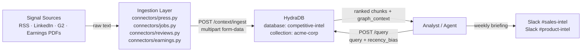

Build an agent that ingests competitor press releases, job postings, customer reviews, and earnings calls into one retrieval layer. It answers point-in-time questions and trend questions, tuning `recency_bias` for each. A full round trip takes under 200 ms.

## Prerequisites

- Base URL: `https://api.hydradb.com`
- A HydraDB API key from [app.hydradb.com](https://app.hydradb.com)
- Python 3.11 or 3.12 (`python --version`)
- `pip install hydradb-sdk`
- Python basics, REST APIs, environment variables

The full project also uses these packages (`requirements.txt`):

```
requests
python-dotenv
slack-sdk          # only if using Slack briefings
```

By the end you can:

- Ingest press releases, job postings, customer reviews, and earnings transcripts into one HydraDB collection per competitor
- Verify indexing before you query, so you never search stale data
- Answer point-in-time questions ("What has Acme announced about enterprise?") with `recency_bias: 0.8`
- Answer trend questions ("How has their messaging shifted since Q1?") with `recency_bias: 0.3`
- Send a weekly Slack briefing to sales and product channels

## How HydraDB handles time

A plain vector store gives a press release from 18 months ago and one from last week similar embeddings. Ask "how has their messaging shifted?" and old and new signals come back mixed. Ask "what are they announcing now?" and stale results crowd the top. HydraDB adds three things:

- **Timestamp-aware ranking:** HydraDB ranks every source by recency at query time. `recency_bias: 0.8` surfaces the latest signals first. `recency_bias: 0.3` pulls in older signals for trend comparison.
- **Context graph:** HydraDB extracts entities and links them across sources. A job posting about "enterprise security", a press release announcing an enterprise tier, and a G2 review about enterprise onboarding get connected. A query about enterprise strategy returns all three.
- **Collection isolation:** each competitor gets its own `collection` in a shared `competitive-intel` database. Query one competitor alone, or several in one call.

## Architecture


```mermaid
graph LR
    A["Signal Sources<br/>RSS · LinkedIn · G2 · Earnings PDFs"] -->|"raw text"| B["Ingestion Layer<br/>connectors/press.py<br/>connectors/jobs.py<br/>connectors/reviews.py<br/>connectors/earnings.py"]
    B -->|"POST /context/ingest<br/>multipart form-data"| C["HydraDB<br/>database: competitive-intel<br/>collection: acme-corp"]
    D["Analyst / Agent"] -->|"POST /query<br/>query + recency_bias"| C
    C -->|"ranked chunks + graph_context"| D
    D -->|"weekly briefing"| E["Slack #sales-intel<br/>Slack #product-intel"]
```

Sources include press releases over RSS, job postings from LinkedIn or Greenhouse, reviews from G2 or Capterra, and earnings transcripts as plain text or PDF. The caller can be a human analyst, a Slack bot, or an LLM.

---

## Step 1: Create the database

Use one database for all competitive intelligence, with one collection per competitor.

```bash
curl -X POST 'https://api.hydradb.com/databases' \
  -H "Authorization: Bearer YOUR_API_KEY" \
  -H "Content-Type: application/json" \
  -d '{"database": "competitive-intel"}'
```

```python
# setup.py
import os
from hydra_db import HydraDB

client = HydraDB(token=os.environ["HYDRA_DB_API_KEY"])
DATABASE_ID = "competitive-intel"

client.databases.create(database=DATABASE_ID)
print(f"✓ Database '{DATABASE_ID}' ready.")

def collection_for(competitor: str) -> str:
    """Normalise competitor name to a valid collection."""
    return competitor.lower().replace(" ", "-")

# e.g. collection_for("Acme Corp") → "acme-corp"
```

Output:
```
✓ Database 'competitive-intel' ready.
```

> **Collection pattern:** Pass `collection: "acme-corp"`, `collection: "betacorp"`, and so on with every upload. Query one competitor with `collection: "acme-corp"`, or several at once with `collections`. Collections are created on first write, so there is no setup.

---

## Step 2: Ingest competitor signals

All four signal types use `POST /context/ingest`. This endpoint takes **multipart form-data**, not JSON. `database` and `collection` are form fields, not body keys.

> **Important:** Do not set `Content-Type: application/json` on ingestion requests. Let your HTTP client set the multipart boundary, and pass only `Authorization` in headers.

> **Batch limit:** Max 20 sources per request. Wait 1 second between batches.

Every signal type returns the same upload response. The JSON below is the `data` field of the response envelope (`success`, `data`, `error`, `meta`), which is what the SDK's `result.data` holds:

```json
{
  "success": true,
  "message": "Knowledge uploaded successfully",
  "results": [
    {
      "id": "d25fb5a6-0378-4bcb-8cbc-2012c3d12ca2",
      "filename": "press-acme-corp-1234567890.txt",
      "status": "queued",
      "error": null
    }
  ],
  "success_count": 1,
  "failed_count": 0
}
```

Save `results[0].id`. You need it to verify indexing.

### 2.1 Press releases and blog posts

Press releases are the most explicit signal. Prepend signal metadata to the content so HydraDB's graph extractor tags entities correctly and links them to related sources.

```python
# connectors/press.py
import os, time
from hydra_db import HydraDB

client = HydraDB(token=os.environ["HYDRA_DB_API_KEY"])
DATABASE_ID = "competitive-intel"


def ingest_press_release(competitor: str, title: str, text: str) -> str:
    """
    Upload a press release or blog post to HydraDB.
    competitor: normalised name, e.g. "acme-corp"
    title:      article headline
    text:       full article body
    Returns:    id for verification
    """
    content  = f"Signal type: press_release\nCompetitor: {competitor}\nTitle: {title}\n\n{text}"
    filename = f"press-{competitor}-{int(time.time())}.txt"

    result = client.context.ingest(
        database=DATABASE_ID,
        collection=competitor,
        documents=[(filename, content.encode("utf-8"), "text/plain")],
    )
    id = result.data.results[0].id
    print(f"[press] Uploaded {filename} → id: {id}")
    return id
```

### 2.2 Job postings

Job postings show what a company is building before any press release. A spike in "enterprise security engineer" roles signals an enterprise push. "ML platform engineer" roles signal AI product investment. Include the job title and department in the content so HydraDB's graph links related roles across uploads.

```python
# connectors/jobs.py
import os, time
from hydra_db import HydraDB

client = HydraDB(token=os.environ["HYDRA_DB_API_KEY"])
DATABASE_ID = "competitive-intel"


def ingest_job_posting(competitor: str, title: str, department: str, description: str) -> str:
    """
    Upload a job posting from LinkedIn, Greenhouse, Lever, etc.
    competitor:  e.g. "acme-corp"
    title:       job title - included in content for graph linking
    department:  e.g. "Engineering", "Product", "Sales"
    description: full job description text
    Returns:     id for verification
    """
    content = (
        f"Signal type: job_posting\n"
        f"Competitor: {competitor}\n"
        f"Role: {title}\n"
        f"Department: {department}\n\n"
        f"{description}"
    )
    filename = f"job-{competitor}-{int(time.time())}.txt"

    result = client.context.ingest(
        database=DATABASE_ID,
        collection=competitor,
        documents=[(filename, content.encode("utf-8"), "text/plain")],
    )
    id = result.data.results[0].id
    print(f"[jobs] Uploaded {filename} → id: {id}")
    return id
```

### 2.3 Customer reviews (G2, Capterra, Trustpilot)

Reviews surface real objections and what customers value, which press releases never show. Negative reviews (rating 2 or lower) are useful for sales battlecards.

```python
# connectors/reviews.py
import os, time
from hydra_db import HydraDB

client = HydraDB(token=os.environ["HYDRA_DB_API_KEY"])
DATABASE_ID = "competitive-intel"


def ingest_review(
    competitor:    str,
    title:         str,
    body:          str,
    rating:        int,
    reviewer_role: str = "Unknown",
) -> str:
    """
    Upload a customer review from G2, Capterra, Trustpilot, etc.
    competitor:    e.g. "acme-corp"
    title:         review headline
    body:          full review text
    rating:        1–5 stars
    reviewer_role: e.g. "IT Director", "VP Engineering"
    Returns:       id for verification
    """
    sentiment = "positive" if rating >= 4 else "negative" if rating <= 2 else "neutral"
    content   = (
        f"Signal type: customer_review\n"
        f"Competitor: {competitor}\n"
        f"Rating: {rating}/5 ({sentiment})\n"
        f"Reviewer role: {reviewer_role}\n"
        f"Review title: {title}\n\n"
        f"{body}"
    )
    filename = f"review-{competitor}-{int(time.time())}.txt"

    result = client.context.ingest(
        database=DATABASE_ID,
        collection=competitor,
        documents=[(filename, content.encode("utf-8"), "text/plain")],
    )
    id = result.data.results[0].id
    print(f"[reviews] Uploaded {filename} ({sentiment}) → id: {id}")
    return id
```

### 2.4 Earnings call transcripts

For public competitors, earnings calls carry pricing changes, market focus, competitive responses, and financial trajectory. Upload them as plain text. HydraDB handles chunking and indexing.

```python
# connectors/earnings.py
import os, time
from hydra_db import HydraDB

client = HydraDB(token=os.environ["HYDRA_DB_API_KEY"])
DATABASE_ID = "competitive-intel"


def ingest_earnings_transcript(competitor: str, quarter: str, transcript: str) -> str:
    """
    Upload an earnings call transcript.
    competitor:  e.g. "acme-corp"
    quarter:     e.g. "2024-Q3"
    transcript:  full text of the earnings call
    Returns:     id for verification
    """
    content = (
        f"Signal type: earnings_call\n"
        f"Competitor: {competitor}\n"
        f"Quarter: {quarter}\n\n"
        f"{transcript}"
    )
    filename = f"earnings-{competitor}-{quarter}-{int(time.time())}.txt"

    result = client.context.ingest(
        database=DATABASE_ID,
        collection=competitor,
        documents=[(filename, content.encode("utf-8"), "text/plain")],
    )
    id = result.data.results[0].id
    print(f"[earnings] Uploaded {filename} → id: {id}")
    return id
```

---

## Step 3: Verify indexing

Poll `GET /context/status` until `indexing_status` is `completed`. HydraDB indexes asynchronously, typically in 10 to 30 seconds per file. Unindexed sources return empty results, so do not query until indexing completes. A source is already searchable at `graph_creation`, while the graph is still being built. Stop and check the error on `errored`.

> **Note:** [`GET /context/status`](/api-reference/v2/endpoint/source-status) takes `ids` and `database` as **query parameters**. Pass multiple `ids` to check a batch in one call.

```bash
curl -G \
  'https://api.hydradb.com/context/status' \
  -H "Authorization: Bearer YOUR_API_KEY" \
  --data-urlencode "database=competitive-intel" \
  --data-urlencode "ids=YOUR_ID"
```

**Response when indexed** (the envelope's `data` field):
```json
{
  "statuses": [
    {
      "id": "d25fb5a6-0378-4bcb-8cbc-2012c3d12ca2",
      "indexing_status": "completed",
      "error_code": "",
      "error_message": "",
      "success": true,
      "message": "Processing status retrieved successfully"
    }
  ]
}
```

```python
# ingest/verify.py
import os, time
from hydra_db import HydraDB

client = HydraDB(token=os.environ["HYDRA_DB_API_KEY"])
DATABASE_ID = "competitive-intel"


def wait_until_indexed(id: str, max_tries: int = 20, interval: int = 3) -> None:
    """
    Poll /context/status until the item is indexed or times out.
    Raises RuntimeError if indexing errors. Warns on timeout (may still complete).
    """
    for i in range(max_tries):
        time.sleep(interval)
        status_result = client.context.status(
            database=DATABASE_ID,
            ids=[id],
        )
        items  = status_result.data.statuses or []
        status = items[0].indexing_status if items else None

        if status == "completed":
            print(f"Indexed ✓ ({id})")
            return
        if status == "errored":
            raise RuntimeError(f"Indexing failed for id: {id}")

        print(f"Indexing... {status or 'queued'} (attempt {i+1}/{max_tries})")

    print(f"Timeout - {id} may still complete in background.")
```

Output (typical run with 1 source):
```
Indexing... queued (attempt 1/20)
Indexing... queued (attempt 2/20)
Indexing... processing (attempt 3/20)
Indexed ✓ (d25fb5a6-0378-4bcb-8cbc-2012c3d12ca2)
```

---

## Step 4: Point-in-time questions

Use `POST /query` to answer "What is Competitor X doing right now?"

- `recency_bias: 0.8`: strongly weights the most recent signals.
- `mode: "thinking"`: enables multi-query reranking.
- `alpha: 0.8`: the API default. Leans semantic over keyword matching.
- `graph_context: true`: returns the entities linked across sources (see below).

```bash
curl -X POST 'https://api.hydradb.com/query' \
  -H "Authorization: Bearer YOUR_API_KEY" \
  -H "Content-Type: application/json" \
  -d '{
    "database":     "competitive-intel",
    "collection": "acme-corp",
    "query":         "What has acme-corp announced about their enterprise tier?",
    "mode":          "thinking",
    "max_results":   12,
    "alpha":         0.8,
    "recency_bias":  0.8,
    "graph_context": true
  }'
```

```python
# query/search.py
import os
from hydra_db import HydraDB

client = HydraDB(token=os.environ["HYDRA_DB_API_KEY"])
DATABASE_ID = "competitive-intel"


def ask_about_competitor(
    question:     str,
    competitor:   str,
    recency_bias: float = 0.8,
    mode:         str   = "thinking",
    max_results:  int   = 12,
) -> dict:
    """
    Query HydraDB for competitor signals.
    recency_bias: 0.8 = point-in-time, 0.3 = trend
    Returns the full API response with chunks, sources, and graph_context.
    """
    return client.query(
        database=DATABASE_ID,
        collection=competitor,
        query=question,
        mode=mode,
        max_results=max_results,
        alpha=0.8,
        recency_bias=recency_bias,
        graph_context=True,
    )


def print_results(result) -> None:
    """Pretty-print chunks and graph entities from a /query response."""
    chunks = result.data.chunks or []
    print(f"\n{len(chunks)} chunks retrieved:\n")
    for chunk in chunks:
        fname = (chunk.additional_metadata or {}).get("filename", "unknown")
        score = chunk.relevancy_score or 0
        print(f"  [{fname} - {score:.2f}]")
        print(f"  {(chunk.chunk_content or '')[:200]}...")
        print()


# Example: point-in-time question
result = ask_about_competitor(
    question     = "What has acme-corp announced about their enterprise tier?",
    competitor   = "acme-corp",
    recency_bias = 0.8,
)
print_results(result)
```

**Response structure:**
```json
{
  "chunks": [
    {
      "chunk_uuid": "d25fb5a6-..._chunk_0",
      "id":  "d25fb5a6-...",
      "chunk_content": "Signal type: press_release\nCompetitor: acme-corp\n\nAcme Corp today announced AcmeShield...",
      "relevancy_score": 0.818,
      "additional_metadata": {
        "filename":      "press-acme-corp-1234567890.txt",
        "collection": "acme-corp"
      }
    }
  ],
  "sources": [...],
  "graph_context": {
    "chunk_relations": [
      {
        "triplets": [
          {
            "source":   {"name": "acmeshield",    "type": "PRODUCT"},
            "relation": {"raw_predicate": "includes", "context": "AcmeShield includes SOC 2 Type II compliance..."},
            "target":   {"name": "soc 2 type ii", "type": "CONCEPT"}
          },
          {
            "source":   {"name": "acme corp",   "type": "ORGANIZATION"},
            "relation": {"raw_predicate": "announced", "context": "Acme Corp announced AcmeShield..."},
            "target":   {"name": "acmeshield",  "type": "PRODUCT"}
          }
        ],
        "relevancy_score": 0.534
      }
    ]
  }
}
```

> **Reading graph_context:** `chunk_relations` shows the entities HydraDB extracted and linked across your sources. A press release mentioning "AcmeShield" connects to a job posting mentioning "SAML/SSO" and a G2 review mentioning "enterprise onboarding", with no manual tagging. That is why a question about "enterprise strategy" returns all three.

---

## Step 5: Trend and temporal questions

For trend and comparison questions, lower `recency_bias` to `0.3` so old and new signals both surface. That gives HydraDB the historical range to answer "how has X changed?" The code also raises `max_results` to 20 for more coverage.

```python
# query/trends.py
# (uses ask_about_competitor from query/search.py)


def ask_trend_question(question: str, competitor: str) -> dict:
    """
    Ask a trend or temporal comparison question.
    recency_bias 0.3 = surfaces old AND recent signals for comparison.
    """
    return ask_about_competitor(
        question     = question,
        competitor   = competitor,
        recency_bias = 0.3,    # lower = historical signals surface alongside recent ones
        max_results  = 20,     # more results for trend analysis
    )


# Example: trend question
result = ask_trend_question(
    question   = "How has acme-corp's enterprise messaging shifted over the past year?",
    competitor = "acme-corp",
)
print_results(result)

# Follow-up: same competitor, narrower focus
result2 = ask_trend_question(
    question   = "How has their pricing messaging changed from Q1 to Q3?",
    competitor = "acme-corp",
)
print_results(result2)
```

Choosing `recency_bias`:

- `0.8` to `1.0`: point-in-time ("What is X doing now?"). Strongly weights the latest signals.
- `0.3` to `0.5`: trend ("How has X changed?"). Surfaces old and new for comparison.
- `0.0`: no bias. Equal weight across all time periods. Send `0` explicitly, because omitting `recency_bias` applies a mild `0.4` tilt.

> **Multi-competitor comparison:** To compare two competitors in one query, pass both in `collections` (for example `["acme-corp", "betacorp"]`) and ask "How does acme-corp's enterprise positioning compare to betacorp's?" HydraDB runs the query against each listed collection and merges the results. Every listed collection must already exist. If you omit `collection`, the query only searches the database's default collection.

---

## Step 6: Weekly briefing agent

Push a Monday-morning briefing to each analyst's Slack channel. Each analyst profile runs its questions through [`/query`](/api-reference/v2/endpoint/query) with `recency_bias: 0.85` to surface the freshest signals.

```python
# briefing/weekly.py
import os, requests
from hydra_db import HydraDB

client = HydraDB(token=os.environ["HYDRA_DB_API_KEY"])
SLACK_TOKEN   = os.environ["SLACK_BOT_TOKEN"]
DATABASE_ID     = "competitive-intel"

BRIEFING_CONFIG = {
    "pm-alice": {
        "channel":      "#product-intel",
        "questions": [
            "What product features or capabilities did our top competitors announce this week?",
            "What new engineering or product roles are competitors hiring for and what does this signal?",
            "What product capabilities are customers praising or criticising in recent reviews?",
        ],
        "recency_bias": 0.85,
    },
    "sales-bob": {
        "channel":      "#sales-intel",
        "questions": [
            "What pricing or packaging changes have competitors made recently?",
            "What objections are customers raising about competitors on G2 and review sites?",
            "What enterprise or mid-market moves are competitors making based on recent signals?",
        ],
        "recency_bias": 0.85,
    },
    "gtm-carol": {
        "channel":      "#gtm-intel",
        "questions": [
            "How is competitor messaging evolving this quarter?",
            "What new market segments are competitors targeting based on recent signals?",
            "What is shifting in analyst and press sentiment about our competitors?",
        ],
        "recency_bias": 0.85,
    },
}

COMPETITORS = ["acme-corp", "betacorp", "gamma-ai"]


def recall_for_question(question: str, competitor: str, recency_bias: float) -> str:
    """Run a single /query request and return the top chunks as a text block."""
    results = client.query(
        database=DATABASE_ID,
        collection=competitor,
        query=question,
        mode="thinking",
        max_results=10,
        alpha=0.8,
        recency_bias=recency_bias,
        graph_context=True,
    )
    chunks = results.data.chunks or []
    if not chunks:
        return "No signals found for this question."
    return "\n".join((c.chunk_content or "")[:300] for c in chunks[:3])


def generate_briefing(analyst: str) -> str:
    """Generate a weekly briefing for one analyst across all tracked competitors."""
    cfg   = BRIEFING_CONFIG[analyst]
    lines = [f"*/// Weekly Competitive Intelligence - {analyst}*\n"]

    for competitor in COMPETITORS:
        lines.append(f"*── {competitor.upper()} ──*")
        for question in cfg["questions"]:
            answer = recall_for_question(question, competitor, cfg["recency_bias"])
            lines.append(f"*{question}*\n{answer}\n")

    return "\n".join(lines)


def send_to_slack(channel: str, text: str) -> None:
    requests.post(
        "https://slack.com/api/chat.postMessage",
        headers={"Authorization": f"Bearer {SLACK_TOKEN}"},
        json={"channel": channel, "text": text},
    )


def run_all_briefings() -> None:
    for analyst, cfg in BRIEFING_CONFIG.items():
        print(f"Generating briefing for {analyst}...")
        briefing = generate_briefing(analyst)
        send_to_slack(cfg["channel"], briefing)
        print(f"Sent to {cfg['channel']}")


# Schedule via cron: 0 8 * * 1  (Monday 08:00)
if __name__ == "__main__":
    run_all_briefings()
```

---

## Endpoints used

Base URL: `https://api.hydradb.com`. Header: `Authorization: Bearer YOUR_API_KEY`.

| Method | Endpoint | Purpose |
|--------|----------|---------|
| `POST` | `/databases` | Create the competitive-intel database |
| `POST` | `/context/ingest` | Upload a signal file (multipart form-data) |
| `GET` | `/context/status?database=...&ids=...` | Check indexing status |
| `POST` | `/query` | Query indexed signals |

This cookbook sends three `POST /context/ingest` form fields: `database` (text, `competitive-intel`), `collection` (text, `acme-corp`), and `documents` (file, your `.txt` or `.pdf`). Do not send `Content-Type: application/json`.

---

## Benchmarks

Tested across 3 competitor corpora (150+ sources each: press releases, job postings, reviews, earnings PDFs). Compared against a manual analyst workflow and a naive vector search baseline. Each line gives the baseline, then the HydraDB agent, then the change.

- **Time to answer "what is X doing now?":** 30 to 60 min manually, under 10 seconds with HydraDB (200x faster).
- **Search accuracy on temporal questions:** 28% naive RAG, 81% HydraDB (+189%).
- **Stale signals surfaced in top results:** 39% naive RAG, 6% HydraDB (85% fewer).
- **Signal sources covered:** typically press only for the baseline, all 4 unified with HydraDB (4x coverage).
- **P95 query latency:** under 200 ms with HydraDB. No baseline figure for the manual workflow.

> Naive RAG scores 28% on temporal questions because a Q2 press release and a Q4 press release produce similar vectors. HydraDB's `recency_bias` and timestamp-aware ranking tell them apart at query time.

> **Benchmark methodology:** Figures are based on internal HydraDB testing. See [research.hydradb.com/hydradb.pdf](https://research.hydradb.com/hydradb.pdf) for the full methodology. Results will vary by corpus size, content quality, and query distribution.

---

## File structure

```
competitive_intel_agent/
├── setup.py                      # database creation + shared constants
├── config.py                     # API_KEY, DATABASE_ID, BASE_URL
├── requirements.txt
├── connectors/
│   ├── press.py                  # ingest press releases and blog posts
│   ├── jobs.py                   # ingest job postings
│   ├── reviews.py                # ingest G2 / Capterra / Trustpilot reviews
│   └── earnings.py               # ingest earnings call transcripts
├── ingest/
│   └── verify.py                 # poll /context/status until indexed
├── query/
│   ├── search.py                 # ask_about_competitor() - point-in-time
│   └── trends.py                 # ask_trend_question() - historical comparison
└── briefing/
    └── weekly.py                 # generate + send weekly Slack briefings
```

---

## Run it

1. Run `setup.py` to create your database and verify the connection.
2. Run each connector script with real competitor data. Start with one competitor and two signal types.
3. Verify all uploads are indexed, then run `python query/search.py` to check the results.
4. Schedule `briefing/weekly.py` with cron (`0 8 * * 1`) or a workflow tool like n8n.

Each new press release, job posting, or review adds to the context graph. There is no retraining step, so running the connectors on a schedule keeps the agent current.
