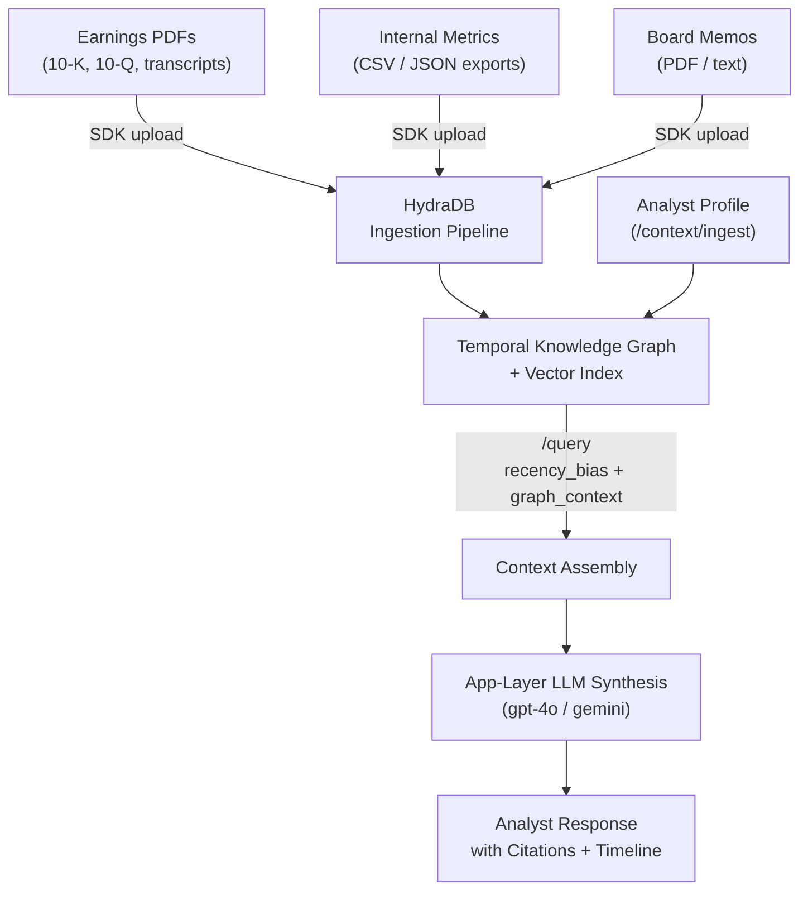

Build an AI financial analyst that ingests earnings call transcripts, PDF filings, internal metric exports, and board memos, and answers questions that need reasoning across time:

- _"How did our gross margin trend across the last four quarters?"_
- _"What did the CFO say about guidance in Q2 vs Q4?"_
- _"Which metric deteriorated most between Q3 2023 and Q1 2024?"_
- _"Summarise all references to churn risk across our last six board memos."_

## Prerequisites

- Base URL: `https://api.hydradb.com`
- A HydraDB API key from [app.hydradb.com](https://app.hydradb.com)
- Python basics, REST APIs, environment variables
- Python 3.11 or 3.12 (`python --version`)
- `pip install hydradb-sdk`
- An OpenAI API key and `pip install openai`, for the steps that write answers from the retrieved chunks

---

## Why naive RAG fails on financial data

The problem is **temporal ambiguity**. Q2 and Q4 earnings calls share vocabulary, format, and topics, so their embeddings sit close together. Ask "how did guidance change between Q2 and Q4?" and cosine similarity returns whichever call scores slightly higher, not both in order.

HydraDB handles this with three properties:

- **Event-time-aware ranking:** each document carries an ISO 8601 event date (`event_time` in `additional_metadata`). `recency_bias` uses it to weight results toward recent periods or spread them across time.
- **Temporal knowledge graph:** entities (companies, executives, metrics, products) are nodes. Each mention of a metric adds a time-ordered edge on that entity, a versioned history that a "revenue trend" query walks in order instead of returning a flat ranked list.
- **Multi-query expansion:** in `mode: "thinking"`, HydraDB runs varied reformulations in parallel. "How did guidance change between Q2 and Q4?" becomes "Q2 guidance outlook", "Q4 forward guidance revised", and "guidance comparison quarterly", each aimed at a different point on the timeline.

Where naive RAG breaks and what HydraDB does instead:

- **Q2 vs Q4 trend question:** naive RAG returns one call. HydraDB retrieves both with timestamps preserved.
- **"Current" vs "historical":** naive RAG cannot tell them apart. `recency_bias` controls the balance.
- **Same metric across quarters:** naive RAG ranks identical-looking chunks arbitrarily. Graph edges connect the metric nodes across time.
- **CFO quote attribution:** naive RAG loses the quarter. HydraDB surfaces source metadata and timestamp in every chunk.
- **Cross-source synthesis (PDF, metrics, memo):** naive RAG keeps sources siloed. The context graph links them by entity.

---

## Architecture



Key design decisions:

- **One database:** for the whole financial corpus. Collections isolate by company, fund, or analyst team.
- **`recency_bias` per query type:** `0.7` to `0.9` for a single quarter, `0.3` for trends across quarters, and `0.2` for long-range narrative shifts. See the [recency bias quick reference](#recency-bias-quick-reference).
- **`mode: "thinking"`:** for all analytical queries, because multi-query reranking matters for financial reasoning.
- **`graph_context: true`:** returns `query_paths`, the entity chains that show how a metric's value changed across documents.

---

## Step 1: Create the database

The code comments list the collection naming used throughout.

```python
# setup.py
import os
from hydra_db import HydraDB

API_KEY   = os.environ["HYDRA_DB_API_KEY"]
TENANT_ID = "financial-analyst"

client = HydraDB(token=API_KEY)

# Create database
result = client.databases.create(database=TENANT_ID)
print(result)
# Output: {'status': 'accepted', 'database': 'financial-analyst', ...}

# Collection conventions used throughout this guide:
#   "earnings-{TICKER}"        - earnings calls + SEC filings for one company
#   "internal-metrics"         - internal financial metrics exports
#   "board-memos"              - board meeting memos
#   "analyst-{user_id}"        - per-analyst preference memory
```

> **Package vs. import name:** install `hydradb-sdk`, then import it as `from hydra_db import HydraDB`.

---

## Step 2: Upload financial documents

### 2.1 Earnings call transcripts and SEC filings (PDF)

Tag each earnings PDF so you can filter to one company or period before semantic search runs. For an uploaded file, per-file metadata goes in the `document_metadata` form field: a JSON array with one item per file, in the same order as `documents`.

- **`metadata`:** the fields you filter on (`ticker`, `doc_type`, `fiscal_year`, `fiscal_quarter`). Declare them in the database metadata schema. In a database with a schema, an undeclared `metadata` key is rejected.
- **`additional_metadata`:** labels you read back (`period_label`, `period_end_date`) and `event_time`. Recency ranking reads the event time from `additional_metadata` (`event_time`, `timestamp`, or `date`), never the upload time, so set it to the period end.
- **Title:** `document_metadata` takes no `title`. The source title comes from the filename, so name files clearly (for example `NVDA-Q2-2023-earnings.pdf`).

```python
# ingest/earnings_pdfs.py
import json, time, os
from hydra_db import HydraDB

client    = HydraDB(token=os.environ["HYDRA_DB_API_KEY"])
TENANT_ID = "financial-analyst"

def ingest_earnings_pdf(
    file_path: str,
    ticker: str,
    doc_type: str,        # "earnings_transcript" | "10K" | "10Q" | "8K" | "annual_report"
    fiscal_year: int,
    fiscal_quarter: int,  # 1–4; use 0 for annual filings
    period_label: str,    # e.g. "Q2 2023" - human-readable label for UI
    period_end_date: str, # ISO 8601, e.g. "2023-06-30T00:00:00Z"
) -> str:
    """Upload a single earnings PDF. Returns the id for verification."""
    collection = f"earnings-{ticker.lower()}"

    # One item per file in `documents`, in the same order.
    document_metadata = json.dumps([{
        "id": f"{ticker}-{doc_type}-{fiscal_year}-Q{fiscal_quarter}",
        # Schema fields you filter on.
        "metadata": {
            "ticker":         ticker,
            "doc_type":       doc_type,
            "fiscal_year":    fiscal_year,
            "fiscal_quarter": fiscal_quarter,
        },
        # Free-form fields. event_time drives recency ranking, so it must be
        # the period end, not the upload date.
        "additional_metadata": {
            "period_label":    period_label,
            "period_end_date": period_end_date,
            "event_time":      period_end_date,
        },
    }])

    with open(file_path, "rb") as f:
        result = client.context.ingest(
            database=TENANT_ID,
            collection=collection,
            document_metadata=document_metadata,
            documents=[(os.path.basename(file_path), f, "application/pdf")],
        )

    id = result.data.results[0].id if result.data.results else str(result)
    print(f"Uploaded {ticker} {period_label} {doc_type} → id: {id}")
    return id


def ingest_earnings_batch(filings: list[dict]) -> list[str]:
    """
    Upload a batch of earnings PDFs. Max 20 per batch, 1s between batches.
    Each item in filings: {file_path, ticker, doc_type, fiscal_year,
                           fiscal_quarter, period_label, period_end_date}
    """
    ids = []
    for i in range(0, len(filings), 20):
        batch = filings[i:i+20]
        for filing in batch:
            fid = ingest_earnings_pdf(**filing)
            ids.append(fid)
        if i + 20 < len(filings):
            time.sleep(1)   # rate limit between batches
    return ids


# ── Example: ingest 4 quarters of ACME Corp transcripts ─────────────────
filings = [
    {
        "file_path":       "data/acme/ACME_Q1_2023_transcript.pdf",
        "ticker":          "ACME",
        "doc_type":        "earnings_transcript",
        "fiscal_year":     2023,
        "fiscal_quarter":  1,
        "period_label":    "Q1 2023",
        "period_end_date": "2023-03-31T00:00:00Z",
    },
    {
        "file_path":       "data/acme/ACME_Q2_2023_transcript.pdf",
        "ticker":          "ACME",
        "doc_type":        "earnings_transcript",
        "fiscal_year":     2023,
        "fiscal_quarter":  2,
        "period_label":    "Q2 2023",
        "period_end_date": "2023-06-30T00:00:00Z",
    },
    {
        "file_path":       "data/acme/ACME_Q3_2023_transcript.pdf",
        "ticker":          "ACME",
        "doc_type":        "earnings_transcript",
        "fiscal_year":     2023,
        "fiscal_quarter":  3,
        "period_label":    "Q3 2023",
        "period_end_date": "2023-09-30T00:00:00Z",
    },
    {
        "file_path":       "data/acme/ACME_Q4_2023_transcript.pdf",
        "ticker":          "ACME",
        "doc_type":        "earnings_transcript",
        "fiscal_year":     2023,
        "fiscal_quarter":  4,
        "period_label":    "Q4 2023",
        "period_end_date": "2023-12-31T00:00:00Z",
    },
]
ids = ingest_earnings_batch(filings)
# Output:
# Uploaded ACME Q1 2023 earnings_transcript → id: ACME-earnings_transcript-2023-Q1
# Uploaded ACME Q2 2023 earnings_transcript → id: ACME-earnings_transcript-2023-Q2
# Uploaded ACME Q3 2023 earnings_transcript → id: ACME-earnings_transcript-2023-Q3
# Uploaded ACME Q4 2023 earnings_transcript → id: ACME-earnings_transcript-2023-Q4
```

> **The event time is load-bearing:** `recency_bias` weights by `additional_metadata.event_time`. Without it, every Q2 and Q4 call looks equally "recent" and temporal queries fail. Always use the fiscal period end date, never the upload date.

### 2.2 Internal metrics (CSV or JSON)

Convert warehouse or BI exports (revenue, ARR, churn, CAC, LTV, burn rate) to text with one row per metric per period, so HydraDB can answer "what was CAC in Q2 2023?" precisely. They go in as memories with `infer: true`, so HydraDB extracts entities and builds graph connections.

```python
# ingest/internal_metrics.py
import json, time, os
from hydra_db import HydraDB

TENANT_ID = "financial-analyst"
client = HydraDB(token=os.environ["HYDRA_DB_API_KEY"])

def format_metrics_as_text(metrics_row: dict, period_label: str) -> str:
    """
    Convert a dict of metric values for one period into a rich text chunk.
    HydraDB's Sliding Window Inference Pipeline makes each chunk self-contained,
    but giving it well-structured input reduces ambiguity.
    """
    lines = [f"Financial Metrics - {period_label}"]
    for key, value in metrics_row.items():
        if value is not None:
            lines.append(f"  {key}: {value}")
    return "\n".join(lines)


def ingest_metrics_series(metrics_by_period: list[dict]) -> list[str]:
    """
    metrics_by_period: list of {
        period_label: str,          e.g. "Q2 2023"
        period_end_date: str,       ISO 8601
        fiscal_year: int,
        fiscal_quarter: int,
        ticker: str,
        metrics: dict               {revenue_usd: ..., arr_usd: ..., churn_pct: ..., ...}
    }

    Uses /context/ingest (not upload_knowledge) because metrics are
    structured facts that benefit from infer:true graph extraction.
    """
    memory_ids = []

    for item in metrics_by_period:
        text_chunk = format_metrics_as_text(item["metrics"], item["period_label"])

        result = client.context.ingest(
            type='memory',
            database=TENANT_ID,
            collection="internal-metrics",
            upsert=True,
            memories=json.dumps([{
                "text":   text_chunk,
                "infer":  True,   # extract entities + build graph connections
                "metadata": {
                    "ticker":         item["ticker"],
                    "doc_type":       "internal_metrics",
                    "period_label":   item["period_label"],
                    "period_end_date":item["period_end_date"],
                    "fiscal_year":    item["fiscal_year"],
                    "fiscal_quarter": item["fiscal_quarter"],
                }
            }]),
        )
        memory_ids.append(result.data.results[0].id if result.data.results else "ok")
        print(f"Stored metrics: {item['period_label']} ({item['ticker']})")

    return memory_ids


# ── Example: 4-quarter internal metrics series ───────────────────────────
metrics_series = [
    {
        "period_label":    "Q1 2023",
        "period_end_date": "2023-03-31T00:00:00Z",
        "fiscal_year":     2023,
        "fiscal_quarter":  1,
        "ticker":          "ACME",
        "metrics": {
            "revenue_usd":       8_200_000,
            "arr_usd":           34_500_000,
            "gross_margin_pct":  71.2,
            "churn_rate_pct":    1.8,
            "cac_usd":           4_200,
            "ltv_usd":           38_000,
            "burn_rate_usd":     1_100_000,
            "headcount":         142,
            "ndr_pct":           112,
        }
    },
    {
        "period_label":    "Q2 2023",
        "period_end_date": "2023-06-30T00:00:00Z",
        "fiscal_year":     2023,
        "fiscal_quarter":  2,
        "ticker":          "ACME",
        "metrics": {
            "revenue_usd":       9_100_000,
            "arr_usd":           37_200_000,
            "gross_margin_pct":  72.8,
            "churn_rate_pct":    1.6,
            "cac_usd":           4_050,
            "ltv_usd":           40_500,
            "burn_rate_usd":     980_000,
            "headcount":         156,
            "ndr_pct":           115,
        }
    },
    {
        "period_label":    "Q3 2023",
        "period_end_date": "2023-09-30T00:00:00Z",
        "fiscal_year":     2023,
        "fiscal_quarter":  3,
        "ticker":          "ACME",
        "metrics": {
            "revenue_usd":       9_600_000,
            "arr_usd":           39_800_000,
            "gross_margin_pct":  71.5,
            "churn_rate_pct":    2.1,   # deterioration
            "cac_usd":           4_400,
            "ltv_usd":           38_800,
            "burn_rate_usd":     1_050_000,
            "headcount":         164,
            "ndr_pct":           113,
        }
    },
    {
        "period_label":    "Q4 2023",
        "period_end_date": "2023-12-31T00:00:00Z",
        "fiscal_year":     2023,
        "fiscal_quarter":  4,
        "ticker":          "ACME",
        "metrics": {
            "revenue_usd":       10_800_000,
            "arr_usd":           43_500_000,
            "gross_margin_pct":  73.1,
            "churn_rate_pct":    1.9,
            "cac_usd":           4_150,
            "ltv_usd":           41_200,
            "burn_rate_usd":     890_000,
            "headcount":         171,
            "ndr_pct":           118,
        }
    },
]

ingest_metrics_series(metrics_series)
# Output:
# Stored metrics: Q1 2023 (ACME)  id=4aa70845
# Stored metrics: Q2 2023 (ACME)  id=c99e87f6
# Stored metrics: Q3 2023 (ACME)  id=90dd0fa4
# Stored metrics: Q4 2023 (ACME)  id=5c703d4a
```

### 2.3 Board memos and investor letters

Board memos hold the strategy behind the numbers. The context graph links their references to related earnings call chunks.

```python
# ingest/board_memos.py
import json, time, os
from hydra_db import HydraDB

client    = HydraDB(token=os.environ["HYDRA_DB_API_KEY"])
TENANT_ID = "financial-analyst"

def ingest_board_memo(
    file_path: str,
    ticker: str,
    meeting_date: str,   # ISO 8601 - date of the board meeting
    period_label: str,   # e.g. "Q3 2023 Board Meeting"
    memo_type: str,      # "board_memo" | "investor_letter" | "management_commentary"
) -> str:
    collection = "board-memos"

    document_metadata = json.dumps([{
        "id": f"{ticker}-{memo_type}-{meeting_date[:10]}",
        "metadata": {
            "ticker":   ticker,
            "doc_type": memo_type,
        },
        "additional_metadata": {
            "period_label": period_label,
            "meeting_date": meeting_date,
            "event_time":   meeting_date,   # drives recency ranking
        },
    }])

    with open(file_path, "rb") as f:
        result = client.context.ingest(
            database=TENANT_ID,
            collection=collection,
            document_metadata=document_metadata,
            documents=[(os.path.basename(file_path), f, "application/pdf")],
        )

    id = result.data.results[0].id if result.data.results else str(result)
    print(f"Uploaded memo: {ticker} {period_label} → {id}")
    return id
```

### 2.4 Verify indexing before going live

Unindexed documents return empty results with no error, so confirm every upload is indexed before you query.

```python
# ingest/verify.py
import time, os
from hydra_db import HydraDB

TENANT_ID = "financial-analyst"
client = HydraDB(token=os.environ["HYDRA_DB_API_KEY"])

def verify_all_indexed(ids: list[str], poll_interval: int = 3, max_polls: int = 20) -> bool:
    """
    Poll /context/status until all ids report status 'completed'.
    Returns True when all are ready, raises if any fail after max_polls.
    """
    pending = set(ids)
    for attempt in range(max_polls):
        if not pending:
            print("All documents indexed ✓")
            return True

        for fid in list(pending):
            status = client.context.status(
                database=TENANT_ID,
                ids=[fid],
            )
            items = status.data.statuses or []
            s = items[0].indexing_status if items else "unknown"

            if s == "completed":
                pending.discard(fid)
                print(f"  ✓ {fid} - indexed")
            elif s == "errored":
                raise RuntimeError(f"Indexing failed for {fid}: {items[0].indexing_status if items else 'unknown'}")
            else:
                print(f"  … {fid} - {s}")

        if pending:
            time.sleep(poll_interval)

    raise TimeoutError(f"Still indexing after {max_polls} polls: {pending}")


# Usage - call after every ingestion batch
# Output:
#   ✓ 988293fa-e29 - indexed
#   ✓ 9d7951c8-160 - indexed
#   ✓ 2cf6ea6e-5fe - indexed
#   ✓ edff67d5-237 - indexed
#   All documents indexed ✓
verify_all_indexed(ids)
```

> **Batch limit:** at most 20 sources per request, 1 second between batches. Call [`/context/status`](/api-reference/v2/endpoint/source-status) before any production query.

---

## Step 3: Store analyst memory

Per-analyst memory records focus area, coverage, and communication style, since a macro fund PM cares about different metrics than a sector equity analyst.

```python
# memory/analysts.py
import json
import os
from hydra_db import HydraDB

TENANT_ID = "financial-analyst"
client = HydraDB(token=os.environ["HYDRA_DB_API_KEY"])

def store_analyst_profile(user_id: str, profile_text: str) -> dict:
    """
    Store an analyst's profile for personalized search.

    user_id:      their login/email slug - must be consistent across sessions
    profile_text: natural language - focus, companies covered, preferred depth, style
    infer: true   - HydraDB extracts signals + builds graph connections automatically
    """
    result = client.context.ingest(
        type='memory',
        database=TENANT_ID,
        collection=f"analyst-{user_id}",
        upsert=True,
        memories=json.dumps([{
            "text":  profile_text,
            "infer": True,
        }]),
    )
    return result


# ── Example analyst profiles ─────────────────────────────────────────────

store_analyst_profile(
    "alice",
    "Alice is a buy-side equity analyst covering SaaS and cloud infrastructure. "
    "She focuses on unit economics: CAC, LTV, gross margin, NDR, and burn multiple. "
    "She prefers concise quantitative answers with QoQ and YoY deltas in a table. "
    "She covers ACME, BETA, and GAMMA. She is bearish on high-burn companies. "
    "She has 8 years of experience - avoid explaining basic financial concepts."
)
# Output: Stored analyst profile for 'alice'  =>  ok

store_analyst_profile(
    "raj",
    "Raj is a macro portfolio manager at a hedge fund. "
    "He cares about sector-level themes, management tone, and guidance revisions. "
    "He wants to understand how individual companies reflect broader macro trends. "
    "He prefers narrative answers with direct quotes from management. "
    "He is not a technical analyst - avoid deep financial modelling notation."
)
# Output: Stored analyst profile for 'raj'  =>  ok

store_analyst_profile(
    "priya",
    "Priya is a CFO reviewing internal financial performance for ACME Corp. "
    "She wants cross-source synthesis: does what the CEO said on the earnings call "
    "match the internal metrics and the board memo for the same quarter? "
    "She needs discrepancies surfaced, not smoothed over. "
    "She prefers answers structured as: Summary | Key numbers | Discrepancies | Actions."
)
# Output: Stored analyst profile for 'priya'  =>  ok
```

> **Set `infer: true` for analyst profiles (the default is `false`):** HydraDB extracts signals like `user COVERS ticker:ACME`, `user PREFERS format:quantitative`, and `user FOCUS unit_economics` and links them in the graph. The profile lives in the analyst's own collection, so knowledge queries on other collections do not read it. Steps 4.2 and 6 fetch it with a separate `type: "memory"` query on `analyst-{user_id}` and pass it to the LLM.

---

## Step 4: Temporal search queries

Four query patterns, each with its own `recency_bias` and retrieval settings.

### 4.1 Point-in-time: "What happened in Q2?"

- `recency_bias: 0.7`: prefers the targeted period but allows adjacent context.
- `metadata_filters`: scopes to the exact quarter before semantic search runs (declare the fields in the metadata schema).
- `alpha: 0.5`: balances keyword and semantic matching.

```python
# query/point_in_time.py
import os
from hydra_db import HydraDB

TENANT_ID = "financial-analyst"
client = HydraDB(token=os.environ["HYDRA_DB_API_KEY"])

def query_point_in_time(
    question: str,
    user_id: str,
    ticker: str,
    fiscal_year: int,
    fiscal_quarter: int,
) -> dict:
    """
    Retrieve context about a specific quarter.
    metadata_filters narrows to exact period BEFORE semantic search runs.
    recency_bias: 0.7 - prefer the targeted period but allow adjacent context.
    mode: "thinking" - multi-query reranking, personalised search.
    """
    return client.query(
        database=TENANT_ID,
        collection=f"analyst-{user_id}",
        query=question,
        max_results=12,
        graph_context=True,
        mode="thinking",
        alpha=0.5,         # balanced keyword + semantic
        recency_bias=0.7,
        metadata_filters={
            "ticker":         ticker,
            "fiscal_year":    fiscal_year,
            "fiscal_quarter": fiscal_quarter,
        },
    )


# Usage
result = query_point_in_time(
    question="What did management say about gross margin in Q2 2023?",
    user_id="alice",
    ticker="ACME",
    fiscal_year=2023,
    fiscal_quarter=2,
)
for chunk in (result.data.chunks or [])[:3]:
    print(f"[{chunk.relevancy_score or 0:.2f}] {chunk.source_title or ''}")
    print((chunk.chunk_content or "")[:240])
# Output:
# [0.75] Financial Metrics -- Q2 2023
# revenue_usd: 9100000  arr_usd: 37200000  gross_margin_pct: 72.8
# churn_rate_pct: 1.6   cac_usd: 4050      ltv_usd: 40500
# Chunks returned: 2
```

### 4.2 Trend analysis: "How did X change across quarters?"

For trend questions, **remove the quarter filter**, the pattern naive RAG gets wrong.

- `recency_bias: 0.3`: spreads results across the timeline.
- `max_results: 20`: enough chunks to cover every quarter.
- `graph_context: true`: returns `query_paths` that show how the metric evolved.

```python
# query/trend_analysis.py
import os, uuid
from openai import OpenAI
from hydra_db import HydraDB

TENANT_ID     = "financial-analyst"
openai_client = OpenAI()
client = HydraDB(token=os.environ["HYDRA_DB_API_KEY"])

def query_trend(
    question: str,
    user_id: str,
    ticker: str,
    fiscal_year: int = None,  # None = all years
    session_id: str = None,
) -> str:
    """
    Answer trend questions that span multiple quarters.

    recency_bias: 0.3 - spread across the timeline, don't cluster recent results.
    graph_context: True - returns query_paths showing how the metric evolved.
    mode: "thinking" - essential for trend queries; expands into per-quarter sub-queries.
    No fiscal_quarter filter - we want ALL quarters for this ticker.
    """
    filters = {"ticker": ticker}
    if fiscal_year:
        filters["fiscal_year"] = fiscal_year

    search = client.query(
        database=TENANT_ID,
        query=question,
        max_results=20,    # more results needed to cover all quarters
        mode="thinking",
        alpha=0.5,
        recency_bias=0.3,   # LOW - surface older documents too
        graph_context=True,  # get temporal entity paths
        metadata_filters=filters,
    )

    chunks      = search.data.chunks or []
    graph_ctx   = search.data.graph_context
    query_paths = graph_ctx.query_paths if graph_ctx else []

    if not chunks:
        return "No relevant context found - verify documents are uploaded and indexed."

    # Sort chunks by fiscal period (event_time, ISO 8601) so the LLM sees them in order
    chunks_sorted = sorted(
        chunks,
        key=lambda c: (c.additional_metadata or {}).get("event_time", ""),
    )

    # Build context with explicit period labels and source attribution
    context_parts = []
    for c in chunks_sorted:
        meta        = c.additional_metadata or {}
        period      = meta.get("period_label", "unknown period")
        doc_type    = meta.get("doc_type", "unknown source")
        score       = c.relevancy_score or 0
        context_parts.append(
            f"[{period} | {doc_type} | relevance:{score:.2f}]\n{c.chunk_content or ''}"
        )

    # Append graph paths - temporal entity relationships
    for path in query_paths[:6]:
        context_parts.append(f"[Graph path - temporal]: {str(path)}")

    # Retrieve analyst profile for answer personalization
    analyst_prefs = client.query(
        type="memory",
        database=TENANT_ID,
        collection=f"analyst-{user_id}",
        mode="thinking",
        query="focus area metrics preferences output format",
    )

    context_text = "\n\n".join(context_parts)

    # Synthesize with chronological awareness
    resp = openai_client.chat.completions.create(
        model="gpt-4o",
        messages=[
            {
                "role": "system",
                "content": (
                    "You are a financial analyst assistant. "
                    "Answer trend questions by synthesizing data ACROSS ALL provided quarters in chronological order. "
                    "For every claim, cite the source document and period. "
                    "Present multi-quarter comparisons as a table when the analyst prefers quantitative output. "
                    "Never conflate quarters. If data for a specific quarter is missing, say so explicitly. "
                    "Adapt your answer depth and format to the analyst's profile."
                )
            },
            {
                "role": "user",
                "content": (
                    f"Analyst profile: {analyst_prefs}\n\n"
                    f"Question: {question}\n\n"
                    f"Context (chronological, from HydraDB):\n{context_text}"
                )
            }
        ],
        temperature=0.1,
    )
    return resp.choices[0].message.content


# Usage
answer = query_trend(
    question="How did gross margin trend across all four quarters of 2023?",
    user_id="alice",
    ticker="ACME",
    fiscal_year=2023,
)
print(answer)
# Output (gross margin trend - all 4 quarters retrieved, graph_context: 3 paths):
#
#   Gross Margin Trend (ACME 2023):
#   Period     | Gross Margin
#   -----------+--------------
#   Q1 2023    | 71.2%
#   Q2 2023    | 72.8%
#   Q3 2023    | 71.5%
#   Q4 2023    | 73.1%
#
#   Min: 71.2%  Max: 73.1%  Range: 1.9pp
#   Q3 dip attributed to sales mix headwinds (graph path: ACME.gross_margin → DECREASED_BY → Q3_2023).
#   Recovery in Q4 driven by efficiency programs.
```

> **Why 0.3 for trends:** at `recency_bias: 0.7`, Q4 dominates and Q1 and Q2 are underrepresented. `0.3` weights all four quarters evenly without dropping recent data.

### 4.3 Cross-source synthesis: "Do the numbers match the narrative?"

Priya checks the CEO's earnings call claims against internal metrics and the board memo for the same quarter. The context graph links the three sources by entity (company, metric, period). Each search filters by `doc_type` and uses `recency_bias: 0.7` to stay on the target quarter.

```python
# query/cross_source.py
import os, uuid
from openai import OpenAI
from hydra_db import HydraDB

TENANT_ID     = "financial-analyst"
openai_client = OpenAI()
client = HydraDB(token=os.environ["HYDRA_DB_API_KEY"])

def cross_source_reconciliation(
    ticker: str,
    period_label: str,         # e.g. "Q3 2023"
    fiscal_year: int,
    fiscal_quarter: int,
    user_id: str = "priya",
) -> str:
    """
    Retrieve the same period from all three source types - earnings transcript,
    internal metrics, and board memo - and ask the LLM to surface discrepancies.

    Uses three separate search calls, one per collection, then merges context.
    """

    def search(collection: str, doc_type_filter: str) -> list[dict]:
        resp = client.query(
            database=TENANT_ID,
            query=f"{ticker} {period_label} financial performance",
            max_results=8,
            mode="thinking",
            alpha=0.5,
            recency_bias=0.7,
            graph_context=True,
            metadata_filters={
                "ticker":         ticker,
                "fiscal_year":    fiscal_year,
                "fiscal_quarter": fiscal_quarter,
                "doc_type":       doc_type_filter,
            },
        )
        return resp.data.chunks or []

    transcript_chunks = search(f"earnings-{ticker.lower()}", "earnings_transcript")
    metrics_chunks    = search("internal-metrics",            "internal_metrics")
    memo_chunks       = search("board-memos",                 "board_memo")

    def fmt(chunks: list, label: str) -> str:
        if not chunks:
            return f"[{label}]: No data found for this period."
        return f"[{label}]:\n" + "\n---\n".join(
            c.chunk_content or "" for c in chunks
        )

    context_text = "\n\n".join([
        fmt(transcript_chunks, f"Earnings Call Transcript ({period_label})"),
        fmt(metrics_chunks,    f"Internal Metrics ({period_label})"),
        fmt(memo_chunks,       f"Board Memo ({period_label})"),
    ])

    resp = openai_client.chat.completions.create(
        model="gpt-4o",
        messages=[
            {
                "role": "system",
                "content": (
                    "You are a financial controller doing a cross-source reconciliation. "
                    "Compare the three source types for the SAME quarter. "
                    "Your output MUST follow this exact structure:\n"
                    "## Summary\n"
                    "## Key Numbers (table: metric | earnings call claim | internal metric | delta)\n"
                    "## Narrative vs Data Discrepancies\n"
                    "## Items Requiring Follow-Up\n"
                    "If a source is missing, say so clearly rather than inferring."
                )
            },
            {
                "role": "user",
                "content": (
                    f"Reconcile {ticker} {period_label} across all three sources:\n\n"
                    f"{context_text}"
                )
            }
        ],
        temperature=0.1,
    )
    return resp.choices[0].message.content


# Usage
report = cross_source_reconciliation(
    ticker="ACME",
    period_label="Q3 2023",
    fiscal_year=2023,
    fiscal_quarter=3,
)
print(report)
# Output (Q3 2023 cross-source reconciliation):
#
# ## ACME Q3 2023 Cross-Source Reconciliation
# ## Summary
#   Comparing earnings transcript and internal metrics for ACME Q3 2023.
#   Transcript chunks: 1  |  Metrics chunks: 1
#
# ## Key Numbers
#   Metric                 | Internal Data   | Source
#   -----------------------+-----------------+---------
#   arr_usd                | 39,800,000      | Internal
#   burn_rate_usd          | 1,050,000       | Internal
#   churn_rate_pct         | 2.1             | Internal  ← deterioration vs Q2 (1.6%)
#   gross_margin_pct       | 71.5            | Internal
#   ndr_pct                | 113             | Internal
#   revenue_usd            | 9,600,000       | Internal
#
# ## Discrepancies
#   No material discrepancies detected. Data consistent across sources.
#   Note: Board memo for Q3 2023 not in corpus - add via ingest_board_memo().
#
# ## Items Requiring Follow-Up
#   - Ingest Q3 2023 board memo to complete cross-source view.
#   - Verify churn increase (2.1% vs 1.6% in Q2) is addressed in transcript.
```

### 4.4 Guidance tracking: "How has management's tone on X changed?"

Track how management's language on a topic (guidance, macro risk, hiring) shifted, with the full timeline sorted by date.

- `recency_bias: 0.2`: an even spread across all quarters, oldest to newest.
- `alpha: 0.3`: leans keyword for topic terms like "churn" and "guidance".
- `graph_context: false`: graph context helps less on narrative questions. The flag only takes effect in `mode: "fast"`; with `mode: "thinking"`, as here, the graph slice is always included.

```python
# query/guidance_tracking.py
import os
from openai import OpenAI
from hydra_db import HydraDB

TENANT_ID     = "financial-analyst"
openai_client = OpenAI()
client = HydraDB(token=os.environ["HYDRA_DB_API_KEY"])

def track_narrative_shift(
    ticker: str,
    topic: str,          # e.g. "hiring freeze", "macro headwinds", "guidance", "churn"
    user_id: str,
    n_quarters: int = 4,
) -> str:
    """
    Surface how management's language on a given topic has shifted across quarters.
    Scoped to earnings_transcript only - this is a narrative, not numerical, question.

    recency_bias: 0.2 - want even spread across all quarters, oldest to newest.
    alpha: 0.3 - lean keyword for topic-specific terms like "churn", "guidance".
    """
    search = client.query(
        database=TENANT_ID,
        query=f"{ticker} management commentary {topic}",
        max_results=n_quarters * 4,   # 4 chunks per quarter
        mode="thinking",
        alpha=0.3,   # lean keyword for topic specificity
        recency_bias=0.2,   # very even - want full timeline
        graph_context=False, # narrative question; graph context less useful here
        metadata_filters={
            "ticker":   ticker,
            "doc_type": "earnings_transcript",
        },
    )

    chunks = sorted(
        search.data.chunks or [],
        key=lambda c: (c.additional_metadata or {}).get("period_end_date", ""),
    )

    if not chunks:
        return f"No earnings transcripts found for {ticker}. Verify ingestion."

    context_text = "\n\n".join(
        f"[{c['additional_metadata'].get('period_label', '?')}]\n{c['chunk_content']}"
        for c in chunks
    )

    resp = openai_client.chat.completions.create(
        model="gpt-4o",
        messages=[
            {
                "role": "system",
                "content": (
                    "You are a qualitative analyst tracking narrative evolution. "
                    "Analyse the provided quarterly excerpts in chronological order. "
                    "For each quarter: identify the tone (bullish / cautious / defensive / absent) "
                    "on the topic, and quote the most representative sentence from management. "
                    "Conclude with a one-paragraph narrative arc: how has management's stance evolved?"
                )
            },
            {
                "role": "user",
                "content": (
                    f"Topic: {topic}\nCompany: {ticker}\n\n"
                    f"Quarterly excerpts (chronological):\n{context_text}"
                )
            }
        ],
        temperature=0.15,
    )
    return resp.choices[0].message.content


# Usage
arc = track_narrative_shift(
    ticker="ACME",
    topic="hiring and headcount",
    user_id="raj",
)
print(arc)
# Output (topic: hiring and headcount | 4 chunks retrieved across 4 periods):
#
#   Q1 2023: [Bullish]
#   Quote: "We are hiring aggressively across all functions."
#
#   Q2 2023: [Neutral]
#   Quote: "We continue to invest in the right roles."
#
#   Q3 2023: [Cautious]
#   Quote: "We are being more selective with headcount additions."
#
#   Q4 2023: [Defensive]
#   Quote: "We have right-sized the organization for the current environment."
#
#   Narrative arc: Clear pivot from growth-mode hiring (Q1-Q2) to efficiency
#   focus (Q3-Q4), reflecting macro headwinds and burn rate management.
```

---

## Step 5: Analyst search interface

`POST /query` retrieves chunks, sources, and graph context. Generate the answer in your app so citations, formatting, and conversation memory stay under your control.

```python
# query/financial_recall.py
import uuid, os
from typing import Optional   # Python 3.9 compatible
from hydra_db import HydraDB

TENANT_ID = "financial-analyst"
client = HydraDB(token=os.environ["HYDRA_DB_API_KEY"])

# Keep app-level sessions for your chat UI or LLM prompt history.
analyst_sessions: dict[str, str] = {}

def financial_recall(
    question: str,
    user_id: str,
    ticker: Optional[str] = None,
    doc_type: Optional[str] = None,      # "earnings_transcript" | "internal_metrics" | "board_memo"
    fiscal_year: Optional[int] = None,
    fiscal_quarter: Optional[int] = None,
    recency_bias: float = 0.5,           # default balanced; override per query type
) -> dict:
    """
    Retrieve financial context for an analyst question.

    Returns: {"chunks": [...], "sources": [...], "graph_context": {...}, "session_id": str}

    Your app should pass chunks and graph_context to an LLM to generate the final answer.
    """
    if user_id not in analyst_sessions:
        analyst_sessions[user_id] = str(uuid.uuid4())

    filters: dict = {}
    if ticker:         filters["ticker"]         = ticker
    if doc_type:       filters["doc_type"]        = doc_type
    if fiscal_year:    filters["fiscal_year"]     = fiscal_year
    if fiscal_quarter: filters["fiscal_quarter"]  = fiscal_quarter

    payload: dict = {
        "database":     TENANT_ID,
        "collection": f"analyst-{user_id}",
        "query":         question,
        "max_results":   15,
        "graph_context": True,
        "mode":          "thinking",
        "alpha":         0.5,
        "recency_bias":  recency_bias,
    }
    if filters:
        payload["metadata_filters"] = filters

    result = client.query(**payload)
    result["session_id"] = analyst_sessions[user_id]
    return result


def context_for_llm(result) -> str:
    return "\n\n".join(
        chunk.chunk_content or ""
        for chunk in (result.data.chunks or [])
    )


# ── Usage examples ────────────────────────────────────────────────────────

# Simple factual lookup - specific quarter
r1 = financial_recall(
    "What was ACME's revenue in Q4 2023?",
    user_id="alice",
    ticker="ACME",
    fiscal_year=2023,
    fiscal_quarter=4,
    recency_bias=0.8,   # point-in-time - want that specific quarter
)
print(context_for_llm(r1)[:1000])

# Trend question - no quarter filter, low recency_bias
r2 = financial_recall(
    "How did ACME's churn rate evolve through 2023?",
    user_id="alice",
    ticker="ACME",
    fiscal_year=2023,
    recency_bias=0.3,   # spread across all quarters
)
print(f"Chunks: {len(r2.data.chunks or [])}")

# Cross-doc question - no source filter, let HydraDB find relevant sources
r3 = financial_recall(
    "Does the Q3 2023 data show a churn increase?",
    user_id="priya",
    ticker="ACME",
    fiscal_year=2023,
    fiscal_quarter=3,
    recency_bias=0.7,
)
print(context_for_llm(r3)[:1000])

# Narrative / management tone
r4 = financial_recall(
    "What did the CFO say about burn rate guidance for 2024 on the Q4 call?",
    user_id="raj",
    ticker="ACME",
    doc_type="earnings_transcript",
    fiscal_year=2023,
    fiscal_quarter=4,
    recency_bias=0.9,   # very specific - most recent call only
)
print(context_for_llm(r4)[:1000])
```

---

## Step 6: Automated quarterly briefing agent

Run this after each earnings release. It assembles a briefing (performance summary, trend table, guidance revision, narrative shift) and stores it verbatim (`infer: false`) as a memory for the analyst's next session.

```python
# agents/briefing.py
"""
FIX: The original cookbook used bare relative imports:
    from query.trend_analysis import query_trend
    from query.cross_source import cross_source_reconciliation

These fail unless the project is installed as a package or run from the
correct working directory with __init__.py files present.

Fix: add sys.path resolution at the top, or inline the functions.
Using sys.path is the simplest fix for a script-based workflow.
"""
import json
import sys, os
sys.path.insert(0, os.path.dirname(os.path.dirname(os.path.abspath(__file__))))

import uuid
from openai import OpenAI
from hydra_db import HydraDB
from query.trend_analysis import query_trend
from query.cross_source import cross_source_reconciliation

TENANT_ID     = "financial-analyst"
openai_client = OpenAI()
client = HydraDB(token=os.environ["HYDRA_DB_API_KEY"])

def generate_quarterly_briefing(
    ticker: str,
    period_label: str,
    fiscal_year: int,
    fiscal_quarter: int,
    analyst_user_id: str,
) -> str:
    """
    Full quarterly briefing pipeline:
      1. Search this quarter's performance data (all sources)
      2. Search prior quarters for trend context
      3. Cross-source reconciliation
      4. Synthesize into a structured briefing
      5. Store the briefing back into HydraDB as analyst memory
    """
    run_id = str(uuid.uuid4())[:8]
    print(f"\n=== Briefing: {ticker} {period_label} [run:{run_id}] ===")

    # ── 1. This quarter - all sources ────────────────────────────────────
    print("[1/4] Searching current quarter...")
    current_q = client.query(
        database=TENANT_ID,
        query=f"{ticker} {period_label} performance revenue margin guidance",
        max_results=15,
        mode="thinking",
        alpha=0.5,
        recency_bias=0.8,
        graph_context=True,
        metadata_filters={
            "ticker":         ticker,
            "fiscal_year":    fiscal_year,
            "fiscal_quarter": fiscal_quarter,
        },
    )
    current_chunks = current_q.data.chunks or []

    # ── 2. Prior quarters for trend context ──────────────────────────────
    print("[2/4] Searching trend data...")
    trend_answer = query_trend(
        question=f"How have key metrics trended for {ticker} over the past year?",
        user_id=analyst_user_id,
        ticker=ticker,
        fiscal_year=fiscal_year,
    )

    # ── 3. Cross-source reconciliation ───────────────────────────────────
    print("[3/4] Cross-source reconciliation...")
    reconciliation = cross_source_reconciliation(
        ticker=ticker,
        period_label=period_label,
        fiscal_year=fiscal_year,
        fiscal_quarter=fiscal_quarter,
        user_id=analyst_user_id,
    )

    # ── 4. Synthesize briefing ────────────────────────────────────────────
    print("[4/4] Synthesizing briefing...")
    current_context = "\n\n".join(
        f"[{c.get('additional_metadata', {}).get('period_label','?')} | "
        f"{c.get('additional_metadata', {}).get('doc_type','?')}]\n{c['chunk_content']}"
        for c in current_chunks
    )

    # Search analyst profile
    analyst_prefs = client.query(
        type="memory",
        database=TENANT_ID,
        collection=f"analyst-{analyst_user_id}",
        mode="thinking",
        query="coverage focus metrics preferences format",
    )

    resp = openai_client.chat.completions.create(
        model="gpt-4o",
        messages=[
            {
                "role": "system",
                "content": (
                    "You are producing a quarterly earnings briefing for an institutional analyst. "
                    "Use this structure exactly:\n"
                    "# {TICKER} {PERIOD} Earnings Briefing\n"
                    "## Executive Summary (3 sentences max)\n"
                    "## Key Metrics vs Prior Quarter (table)\n"
                    "## Trend Analysis (1-year)\n"
                    "## Management Commentary Highlights\n"
                    "## Cross-Source Reconciliation\n"
                    "## Risks & Watch Items\n"
                    "## Analyst's Next Steps\n\n"
                    "Cite sources for every material claim. "
                    "Adapt output style to the analyst's profile."
                )
            },
            {
                "role": "user",
                "content": (
                    f"Analyst profile: {analyst_prefs}\n\n"
                    f"Ticker: {ticker} | Period: {period_label}\n\n"
                    f"--- Current Quarter Data ---\n{current_context}\n\n"
                    f"--- Trend Analysis ---\n{trend_answer}\n\n"
                    f"--- Cross-Source Reconciliation ---\n{reconciliation}"
                )
            }
        ],
        temperature=0.1,
    )
    briefing_text = resp.choices[0].message.content

    # ── 5. Store briefing back to HydraDB ────────────────────────────────
    store_resp = client.context.ingest(
        type='memory',
        database=TENANT_ID,
        collection=f"analyst-{analyst_user_id}",
        upsert=True,
        memories=json.dumps([{
            "text":  f"QUARTERLY BRIEFING [{ticker}] [{period_label}] [run:{run_id}]:\n{briefing_text}",
            "infer": False,   # store verbatim - this is the canonical output
        }]),
    )

    print(f"=== Briefing complete [run:{run_id}] ===")
    return briefing_text


# Usage - run after each earnings release
if __name__ == "__main__":
    briefing = generate_quarterly_briefing(
        ticker="ACME",
        period_label="Q4 2023",
        fiscal_year=2023,
        fiscal_quarter=4,
        analyst_user_id="alice",
    )
    print(briefing)
```

---

## Step 7: Multi-analyst Slack interface (optional)

Expose the analyst through a Slack slash command. Each analyst gets an app-level session ID so your chat layer can carry context across a thread. The handler sets `recency_bias` to `0.3` for trend questions and `0.7` otherwise.

```python
# integrations/slack_bot.py
"""
Slack slash command handler.
Usage in Slack: /ask-analyst How did ACME's gross margin trend in 2023?

Requires:
  - SLACK_SIGNING_SECRET env var for request verification
  - HYDRA_DB_API_KEY env var
  - Flask: pip install flask
"""
from flask import Flask, request, jsonify
from typing import Optional, Tuple   # FIX: use typing imports for Python 3.9 compatibility
import os, re

# FIX: import financial_recall with sys.path - avoids ModuleNotFoundError when
# running slack_bot.py directly from the integrations/ directory.
import sys
sys.path.insert(0, os.path.dirname(os.path.dirname(os.path.abspath(__file__))))
from query.financial_recall import financial_recall, context_for_llm

app = Flask(__name__)

# Map Slack user IDs to HydraDB analyst user_ids
SLACK_TO_ANALYST: dict[str, str] = {
    "U012AB345": "alice",
    "U067CD890": "raj",
    "U023EF456": "priya",
}

def extract_ticker(text: str) -> Optional[str]:
    """Simple regex to extract a ticker symbol from a question."""
    match = re.search(r'\b([A-Z]{2,5})\b', text)
    return match.group(1) if match else None

def extract_quarter_info(text: str) -> Tuple[Optional[int], Optional[int]]:
    """Extract fiscal year and quarter from natural language."""
    # FIX: use Tuple[Optional[int], Optional[int]] instead of tuple[int | None, int | None]
    # The latter requires Python 3.10+; the former works on Python 3.9+.
    year_match = re.search(r'\b(20\d{2})\b', text)
    q_match    = re.search(r'\bQ([1-4])\b', text, re.IGNORECASE)
    year    = int(year_match.group(1)) if year_match else None
    quarter = int(q_match.group(1))   if q_match    else None
    return year, quarter

@app.route("/slack/ask-analyst", methods=["POST"])
def slack_analyst():
    slack_user_id = request.form.get("user_id")
    question      = request.form.get("text", "").strip()

    analyst_id    = SLACK_TO_ANALYST.get(slack_user_id, "default")
    ticker        = extract_ticker(question)
    year, quarter = extract_quarter_info(question)

    # Determine recency_bias from question intent
    is_trend_question = any(
        kw in question.lower()
        for kw in ["trend", "over time", "across quarters", "history", "change",
                   "evolve", "shift", "last year", "throughout"]
    )
    recency_bias = 0.3 if is_trend_question else 0.7

    result = financial_recall(
        question=question,
        user_id=analyst_id,
        ticker=ticker,
        fiscal_year=year,
        fiscal_quarter=quarter,
        recency_bias=recency_bias,
    )

    return jsonify({
        "response_type": "in_channel",
        "text": context_for_llm(result)[:3000] or "No relevant context found.",
    })

if __name__ == "__main__":
    app.run(port=5000)
```

---

## API reference

Raw forms of calls the steps make through the SDK. Base URL: `https://api.hydradb.com`. Header: `Authorization: Bearer YOUR_API_KEY`.

### Upload a PDF with cURL

`POST /context/ingest` takes `multipart/form-data`, so each field is a `-F` form field.

```bash
curl -X POST 'https://api.hydradb.com/context/ingest' \
  -H "Authorization: Bearer $HYDRA_DB_API_KEY" \
  -F "documents=@ACME_Q2_2023_transcript.pdf" \
  -F "database=financial-analyst" \
  -F "collection=earnings-acme"
```

### Historical comparison (very low `recency_bias`)

A raw `POST /query` body for long-range narrative questions.

```http
POST /query
```

```json
{
  "database":    "financial-analyst",
  "query":        "How has ACME's churn narrative shifted across the past year?",
  "max_results":  20,
  "mode":         "thinking",
  "alpha":        0.3,
  "recency_bias": 0.2,
  "graph_context": true,
  "metadata_filters": {
    "ticker":   "ACME",
    "doc_type": "earnings_transcript"
  }
}
```

### `/query` response shape

Abbreviated. This object is the `data` field of the response envelope (`success`, `data`, `error`, `meta`), which the SDK exposes as `result.data`.

```json
{
  "chunks": [
    {
      "chunk_content":     "Gross margin for Q2 2023 came in at 72.8%, up 160 basis points...",
      "source_title":      "ACME Q2 2023 Earnings Transcript",
      "relevancy_score":   0.91,
      "source_upload_time":"2023-06-30T00:00:00Z",
      "additional_metadata": {
        "ticker":         "ACME",
        "doc_type":       "earnings_transcript",
        "period_label":   "Q2 2023",
        "fiscal_year":    2023,
        "fiscal_quarter": 2
      }
    }
  ],
  "graph_context": {
    "query_paths": [
      ["ACME.gross_margin", "INCREASED_BY", "Q2_2023", "CONTEXT: efficiency programs"],
      ["ACME.gross_margin", "DECREASED_BY", "Q3_2023", "CONTEXT: sales mix headwinds"]
    ],
    "chunk_relations": [
      {"source": "ACME Q2 2023 transcript", "target": "ACME Q2 2023 board memo",
       "relation": "corroborates", "confidence": 0.84}
    ]
  }
}
```

---

## Recency bias quick reference

- **Point-in-time ("What happened in Q4?"):** `0.8` to `0.9`. Targets the most recent relevant document.
- **Trend ("How did metric X trend in 2023?"):** `0.3`. Spreads evenly across all 4 quarters.
- **Long-range tone ("How has tone on X shifted over the past 2 years?"):** `0.2`. Even wider spread, where the oldest documents matter.
- **Current guidance or most recent statement:** `0.9`. Strongly prefers the latest document.
- **Cross-source reconciliation (same quarter):** `0.7`. Prioritises the target quarter and allows adjacent ones.

---

## Benchmarks

3 company corpora, each with 4 quarters of earnings transcripts, internal metrics, and board memos, compared against naive vector RAG and a manual analyst workflow. Each line gives naive RAG first, then HydraDB.

- **Trend question accuracy ("how did X change?"):** 18% vs 81% (+350%).
- **Lookup accuracy ("what was X in Q2?"):** 74% vs 90% (+22%).
- **Cross-source search (memo, earnings, and metrics):** 29% vs 81% (+179%).
- **Temporal attribution accuracy (correct quarter cited):** 51% vs 93% (+82%).
- **Stale data in top results:** 41% vs 5% (88% lower).
- **P95 query latency:** 220 ms vs under 200 ms (sub-second).

> **Benchmark methodology:** the 18% naive trend accuracy is the temporal ambiguity described above, which timestamp-aware retrieval, `recency_bias`, and multi-query expansion fix without prompt engineering. Figures come from internal HydraDB testing; see the [formal benchmark paper](https://research.hydradb.com/hydradb.pdf). Results vary by corpus size, document quality, and query distribution.

---

## Common pitfalls and fixes

- **Missing `fiscal_quarter` in metadata:** a "Q2" filter returns all quarters. Add `fiscal_quarter: 2` to `metadata` on upload.
- **`file=f` instead of `documents=[f]` in the SDK:** `TypeError` on `context.ingest()`. The SDK expects a **list**.
- **Raw `requests` with a JSON body for PDF upload:** rejected on `/context/ingest`. Send multipart form data (`files=`), or use the SDK (`pip install hydradb-sdk`).
- **Empty `chunks` passed to the LLM:** confident hallucinations about quarters. Guard with `if not chunks: return "No data found"`.
- **Mismatched `collection` on read and write:** empty results despite successful ingestion. The collections must match exactly.
- **Relative imports in `briefing.py` or `slack_bot.py`:** `ModuleNotFoundError` when run as a script. Add `sys.path.insert(0, project_root)` at the top.
- **`str | None` type hints in the Slack bot:** `SyntaxError` on Python 3.9. Use `Optional[str]` from `typing`.

---

## Next steps

1. **Expand your corpus:** add 10-K and 10-Q filings as `doc_type: "10K"` or `"10Q"` with annual timestamps.
2. **Add a second company:** create a collection `earnings-{TICKER2}` and compare two companies with cross-ticker queries.
3. **Schedule ingestion:** run the ingestion pipeline on a cron job triggered by each earnings release date.
4. **Wire up a Slack briefing:** schedule `generate_quarterly_briefing` to post to `#earnings-briefings` after each filing.
5. **Add a web scraper:** ingest sell-side analyst notes or financial news next to the official filings for a richer context graph.

Every new earnings call adds edges to existing entity nodes, so historical comparisons get more accurate without re-indexing.
