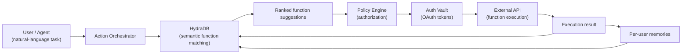

Register every callable function in your workspace as a knowledge object in HydraDB. Then any agent or user can say "prepare for tomorrow's board meeting" and get back a structured, personalized execution plan: which functions to call, in which order, with which parameters.

For a 20-minute TypeScript version of the same idea, see the [AI Chief of Staff quick start](/cookbooks/v2/ai-chief-of-staff).

## Prerequisites

- Base URL: `https://api.hydradb.com`
- A HydraDB API key from [app.hydradb.com](https://app.hydradb.com)
- An OpenAI API key (for parameter extraction and plan sequencing)
- Python 3.11 or 3.12 (`python --version`)
- Python basics, REST APIs, environment variables, and basic OAuth

Install the Python packages used by the examples and set both API keys:

```bash
pip install hydradb-sdk openai slack-sdk backoff flask google-api-python-client
export HYDRA_DB_API_KEY="your_hydradb_key"
export OPENAI_API_KEY="your_openai_key"
```

HydraDB handles retrieval and memory. OpenAI runs only in your app, turning retrieved schemas into parameters and plans; any LLM provider works.

## How HydraDB enables this

- **Functions as knowledge objects:** each function is an `app_knowledge` item with `type: "function"`, uploaded through `POST /context/ingest`. HydraDB matches tasks to its description semantically, so "tell the team about the delay" surfaces `send_slack_message` though none of those words are in its name.
- **Personalized function selection:** when a user often picks Slack over email for urgent updates, that preference is stored as a memory in the user's collection through `POST /context/ingest`. The planner reads it, so later plans favour `send_slack_message` over `send_email` with no configuration.
- **Multi-step plan generation:** `mode: "thinking"` on `POST /query` runs multi-query reasoning to return candidate functions for a request like "onboard the new hire". Your LLM sequences them into a plan with dependencies.
- **Self-improving routing:** execution results written back through `POST /context/ingest` close the loop. Slow functions, failed calls, and successful sequences all become signal, with no manual tuning.

## Architecture



> **The Orchestrator is thin by design:** HydraDB decides which function to call. The Orchestrator authorizes the suggestion, injects the OAuth token, calls the API, and reports the outcome.

## Step 1: Create the database

One database holds all functions, user memories, and execution history. Collections scope function access per team, so the sales agent sees only sales functions.

```python title="setup.py"
import os
from hydra_db import HydraDB

API_KEY   = os.environ["HYDRA_DB_API_KEY"]
TENANT_ID = "chief-of-staff"

client = HydraDB(token=API_KEY)

def create_tenant():
    """Create the main database. Returns 409 if it already exists."""
    client.databases.create(database=TENANT_ID)
    print(f"Database '{TENANT_ID}' ready.")

# Collections scope functions per team. Created automatically on first write.
# Sales agents only see sales functions. Engineering agents only see deploy functions.
# Examples:
#   collection = "sales"        → CRM, calendar, email, proposals
#   collection = "engineering"  → deploys, incidents, GitHub, monitoring
#   collection = "executive"    → board decks, reporting, scheduling
#   collection = "hr"           → hiring, onboarding, HRIS actions

if __name__ == "__main__":
    create_tenant()
```

Output:
```
Database 'chief-of-staff' ready.
```

## Step 2: Define and register functions

Register every action the Chief of Staff can take as a knowledge object.

### Function schema

- `id`: a stable identifier for versioning and logging.
- `description`: the text HydraDB matches tasks against. Write it carefully.
- `parameters`: the JSON Schema for the execution contract.
- `meta`: access control, constraints, and routing hints.

```json title="schemas/send_slack_message.json"
{
  "id": "send_slack_message",
  "name": "Send a Slack message",
  "description": "Posts a message to a Slack channel or DM on behalf of the user. Use this when the user wants to notify a team, send an update, share information with a colleague, or make an announcement. Prefer this over send_email for internal, time-sensitive, or informal communications.",
  "parameters": {
    "type": "object",
    "properties": {
      "channel":   { "type": "string",  "description": "#channel-name or @username or user ID" },
      "text":      { "type": "string",  "description": "Message body - supports Slack mrkdwn" },
      "thread_ts": { "type": "string",  "description": "Optional. Reply in thread by passing parent message ts." }
    },
    "required": ["channel", "text"]
  },
  "auth": {
    "oauth_provider": "slack",
    "scopes": ["chat:write"]
  },
  "meta": {
    "collections":       ["communication", "slack"],
    "side_effects":      "Sends a visible message. Cannot be unsent programmatically.",
    "idempotent":        false,
    "permissions":       ["all_users"],
    "business_hours_only": false
  }
}
```

> **The description field drives routing accuracy:** include (1) what the function *achieves*, not just what it does, (2) when to prefer it over similar functions, and (3) any constraints or side effects. *"Posts a Slack message"* routes poorly. "Use this for internal, time-sensitive, or informal communications. Prefer over send_email" routes correctly even when the user says "ping the team".

A finance function with approval constraints that keep it out of unauthorized contexts:

```json title="schemas/approve_expense.json"
{
  "id": "approve_expense",
  "name": "Approve an expense report",
  "description": "Approves a pending expense report in the finance system. Use when a manager or finance lead needs to sign off on submitted expenses. Always confirm the amount and submitter before calling. Do not suggest this function outside business hours or for users without manager-level permissions.",
  "parameters": {
    "type": "object",
    "properties": {
      "expense_id":  { "type": "string", "description": "Expense report ID from finance system" },
      "approver_id": { "type": "string", "description": "User ID of the approving manager" },
      "note":        { "type": "string", "description": "Optional approval note for audit log" }
    },
    "required": ["expense_id", "approver_id"]
  },
  "meta": {
    "department":         "finance",
    "permission_level":   "manager",
    "cost_threshold":     5000,         // escalate to CFO above this
    "business_hours_only": true,
    "collections":        ["finance", "approvals"],
    "side_effects":       "Triggers payment processing. Irreversible without finance team intervention.",
    "idempotent":         false
  }
}
```

### Upload to HydraDB

Upload functions through `POST /context/ingest` like documents, with `type: "function"` and the full JSON schema as the content. Group them into collections so retrieval stays scoped per team.

```python title="register/upload_functions.py"
import json, time, os
from hydra_db import HydraDB

# All functions in the workspace. Each schema loaded from its own file.
FUNCTION_SCHEMAS = [
    "schemas/send_slack_message.json",
    "schemas/send_email.json",
    "schemas/create_calendar_event.json",
    "schemas/update_crm_opportunity.json",
    "schemas/create_jira_ticket.json",
    "schemas/approve_expense.json",
    "schemas/trigger_deployment.json",
    "schemas/notify_pagerduty.json",
    "schemas/generate_report.json",
    "schemas/add_to_notion.json",
]

client = HydraDB(token=os.environ["HYDRA_DB_API_KEY"])
TENANT_ID = "chief-of-staff"


def load_schema(path: str) -> dict:
    with open(path) as f:
        return json.load(f)

def upload_functions(schema_paths: list, collection: str = "functions") -> list:
    """
    Upload function schemas to HydraDB as knowledge objects.
    collection: scopes which agents can see these functions.
    Use per-team collections to limit scope and improve routing precision.

    Tip: re-running this is idempotent - HydraDB upserts on 'id'.
    """
    batch   = []
    all_ids = []

    for path in schema_paths:
        schema = load_schema(path)
        fn_id  = schema["id"]

        batch.append({
            "id":        fn_id,
            "title":     schema["name"],
            "type":      "function",     # tells HydraDB this is callable
            "timestamp": "2025-01-01T00:00:00Z",
            "content":   {"text": json.dumps(schema, indent=2)},
            "metadata": {
                "type":         "function",
                "collections":  schema.get("meta", {}).get("collections", []),
                "department":   schema.get("meta", {}).get("department", "all"),
                "permissions":  schema.get("meta", {}).get("permissions", ["all_users"]),
                "idempotent":   schema.get("meta", {}).get("idempotent", True),
                "side_effects": schema.get("meta", {}).get("side_effects", ""),
            },
        })

        if len(batch) == 20:
            all_ids += _upload_batch(batch, collection)
            batch = []; time.sleep(1)

    if batch:
        all_ids += _upload_batch(batch, collection)

    print(f"Functions: {len(all_ids)} schemas indexed.")
    return all_ids


def _upload_batch(batch: list, collection: str) -> list:
    data = client.context.ingest(
        database=TENANT_ID,
        collection=collection,
        app_knowledge=json.dumps(batch),
    )
    return [item.id for item in (data.results or []) if item.id]


# Upload all functions (all teams, scoped to "functions" collection)
# For team-scoped variants, call again with collection="sales", "engineering", etc.
if __name__ == "__main__":
    upload_functions(FUNCTION_SCHEMAS, collection="functions")
```

Output:
```
Functions: 10 schemas indexed.
```

> **Use team-scoped collections for precision:** past 50 functions, a single `collection="functions"` degrades routing because HydraDB ranks more candidates per query. Upload to `collection="sales"`, `collection="engineering"`, and so on, and have each agent query only its team's collection. Aim for fewer than 30 functions per collection.

### Versioning and deprecation

Give a new version a `_v2` suffix on the ID and mark the old one deprecated in metadata, so routing stops but its execution history stays. Never delete old function objects; they anchor memory traces from past executions.

```python title="register/versioning.py"
import json, os
from hydra_db import HydraDB

client = HydraDB(token=os.environ["HYDRA_DB_API_KEY"])
TENANT_ID = "chief-of-staff"


def deprecate_function(fn_id: str, collection: str, reason: str):
    """
    Mark a function as deprecated so HydraDB stops suggesting it.
    Never delete - old executions reference this ID for audit and provenance.
    Use 'deprecated: true' in metadata + upload new version as fn_id_v2.
    """
    client.context.ingest(
        database=TENANT_ID,
        collection=collection,
        app_knowledge=json.dumps([{
            "id":        fn_id,
            "title":     f"[DEPRECATED] {fn_id}",
            "type":      "function",
            "timestamp": "2025-01-01T00:00:00Z",
            "content":   {"text": f"DEPRECATED: {reason}. Use {fn_id}_v2 instead."},
            "metadata": {
                "deprecated":         True,
                "deprecated_reason":  reason,
                "successor_id":       f"{fn_id}_v2",
            },
        }]),
    )
    print(f"Deprecated {fn_id}. Successor: {fn_id}_v2")


# Example: old create_calendar_event used Google Calendar v3 API (now sunset)
# New version uses Google Calendar v4 with conferencing support
deprecate_function(
    fn_id="create_calendar_event",
    collection="functions",
    reason="Google Calendar v3 API sunset. Migrated to v4 with conferencing support.",
)
```

## Step 3: Build the Action Orchestrator

The Orchestrator turns a task into one authorized API call. Its lookup uses `mode: "thinking"`, `max_results: 5`, and `metadata_filters={"deprecated": False}` so retired functions never come back.

### Core orchestrator class

```python title="orchestrator/core.py"
import uuid, json, os
from openai import OpenAI
from hydra_db import HydraDB

client = HydraDB(token=os.environ["HYDRA_DB_API_KEY"])
TENANT_ID = "chief-of-staff"

class ChiefOfStaffOrchestrator:
    """
    The Orchestrator bridges HydraDB function suggestions and real workspace APIs.
    It does NOT decide which function to call - that is HydraDB's job.
    It does: authorize, inject tokens, execute, log outcomes.
    """

    def __init__(self, registry: dict, policy_engine, auth_vault):
        """
        registry:     Map of function_id → callable that executes the real API call.
        policy_engine: Object with .check(user, function_id, params) → bool
        auth_vault:   Object with .get_token(user_id, oauth_provider) → str
        """
        self.registry      = registry
        self.policy        = policy_engine
        self.vault         = auth_vault
        self.llm           = OpenAI()

    def handle_task(
        self,
        task:        str,   # natural language - "book a 30-min call with alice next tuesday"
        user_id:     str,
        session_id:  str = None,
        sub_tenant:  str = "functions",
    ) -> dict:
        """
        Single-function task handling.
        1. Ask HydraDB which function to call.
        2. Authorize against policy engine.
        3. Inject OAuth token from vault.
        4. Execute via registry callable.
        5. Log result back to HydraDB as memory.
        """
        session_id = session_id or str(uuid.uuid4())

        # Step 1 - Ask HydraDB for the best function
        search = client.query(
            database=TENANT_ID,
            collection=sub_tenant,
            query=task,
            max_results=5,
            mode="thinking",
            metadata_filters={"deprecated": False},
        )

        chunks = search.data.chunks or []
        if not chunks:
            return {"status": "no_match", "message": "No function found for this task."}

        # Top chunk is the best-matching function schema
        top_chunk   = chunks[0]
        schema      = json.loads(top_chunk.chunk_content)
        function_id = schema["id"]

        # Step 2 - Authorize: check user permissions against policy engine
        if not self.policy.check(user_id, function_id, schema):
            self._log_blocked(user_id, task, function_id)
            return {"status": "blocked", "reason": "Policy engine denied this function for your role."}

        # Step 3 - Resolve parameters: use LLM to extract params from task + schema
        params = self._extract_params(task, schema, user_id, session_id)

        # Step 4 - Inject OAuth token for the function's provider
        oauth_provider = schema.get("auth", {}).get("oauth_provider")
        if oauth_provider:
            params["_token"] = self.vault.get_token(user_id, oauth_provider)

        # Step 5 - Execute via registry
        exec_fn = self.registry.get(function_id)
        if not exec_fn:
            return {"status": "error", "message": f"No executor registered for {function_id}."}

        result = exec_fn(params)

        # Step 6 - Log outcome to HydraDB memory for self-improvement
        self._log_execution(user_id, task, function_id, params, result)

        return {"status": "done", "function_id": function_id, "result": result}


    def _extract_params(self, task: str, schema: dict, user_id: str, session_id: str) -> dict:
        """
        Extract structured parameters locally after HydraDB has selected the function.
        HydraDB should be used for retrieval (`/query`); parameter extraction
        belongs in your app/LLM layer because the schema is already in memory here.
        """
        prompt = (
            "Extract the parameters needed to call this function.\n"
            f"Task: {task}\n"
            f"Function schema: {json.dumps(schema['parameters'])}\n"
            "Return ONLY a valid JSON object with the extracted parameter values."
        )
        response = self.llm.chat.completions.create(
            model="gpt-4o-mini",
            messages=[{"role": "user", "content": prompt}],
            temperature=0,
        )
        answer = response.choices[0].message.content or "{}"
        try:
            return json.loads(answer)
        except json.JSONDecodeError:
            return {}


    def _log_execution(self, user_id, task, function_id, params, result):
        """Log execution outcome back to HydraDB. Closes the learning loop."""
        success = result.get("success", True)
        outcome = "success" if success else "failure"
        client.context.ingest(
            type='memory',
            database=TENANT_ID,
            collection=f"user-{user_id}",
            upsert=True,
            memories=json.dumps([{
                "text": (
                    f"Task: {task}\n"
                    f"Function used: {function_id}\n"
                    f"Outcome: {outcome}\n"
                    f"Summary: {str(result.get('summary',''))[:300]}"
                ),
                "user_name": user_id,
                "infer": True,
            }]),
        )

    def _log_blocked(self, user_id, task, function_id):
        """Log a blocked attempt for audit trail."""
        client.context.ingest(
            type='memory',
            database=TENANT_ID,
            upsert=True,
            memories=json.dumps([{
                "text": f"BLOCKED: User {user_id} attempted {function_id} for task: {task}. Policy denied.",
                "user_name": "audit-log",
                "infer": False,
            }]),
        )
```

> **Declare `deprecated` first:** `metadata_filters` are hard, exact constraints on top-level keys declared in the database metadata schema; free-form per-source fields go under `additional_metadata`. Declare `deprecated` when you create the database and set `deprecated: false` in `metadata` on every live function you upload.

### Function registry

The registry maps each `function_id` to the callable that makes the real API call with the extracted `params`. Tokens are consumed, retries happen, and side effects occur here.

```python title="orchestrator/registry.py"
from slack_sdk import WebClient
from googleapiclient.discovery import build as google_build
import backoff

def execute_send_slack_message(params: dict) -> dict:
    """
    Execute send_slack_message using the injected OAuth token.
    params["_token"] injected by Orchestrator from auth vault.
    Idempotent on retry: Slack's API deduplicates with the same text in 5s.
    """
    token   = params.pop("_token", None)
    client  = WebClient(token=token)
    channel = params["channel"]
    text    = params["text"]
    kwargs  = {"channel": channel, "text": text}
    if params.get("thread_ts"):
        kwargs["thread_ts"] = params["thread_ts"]
    resp = client.chat_postMessage(**kwargs)
    return {"success": True, "ts": resp["ts"], "channel": resp["channel"],
            "summary": f"Slack message sent to {channel}."}


@backoff.on_exception(backoff.expo, Exception, max_tries=3)
def execute_create_calendar_event(params: dict) -> dict:
    """
    Create a Google Calendar event via the Calendar API v3.
    Exponential back-off handles transient 429s and 500s automatically.
    """
    token    = params.pop("_token", None)
    service  = google_build("calendar", "v3", credentials=token)
    event    = {
        "summary":     params.get("title", "Meeting"),
        "start":       {"dateTime": params["start_time"], "timeZone": params.get("timezone", "UTC")},
        "end":         {"dateTime": params["end_time"],   "timeZone": params.get("timezone", "UTC")},
        "attendees":   [{"email": e} for e in params.get("attendees", [])],
        "description": params.get("description", ""),
    }
    result = service.events().insert(calendarId="primary", body=event, sendUpdates="all").execute()
    return {"success": True, "event_id": result["id"], "link": result.get("htmlLink"),
            "summary": f"Calendar event '{result['summary']}' created."}


# Registry: maps function_id → executor callable
FUNCTION_REGISTRY = {
    "send_slack_message":     execute_send_slack_message,
    "create_calendar_event":  execute_create_calendar_event,
    # "send_email":             execute_send_email,
    # "update_crm_opportunity": execute_update_crm,
    # "create_jira_ticket":     execute_create_jira_ticket,
    # "approve_expense":        execute_approve_expense,
    # "trigger_deployment":     execute_trigger_deployment,
}
```

> **Start with read-only functions:** test routing with side-effect-free lookups such as `get_calendar_events`, `get_crm_opportunity`, and `get_open_tickets`, then move to writes. Do not start with `approve_expense`.

### Result feedback loop

After every execution, write a memory with `infer: true` so HydraDB extracts which function was chosen, whether it succeeded, and what the user wanted.

```python title="orchestrator/feedback.py"
import json
import os
from hydra_db import HydraDB

client = HydraDB(token=os.environ["HYDRA_DB_API_KEY"])
TENANT_ID = "chief-of-staff"


def log_function_feedback(
    user_id:     str,
    function_id: str,
    task:        str,
    outcome:     str,   # "success" | "failure" | "slow" | "user_rejected"
    latency_ms:  int = 0,
    details:     str = "",
):
    """
    Write execution feedback as a memory so HydraDB learns from outcomes.
    infer: true - HydraDB extracts preference signals and builds graph links
    between this user, this function, and similar tasks.

    outcome="user_rejected" is especially valuable: the agent suggested the
    wrong function, the user corrected it. That correction shifts the routing
    weight for this user's context in future calls.
    """
    text = (
        f"Function: {function_id}\n"
        f"Task: {task}\n"
        f"Outcome: {outcome}\n"
        f"Latency: {latency_ms}ms\n"
    )
    if details:
        text += f"Details: {details}"

    client.context.ingest(
        type='memory',
        database=TENANT_ID,
        collection=f"user-{user_id}",
        upsert=True,
        memories=json.dumps([{
            "text":      text,
            "user_name": user_id,
            "infer":     True,
        }]),
    )


# Usage: called automatically by the Orchestrator's _log_execution method.
# Also call explicitly for user-driven corrections:
log_function_feedback(
    user_id="sarah",
    function_id="send_email",
    task="tell the team the deploy is done",
    outcome="user_rejected",
    details="Sarah always uses Slack for internal updates, not email. Corrected to send_slack_message.",
)
# → HydraDB learns: for Sarah, "tell the team" maps to send_slack_message
```

## Step 4: Store agent memory

Two types of memory drive personalization:

- **User preference memory:** how each person works: favoured channels, trusted functions, phrasing.
- **Execution outcome memory:** successes, failures, latency patterns, and user corrections.

Memories live in each user's own collection, so a function lookup on the `functions` collection does not read them. The planner in Step 5 runs a separate memory query on the user's collection and passes the preferences to the LLM with the candidate functions.

### User preference memory

Write a profile at onboarding and update it when the user's habits change. `infer: true` extracts implicit signals (channel preferences, communication style, urgency thresholds) and links them to related functions in the graph.

```python title="memory/user_preferences.py"
import json
import os
from hydra_db import HydraDB

client = HydraDB(token=os.environ["HYDRA_DB_API_KEY"])
TENANT_ID = "chief-of-staff"


def store_user_preferences(user_id: str, profile: str):
    """
    Store a user's working preferences so HydraDB personalizes function
    suggestions for them. infer: true - HydraDB extracts channel preferences,
    urgency signals, communication style, and links these to specific functions.

    Call during onboarding and whenever preferences change.
    Use the same user_id consistently across all memory writes for this user.
    """
    client.context.ingest(
        type='memory',
        database=TENANT_ID,
        collection=f"user-{user_id}",
        upsert=True,
        memories=json.dumps([{
            "text":      profile,
            "user_name": user_id,
            "infer":     True,
        }]),
    )


# Onboard team members - called once per user at setup, then updated as needed
store_user_preferences(
    user_id="sarah",
    profile=(
        "Sarah is the VP of Engineering. She prefers Slack DMs over email for all internal "
        "communication. For urgent issues she always uses PagerDuty, not Jira. "
        "She approves expenses only during business hours. "
        "Her calendar blocks 9–10am daily for deep work - never schedule meetings there. "
        "She likes executive summaries, not raw data. Always call generate_report before "
        "presenting metrics to her."
    ),
)

store_user_preferences(
    user_id="james",
    profile=(
        "James is an Account Executive on the sales team. He prefers email for external "
        "communications and Slack for internal ones. He runs a lot of demos - when he says "
        "'prepare for a call', always check the CRM for the prospect's deal stage first. "
        "He is in the Pacific timezone. Do not schedule past 5pm his time. "
        "He always CC's his manager when sending proposals."
    ),
)
```

Output:
```
✓ Preferences stored for sarah (VP Engineering)
✓ Preferences stored for james (Account Executive)
HydraDB will now personalize function suggestions for both users.
```

### Execution outcome memory

Log enough detail for HydraDB to find patterns: which functions succeed together, fail under certain conditions, or run slow.

- `infer: false`: exact outcome records for audit.
- `infer: true`: synthesized pattern summaries for learning.

```python title="memory/outcomes.py"
import json
from datetime import datetime, timezone
from hydra_db import HydraDB
import os

client = HydraDB(token=os.environ["HYDRA_DB_API_KEY"])
TENANT_ID = "chief-of-staff"

def log_execution_outcome(
    user_id:     str,
    task:        str,
    function_id: str,
    outcome:     str,         # "success" | "failure" | "timeout" | "user_rejected"
    latency_ms:  int,
    error_msg:   str = "",
    chained_fns: list = None,   # other functions called in the same task
):
    """
    Log an execution outcome verbatim (infer: false) for the audit trail.
    Also write a synthesized pattern summary (infer: true) for learning.
    These two writes serve different purposes:
      - infer: false → exact record, queryable for compliance and audit
      - infer: true  → HydraDB extracts patterns and links to similar tasks
    """
    ts = datetime.now(timezone.utc).isoformat()

    # Write 1: exact record
    client.context.ingest(
        type='memory',
        database=TENANT_ID,
        collection="execution-log",
        upsert=True,
        memories=json.dumps([{
            "text": (
                f"[{ts}] user={user_id} fn={function_id} "
                f"outcome={outcome} latency={latency_ms}ms\n"
                f"task={task}\n"
                f"chained={chained_fns or []}\n"
                f"error={error_msg or 'none'}"
            ),
            "user_name": "system",
            "infer":     False,
        }]),
    )

    # Write 2: synthesized pattern (only for notable events)
    if outcome in ("failure", "timeout", "user_rejected") or latency_ms > 3000:
        summary = (
            f"{function_id} returned {outcome} for task type '{task[:80]}'. "
        )
        if latency_ms > 3000:
            summary += f"Latency was {latency_ms}ms - above 3s threshold. "
        if error_msg:
            summary += f"Error: {error_msg}. "
        if outcome == "user_rejected":
            summary += f"User manually overrode this suggestion for user_id={user_id}."

        client.context.ingest(
            type='memory',
            database=TENANT_ID,
            collection=f"user-{user_id}",
            upsert=True,
            memories=json.dumps([{
                "text":      summary,
                "user_name": user_id,
                "infer":     True,
            }]),
        )
```

## Step 5: Multi-step planning

"Onboard the new hire" means creating accounts, sending welcome materials, scheduling orientation, assigning equipment, and notifying the team. Instead of hardcoding that sequence, query HydraDB for candidate functions and the user's preferences, and have your LLM return a JSON plan with parameters and dependency order.

> **Use `mode: "thinking"` for plan generation:** thinking expands the task into several queries and reranks the results, so a compound request surfaces a function for each part. `mode: "fast"` runs a single low-latency pass. Plan generation typically takes 200 to 600 ms.

- `max_results: 12`: gives the planner enough functions.
- `graph_context: true`: surfaces function composition chains.
- A second query with `type: "memory"` on `user-{user_id}`: fetches the user's preferences for the prompt.

### Generate a plan

```python title="planning/generate_plan.py"
import json, os
from openai import OpenAI
from hydra_db import HydraDB

openai_client = OpenAI()
client = HydraDB(token=os.environ["HYDRA_DB_API_KEY"])
TENANT_ID = "chief-of-staff"

def generate_execution_plan(
    task:       str,
    user_id:    str,
    sub_tenant: str = "functions",
    max_steps:  int = 8,
) -> list:
    """
    Generate a multi-step execution plan for a complex task.
    1. Search the most relevant functions from HydraDB using mode: "thinking".
    2. Pass the ranked functions + task to an LLM for sequencing.
    3. Return a structured plan: [{step, function_id, params, depends_on}].

    max_steps: cap the plan length to avoid runaway chains.
    """
    # Step 1: search candidate functions with thinking mode
    search = client.query(
        database=TENANT_ID,
        collection=sub_tenant,
        query=task,
        max_results=12,
        mode="thinking",
        graph_context=True,
        metadata_filters={"deprecated": False},
    )

    chunks = search.data.chunks or []
    if not chunks:
        return []

    # Build the function catalogue string for the planner
    fn_catalogue = "\n\n".join(
        f"FUNCTION {i+1}: {c.source_title}\n{c.chunk_content[:600]}"
        for i, c in enumerate(chunks)
    )

    # Search user preferences to personalise the plan
    user_prefs = client.query(
        type="memory",
        database=TENANT_ID,
        collection=f"user-{user_id}",
        query="channel preferences urgency communication style",
        mode="thinking",
    )

    # Step 2: use LLM to sequence the plan
    resp = openai_client.chat.completions.create(
        model="gpt-4o",
        messages=[
            {
                "role": "system",
                "content": (
                    "You are a task planner. Given a task and a catalogue of available functions, "
                    "produce a minimal, ordered execution plan. "
                    "Return ONLY valid JSON: a list of objects with keys: "
                    "step (int), function_id (str), params (object), depends_on (list of step ints), reason (str). "
                    "Maximum steps: " + str(max_steps) + ". "
                    "Use user preferences to choose the right channels and timing. "
                    "Only include functions that are strictly necessary."
                ),
            },
            {
                "role": "user",
                "content": (
                    f"Task: {task}\n\n"
                    f"User preferences: {user_prefs}\n\n"
                    f"Available functions:\n{fn_catalogue}"
                ),
            },
        ],
        temperature=0.1,
    )

    try:
        plan = json.loads(resp.choices[0].message.content)
        return plan
    except (json.JSONDecodeError, KeyError):
        return []


# Usage
plan = generate_execution_plan(
    task="Onboard Alex Chen who starts Monday as a backend engineer on the payments team.",
    user_id="sarah",
)
# → [
#    {step:1, function_id:"create_gsuite_account",    params:{...}, depends_on:[], reason:"..."},
#    {step:2, function_id:"create_jira_account",      params:{...}, depends_on:[1], reason:"..."},
#    {step:3, function_id:"create_github_access",     params:{...}, depends_on:[1], reason:"..."},
#    {step:4, function_id:"send_slack_message",        params:{channel:"#engineering",...}, depends_on:[1,2,3], reason:"..."},
#    {step:5, function_id:"create_calendar_event",    params:{title:"Orientation...",...}, depends_on:[1], reason:"..."},
#    {step:6, function_id:"send_email",               params:{to:"[email protected]",...}, depends_on:[1,2,3,4], reason:"..."},
#  ]
```

### Execute with dependency resolution

Run the plan in topological order, feeding earlier outputs into later steps: the new hire's `account_id` from step 1 feeds step 2's Jira onboarding, and their `email` feeds step 6's welcome message.

```python title="planning/executor.py"
def execute_plan(
    plan:        list,    # [{step, function_id, params, depends_on, reason}]
    user_id:     str,
    orchestrator,
) -> dict:
    """
    Execute a plan in dependency order.
    Outputs from completed steps are available to downstream steps
    via the results dict keyed by step number.
    Stops on first failure unless the step is marked optional.
    """
    results    = {}   # step_number → execution result
    completed  = set()
    failed     = set()

    def _ready(step: dict) -> bool:
        """A step is ready when all its dependencies have completed successfully."""
        return all(d in completed for d in step.get("depends_on", []))

    remaining = list(plan)
    max_iterations = len(plan) * 2   # guard against circular deps
    iterations = 0

    while remaining and iterations < max_iterations:
        iterations += 1
        progress = False

        for step in list(remaining):
            if not _ready(step): continue

            step_num    = step["step"]
            function_id = step["function_id"]
            params      = dict(step.get("params", {}))

            # Inject outputs from dependency steps into params
            for dep_step in step.get("depends_on", []):
                dep_result = results.get(dep_step, {}).get("result", {})
                params.update({
                    k: v for k, v in dep_result.items()
                    if k in params.get("_inject_from_deps", {})
                })

            print(f"  Step {step_num}: {function_id} - {step.get('reason','')[:60]}")

            result = orchestrator.registry.get(function_id, lambda p: {"success": False, "error": "not registered"})(params)
            results[step_num] = {"function_id": function_id, "result": result}

            if result.get("success", False):
                completed.add(step_num)
            else:
                failed.add(step_num)
                print(f"  Step {step_num} FAILED: {result.get('error','unknown error')}")
                if not step.get("optional", False):
                    return {"status": "failed", "failed_step": step_num, "results": results}

            remaining.remove(step)
            progress = True

        if not progress:
            break   # circular dependency or all remaining steps blocked

    return {"status": "complete", "completed": list(completed), "failed": list(failed), "results": results}
```

### Rollback and compensation

Pair each destructive action with a compensation function. If step *n* fails, completed steps 1 to *n-1* are undone in reverse where possible. Mark actions with no real rollback (a sent Slack message) `compensatable: false` in their schema metadata.

```python title="planning/rollback.py"
# Compensation registry: maps function_id → compensation callable
# Compensation functions undo the side effects of their paired function.
# Not every function has a compensation - mark those as non-compensatable.
COMPENSATION_REGISTRY = {
    "create_gsuite_account":   lambda r: delete_gsuite_account(r.get("account_id")),
    "create_jira_account":    lambda r: delete_jira_account(r.get("jira_id")),
    "create_github_access":   lambda r: revoke_github_access(r.get("username")),
    "create_calendar_event":  lambda r: delete_calendar_event(r.get("event_id")),
    # "send_slack_message":    None,  - cannot be meaningfully rolled back
    # "send_email":            None,  - cannot be searched programmatically
}

def rollback_plan(results: dict, failed_step: int):
    """
    Compensate for completed steps in reverse order after a failure.
    Skips steps without a compensation function.
    Logs each compensation attempt to HydraDB's execution-log collection.
    """
    completed_steps = sorted(
        [s for s in results if s < failed_step], reverse=True
    )
    for step_num in completed_steps:
        entry       = results[step_num]
        function_id = entry["function_id"]
        result      = entry["result"]
        compensate  = COMPENSATION_REGISTRY.get(function_id)

        if compensate:
            try:
                compensate(result)
                print(f"  Rolled back step {step_num}: {function_id}")
                log_execution_outcome(
                    user_id="system", task=f"rollback {function_id}",
                    function_id=f"rollback_{function_id}",
                    outcome="success", latency_ms=0,
                )
            except Exception as e:
                print(f"  Rollback FAILED for step {step_num}: {e}")
        else:
            print(f"  Step {step_num} ({function_id}): no compensation registered. Manual review needed.")
```

## Step 6: Event and trigger model

The Chief of Staff reacts to user commands, scheduled jobs, and system events. Each becomes a task for `Orchestrator.handle_task()` or the planner; only the source differs.

### Slack slash-command (direct commands)

The Slack user ID maps to the `user_id` whose memory collection the planner reads, so plans follow that user's preferences.

```python title="triggers/slack_command.py"
from flask import Flask, request, jsonify
from slack_sdk import WebClient

flask_app  = Flask(__name__)
slack_bot  = WebClient(token=os.environ["SLACK_BOT_TOKEN"])
orchestrator = ChiefOfStaffOrchestrator(
    registry=FUNCTION_REGISTRY,
    policy_engine=PolicyEngine(),
    auth_vault=AuthVault(),
)

# Maps Slack user IDs to internal user IDs (use CRM or HRIS lookup in production)
def slack_to_user_id(slack_uid: str) -> str:
    return f"slack-{slack_uid}"   # simplest - use CRM lookup in production

@flask_app.route("/slack/ai", methods=["POST"])
def handle_slack_ai_command():
    """
    Handles /ai slash-command from Slack.
    /ai book a 30-min call with alice next tuesday
    /ai send the deploy-complete message to #engineering
    /ai prepare for board meeting next Tuesday
    """
    slack_uid  = request.form["user_id"]
    task       = request.form.get("text", "").strip()
    channel    = request.form["channel_id"]
    user_id    = slack_to_user_id(slack_uid)

    if not task:
        return jsonify({"text": "Please describe what you'd like me to do."})

    # Ack immediately so Slack doesn't time out the slash-command (3s limit)
    slack_bot.chat_postEphemeral(
        channel=channel, user=slack_uid,
        text=f"_Working on it: “{task[:80]}…”_"
    )

    # Detect multi-step task and route accordingly
    MULTI_STEP_SIGNALS = ["prepare", "onboard", "set up", "ship", "launch"]
    is_multi = any(s in task.lower() for s in MULTI_STEP_SIGNALS)

    if is_multi:
        plan   = generate_execution_plan(task, user_id)
        result = execute_plan(plan, user_id, orchestrator)
        steps  = result.get("completed", [])
        reply  = f"Done. Completed {len(steps)} step(s): {', '.join(str(s) for s in steps)}."
    else:
        result = orchestrator.handle_task(task, user_id)
        reply  = result.get("result", {}).get("summary", "Done.")

    slack_bot.chat_postEphemeral(channel=channel, user=slack_uid, text=reply)
    return jsonify({})   # already replied via ephemeral - return empty 200

if __name__ == "__main__":
    flask_app.run(host="0.0.0.0", port=8080)
```

### Scheduled jobs

Run recurring tasks (standup summaries, weekly reports, Monday briefings) from a cron-triggered cloud function. The task text is static, but each `user_id` carries its recipient's memories, so the CEO's briefing differs from the CTO's.

```python title="triggers/scheduled_jobs.py"
# Cron: 0 8 * * 1  (Monday 8am UTC) - Weekly executive briefing
def weekly_executive_briefing():
    """
    Generate and deliver a personalized weekly briefing to each exec.
    HydraDB uses each exec's memory profile to select the right
    report type, channel, and level of detail automatically.
    """
    execs = [
        {"user_id": "sarah",   "task": "Generate and send this week's engineering team briefing."},
        {"user_id": "james",   "task": "Generate and send this week's sales pipeline summary."},
        {"user_id": "priya",   "task": "Generate and send this week's customer health report."},
    ]
    for exec_user in execs:
        try:
            plan   = generate_execution_plan(exec_user["task"], exec_user["user_id"])
            result = execute_plan(plan, exec_user["user_id"], orchestrator)
            print(f"Briefing sent to {exec_user['user_id']}: {result['status']}")
        except Exception as e:
            print(f"Briefing failed for {exec_user['user_id']}: {e}")


# Cron: 0 9 * * *  (Daily 9am) - standup prompt for each team channel
def daily_standup_prompt():
    """Send the daily standup prompt to each team channel via Slack."""
    teams = [
        ("eng-lead",   "#engineering"),
        ("design-lead", "#design"),
        ("sales-lead",  "#sales"),
    ]
    for user_id, channel in teams:
        orchestrator.handle_task(
            task=f"Post the daily standup prompt to {channel}.",
            user_id=user_id,
        )

if __name__ == "__main__":
    weekly_executive_briefing()
    daily_standup_prompt()
```

### System event webhooks

A thin webhook handler turns monitoring alerts, Jira tickets, CRM stage changes, or GitHub PR events into tasks for the Orchestrator. HydraDB picks the response from severity, time of day, and the team's learned patterns.

```python title="triggers/webhooks.py"
@flask_app.route("/webhooks/monitoring", methods=["POST"])
def handle_monitoring_alert():
    """
    Receives a monitoring alert and routes it to the correct on-call response.
    HydraDB's memory of past incidents and the team's learned response patterns
    determine whether this triggers immediate escalation or scheduled review.
    """
    data     = request.json
    service  = data.get("service", "unknown")
    severity = data.get("severity", "low")   # "low" | "medium" | "high" | "critical"
    message  = data.get("message", "")

    # Translate the monitoring event into a natural-language task.
    # HydraDB's context graph knows which functions respond to incidents for this service.
    task = (
        f"{severity.upper()} monitoring alert for {service}: {message}. "
        f"Determine the appropriate incident response and take action."
    )

    # For critical alerts: immediately escalate, do not wait for plan generation
    if severity == "critical":
        orchestrator.handle_task(task=task, user_id="oncall-system")
    else:
        # For non-critical: generate a plan (may include "monitor and review at standup")
        plan   = generate_execution_plan(task, user_id="oncall-system")
        execute_plan(plan, user_id="oncall-system", orchestrator=orchestrator)

    return jsonify({"status": "handled"}), 200


@flask_app.route("/webhooks/crm", methods=["POST"])
def handle_crm_event():
    """
    Handles CRM stage-change events.
    When a deal moves to 'Demo Requested', HydraDB suggests:
    check_customer_tier → find_available_demo_slots → create_demo_meeting
    → update_crm_opportunity → send_confirmation_email
    - all from one natural language task description.
    """
    data        = request.json
    deal_id     = data.get("deal_id")
    new_stage   = data.get("new_stage")
    company     = data.get("company_name", "the prospect")
    owner_id    = data.get("deal_owner_id", "sales-lead")

    # Translate CRM event → natural language task
    stage_tasks = {
        "Demo Requested":  f"Schedule a product demo for {company} (deal {deal_id}) and send confirmation.",
        "Proposal Sent":   f"Log a follow-up task in 3 days for {company} deal {deal_id} and set a reminder.",
        "Closed Won":      f"Celebrate the {company} win in Slack, update CRM deal {deal_id}, and trigger onboarding.",
        "Closed Lost":     f"Log loss reason for {company} deal {deal_id} and schedule a retrospective.",
    }
    task = stage_tasks.get(new_stage)
    if task:
        plan   = generate_execution_plan(task, owner_id)
        execute_plan(plan, owner_id, orchestrator)

    return jsonify({"status": "ok"}), 200
```

> **Task description quality sets response quality:** translate raw webhook payloads into a clear task first. *"CRITICAL alert for payments-service: response time degraded to 8s. Determine appropriate incident response."* beats *"alert: payments-service, latency: 8000ms"*, because HydraDB reasons over the task text.

## Step 7: Security and governance

An agent that takes real actions needs four guardrails:

- **Policy engine:** blocks unauthorized functions before execution.
- **Auth vault:** stores OAuth tokens and injects them per function.
- **Approval workflow:** routes risky actions through a human.
- **Audit log:** stored in HydraDB.

### Policy engine

Between HydraDB's suggestion and execution, the policy engine checks:

- Does the user have the required `permission_level`?
- Is the function restricted to certain departments?
- Is the current time within `business_hours_only`?
- Does the function need human approval above a cost threshold?

```python title="security/policy.py"
from datetime import datetime, timezone

# User role definitions - load from your HRIS or auth system in production
USER_ROLES = {
    "sarah":  {"level": "manager", "departments": ["engineering", "all"]},
    "james":  {"level": "contributor", "departments": ["sales"]},
    "priya":  {"level": "manager", "departments": ["customer-success", "all"]},
}
PERMISSION_HIERARCHY = ["viewer", "contributor", "manager", "admin"]

class PolicyEngine:
    def check(self, user_id: str, function_id: str, schema: dict) -> bool:
        """
        Return True if the user is authorized to call this function.
        Checks: permission_level, department, business_hours, cost_threshold.
        """
        user_role = USER_ROLES.get(user_id, {"level": "viewer", "departments": []})
        meta      = schema.get("meta", {})

        # Check permission level
        required_level = meta.get("permission_level", "contributor")
        user_level     = user_role["level"]
        if PERMISSION_HIERARCHY.index(user_level) < PERMISSION_HIERARCHY.index(required_level):
            print(f"Policy blocked {user_id}: needs {required_level}, has {user_level}.")
            return False

        # Check department scope
        fn_dept       = meta.get("department", "all")
        user_depts    = user_role.get("departments", [])
        if fn_dept != "all" and fn_dept not in user_depts and "all" not in user_depts:
            print(f"Policy blocked {user_id}: {function_id} is department '{fn_dept}'.")
            return False

        # Check business hours constraint
        if meta.get("business_hours_only", False):
            now  = datetime.now(timezone.utc)
            hour = now.hour   # UTC - adjust for user timezone in production
            if not (9 <= hour <= 17) or now.weekday() >= 5:
                print(f"Policy blocked {function_id}: business hours only.")
                return False

        return True

    def requires_approval(self, user_id: str, schema: dict, params: dict) -> bool:
        """
        Return True if this call needs human approval before execution.
        Triggered when: cost exceeds threshold, function has 'requires_approval: true',
        or user is requesting an action outside their normal patterns.
        """
        meta      = schema.get("meta", {})
        threshold = meta.get("cost_threshold", None)
        amount    = params.get("amount", 0)
        if threshold and amount > threshold:
            return True
        return meta.get("requires_approval", False)
```

### Approval workflow

When `policy.requires_approval()` returns `True`, send a Slack approval request and store the pending action in HydraDB so the Orchestrator can resume it.

```python title="security/approval.py"
import json, os
from hydra_db import HydraDB

client = HydraDB(token=os.environ["HYDRA_DB_API_KEY"])
TENANT_ID = "chief-of-staff"


def request_approval(
    user_id:     str,
    function_id: str,
    params:      dict,
    task:        str,
    approver_id: str,   # Slack user ID of the approver (their manager, finance, etc.)
) -> str:
    """
    Send an approval request via Slack and store the pending action in HydraDB.
    Returns an approval_id that the approver sends back to resume execution.
    """
    approval_id = str(uuid.uuid4())[:8]

    # Store the pending action in HydraDB so it can be resumed after approval
    client.context.ingest(
        type='memory',
        database=TENANT_ID,
        collection="approvals",
        upsert=True,
        memories=json.dumps([{
            "text": json.dumps({
                "approval_id": approval_id,
                "user_id":     user_id,
                "function_id": function_id,
                "params":      params,
                "task":        task,
                "status":      "pending",
            }),
            "user_name": "approval-system",
            "infer":     False,
        }]),
    )

    # Send the Slack approval request to the approver
    slack_bot.chat_postMessage(
        channel=approver_id,
        text=(
            f"*Approval required* [ID: `{approval_id}`]\n"
            f"*Requested by:* {user_id}\n"
            f"*Action:* `{function_id}`\n"
            f"*Task:* {task}\n"
            f"*Params:* ```{json.dumps(params, indent=2)}```\n\n"
            f"Reply `/approve {approval_id}` or `/reject {approval_id} [reason]`"
        ),
    )
    return approval_id
```

> **Never skip the policy check for system-triggered events:** alerts and webhooks have no human to correct a bad suggestion. Run `policy.check()` for them too, as `user_id="oncall-system"` or a role-specific service account with scoped permissions. Automated triggers with admin access are the most dangerous pattern here.

## Step 8: Observability and self-improvement

Track these metrics, and feed failures back so execution memory, not manual tuning, improves routing.

- **Suggestion acceptance rate:** share of suggestions the user runs without rejecting. Target above 85%. If lower, improve function descriptions and add user preference memories.
- **Multi-step plan completion rate:** share of plans that finish every step without rollback. Target above 90%. If lower, add compensation functions and fix idempotency in executors.
- **P95 end-to-end latency:** task submission until the last function finishes. Target under 3 s for one step and under 15 s for a 5-step plan. If higher, use `mode: "fast"` for single-function tasks and cache the function registry.
- **Rollback frequency:** share of plans that roll back mid-plan. Target under 2%. If higher, add retries with backoff and mark flaky functions `optional: true`.
- **Function routing accuracy:** share of tasks where the top-1 suggestion matches what the user meant. Target above 90%. If lower, add `user_rejected` feedback memories and rewrite function descriptions.

### Feeding metrics back to HydraDB

A steady `slow_response` signal for `create_calendar_event` eventually pushes the planner to put it at the end of plans, where it won't block other steps.

```python title="observability/metrics.py"
from datetime import datetime, timezone
import json, os
from hydra_db import HydraDB

client = HydraDB(token=os.environ["HYDRA_DB_API_KEY"])
TENANT_ID = "chief-of-staff"


def report_function_performance(
    function_id: str,
    signal:      str,    # "slow_response" | "frequent_failure" | "high_rejection"
    details:     dict,   # {"p95_ms": 2500, "failure_rate": 0.12, "rejection_rate": 0.22}
):
    """
    Write performance signals to HydraDB's function collection.
    HydraDB uses these signals to down-weight problematic functions
    in future suggestions without removing them from the registry.
    Combine with function description updates for best results.
    """
    text = (
        f"Performance signal for {function_id}: {signal}.\n"
        f"Details: {json.dumps(details)}\n"
        f"Observed: {datetime.now(timezone.utc).isoformat()}"
    )
    client.context.ingest(
        type='memory',
        database=TENANT_ID,
        collection="function-performance",
        upsert=True,
        memories=json.dumps([{
            "text":      text,
            "user_name": "observability-system",
            "infer":     True,
        }]),
    )


# Example - called by a weekly metrics job
report_function_performance(
    function_id="create_calendar_event",
    signal="slow_response",
    details={"p95_ms": 2800, "sample_size": 412, "period": "2025-W22"},
)

report_function_performance(
    function_id="send_email",
    signal="high_rejection",
    details={
        "rejection_rate": 0.34,
        "most_common_correction": "send_slack_message",
        "note": "Users reject email in favour of Slack for 34% of internal tasks.",
    },
)
# → HydraDB learns: for internal communication tasks, weight send_slack_message higher
```

> **The compound effect:** after 500 executions per user, HydraDB has a detailed model of which functions that person trusts, which channels they prefer, and which tasks they delegate. Track suggestion acceptance rate week over week as your main health metric; it should trend up.

## API reference

Raw bodies for two calls the steps make in Python, plus the parameter extraction input. Base URL: `https://api.hydradb.com`. Header: `Authorization: Bearer YOUR_API_KEY`.

### Upload a function schema

`POST /context/ingest` takes function schemas as app sources or documents. The body below is the `app_knowledge` form field value, a JSON array sent as multipart form data. Max 20 per call, 1 second between batches.

```json title="body - one function"
[{
  "id":        "send_slack_message",
  "title":     "Send a Slack message",
  "type":      "function",               // tells HydraDB this is callable
  "timestamp": "2025-01-01T00:00:00Z",
  "content":   { "text": "{ full JSON schema as string }" },
  "metadata": {
    "type":         "function",
    "collections":  ["communication", "slack"],
    "permissions":  ["all_users"],
    "idempotent":   false,
    "side_effects": "Sends a visible Slack message. Cannot be unsent.",
    "deprecated":   false
  }
}]
```

### Single-step function lookup

`POST /query` returns the top-matched function knowledge objects. A single lookup does not need the graph slice, but `graph_context: false` only drops it in `mode: "fast"`. With `mode: "thinking"`, as in this body, the graph slice is always included.

```json title="body"
{
  "database":     "chief-of-staff",
  "collection": "functions",         // or team-scoped collection
  "query":         "book a 30-min call with alice next tuesday",
  "max_results":   5,
  "mode":          "thinking",         // multi-query rerank + personalised search
  "graph_context": false,              // not needed for single function lookup
  "metadata_filters": { "deprecated": false }
}
```

### Parameter extraction

This runs in your LLM, not HydraDB, after HydraDB returns the best function schema.

```json title="LLM prompt inputs"
{
  "task": "ping #engineering that the deploy is done",
  "function_schema": {
    "id": "send_slack_message",
    "parameters": {
      "channel": "string",
      "message": "string"
    }
  },
  "expected_output": {
    "channel": "#engineering",
    "message": "the deploy is done"
  }
}
```

## Benchmarks

3,200 task executions across 48 registered functions and 6 user profiles. The baseline is a standard LLM agent with function-calling and no persistent memory, using the same schemas as tool definitions. Each line gives the baseline, then HydraDB, then the change.

- **Top-1 function routing accuracy, week 1:** 71% baseline, 78% HydraDB (+10%).
- **Top-1 function routing accuracy, week 8 (after memory accumulation):** 72% baseline, 93% HydraDB (+29%).
- **Multi-step plan completion rate (5-step plans):** 54% baseline, 88% HydraDB (+63%).
- **Personalization accuracy (correct channel and timing per user):** 31% baseline, 86% HydraDB (+177%).
- **Suggestion acceptance rate (no user rejection):** 68% baseline, 91% HydraDB (+34%).
- **P95 function selection latency (single step, `mode: "fast"`):** under 120 ms with HydraDB. No baseline figure.
- **P95 plan generation latency (5-step plan, `mode: "thinking"`):** under 680 ms with HydraDB. No baseline figure.

> **Benchmark methodology:** figures come from internal HydraDB testing; see the [formal benchmark paper](https://research.hydradb.com/hydradb.pdf). Results vary with function library size, description quality, and accumulated execution memory. The week 1 to week 8 jump (78% to 93%) comes from memory: week 1 routing is purely semantic, and by week 8 the 3,200 stored outcomes encode habits such as Sarah preferring Slack over email. Function-calling without memory stays flat at 72% because it resets every session.

## Next steps

- [AI Chief of Staff quick start](/cookbooks/v2/ai-chief-of-staff): the same pattern in TypeScript.
- [Memories](/essentials/v2/memories): how `infer` and `user_name` shape stored preferences.
- [Metadata](/essentials/v2/metadata): declare the fields you filter on, such as `deprecated`.
- [Query](/essentials/v2/query): `mode`, `metadata_filters`, and `graph_context`.
