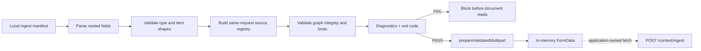

`POST /context/ingest` accepts documents, app sources, memories, and caller-supplied graphs in one multipart request. Several of its richest fields are JSON strings, so a client can construct valid multipart syntax while the nested payload is still inconsistent.

**Ingest Doctor** is a dependency-free Node.js preflight for that gap. It validates a local representation of an ingest request before you use a HydraDB key, upload a document, or make a network call. After validation passes, an optional helper can turn the same manifest into in-memory `FormData` without sending it.

<CardGroup cols={2}>
  <Card title="No credentials" icon="key">
    The validator runs entirely offline and does not read a HydraDB API key.
  </Card>
  <Card title="Actionable diagnostics" icon="stethoscope">
    Stable codes and JSON paths point to the field that needs attention.
  </Card>
  <Card title="Cross-field checks" icon="link">
    Source IDs, document metadata, Knowledge/Memory mode, and graph keys are checked together.
  </Card>
  <Card title="CI friendly" icon="terminal">
    Human-readable output, JSON output, and process exit codes work locally or in automation.
  </Card>
</CardGroup>

## What you will build

By the end of this cookbook, you will be able to:

- preflight Knowledge and Memory ingestion manifests without an API key;
- detect malformed JSON and fields that conflict with the selected ingest `type`;
- check document-to-metadata alignment and source-ID integrity;
- validate a source-attached `graph_payload`, including documented HydraDB limits;
- prepare documented multipart fields only after validation passes;
- use deterministic diagnostics in a terminal or CI job; and
- understand exactly what this local check guarantees and what the server still decides.

## The problem

HydraDB ingestion uses `multipart/form-data`. Scalar fields such as `type` and `database` are ordinary form parts, uploaded documents are file parts, and these structured fields travel as JSON strings:

- `document_metadata`
- `app_knowledge`
- `memories`
- `graph_payload`

The outer multipart request can therefore look correct even when a nested field contains malformed JSON, a Memory request contains Knowledge-only data, two sources reuse an ID, or a graph points at a source that is not in the same request.

Without a preflight, those mistakes are normally discovered after request construction or upload. Ingest Doctor moves that feedback to the developer's machine and gives every diagnostic a stable code and path.



## Quickstart

The example is plain JavaScript and uses only Node.js built-ins.

```bash
node examples/ingest-doctor/validate.mjs \
  examples/ingest-doctor/valid-knowledge.json
```

```text Expected output
PASS — ingest manifest is internally consistent
2 sources · 2 graphs · 4 entities · 2 relations · 0 errors · 0 warnings
```

Run the Memory example through the same validator:

```bash
node examples/ingest-doctor/validate.mjs \
  examples/ingest-doctor/valid-memory.json
```

```text Expected output
PASS — ingest manifest is internally consistent
1 source · 1 graph · 2 entities · 1 relation · 0 errors · 0 warnings
```

Then run the deliberately broken fixture:

```bash
node examples/ingest-doctor/validate.mjs \
  examples/ingest-doctor/invalid.json
```

```text Expected output
FAIL — ingest manifest has validation errors
3 sources · 1 graph · 1 entity · 1 relation · 3 errors · 0 warnings
ERROR E_DOCUMENT_METADATA_COUNT document_metadata
  document_metadata must contain one item for each local document descriptor.
ERROR E_GRAPH_TARGET_UNKNOWN_ENTITY graph_payload.*.relations[0].target
  The relation target does not reference an entity-map key.
ERROR E_GRAPH_UNKNOWN_SOURCE graph_payload.*
  A graph key does not match an explicit source id in this request.
```

A successful run exits with status `0`; an invalid manifest exits with status `1`.

<Note>
These commands do not call HydraDB, upload files, or use model/API credits. They validate local fixture data only.
</Note>

## Failure → repair → multipart-ready

The broken and repaired fixtures differ only where the diagnostics point:

- `E_DOCUMENT_METADATA_COUNT` — add metadata for the second document.
- `E_GRAPH_UNKNOWN_SOURCE` — key the graph by the same-request app source ID
  `incident-42`.
- `E_GRAPH_TARGET_UNKNOWN_ENTITY` — add the relation's missing `incident`
  entity.

Run the repaired twin:

```bash
node examples/ingest-doctor/validate.mjs \
  examples/ingest-doctor/repaired.json
```

```text Expected output
PASS — ingest manifest is internally consistent
3 sources · 1 graph · 2 entities · 1 relation · 0 errors · 0 warnings
```

After that PASS, run the deterministic multipart preparation demo:

```bash
node examples/ingest-doctor/prepare-demo.mjs
```

```json Expected output
{
  "status": "ready",
  "fieldNames": [
    "type",
    "database",
    "collection",
    "documents",
    "documents",
    "document_metadata",
    "app_knowledge",
    "graph_payload"
  ],
  "documentCount": 2,
  "partCount": 8
}
```

The demo uses synthetic document `Blob` values and the same API an application
would call:

```js
import { readFile } from "node:fs/promises";
import {
  prepareValidatedMultipart,
} from "./examples/ingest-doctor/prepare-multipart.mjs";

const manifest = JSON.parse(
  await readFile(
    "examples/ingest-doctor/repaired.json",
    "utf8",
  ),
);

const prepared = await prepareValidatedMultipart(
  manifest,
  {
    // Synthetic bytes keep this demo self-contained.
    // Real applications load and type their own bytes.
    loadDocument: async () =>
      new Blob(
        ["synthetic document bytes"],
        { type: "application/pdf" },
      ),
  },
);

console.log(
  JSON.stringify(
    { status: prepared.status, ...prepared.partSummary },
    null,
    2,
  ),
);
```

`ready` means the helper prepared in-memory `FormData` from a passing snapshot.
It does not mean HydraDB accepted the request. The helper module contains no
credential, header, or transport implementation. The application-owned
`loadDocument` callback may perform file, network, or credential I/O; the
application also owns `fetch`, response handling, and status polling.

<Warning>
Do not log the returned `FormData`, document `Blob` values, or structured form
values. `partSummary` intentionally reports names and counts only.
</Warning>

## Manifest contract versus wire contract

The file passed to Ingest Doctor is a **local preflight manifest**. It gives the validator one JSON document in which it can reason across files, metadata, app sources, memories, and graphs.

It is not the body that you send to HydraDB.

The manifest keeps the nested multipart fields JSON-encoded, while representing local documents as filename strings or `{ "filename": "..." }` descriptors:

```json
{
  "type": "knowledge",
  "database": "acme_corp",
  "collection": "team_docs",
  "documents": ["billing-policy.pdf"],
  "document_metadata": "[{\"id\":\"billing-policy-doc\"}]"
}
```

| Concept | Local preflight manifest | `POST /context/ingest` wire request |
| --- | --- | --- |
| Request container | One JSON file | `multipart/form-data` |
| Documents | Local descriptors used for alignment checks | Repeated binary `documents` file parts |
| `document_metadata` | JSON-encoded string, matching the wire encoding | JSON string form part |
| `app_knowledge` | JSON-encoded string, matching the wire encoding | JSON string form part |
| `memories` | JSON-encoded string, matching the wire encoding | JSON string form part |
| `graph_payload` | JSON-encoded string, matching the wire encoding | JSON string form part |
| Credentials | None | `Authorization: Bearer ...` header |
| Result | Local diagnostics | `202 Accepted` or an API error |

<Warning>
Do not send the manifest file itself as `application/json`. The ingestion endpoint expects multipart form data. After a manifest passes, use `prepareValidatedMultipart` or your own client to construct the documented wire request.
</Warning>

For example, this wire request stringifies the structured fields and uploads the file as a separate part:

```bash
curl -X POST 'https://api.hydradb.com/context/ingest' \
  -H "Authorization: Bearer $HYDRA_DB_API_KEY" \
  -H "API-Version: 2" \
  -F "type=knowledge" \
  -F "database=acme_corp" \
  -F "collection=team_docs" \
  -F "documents=@/path/to/billing-policy.pdf" \
  -F 'document_metadata=[{"id":"billing-policy"}]'
```

See [Ingest Context](/api-reference/v2/endpoint/ingest-context) for the complete request contract.

## How validation works

Ingest Doctor evaluates the manifest in stages. Later stages run only with data that earlier stages established as safe to inspect.

### 1. Decode structured fields

Each opaque JSON field must decode to its documented container:

| Field | Expected decoded shape |
| --- | --- |
| `document_metadata` | Array |
| `app_knowledge` | Object or array |
| `memories` | Non-empty array for `type: "memory"` |
| `graph_payload` | Object keyed by same-request source ID |

Malformed JSON produces a field-specific error instead of an unhandled parser exception.

### 2. Enforce the selected context type

HydraDB keeps Knowledge and Memory ingestion distinct:

- `type: "knowledge"` can include documents and `app_knowledge`;
- `type: "memory"` requires `memories`;
- documents, `document_metadata`, and `app_knowledge` do not belong in a Memory request; and
- `memories` does not belong in a Knowledge request.

The preflight fails closed when a request mixes these modes.

The deprecated top-level aliases `tenant_id` and `sub_tenant_id` remain compatible. Using one instead of its current field produces `W_DATABASE_ALIAS` or `W_COLLECTION_ALIAS`; supplying conflicting old and new values is a blocking error.

### 3. Align documents and metadata

`document_metadata` is positional: entry `0` describes document `0`, entry `1` describes document `1`, and so on. When metadata is present, Ingest Doctor checks that its length matches the local document descriptors so a title, ID, or metadata object cannot silently attach to the wrong upload.

### 4. Build one source-ID registry

Cross-field validation needs a single view of every source in the request. The registry includes explicit IDs from:

- `document_metadata` entries;
- `app_knowledge` items; or
- `memories` items.

The validator rejects duplicate IDs and IDs containing a comma. A comma is reserved as the separator used by `GET /context/status?ids=a,b`, so a comma-containing ID cannot be looked up unambiguously.

### 5. Validate item-level shapes

The validator checks the documented minimum structure for app sources and memories. Examples include:

- an app source has an `id` and uses the modern app-native `fields` model, while the legacy generic `content` model is recognized as a compatibility path;
- app-native `fields.kind` agrees with the top-level `kind`, and an external-ID relation target includes its provider namespace;
- any `database` or `collection` supplied inside an app source matches the request-level scope;
- a memory has `text` or `user_assistant_pairs`; and
- a graph-targeted source has an explicit ID.

Diagnostics use paths into the manifest so a developer can repair the item without searching the entire request.

### 6. Prepare FormData only after PASS

`prepareValidatedMultipart` first runs the complete validator. A validation
failure returns `status: "blocked"` without invoking the application document
loader.

For a passing manifest, the helper:

1. snapshots the supported values before any asynchronous loader call;
2. blocks unknown top-level fields instead of silently discarding them;
3. rejects unpaired UTF-16 surrogates before `FormData` can normalize two
   distinct values to the replacement character;
4. canonicalizes deprecated `tenant_id` and `sub_tenant_id` aliases to
   `database` and `collection`;
5. appends the original well-formed nested JSON string values without parsing
   and reserializing them;
6. invokes the supplied loader sequentially for document `Blob` values; and
7. strips both POSIX and Windows path segments from multipart upload names.

The deterministic part order belongs to this example, not to the HydraDB
server contract. The helper module does not create a `Request`, set
`Content-Type`, access credentials, or implement `fetch`; the application
loader may perform its own I/O, and the runtime that eventually sends
`FormData` must generate the multipart boundary.

<Info>
The repository currently documents both the modern app-native `fields` shape and a legacy generic `content` shape. Ingest Doctor treats `fields` as canonical and recognizes legacy `content` with `W_APP_LEGACY_CONTENT`. It accepts the canonical app-native `relations[]` model and the legacy `relations.ids` shortcut, which produces `W_APP_RELATIONS_LEGACY`. An omitted item-level database or collection produces `W_APP_DATABASE_OMITTED` or `W_APP_COLLECTION_OMITTED`; a supplied value that differs from the request scope is an error.
</Info>

For memory metadata, the example follows the canonical [Memories](/essentials/v2/memories) guide: `metadata` is a JSON-encoded object string inside each memory item, while `additional_metadata` is an object. The validator also accepts an encoded-object `additional_metadata` value for compatibility with the endpoint reference and reports `W_MEMORY_ADDITIONAL_METADATA_ENCODED`.

## Advanced check: `graph_payload`

`graph_payload` is a map of **source ID → source graph**. It supplies entities and relations for a document, app source, or memory and replaces LLM graph extraction for that keyed source.

Ingest Doctor checks the graph together with its request rather than treating it as isolated JSON:

1. Every top-level graph key must match an explicit source ID in the same manifest.
2. Every relation `source` and `target` must reference a key in that graph's `entities` map.
3. Entity names and relation predicates must be non-empty strings within the documented length limit.
4. The graph must stay within HydraDB's entity, relation, and per-entity degree limits.
5. Relation context must stay within its documented length limit.
6. Object construction rejects prototype-sensitive keys instead of merging them into ordinary application objects.

The documented server limits are:

| Limit | Maximum |
| --- | ---: |
| Entities per source graph | 5,000 |
| Relations per source graph | 10,000 |
| Relations per entity (degree) | 500 |
| `context` length | 2,000 characters |
| Entity `name` length | 256 characters |
| Relation `predicate` length | 256 characters |

Some useful findings are quality warnings rather than claims about server rejection:

- an entity is never referenced by a relation;
- two entity names collide after lowercase normalization; or
- the same relation appears more than once.

<Note>
This `graph_payload` is the source-attached Bring Your Own Graph contract on `POST /context/ingest`. It is not a Cypher query or a Graph Collection API request. Read [Bring Your Own Graph](/essentials/v2/bring-your-own-graph) for storage and query behavior.
</Note>

## Read diagnostics

Each diagnostic is designed for both a human and a script:

| Field | Purpose |
| --- | --- |
| `severity` | Distinguishes blocking errors from non-blocking warnings |
| `code` | Stable machine-readable identity |
| `path` | Location in the local manifest |
| `message` | Short repair-oriented explanation |

Human output is the default. For machine-readable output, add `--json` after the manifest path:

```bash
node examples/ingest-doctor/validate.mjs \
  examples/ingest-doctor/invalid.json \
  --json
```

For the included invalid fixture, the command returns:

```json
{
  "status": "fail",
  "summary": {
    "sources": 3,
    "graphs": 1,
    "entities": 1,
    "relations": 1,
    "errors": 3,
    "warnings": 0,
    "diagnosticsShown": 3,
    "diagnosticsTruncated": false
  },
  "diagnostics": [
    {
      "severity": "error",
      "code": "E_DOCUMENT_METADATA_COUNT",
      "path": "document_metadata",
      "message": "document_metadata must contain one item for each local document descriptor."
    },
    {
      "severity": "error",
      "code": "E_GRAPH_TARGET_UNKNOWN_ENTITY",
      "path": "graph_payload.*.relations[0].target",
      "message": "The relation target does not reference an entity-map key."
    },
    {
      "severity": "error",
      "code": "E_GRAPH_UNKNOWN_SOURCE",
      "path": "graph_payload.*",
      "message": "A graph key does not match an explicit source id in this request."
    }
  ]
}
```

The process exit status distinguishes manifest results from invocation failures:

| Exit status | Meaning |
| ---: | --- |
| `0` | The manifest has no blocking errors; warnings may still be present |
| `1` | The manifest violates one or more checked validation rules |
| `2` | The CLI could not validate the input, such as an unreadable file or invalid top-level JSON |

## Use it in CI

Add the preflight before the step that builds or sends your multipart request:

```yaml
name: Validate HydraDB ingest manifests

on:
  pull_request:

jobs:
  ingest-preflight:
    runs-on: ubuntu-latest
    steps:
      - uses: actions/checkout@v4
      - uses: actions/setup-node@v4
        with:
          node-version: 20
      - name: Validate Knowledge manifest
        run: node examples/ingest-doctor/validate.mjs examples/ingest-doctor/valid-knowledge.json
      - name: Validate Memory manifest
        run: node examples/ingest-doctor/validate.mjs examples/ingest-doctor/valid-memory.json
```

No package installation is required. A blocking diagnostic produces a non-zero exit status, so a CI step can stop before an upload job runs.

The example itself is protected by the repository's existing CI workflow. It
runs the validator suite and its source-of-truth drift guard on every pull
request:

```bash
node --test \
  tests/ingest-doctor.test.mjs \
  tests/ingest-doctor-contract.test.mjs \
  tests/ingest-doctor-multipart.test.mjs
```

The drift guard reads the checked-in v2 OpenAPI document and BYOG limits table.
When one of the outer request fields or published limits used by the validator
changes, CI asks a maintainer to review the corresponding assumption.

## Rule provenance

Ingest Doctor separates documented HydraDB rules from conservative local protections. An `error` means the manifest violates a rule enforced by this example; it does not promise that the API returns the same status or message.

| Validator family | Classification | Authority |
| --- | --- | --- |
| Multipart fields, `type`, `database`/`collection`, deprecated aliases, `upsert`, and JSON-string encoding | Documented HydraDB contract | [Ingest Context](/api-reference/v2/endpoint/ingest-context) and the checked-in v2 OpenAPI document |
| Knowledge/Memory separation, non-empty `memories`, and positional document metadata | Documented HydraDB contract | [Ingest Context](/api-reference/v2/endpoint/ingest-context) and [Memories](/essentials/v2/memories) |
| App-source `fields`, supported kinds, scope matching, and provider-aware relations | Documented contract; omitted recommended fields and legacy-shape warnings are compatibility guidance | [App Sources](/essentials/v2/app-sources) and [Ingest Context](/api-reference/v2/endpoint/ingest-context) |
| Memory content, pairs, inference fields, and nested metadata encoding | Documented contract; multiple-content and ineffective-option warnings are local quality guidance | [Memories](/essentials/v2/memories) |
| BYOG source membership, entity/relation references, and published size/length limits | Documented contract; duplicate-relation, normalized-name, and orphan-entity warnings are local quality guidance | [Bring Your Own Graph](/essentials/v2/bring-your-own-graph) |
| Multipart field names and outer types | Documented contract; validation-before-load, unknown-field blocking, well-formed string enforcement, canonical alias output, deterministic order, and upload-basename handling are local adapter policies | Checked-in v2 OpenAPI document and `prepare-multipart.mjs` |
| Cross-field duplicate IDs, prototype-key rejection, traversal/diagnostic bounds, wildcard redaction, deterministic ordering, and the 128 MiB manifest ceiling | Conservative Ingest Doctor policy, not a HydraDB server limit | Local fail-closed and privacy protections in this example |

The local document descriptors and 128 MiB ceiling belong only to the preflight adapter; neither describes HydraDB's multipart file parts or server upload limits.

## Guarantees and non-goals

When the preflight passes, Ingest Doctor establishes that the local manifest satisfies the documented rules and local safety policies implemented by this example:

- structured fields decode to their expected containers;
- Knowledge and Memory fields are not mixed;
- document descriptors and supplied metadata align;
- explicit source IDs are unique and status-safe;
- graph keys belong to the same request;
- graph references and documented limits are internally consistent; and
- diagnostics are deterministic for the same input.

When the optional multipart helper returns `ready`, it additionally establishes
that:

- the validator passed before any document loader call;
- only the helper's allowlisted canonical fields were appended;
- well-formed structured JSON strings were appended without reserialization;
  and
- document descriptors produced `Blob` parts with path-stripped upload names,
  while malformed UTF-16 was blocked before document reads.

It deliberately does **not** guarantee:

- that a local document path exists, can be read, or has the claimed MIME type;
- that credentials, database permissions, quotas, or network connectivity are valid;
- that HydraDB will accept behavior introduced by an unpublished or future server-side contract change;
- that ingestion has finished after a `202 Accepted` response;
- that graph relations are factually true or semantically supported by source content;
- that optional metadata matches a database's configured metadata schema;
- that loader-provided bytes or MIME types match the referenced documents;
- that the application-owned loader avoided file, network, credential, or
  other side effects;
- that authorization, API-version headers, HTTP transport, or multipart
  boundary serialization are configured; or
- that prepared `FormData` will be accepted by the HydraDB API.

The API remains authoritative. After a successful upload, poll [Ingestion Status](/api-reference/v2/endpoint/source-status) until each source reaches `completed` or `errored`.

## Security and privacy

The validator and built-in multipart logic are designed for offline use:

- the validator makes no external requests and reads no API key;
- the multipart module contains no credential or transport implementation;
- neither uses a model or adds a runtime dependency;
- diagnostics use wildcard paths and compact explanations instead of dumping complete source content;
- the 128 MiB file ceiling applies only to the local JSON manifest, not to referenced document files or a HydraDB upload quota;
- structural traversal and visible diagnostics are bounded; and
- prototype-sensitive keys, excessive nesting, and non-preservable multipart
  strings fail closed.

Diagnostics never echo source IDs, entity keys, filenames, text, URLs, metadata values, or other raw values from the manifest. Dynamic object-key locations use a stable wildcard such as `graph_payload.*`.

The multipart helper intentionally invokes the application-supplied loader and
holds its returned document `Blob` values in memory. The loader receives the
full local descriptor filename so it can locate the file; only the multipart
upload filename is reduced to its basename. Loader exceptions are replaced
with a stable diagnostic rather than returned verbatim. Because the loader is
application code, it can perform arbitrary I/O; keep those effects inside your
own trust boundary.

That makes the workflow suitable for synthetic fixtures and local preflight of sensitive manifests. It does not replace your own controls for file access, secret scanning, log retention, or handling personal data. Prefer sanitized fixtures in source control and keep real documents and memory text out of CI logs.

## Reviewer proof

The repository includes deterministic positive, negative, and adversarial coverage. A reviewer can inspect the complete flow without a HydraDB account:

| Claim | Proof |
| --- | --- |
| Knowledge and Memory manifests pass offline | Run the two valid fixture commands in [Quickstart](#quickstart) |
| Broken cross-field data fails before upload | Run `examples/ingest-doctor/invalid.json` |
| The three reported repairs produce a clean pass | Run `examples/ingest-doctor/repaired.json` |
| The repaired manifest becomes a safe part-name/count summary | Run `node examples/ingest-doctor/prepare-demo.mjs` |
| Invalid input causes zero document reads; passing input produces ordered repeated Blob parts | Inspect `tests/ingest-doctor-multipart.test.mjs` |
| Well-formed opaque strings remain unchanged; malformed UTF-16 blocks before reads; upload names expose no local path | Run the multipart test file |
| Machine-readable diagnostics are available | Add `--json` after the manifest path |
| 135 boundary, validation, CLI, drift, multipart, privacy, and adversarial tests pass | Run all three test files with the command in [Use it in CI](#use-it-in-ci) |
| Selected OpenAPI fields and BYOG limits are drift-guarded | Inspect `tests/ingest-doctor-contract.test.mjs` |
| The proof runs on every pull request | Inspect the `Test Ingest Doctor` step in `.github/workflows/ci.yml` |
| The included proof needs no network or package install | The modules import only Node.js built-ins; the demo uses synthetic Blobs and no transport |

For a short demo:

1. Run the invalid fixture and show its path-specific diagnostics.
2. Run its repaired twin and show the passing summary.
3. Run `prepare-demo.mjs` and show only its safe `partSummary`.
4. Run the focused tests to prove the gate, exact boundaries, and
   boundary-plus-one cases.

## Limitations

- This is an example validator maintained with the documentation, not an official HydraDB SDK feature.
- The local manifest is a deliberate adapter for preflight. Applications still
  supply document `Blob` values, credentials, headers, `fetch`, response
  handling, and ingestion-status polling.
- A validator PASS can still be preparation-blocked by an unknown top-level
  field, a non-preservable string, an unsafe upload name, a missing loader, a
  loader failure, or a non-`Blob` loader result.
- The CLI rejects local manifest files larger than 128 MiB before reading them. This is an Ingest Doctor resource policy, not a HydraDB upload limit; direct `validateIngestManifest()` calls receive an already-parsed object and do not apply the file-size check.
- Warnings identify suspicious quality patterns but do not claim that the server rejects them.
- The validator checks graph structure and membership, not semantic truth or entailment.
- Standard `JSON.parse` keeps the last value for duplicate raw object keys. Reject duplicate keys before this preflight if your serializer or input boundary permits hand-authored JSON.
- The degree check counts a relation once for each distinct endpoint and counts a self-loop once. The public limit is authoritative; its mixed-direction and self-loop counting convention is not specified.
- Tests detect changes to the selected checked-in `/context/ingest` outer fields and the five BYOG limits used by the validator. The live API remains authoritative for unpublished or future behavior.

## Next steps

- [Ingest Context](/api-reference/v2/endpoint/ingest-context) - add headers and send the authoritative multipart request
- [Bring Your Own Graph](/essentials/v2/bring-your-own-graph) - understand source-attached graph behavior
- [Ingestion Status](/api-reference/v2/endpoint/source-status) - wait for asynchronous indexing
- [Query](/api-reference/v2/endpoint/query) - retrieve the indexed context
