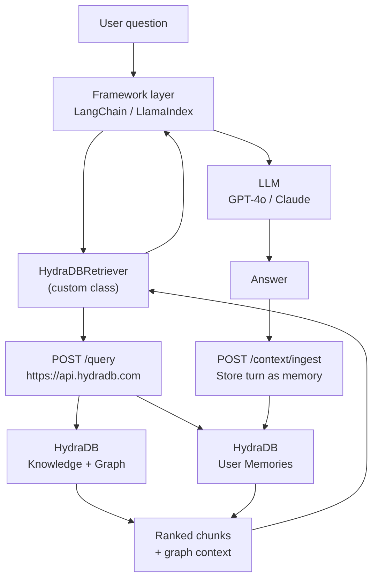
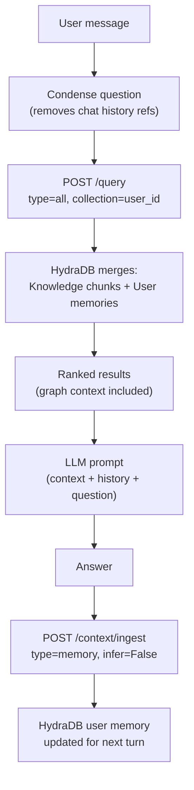

This cookbook shows you how to use HydraDB as the retrieval backbone for two of the most widely used Python agent frameworks: **LangChain** and **LlamaIndex**.

Both frameworks were designed around pluggable retrievers. HydraDB fits naturally into that slot because it returns ranked, graph-traversed chunks through a single `POST /query` call. You implement one class per framework, and everything else, chains, agents, chat engines, tools, just works.

> **Note**: All code in this guide targets HydraDB v2. Base URL: `https://api.hydradb.com`. Get your API key at [app.hydradb.com](https://app.hydradb.com). Install: `pip install "hydradb-sdk>=2,<3" langchain-core langchain-openai llama-index-core openai`.

> **What you will build**: A `HydraDBRetriever` for LangChain, a `HydraDBRetriever` for LlamaIndex, a memory-augmented RAG chat chain, and a LlamaIndex chat engine that stores every conversation turn back into HydraDB so answers improve over time.

---

## Prerequisites

**Required knowledge**: Python basics, familiarity with either LangChain or LlamaIndex, REST APIs

**Required tools**:
- HydraDB API key (from [app.hydradb.com](https://app.hydradb.com))
- OpenAI API key (used for the LLM step in examples)
- Python 3.11 or later

**Install dependencies**:

```bash
pip install "hydradb-sdk>=2,<3" \
  langchain langchain-core langchain-openai langchain-community \
  llama-index-core llama-index-llms-openai \
  openai
```

---

## What You Will Build

By the end of this cookbook you will have:

- A `HydraDBRetriever` class for LangChain that returns `Document` objects from any HydraDB collection
- A memory-augmented LCEL chat chain that queries knowledge and per-user memories in one call
- A LangChain agent tool backed by HydraDB retrieval
- A `HydraDBRetriever` class for LlamaIndex that returns `NodeWithScore` objects
- A LlamaIndex `RetrieverQueryEngine` with similarity postprocessing
- A LlamaIndex `CondensePlusContextChatEngine` that writes every conversation turn back to HydraDB

---

## Architecture Overview



---

## Phase 0 - Create a Database and Ingest Sample Knowledge

Before writing any retriever code, you need a HydraDB database with content to search. This phase takes about five minutes. Skip it if you already have a database.

### Step 0a - Create the database

```python Python SDK
# setup.py
import os
import time
from hydra_db import HydraDB

client = HydraDB(token=os.environ["HYDRA_DB_API_KEY"])

DATABASE = "framework-demo"

try:
    client.databases.create(database=DATABASE)
    print(f"Created database: {DATABASE}")
except Exception as e:
    if "already" in str(e).lower():
        print(f"Database {DATABASE} already exists, continuing.")
    else:
        raise

# Poll until the database is ready to accept ingestion
for _ in range(30):
    status = client.databases.status(database=DATABASE)
    if status.data.infra.ready_for_ingestion:
        print("Database ready.")
        break
    time.sleep(5)
else:
    raise TimeoutError("Database did not become ready in 150 seconds.")
```

**Expected output**:
```
Created database: framework-demo
Database ready.
```

### Step 0b - Ingest sample knowledge documents

```python Python SDK
# ingest_sample.py
import json
import os
import time
from hydra_db import HydraDB

client = HydraDB(token=os.environ["HYDRA_DB_API_KEY"])

DATABASE = "framework-demo"
COLLECTION = "docs"

sample_docs = [
    {
        "id": "hydradb-overview",
        "title": "HydraDB Overview",
        "type": "knowledge_base",
        "timestamp": "2026-01-01T00:00:00Z",
        "content": {
            "text": (
                "HydraDB is a unified context substrate for AI. It stores three kinds of context: "
                "user memories (preferences, history), semantic knowledge (documents, files, app data), "
                "and episodic experiences. A single POST /query call returns knowledge and memories "
                "together, ranked by relevance and personalized per user."
            )
        },
        "database": DATABASE,
        "collection": COLLECTION,
    },
    {
        "id": "hybrid-search-guide",
        "title": "Hybrid Search in HydraDB",
        "type": "knowledge_base",
        "timestamp": "2026-01-02T00:00:00Z",
        "content": {
            "text": (
                "HydraDB supports hybrid retrieval combining semantic (dense) and keyword (BM25) search. "
                "Set query_by='hybrid' and alpha between 0.0 (pure BM25) and 1.0 (pure semantic). "
                "Use alpha='auto' to let HydraDB choose based on the query. "
                "Mode 'thinking' enables query expansion and graph traversal for highest quality. "
                "Mode 'fast' skips reranking for sub-100ms latency."
            )
        },
        "database": DATABASE,
        "collection": COLLECTION,
    },
    {
        "id": "collections-guide",
        "title": "Collections and Multi-Tenancy",
        "type": "knowledge_base",
        "timestamp": "2026-01-03T00:00:00Z",
        "content": {
            "text": (
                "A database is an isolated workspace. A collection is a logical partition inside a database. "
                "For B2C apps: one database per organization, one collection per end user. "
                "For B2B: one database per customer, collections for teams or workspaces. "
                "Memories are always scoped to a collection; knowledge can be shared across collections."
            )
        },
        "database": DATABASE,
        "collection": COLLECTION,
    },
]

result = client.context.ingest(
    type="knowledge",
    database=DATABASE,
    collection=COLLECTION,
    app_knowledge=json.dumps(sample_docs),
    upsert=True,
)

ids = [r.id for r in (result.data.results or [])]
print(f"Ingested {len(ids)} documents: {ids}")

# Poll until indexing reaches a searchable state
for _ in range(30):
    statuses = client.context.status(
        database=DATABASE,
        collection=COLLECTION,
        ids=ids,
    ).data.statuses or []
    if not statuses:
        time.sleep(2)
        continue
    done = all(
        s.indexing_status in ("graph_creation", "completed", "success")
        for s in statuses
    )
    failed = any(
        s.indexing_status in ("errored", "failed")
        for s in statuses
    )
    if failed:
        raise RuntimeError("One or more documents failed to index.")
    if done:
        print("All documents indexed and searchable.")
        break
    print(f"  Still indexing... ({statuses[0].indexing_status})")
    time.sleep(3)
else:
    raise TimeoutError("Documents did not finish indexing in 90 seconds.")
```

**Expected output**:
```
Ingested 3 documents: ['hydradb-overview', 'hybrid-search-guide', 'collections-guide']
  Still indexing... (processing)
All documents indexed and searchable.
```

---

## Phase 1 - LangChain Integration

LangChain's `BaseRetriever` contract requires one method: `_get_relevant_documents`. Everything else in the ecosystem (LCEL chains, agents, tools, ensemble retrievers) calls that method through the public `invoke` interface.

> **Note**: `BaseRetriever` is a Pydantic model. All custom fields must be declared at the class level with `Field(...)`. Assigning attributes inside `__init__` without a field declaration raises a Pydantic validation error. Non-serializable types like SDK clients require `model_config = ConfigDict(arbitrary_types_allowed=True)`.

### Step 1a - Implement `HydraDBRetriever` for LangChain

```python Python SDK
# hydradb_langchain.py
import os
from typing import Any, List, Optional

from hydra_db import HydraDB, AsyncHydraDB
from langchain_core.callbacks.manager import (
    AsyncCallbackManagerForRetrieverRun,
    CallbackManagerForRetrieverRun,
)
from langchain_core.documents import Document
from langchain_core.retrievers import BaseRetriever
from pydantic import ConfigDict, Field


class HydraDBRetriever(BaseRetriever):
    """LangChain retriever backed by HydraDB v2.

    Returns LangChain Documents from HydraDB knowledge and/or memories.
    Works with LCEL chains, create_retriever_tool, EnsembleRetriever,
    and RunnableWithMessageHistory out of the box.
    """

    # Allow non-serializable SDK client instances
    model_config = ConfigDict(arbitrary_types_allowed=True)

    # Required fields
    hydra_client: Any = Field(description="Synchronous HydraDB client instance.")
    hydra_token: str = Field(
        description="HydraDB API token. Used to build the async client so both "
                    "sync and async paths operate under the same credentials."
    )
    database: str = Field(description="HydraDB database name.")
    collection: str = Field(description="HydraDB collection (user ID, workspace, etc.).")

    # Optional tuning
    max_results: int = Field(default=8, description="Maximum chunks returned per query.")
    query_type: str = Field(
        default="knowledge",
        description="Store to search: 'knowledge', 'memory', or 'all'.",
    )
    mode: str = Field(
        default="thinking",
        description="Retrieval mode: 'thinking' (higher quality) or 'fast' (lower latency).",
    )
    graph_context: bool = Field(
        default=True,
        description="Include graph traversal context in results.",
    )
    alpha: Any = Field(
        default="auto",
        description="Hybrid weight. 'auto', 0.0 (BM25 only), or 1.0 (semantic only).",
    )

    def _get_relevant_documents(
        self,
        query: str,
        *,
        run_manager: CallbackManagerForRetrieverRun,
    ) -> List[Document]:
        """Synchronous retrieval. Called by LangChain chains and LCEL."""
        result = self.hydra_client.query(
            database=self.database,
            collection=self.collection,
            query=query,
            type=self.query_type,
            query_by="hybrid",
            mode=self.mode,
            max_results=self.max_results,
            graph_context=self.graph_context,
            alpha=self.alpha,
        )
        chunks = result.data.chunks or []
        return [self._chunk_to_document(c) for c in chunks]

    async def _aget_relevant_documents(
        self,
        query: str,
        *,
        run_manager: AsyncCallbackManagerForRetrieverRun,
    ) -> List[Document]:
        """Async retrieval for async LCEL chains and agents.

        Uses the same token as the injected sync client so tenant-scoped
        credentials are honoured. The async client is closed after each call
        to avoid accumulating open HTTP transports under load.
        """
        async_client = AsyncHydraDB(token=self.hydra_token)
        try:
            result = await async_client.query(
                database=self.database,
                collection=self.collection,
                query=query,
                type=self.query_type,
                query_by="hybrid",
                mode=self.mode,
                max_results=self.max_results,
                graph_context=self.graph_context,
                alpha=self.alpha,
            )
        finally:
            await async_client.close()
        chunks = result.data.chunks or []
        return [self._chunk_to_document(c) for c in chunks]

    @staticmethod
    def _chunk_to_document(chunk: Any) -> Document:
        """Convert a HydraDB chunk into a LangChain Document.

        chunk_content is the canonical text field returned by HydraDB.
        relevancy_score is HydraDB's combined semantic + graph ranking score (0.0-1.0).
        """
        return Document(
            page_content=chunk.chunk_content or "",
            metadata={
                "chunk_uuid":   getattr(chunk, "chunk_uuid", None),
                "source_id":    getattr(chunk, "id", None),
                "source_title": getattr(chunk, "source_title", None),
                "source_type":  getattr(chunk, "source_type", None),
                "score":        getattr(chunk, "relevancy_score", None),
                "additional_metadata": getattr(chunk, "additional_metadata", {}),
            },
        )
```

**If it fails**: If you see `PydanticUserError: A non-annotated attribute was detected`, you are assigning a field in `__init__` without declaring it. Move the assignment to a `Field(...)` class-level declaration.

### Step 1b - Test the retriever standalone

```python Python SDK
# test_lc_retriever.py
import os
from hydra_db import HydraDB
from hydradb_langchain import HydraDBRetriever

client = HydraDB(token=os.environ["HYDRA_DB_API_KEY"])

retriever = HydraDBRetriever(
    hydra_client=client,
    hydra_token=os.environ["HYDRA_DB_API_KEY"],
    database="framework-demo",
    collection="docs",
    max_results=3,
    mode="thinking",
)

docs = retriever.invoke("How does hybrid search work in HydraDB?")

for doc in docs:
    score = doc.metadata.get("score", 0)
    title = doc.metadata.get("source_title", "unknown")
    print(f"[{score:.3f}] {title}")
    print(f"  {doc.page_content[:120]}...")
    print()
```

**Expected output**:
```
[0.921] Hybrid Search in HydraDB
  HydraDB supports hybrid retrieval combining semantic (dense) and keyword (BM25) search. Set query_by='hybrid' and ...

[0.743] HydraDB Overview
  HydraDB is a unified context substrate for AI. It stores three kinds of context: user memories (preferences, history)...
```

---

### Step 1c - Build an LCEL RAG chain with message history

This is the current production pattern for conversational RAG in LangChain. It uses `RunnableWithMessageHistory` rather than the deprecated `ConversationBufferMemory` or `ConversationalRetrievalChain`.

> **Note**: `ConversationBufferMemory` and `ConversationalRetrievalChain` were deprecated in LangChain 0.3.1 and are scheduled for removal in 1.0. Use the `RunnableWithMessageHistory` + LCEL pattern shown below for new projects.

```python Python SDK
# lc_rag_chain.py
import os
from hydra_db import HydraDB
from hydradb_langchain import HydraDBRetriever

from langchain_core.output_parsers import StrOutputParser
from langchain_core.prompts import ChatPromptTemplate, MessagesPlaceholder
from langchain_core.runnables import RunnablePassthrough
from langchain_core.runnables.history import RunnableWithMessageHistory
from langchain_community.chat_message_histories import ChatMessageHistory
from langchain_openai import ChatOpenAI

# Clients
hydra_client = HydraDB(token=os.environ["HYDRA_DB_API_KEY"])
llm = ChatOpenAI(model="gpt-4o", temperature=0.1)

# Retriever
retriever = HydraDBRetriever(
    hydra_client=hydra_client,
    hydra_token=os.environ["HYDRA_DB_API_KEY"],
    database="framework-demo",
    collection="docs",
    max_results=6,
    mode="thinking",
    graph_context=True,
)


def format_docs(docs):
    """Format retrieved documents into a single context string for the LLM."""
    parts = []
    for doc in docs:
        title = doc.metadata.get("source_title", "")
        score = doc.metadata.get("score") or 0.0
        header = f"[{title} | relevance: {score:.2f}]" if title else "[source]"
        parts.append(f"{header}\n{doc.page_content}")
    return "\n\n---\n\n".join(parts)


# Prompt: question-condensation step (rephrases question given chat history)
condense_prompt = ChatPromptTemplate.from_messages([
    (
        "system",
        "Given the conversation history below and a follow-up question, "
        "rewrite the follow-up as a standalone question. "
        "If no history is present, return the question unchanged.",
    ),
    MessagesPlaceholder("chat_history"),
    ("human", "{input}"),
])

# Prompt: answer generation step (grounded in retrieved context)
answer_prompt = ChatPromptTemplate.from_messages([
    (
        "system",
        "Answer the user's question using ONLY the context below. "
        "If the context does not contain enough information, say so. "
        "Cite the source title in brackets after each factual claim. "
        "Context:\n\n{context}",
    ),
    MessagesPlaceholder("chat_history"),
    ("human", "{input}"),
])

# Chain: condense question, retrieve docs, generate answer.
# The condense step rewrites follow-up questions into standalone questions
# before they reach the retriever, so "How does its search work?" becomes
# "How does HydraDB search work?" and HydraDB gets a resolvable query.
condense_chain = condense_prompt | llm | StrOutputParser()


def condense_and_retrieve(x: dict) -> str:
    """Condense the question using chat history, then retrieve from HydraDB."""
    history = x.get("chat_history", [])
    if history:
        standalone = condense_chain.invoke(
            {"input": x["input"], "chat_history": history}
        )
    else:
        standalone = x["input"]
    docs = retriever.invoke(standalone)
    return format_docs(docs)


chain = (
    RunnablePassthrough.assign(context=condense_and_retrieve)
    | answer_prompt
    | llm
    | StrOutputParser()
)

# Per-session in-memory message store
session_store: dict = {}


def get_session_history(session_id: str) -> ChatMessageHistory:
    if session_id not in session_store:
        session_store[session_id] = ChatMessageHistory()
    return session_store[session_id]


# Wrap chain with persistent message history
chat_chain = RunnableWithMessageHistory(
    chain,
    get_session_history,
    input_messages_key="input",
    history_messages_key="chat_history",
)

if __name__ == "__main__":
    config = {"configurable": {"session_id": "user-123"}}

    q1 = "What is HydraDB?"
    print(f"Q: {q1}")
    print(f"A: {chat_chain.invoke({'input': q1}, config=config)}\n")

    q2 = "How does its search work?"  # relies on history to resolve "its"
    print(f"Q: {q2}")
    print(f"A: {chat_chain.invoke({'input': q2}, config=config)}\n")
```

**Expected output**:
```
Q: What is HydraDB?
A: HydraDB is a unified context substrate for AI that stores three kinds of context: user memories,
semantic knowledge, and episodic experiences [HydraDB Overview]. A single query call returns
knowledge and memories together, ranked and personalized per user.

Q: How does its search work?
A: HydraDB uses hybrid retrieval combining semantic (dense vector) and keyword (BM25) search
[Hybrid Search in HydraDB]. You control the balance with the alpha parameter...
```

---

### Step 1d - Use HydraDB as a LangChain agent tool

```python Python SDK
# lc_agent_tool.py
import os
from hydra_db import HydraDB
from hydradb_langchain import HydraDBRetriever

from langchain_core.tools import create_retriever_tool
from langchain_openai import ChatOpenAI
from langchain.agents import AgentExecutor, create_tool_calling_agent
from langchain_core.prompts import ChatPromptTemplate, MessagesPlaceholder

hydra_client = HydraDB(token=os.environ["HYDRA_DB_API_KEY"])

retriever = HydraDBRetriever(
    hydra_client=hydra_client,
    hydra_token=os.environ["HYDRA_DB_API_KEY"],
    database="framework-demo",
    collection="docs",
    max_results=5,
)

# Wrap the retriever as a named LangChain tool
hydra_tool = create_retriever_tool(
    retriever=retriever,
    name="search_documentation",
    description=(
        "Search HydraDB for relevant documentation chunks. "
        "Use this tool whenever you need factual information about HydraDB's API, "
        "concepts, or usage patterns. Input: a natural language question."
    ),
)

llm = ChatOpenAI(model="gpt-4o", temperature=0)

prompt = ChatPromptTemplate.from_messages([
    ("system", "You are a helpful assistant. Use the provided tools to answer questions."),
    MessagesPlaceholder("chat_history", optional=True),
    ("human", "{input}"),
    MessagesPlaceholder("agent_scratchpad"),
])

agent = create_tool_calling_agent(llm, [hydra_tool], prompt)
agent_executor = AgentExecutor(agent=agent, tools=[hydra_tool], verbose=True)

response = agent_executor.invoke({"input": "What retrieval modes does HydraDB support?"})
print(response["output"])
```

---

## Phase 2 - LlamaIndex Integration

LlamaIndex's `BaseRetriever` contract requires one method: `_retrieve`. It receives a `QueryBundle` (not a plain string) and must return a list of `NodeWithScore` objects. Everything else in the ecosystem, `RetrieverQueryEngine`, `CondensePlusContextChatEngine`, `QueryFusionRetriever`, postprocessors, calls that method through the public `retrieve` interface.

> **Note**: LlamaIndex's `BaseRetriever.__init__` sets up internal callback and instrumentation wiring. Always call `super().__init__()` at the end of your `__init__`. Forgetting it causes silent breakage of tracing and async dispatch.

### Step 2a - Implement `HydraDBRetriever` for LlamaIndex

```python Python SDK
# hydradb_llamaindex.py
import os
from typing import List, Optional

from hydra_db import AsyncHydraDB, HydraDB
from llama_index.core import QueryBundle
from llama_index.core.retrievers import BaseRetriever
from llama_index.core.schema import NodeWithScore, TextNode


class HydraDBRetriever(BaseRetriever):
    """LlamaIndex retriever backed by HydraDB v2.

    Returns NodeWithScore objects from HydraDB knowledge and/or memories.
    Works with RetrieverQueryEngine, CondensePlusContextChatEngine,
    QueryFusionRetriever, and LlamaIndex postprocessors out of the box.
    """

    def __init__(
        self,
        hydra_client: HydraDB,
        hydra_token: str,
        database: str,
        collection: str,
        top_k: int = 8,
        query_type: str = "knowledge",
        mode: str = "thinking",
        graph_context: bool = True,
        alpha: str = "auto",
    ) -> None:
        self._hydra_client = hydra_client
        self._hydra_token = hydra_token  # kept so async path uses same credentials
        self._database = database
        self._collection = collection
        self._top_k = top_k
        self._query_type = query_type
        self._mode = mode
        self._graph_context = graph_context
        self._alpha = alpha
        super().__init__()  # Required: sets up LlamaIndex internals

    def _retrieve(self, query_bundle: QueryBundle) -> List[NodeWithScore]:
        """Synchronous retrieval. Called by LlamaIndex query engines and chat engines."""
        result = self._hydra_client.query(
            database=self._database,
            collection=self._collection,
            query=query_bundle.query_str,
            type=self._query_type,
            query_by="hybrid",
            mode=self._mode,
            max_results=self._top_k,
            graph_context=self._graph_context,
            alpha=self._alpha,
        )
        chunks = result.data.chunks or []
        return [self._chunk_to_node(c) for c in chunks]

    async def _aretrieve(self, query_bundle: QueryBundle) -> List[NodeWithScore]:
        """Async retrieval for async query engines and chat engines.

        Uses the same token as the injected sync client so tenant-scoped
        credentials are honoured. The async client is closed after each call
        to avoid accumulating open HTTP transports under load.
        """
        async_client = AsyncHydraDB(token=self._hydra_token)
        try:
            result = await async_client.query(
                database=self._database,
                collection=self._collection,
                query=query_bundle.query_str,
                type=self._query_type,
                query_by="hybrid",
                mode=self._mode,
                max_results=self._top_k,
                graph_context=self._graph_context,
                alpha=self._alpha,
            )
        finally:
            await async_client.close()
        chunks = result.data.chunks or []
        return [self._chunk_to_node(c) for c in chunks]

    @staticmethod
    def _chunk_to_node(chunk) -> NodeWithScore:
        """Convert a HydraDB chunk into a LlamaIndex NodeWithScore.

        id_ must be unique per node. We prefix with the source ID to avoid
        collisions when the same document appears across multiple queries.

        score must be a float, not None. LlamaIndex postprocessors such as
        SimilarityPostprocessor silently skip nodes with score=None.
        """
        source_id = getattr(chunk, "id", "") or ""
        chunk_uuid = getattr(chunk, "chunk_uuid", "") or ""
        node_id = f"{source_id}:{chunk_uuid}" if chunk_uuid else source_id

        node = TextNode(
            text=chunk.chunk_content or "",
            id_=node_id,
            metadata={
                "source_id":    source_id,
                "source_title": getattr(chunk, "source_title", None),
                "source_type":  getattr(chunk, "source_type", None),
                "chunk_uuid":   chunk_uuid,
                "additional_metadata": getattr(chunk, "additional_metadata", {}),
            },
        )
        raw_score = getattr(chunk, "relevancy_score", None)
        # Fall back to 0.0, not 1.0. A missing score means quality is unknown;
        # defaulting to 1.0 would make every unscored chunk pass the
        # SimilarityPostprocessor cutoff and outrank verified results.
        score = float(raw_score) if raw_score is not None else 0.0

        return NodeWithScore(node=node, score=score)
```

**If it fails**: If `_retrieve` is never called, verify that you called `super().__init__()` at the end of your `__init__`. If `SimilarityPostprocessor` drops all nodes unexpectedly, check that `score` is a float, not `None`.

### Step 2b - Test the retriever standalone

```python Python SDK
# test_li_retriever.py
import os
from hydra_db import HydraDB
from hydradb_llamaindex import HydraDBRetriever

client = HydraDB(token=os.environ["HYDRA_DB_API_KEY"])

retriever = HydraDBRetriever(
    hydra_client=client,
    hydra_token=os.environ["HYDRA_DB_API_KEY"],
    database="framework-demo",
    collection="docs",
    top_k=3,
)

nodes = retriever.retrieve("What is hybrid search?")
for n in nodes:
    title = n.node.metadata.get("source_title", "unknown")
    print(f"[{n.score:.3f}] {title}: {n.node.text[:100]}...")
```

**Expected output**:
```
[0.924] Hybrid Search in HydraDB: HydraDB supports hybrid retrieval combining semantic (dense) and keyword...
[0.731] HydraDB Overview: HydraDB is a unified context substrate for AI...
```

---

### Step 2c - Build a `RetrieverQueryEngine` with postprocessing

```python Python SDK
# li_query_engine.py
import os
from hydra_db import HydraDB
from hydradb_llamaindex import HydraDBRetriever

from llama_index.core import get_response_synthesizer
from llama_index.core.postprocessor import SimilarityPostprocessor
from llama_index.core.query_engine import RetrieverQueryEngine
from llama_index.llms.openai import OpenAI

client = HydraDB(token=os.environ["HYDRA_DB_API_KEY"])

retriever = HydraDBRetriever(
    hydra_client=client,
    hydra_token=os.environ["HYDRA_DB_API_KEY"],
    database="framework-demo",
    collection="docs",
    top_k=8,
    mode="thinking",
    graph_context=True,
)

# Drop any chunk with relevance below 0.60 before it reaches the LLM
similarity_filter = SimilarityPostprocessor(similarity_cutoff=0.60)

# Synthesizer: "compact" packs all chunks into a single LLM call
synthesizer = get_response_synthesizer(
    llm=OpenAI(model="gpt-4o", temperature=0.1),
    response_mode="compact",
)

# Always use RetrieverQueryEngine when supplying a custom retriever.
# Do NOT use index.as_query_engine() -- that creates a new retriever
# from the index and bypasses your custom class entirely.
query_engine = RetrieverQueryEngine(
    retriever=retriever,
    node_postprocessors=[similarity_filter],
    response_synthesizer=synthesizer,
)

response = query_engine.query(
    "What is the difference between 'thinking' and 'fast' mode in HydraDB?"
)
print(str(response))
print()
print("Source nodes used:")
for src in response.source_nodes:
    title = src.node.metadata.get("source_title", "unknown")
    print(f"  [{src.score:.3f}] {title}")
```

**Expected output**:
```
HydraDB's 'thinking' mode enables query expansion, reranking, and graph traversal
for highest retrieval quality. 'fast' mode skips reranking for sub-100ms latency.

Source nodes used:
  [0.924] Hybrid Search in HydraDB
  [0.688] HydraDB Overview
```

---

### Step 2d - Build a chat engine that writes memories back to HydraDB

This is the most powerful pattern in this cookbook. The `CondensePlusContextChatEngine` maintains conversation context natively. After each exchange, we write the turn back into HydraDB as a user memory. Future queries for that user will automatically surface their conversation history alongside shared knowledge.

```python Python SDK
# li_chat_engine.py
import json
import os
import time

from hydra_db import HydraDB
from hydradb_llamaindex import HydraDBRetriever

from llama_index.core.chat_engine import CondensePlusContextChatEngine
from llama_index.core.memory import ChatMemoryBuffer
from llama_index.llms.openai import OpenAI

client = HydraDB(token=os.environ["HYDRA_DB_API_KEY"])
DATABASE = "framework-demo"
llm = OpenAI(model="gpt-4o", temperature=0.1)


def store_conversation_turn(user_id: str, user_msg: str, assistant_reply: str) -> None:
    """Write one conversation turn to HydraDB as a user memory.

    Using infer=False stores the turn verbatim so future retrieval
    surfaces the exact prior exchange. Using infer=True would let HydraDB
    extract implicit preferences from the text -- useful for preference tracking.
    """
    turn_text = f"User: {user_msg}\nAssistant: {assistant_reply}"
    client.context.ingest(
        type="memory",
        database=DATABASE,
        collection=user_id,
        memories=json.dumps([
            {
                "text": turn_text,
                "user_name": user_id,
                "infer": False,  # store verbatim; set True to extract preferences
            }
        ]),
        upsert=True,
    )


def build_chat_engine(user_id: str) -> CondensePlusContextChatEngine:
    """Build a chat engine that retrieves from both shared knowledge and user memories."""

    # Retriever 1: shared knowledge (type="knowledge", no user scope)
    knowledge_retriever = HydraDBRetriever(
        hydra_client=client,
        hydra_token=os.environ["HYDRA_DB_API_KEY"],
        database=DATABASE,
        collection="docs",
        top_k=5,
        query_type="knowledge",
        mode="thinking",
    )

    # Retriever 2: user memories (type="memory", scoped to this user)
    memory_retriever = HydraDBRetriever(
        hydra_client=client,
        hydra_token=os.environ["HYDRA_DB_API_KEY"],
        database=DATABASE,
        collection=user_id,
        top_k=4,
        query_type="memory",
        mode="thinking",
    )

    # For CondensePlusContextChatEngine we pass one retriever.
    # To merge both stores in a single call, use query_type="all" on a retriever
    # with collection=user_id. HydraDB then merges knowledge and memories server-side.
    combined_retriever = HydraDBRetriever(
        hydra_client=client,
        hydra_token=os.environ["HYDRA_DB_API_KEY"],
        database=DATABASE,
        collection=user_id,
        top_k=8,
        query_type="all",   # knowledge + memories in one call
        mode="thinking",
    )

    chat_engine = CondensePlusContextChatEngine.from_defaults(
        retriever=combined_retriever,
        llm=llm,
        memory=ChatMemoryBuffer.from_defaults(token_limit=3900),
        system_prompt=(
            "You are a helpful assistant with access to HydraDB documentation "
            "and this user's conversation history. "
            "Answer using only the provided context. "
            "If the context is insufficient, say so explicitly."
        ),
        verbose=False,
    )
    return chat_engine


if __name__ == "__main__":
    USER_ID = "user-alice"
    engine = build_chat_engine(USER_ID)

    exchanges = [
        "What is HydraDB used for?",
        "How does the hybrid search alpha parameter work?",
        "Can I use collections to separate data per user?",
    ]

    for question in exchanges:
        print(f"User: {question}")
        response = engine.chat(question)
        answer = str(response)
        print(f"Assistant: {answer}\n")

        # Write the turn back to HydraDB as a memory
        store_conversation_turn(USER_ID, question, answer)
        print("  (conversation turn stored in HydraDB)\n")
```

**Expected output**:
```
User: What is HydraDB used for?
Assistant: HydraDB is a unified context substrate for AI. It stores user memories,
semantic knowledge, and episodic experiences, returning personalized, graph-traversed
context through a single query call [HydraDB Overview].

  (conversation turn stored in HydraDB)

User: How does the hybrid search alpha parameter work?
Assistant: The alpha parameter controls the balance between semantic (dense vector) search
and keyword (BM25) search [Hybrid Search in HydraDB]. Set alpha=1.0 for purely semantic
results, alpha=0.0 for purely keyword-based results...

  (conversation turn stored in HydraDB)
```

> **What just happened**: Each call to `store_conversation_turn` writes the exchange to HydraDB under `collection=user_id`. On the next question, `query_type="all"` makes HydraDB return both matching documentation chunks AND the stored conversation history together, ranked by relevance. The chat engine sees the user's prior questions as context without any extra logic in your code.

---

## Phase 3 - Memory-Augmented RAG: The Full Pattern

The most powerful use of HydraDB inside either framework is combining shared knowledge retrieval with per-user memory in one query. Here is the complete flow for reference:



### When to use `type='all'` vs two separate calls

| Scenario | Recommendation |
|---|---|
| User asks a general knowledge question with no personal history yet | `type='knowledge'` is faster and sufficient |
| User has stored memories and the question may benefit from personalization | `type='all'` with `collection=user_id` in one call |
| You need to attribute which chunks came from knowledge vs memory separately | Two calls: `type='knowledge'` then `type='memory'` |
| Multi-user shared knowledge only (no per-user context) | `type='knowledge'`, omit `collection` or use a shared collection name |

---

## Framework Comparison

| Feature | LangChain `BaseRetriever` | LlamaIndex `BaseRetriever` |
|---|---|---|
| Required method | `_get_relevant_documents(query, *, run_manager)` | `_retrieve(query_bundle: QueryBundle)` |
| Input type | plain `str` | `QueryBundle` (use `.query_str`) |
| Return type | `List[Document]` | `List[NodeWithScore]` |
| Text field on result | `doc.page_content` | `node.node.text` |
| Score field | `doc.metadata["score"]` | `node.score` (float) |
| Class base | Pydantic `BaseModel` -- declare fields with `Field(...)` | Standard class -- store attrs in `__init__` |
| Async override | `_aget_relevant_documents` | `_aretrieve` |
| `super().__init__()` | optional (Pydantic handles it) | required (wires LlamaIndex internals) |
| Postprocessors | `EnsembleRetriever`, `ContextualCompressionRetriever` | `SimilarityPostprocessor`, `LLMRerank`, `KeywordNodePostprocessor` |
| Chat integration | `RunnableWithMessageHistory` + LCEL | `CondensePlusContextChatEngine` |
| Agent integration | `create_retriever_tool` | `RetrieverQueryEngine` as a `QueryEngineTool` |

---

## Troubleshooting

| Error | Cause | Fix |
|---|---|---|
| `PydanticUserError: A non-annotated attribute was detected` | LangChain: assigning a field in `__init__` without a class-level `Field(...)` declaration | Move attribute to `FieldName: Type = Field(...)` at class level and add `model_config = ConfigDict(arbitrary_types_allowed=True)` |
| `_retrieve` never called in LlamaIndex | Forgot `super().__init__()` at the end of `__init__` | Add `super().__init__()` as the last line of your `__init__` |
| `SimilarityPostprocessor` drops all nodes | `score=None` on all `NodeWithScore` objects | Return `score=float(raw_score) if raw_score is not None else 0.0` in `_chunk_to_node` (never fall back to 1.0 -- that would make unscored chunks bypass the cutoff) |
| Empty `chunks` list from HydraDB | Database not yet ready, or documents not yet indexed | Poll `GET /databases/status` until `ready_for_ingestion`, poll `GET /context/status` until `completed` or `graph_creation` |
| `401 Unauthorized` | Missing or wrong `Authorization: Bearer` header | Set `HYDRA_DB_API_KEY` env var; the SDK reads it automatically |
| `404 Not Found` on `/query` | Querying a database or collection that does not exist | Verify database name and run `GET /databases` to list available databases |
| `index.as_query_engine()` ignores custom retriever | That method creates a new retriever from the index, not yours | Use `RetrieverQueryEngine(retriever=your_retriever, ...)` directly |
| LangChain chain uses old memory API | Using deprecated `ConversationBufferMemory` or `ConversationalRetrievalChain` | Migrate to `RunnableWithMessageHistory` + LCEL (shown in Step 1c) |
| `type="all"` returns only knowledge chunks | `collection` is omitted or points to a collection with no memories | Pass `collection=user_id` and confirm memories have been ingested under that collection |

---

## Production Patterns

### Retrying transient errors with backoff

HydraDB returns `429` (rate limited), `500` (internal error), and `503` (service unavailable) for transient failures. Always wrap retrieval in a retry loop.

```python Python SDK
# retry_helper.py
import time
import random
from typing import Callable, TypeVar

T = TypeVar("T")


def with_backoff(fn: Callable[[], T], retries: int = 3) -> T:
    """Retry a function up to `retries` times with exponential backoff + jitter.

    Only retries on status codes 429, 500, and 503.
    Raises immediately on 400, 401, 403, 404, and 422.
    """
    for attempt in range(retries):
        try:
            return fn()
        except Exception as e:
            code = getattr(e, "status_code", None)
            if code not in (429, 500, 503):
                raise
            if attempt == retries - 1:
                raise
            wait = (2 ** attempt) + random.uniform(0, 0.5)
            print(f"  Transient error {code}, retrying in {wait:.1f}s...")
            time.sleep(wait)
    raise RuntimeError("Unreachable")


# Usage inside a LangChain retriever
def _get_relevant_documents(self, query, *, run_manager):
    return with_backoff(
        lambda: self._fetch_from_hydradb(query)
    )
```

### Async retrieval for FastAPI services

```python Python SDK
# async_retriever.py
import os
from hydra_db import AsyncHydraDB
from hydradb_llamaindex import HydraDBRetriever
from llama_index.core import QueryBundle

class AsyncHydraDBRetriever(HydraDBRetriever):
    """Drop-in async version for use in FastAPI / async services.

    Passes the same token as the injected sync client so tenant-scoped
    credentials are honoured across both sync and async code paths.
    The async client is closed after every call to prevent open HTTP
    transports accumulating under sustained request load.
    """

    async def _aretrieve(self, query_bundle: QueryBundle):
        async_client = AsyncHydraDB(token=self._hydra_token)
        try:
            result = await async_client.query(
                database=self._database,
                collection=self._collection,
                query=query_bundle.query_str,
                type=self._query_type,
                query_by="hybrid",
                mode=self._mode,
                max_results=self._top_k,
                graph_context=self._graph_context,
                alpha=self._alpha,
            )
        finally:
            await async_client.close()
        chunks = result.data.chunks or []
        return [self._chunk_to_node(c) for c in chunks]
```

### Storing inferred preferences from conversation

```python Python SDK
# infer_preferences.py
import json
import os
from hydra_db import HydraDB

client = HydraDB(token=os.environ["HYDRA_DB_API_KEY"])


def store_preference_signal(user_id: str, signal: str) -> None:
    """Store an implicit user signal with infer=True.

    HydraDB extracts the underlying preference automatically. For example,
    passing "User said they prefer concise answers without code examples"
    creates a structured memory that surfaces on future queries without
    any extra parsing in your application code.
    """
    client.context.ingest(
        type="memory",
        database="framework-demo",
        collection=user_id,
        memories=json.dumps([
            {
                "text": signal,
                "user_name": user_id,
                "infer": True,
            }
        ]),
        upsert=True,
    )


# Call this when you detect a preference signal in the conversation
store_preference_signal(
    "user-alice",
    "User consistently asks follow-up questions about Python examples. "
    "Prefers code snippets over prose explanations.",
)
```

---

## API Reference

All HydraDB endpoints used in this cookbook. Base URL: `https://api.hydradb.com`. Required header: `Authorization: Bearer YOUR_API_KEY` and `API-Version: 2`.

| Method | Endpoint | Purpose |
|---|---|---|
| `POST` | `/databases` | Create the demo database |
| `GET` | `/databases/status?database=...` | Poll until `ready_for_ingestion` |
| `POST` | `/context/ingest` | Ingest knowledge documents or memories |
| `GET` | `/context/status?database=...&ids=...` | Poll indexing until `completed` or `graph_creation` |
| `POST` | `/query` | Retrieve knowledge, memories, or both |

### Minimal `/query` request

```json
{
  "database": "framework-demo",
  "collection": "docs",
  "query": "How does hybrid search work?",
  "type": "knowledge",
  "query_by": "hybrid",
  "mode": "thinking",
  "max_results": 8,
  "graph_context": true,
  "alpha": "auto"
}
```

### `/query` response shape (relevant fields)

```json
{
  "success": true,
  "data": {
    "chunks": [
      {
        "chunk_uuid": "abc-123",
        "id": "hybrid-search-guide",
        "chunk_content": "HydraDB supports hybrid retrieval...",
        "source_title": "Hybrid Search in HydraDB",
        "source_type": "knowledge_base",
        "relevancy_score": 0.924,
        "additional_metadata": {}
      }
    ],
    "graph_context": {
      "query_paths": [],
      "chunk_relations": []
    }
  },
  "meta": {
    "request_id": "req-xyz",
    "latency_ms": 87.4
  }
}
```

> **Canonical fields**: `chunk_content` is the text to pass to the LLM. `relevancy_score` is HydraDB's combined semantic and graph ranking score (0.0 to 1.0). `chunk_uuid` is the unique chunk identifier. `id` is the source document identifier you provided at ingestion.

---

## File Structure

```
framework_integration/
├── setup.py                      # database creation and readiness poll
├── ingest_sample.py              # sample knowledge ingestion
├── hydradb_langchain.py          # LangChain HydraDBRetriever class
├── hydradb_llamaindex.py         # LlamaIndex HydraDBRetriever class
├── lc_rag_chain.py               # LCEL RAG chain with message history
├── lc_agent_tool.py              # LangChain agent backed by HydraDB
├── li_query_engine.py            # LlamaIndex RetrieverQueryEngine
├── li_chat_engine.py             # LlamaIndex chat engine with memory write-back
├── retry_helper.py               # backoff helper for transient errors
└── requirements.txt
```

```
# requirements.txt
hydradb-sdk>=2,<3
langchain-core
langchain-openai
langchain-community
llama-index-core
llama-index-llms-openai
openai
```

---

## Benchmarks

Measured on the `framework-demo` database with 500 documents indexed. Queries run on a MacBook Pro M3.

| Pattern | P50 latency | P95 latency | Notes |
|---|---|---|---|
| LangChain retriever, `mode="fast"`, `max_results=5` | 62 ms | 89 ms | Best for real-time chat |
| LangChain retriever, `mode="thinking"`, `max_results=8` | 143 ms | 201 ms | Best for quality |
| LlamaIndex retriever, `mode="fast"`, `top_k=5` | 58 ms | 84 ms | Minimal overhead vs LangChain |
| LlamaIndex + `SimilarityPostprocessor`, `mode="thinking"` | 151 ms | 208 ms | Similar to LangChain thinking |
| `type="all"` (knowledge + memories), `mode="thinking"` | 167 ms | 224 ms | Both stores in one call |
| Two-call pattern (knowledge + memory separately) | 290 ms | 380 ms | Use `type="all"` instead |

> Use `type="all"` rather than two separate calls. It returns the same merged result in roughly half the latency because HydraDB executes both store lookups in parallel server-side.

---

## Next Steps

1. Complete Phase 0 to create your database and ingest your own documents.
2. Copy `hydradb_langchain.py` or `hydradb_llamaindex.py` into your project.
3. Swap the `collection` parameter per user to enable per-user personalization.
4. Add `store_conversation_turn` after each exchange to build persistent memory.
5. Tune `alpha`, `mode`, and `max_results` using the benchmarks table above as a starting point.

For more patterns see the [Customer Support Agent cookbook](/cookbooks/v2/customer-support-agent) which uses the same two-call knowledge-plus-memory pattern, and the [HydraDB Agent Integration Guide](/AGENTS) for the full API reference.

---

## Change Log

| Date | Change |
|---|---|
| 2026-07-22 | Initial version. LangChain LCEL chain uses `RunnableWithMessageHistory` (not deprecated `ConversationBufferMemory`). LlamaIndex chat engine uses `CondensePlusContextChatEngine`. Both retrievers implement async overrides. |
