The [Quickstart](/get-started/v2/quickstart) gets you a working loop in five minutes: create a database, ingest, poll, query. That code is correct - and it is demo code. This cookbook walks the same loop again the way you'd ship it, hardening one stage at a time.

Every snippet is runnable and every claim links to the reference page that backs it.

## What changes between demo and production

| Stage | Quickstart does | Production needs | Hardened in |
|---|---|---|---|
| Database setup | Bare `POST /databases` | Metadata schema declared up front - **schema fields are immutable after creation** | [Step 1](#step-1-design-the-metadata-schema-before-anything-else) |
| Ingestion | Auto-generated IDs, fire once | Stable IDs + `upsert` so retries are idempotent; partial-failure handling | [Step 2](#step-2-make-ingestion-idempotent) |
| Waiting for indexing | `sleep`-and-poll loop | [Webhooks](/essentials/v2/webhooks) with signature verification, dedup, and a reconciliation sweep | [Step 3](#step-3-replace-polling-with-webhooks) |
| Errors | Ignored | Envelope-aware retry policy: retry `429`/`500`/`503` with backoff, never retry `4xx` validation errors | [Step 4](#step-4-handle-the-envelope-and-retry-classes) |
| Query | Defaults everywhere | Explicit `mode` (omitting it means `"auto"` routing), per-mode timeouts, empty-results guard | [Step 5](#step-5-make-query-latency-deterministic) |

```mermaid
flowchart LR
  App([Your app]) -->|"stable IDs + upsert"| Ingest([POST /context/ingest])
  Ingest -->|"202 + queued"| Pipeline([Async indexing pipeline])
  Pipeline -->|"indexing.status_changed"| Hook([Your webhook receiver])
  Hook -->|"verify + dedupe + mark ready"| DB[(Your app DB)]
  Recon([Reconciliation sweep]) -.->|"GET /context/status for stuck items"| DB
  App -->|"explicit mode + timeout"| Query([POST /query])
  DB -->|"only query ready content"| Query

  style App fill:#0f172a,stroke:#334155,stroke-width:2px,color:#f8fafc,stroke-linecap:round
  style Ingest fill:#1e293b,stroke:#334155,stroke-width:2px,color:#f8fafc,stroke-linecap:round
  style Pipeline fill:#1e293b,stroke:#334155,stroke-width:2px,color:#f8fafc,stroke-linecap:round
  style Hook fill:#FF571A,stroke:#334155,stroke-width:2px,color:#f8fafc,stroke-linecap:round
  style DB fill:#0f172a,stroke:#334155,stroke-width:2px,color:#f8fafc
  style Recon fill:#1e293b,stroke:#334155,stroke-width:2px,color:#f8fafc,stroke-linecap:round
  style Query fill:#FF571A,stroke:#334155,stroke-width:2px,color:#f8fafc,stroke-linecap:round
```



---

## Step 1 - Design the metadata schema before anything else

The most common irreversible production mistake happens on day one: creating the database without a metadata schema, ingesting a corpus, and then discovering that filters don't work.

Two facts make this unforgiving:

1. **Undeclared keys are silently ignored at query time.** A `metadata_filters` key only narrows results if the field was declared with `enable_match: true` (see [Metadata](/essentials/v2/metadata)).
2. **Schema fields are immutable after creation.** You can *add* fields later with [Update Metadata Schema](/api-reference/v2/endpoint/update-metadata-schema), but you cannot delete, rename, or change the type of existing ones - and new dense/sparse lanes are not backfilled for already-ingested content (see [Create Database](/api-reference/v2/endpoint/create-tenant#defining-metadata-schema)).

So the production version of "create a database" starts with a question: *which fields will queries need to filter on deterministically?* Declare those - and only those - at creation:

<CodeGroup>
```python Python SDK
response = client.databases.create(
    database="acme_prod",
    database_metadata_schema=[
        # Hot filters: exact-match narrowing at query time.
        {"name": "document_type", "data_type": "VARCHAR", "max_length": 256, "enable_match": True},
        {"name": "department",    "data_type": "VARCHAR", "max_length": 256, "enable_match": True},
        # Searchable text field: semantic + keyword lanes over the metadata itself.
        {
            "name": "summary",
            "data_type": "VARCHAR",
            "max_length": 4096,
            "enable_dense_embedding": True,
            "enable_sparse_embedding": True,
        },
    ],
)
```
```bash cURL
curl -X POST 'https://api.hydradb.com/databases' \
  -H "Authorization: Bearer $HYDRA_DB_API_KEY" \
  -H "API-Version: 2" \
  -H "Content-Type: application/json" \
  -d '{
    "database": "acme_prod",
    "database_metadata_schema": [
      { "name": "document_type", "data_type": "VARCHAR", "max_length": 256, "enable_match": true },
      { "name": "department",    "data_type": "VARCHAR", "max_length": 256, "enable_match": true },
      {
        "name": "summary",
        "data_type": "VARCHAR",
        "max_length": 4096,
        "enable_dense_embedding": true,
        "enable_sparse_embedding": true
      }
    ]
  }'
```
</CodeGroup>

Everything that doesn't need deterministic filtering goes in free-form `additional_metadata` at ingestion time - no schema required, still filterable with the nested syntax when occasionally needed. The decision rule lives in [Metadata](/essentials/v2/metadata).

Then gate ingestion on provisioning, exactly as in the quickstart - poll [`GET /databases/status`](/api-reference/v2/endpoint/tenant-status) until `data.infra.ready_for_ingestion` is `true`. Database creation is a one-time setup step, so polling is fine here; it's the *per-document* polling we remove in Step 3.

---

## Step 2 - Make ingestion idempotent

In production, ingestion calls run inside jobs that crash, time out, and get retried. Two request-level choices make a retried ingest converge instead of duplicating:

- **Supply your own stable `id` for every item.** It becomes the upsert key, the status key, the delete key, and the webhook correlation key. Derive it from your system of record (`notion_page_8f3a`, `policy_v2`), never generate it randomly per attempt.
- **Keep `upsert: true`** (the default on [`POST /context/ingest`](/api-reference/v2/endpoint/ingest-context)). Re-sending the same `id` replaces the item instead of duplicating it - which also makes this the update path when a source changes.

The second production habit: **read the per-item results.** A `200` from ingest does not mean every item was accepted - the response carries `success_count`, `failed_count`, and a per-item `error`:

```python Python SDK
import json

items = [
    {"id": "policy_v2",      "metadata": {"document_type": "policy",  "department": "legal"}},
    {"id": "runbook_deploy", "metadata": {"document_type": "runbook", "department": "platform"}},
]

with open("policy.pdf", "rb") as f1, open("runbook.pdf", "rb") as f2:
    resp = client.context.ingest(
        type="knowledge",
        database="acme_prod",
        upsert=True,
        documents=[
            ("policy.pdf", f1, "application/pdf"),
            ("runbook.pdf", f2, "application/pdf"),
        ],
        document_metadata=json.dumps(items),
    )

accepted, rejected = [], []
for item in resp.data.results:
    (rejected if item.error else accepted).append(item)

# Persist BOTH lists in your own database before moving on:
# accepted -> state "pending_indexing" (webhook will flip it in Step 3)
# rejected -> state "failed_validation" (fix and re-send; retrying unchanged input cannot succeed)
if rejected:
    for item in rejected:
        print(f"rejected {item.id}: {item.error}")
```

That local state record - *which IDs are pending, ready, or failed* - is the backbone of the next step.

<Note>
Memories harden the same way: stable `id` per memory item, `upsert: true`, and an explicit `collection` per user. An omitted `collection` sends the memory to the default scope, where it can surface for the wrong user - the top scoping trap in [Multi-Tenant](/essentials/v2/multi-tenant).
</Note>

---

## Step 3 - Replace polling with webhooks

The quickstart's `while True: sleep(2)` loop is the right teaching tool and the wrong production pattern: it burns a worker per document, adds latency (documents take 1-5 minutes), and doesn't survive process restarts.

Production inverts it: HydraDB calls **you** when an item reaches a terminal state, via the `indexing.status_changed` event (see [Webhooks](/essentials/v2/webhooks)).

### 3.1 Register once, with a signing secret

```bash cURL
curl -X POST 'https://api.hydradb.com/webhooks/indexing' \
  -H "Authorization: Bearer $HYDRA_DB_API_KEY" \
  -H "API-Version: 2" \
  -H "Content-Type: application/json" \
  -d '{
    "url": "https://api.example.com/webhooks/hydradb",
    "event_types": ["indexing.status_changed"],
    "signing_secret": "'"$HYDRADB_WEBHOOK_SECRET"'"
  }'
```

Always set the signing secret (16+ characters) in production - your receiver endpoint is public, and the signature is the only proof a delivery came from HydraDB.

### 3.2 A production receiver

Four properties separate a production receiver from the minimal example: it **verifies the signature** against the raw body, **dedupes** on `delivery_id` (deliveries are retried, so you will see duplicates), **skips test events**, and **acknowledges fast** - flip the state, return `204`, and do slow work elsewhere.

```python Python
import hashlib, hmac, json, os
from fastapi import FastAPI, Header, Request, Response

app = FastAPI()
SECRET = os.environ["HYDRADB_WEBHOOK_SECRET"]

@app.post("/webhooks/hydradb")
async def hydradb_webhook(
    request: Request,
    delivery_id: str = Header(alias="X-HydraDB-Delivery-ID"),
    signature: str | None = Header(default=None, alias="X-HydraDB-Signature"),
):
    raw = await request.body()

    # 1. Verify: HMAC-SHA256 of the raw body, compared in constant time.
    expected = "sha256=" + hmac.new(SECRET.encode(), raw, hashlib.sha256).hexdigest()
    if not signature or not hmac.compare_digest(signature, expected):
        return Response(status_code=401)

    event = json.loads(raw)

    # 2. Skip synthetic events from the dashboard's Send Test button.
    if event.get("test"):
        return Response(status_code=204)

    # 3. Dedupe: deliveries are retried until acknowledged.
    if await already_processed(delivery_id):        # your storage
        return Response(status_code=204)

    # 4. Flip your local state - this is the whole job.
    #    completed -> "ready" (safe to include in query flows)
    #    errored   -> "failed" (surface error_code / error_message to the owner)
    await mark_source(
        id=event["id"],
        database=event["database"],
        collection=event["collection"],
        status=event["status"],
        error=event.get("error_message"),
    )
    await record_delivery(delivery_id)

    return Response(status_code=204)
```

### 3.3 The reconciliation sweep

Webhooks are at-least-once, not exactly-guaranteed: your endpoint can be down long enough for a delivery to reach `permanently_failed` (the delivery states are listed in [Webhooks §6](/essentials/v2/webhooks#6-delivery-and-retries)). A production pipeline therefore keeps one small scheduled job that catches anything the webhook path missed:

```python Python
# Run every ~15 minutes: resolve items stuck in "pending_indexing".
stuck = await sources_pending_longer_than(minutes=15)   # from YOUR state store

for batch in chunked(stuck, 50):
    status = client.context.status(
        database="acme_prod",
        ids=[s.id for s in batch],
    )
    for s in status.data.statuses:
        if s.indexing_status in ("completed", "errored"):
            await mark_source(id=s.id, database="acme_prod",
                              collection=None, status=s.indexing_status,
                              error=getattr(s, "error_message", None))
```

Polling as a *fallback sweep* is cheap; polling as the *primary mechanism* is what we removed.

<Info>
**Queryable earlier than `completed`.** Content becomes retrievable once `indexing_status` reaches `graph_creation`; `completed` adds full graph traversal. Webhooks fire on terminal states only - if your product wants earliest availability, let the sweep also promote `graph_creation` items to a "queryable" state. See [Ingestion Status](/api-reference/v2/endpoint/source-status).
</Info>

---

## Step 4 - Handle the envelope and retry classes

Every HydraDB endpoint (except the webhook management endpoints) responds in one envelope: `{ success, data, error, meta }`. Production code reads all four:

- `success` / `error.code` - branch on the machine-readable code, not the message string.
- `data` - the payload; never at the top level.
- `meta.request_id` - log it on every failure; it's the key support uses to trace a request.

The retry decision is a two-class split (full table in [Error Responses](/api-reference/v2/error-responses)):

| Class | Statuses | Policy |
|---|---|---|
| **Transient** | `429`, `500`, `503` | Retry with exponential backoff + jitter. Safe because Step 2 made ingestion idempotent. |
| **Permanent** | `400`, `401`, `403`, `404`, `409`, `422` | Never retry unchanged - the request itself is wrong. Fix input, credentials, or scope. |

```python Python
import random, time
import hydra_db

TRANSIENT = (429, 500, 503)

def with_retries(call, max_attempts=5, base_delay=1.0):
    for attempt in range(1, max_attempts + 1):
        try:
            return call()
        except hydra_db.APIStatusError as e:
            request_id = (e.body or {}).get("meta", {}).get("request_id")
            if e.status_code not in TRANSIENT or attempt == max_attempts:
                # Permanent, or out of budget: surface it with the trace key.
                raise RuntimeError(f"HydraDB call failed (request_id={request_id})") from e
            delay = base_delay * (2 ** (attempt - 1)) * (0.5 + random.random())
            time.sleep(delay)

# Idempotent thanks to stable IDs + upsert - safe to wrap:
resp = with_retries(lambda: client.context.ingest(
    type="memory",
    database="acme_prod",
    collection="user_9f2",
    memories=memories_json,
))
```

One transient case deserves special handling: ingestion items that land in `errored` with code `E6001` (vector-store persistence). The pipeline retries it automatically and it usually clears within minutes - so treat it as "wait and re-check", not "re-ingest immediately" (see [Ingestion error codes](/api-reference/v2/error-responses#ingestion-error-codes)).

---

## Step 5 - Make query latency deterministic

The write path is now event-driven and retry-safe. The read path has one production surprise and three knobs:

**The surprise: omitting `mode` means `mode: "auto"`.** Auto-routing scores each query and picks `"fast"` or `"thinking"` per call - great for quality, but it makes your p99 unpredictable and overrides `graph_context` to match its own choice. For production traffic you know the shape of, set `mode` explicitly and size timeouts per mode: generous for `thinking` (3-5 s), tight for `fast` (≤500 ms). The full tuning guide is in [Query](/essentials/v2/query#3-tuning-heuristics).

```python Python
result = client.query(
    database="acme_prod",
    collection="user_9f2",          # same scope you wrote to - mismatches read as "no data"
    query=user_question,
    type="all",                      # knowledge + this user's memories, merged and re-ranked
    mode="thinking",                 # explicit: no auto-routing surprises
    query_by="hybrid",
    max_results=10,
    metadata_filters={"document_type": "policy"},   # declared in Step 1, so it actually filters
    timeout=5.0,
)

chunks = result.data.chunks
if not chunks:
    # Never let the LLM improvise on empty context.
    answer = "I couldn't find anything relevant for that - try rephrasing?"
else:
    answer = generate_answer(context=chunks, question=user_question)
```

The three habits that matter:

1. **Guard the empty case.** An empty `chunks` array is a normal response (wrong store `type`, over-tight filter, content still indexing) - passing it silently into a prompt produces confident hallucinations.
2. **Query only content your state store marks ready.** That's the payoff of Step 3: the app never asks for documents that haven't finished indexing.
3. **Keep read scope = write scope.** `type` and `collection` at query time must match what ingestion used; the common-mistakes table in [Query](/essentials/v2/query#5-common-mistakes) lists the silent failure modes.

---

## The production checklist

Run down this list before the first real user hits the system:

| # | Check | Backed by |
|---|---|---|
| 1 | Metadata schema declared at creation; hot filters use `enable_match` | [Step 1](#step-1-design-the-metadata-schema-before-anything-else) |
| 2 | Every ingested item has a stable, deterministic `id`; `upsert` left on | [Step 2](#step-2-make-ingestion-idempotent) |
| 3 | Per-item `results[].error` checked; `failed_count` alarmed on | [Step 2](#step-2-make-ingestion-idempotent) |
| 4 | Webhook registered with a signing secret; receiver verifies, dedupes, skips `test: true`, returns `2xx` fast | [Step 3](#step-3-replace-polling-with-webhooks) |
| 5 | Reconciliation sweep resolves items stuck pending | [Step 3](#step-3-replace-polling-with-webhooks) |
| 6 | Retries only on `429`/`500`/`503`, with backoff + jitter; `meta.request_id` logged on every failure | [Step 4](#step-4-handle-the-envelope-and-retry-classes) |
| 7 | `mode` set explicitly; timeouts sized per mode | [Step 5](#step-5-make-query-latency-deterministic) |
| 8 | Empty `chunks` handled before the LLM sees the prompt | [Step 5](#step-5-make-query-latency-deterministic) |
| 9 | Memory ingestion always passes the user's `collection`; read scope matches write scope | [Multi-Tenant](/essentials/v2/multi-tenant) |

## Related

- [Quickstart](/get-started/v2/quickstart) - the five-minute loop this guide hardens
- [Webhooks](/essentials/v2/webhooks) - full payload, signature, and delivery-state reference
- [Error Responses](/api-reference/v2/error-responses) - complete status and error-code catalog
- [Metadata](/essentials/v2/metadata) - schema design and the `metadata` vs `additional_metadata` rule
- [Query](/essentials/v2/query) - parameter reference and tuning heuristics
