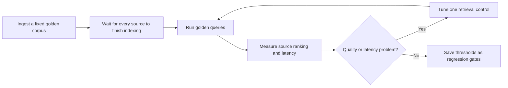
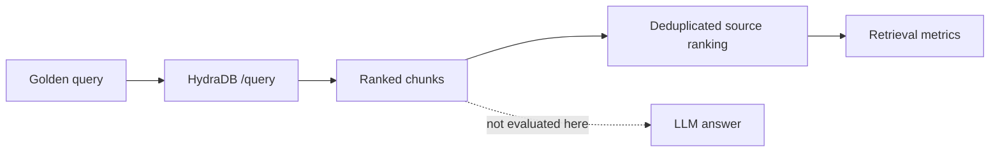
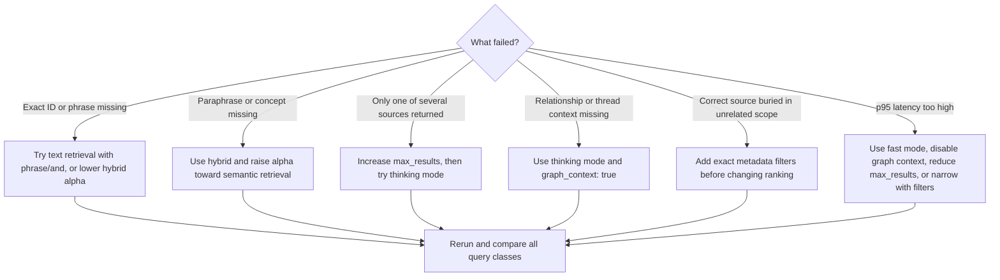

Your content finished indexing and `/query` returns chunks. But are the **right sources** near the top, is the result stable across retrieval settings, and did the latest change make it better?

This lab turns that ambiguous moment into a repeatable workflow:



You will use the repository's dependency-free Node.js evaluator to:

- validate a versioned fixture completely offline
- seed a named, isolated sandbox with fictional sources and fixed IDs
- compare lexical, fast hybrid, and thinking hybrid profiles
- calculate Hit@K, source Recall@K, MRR@K, and p50/p95 latency
- fail CI when a known-good profile regresses

<Info>
  This is a **runtime retrieval evaluation**: it calls HydraDB `/query` and checks the returned source IDs. It does not score whether documentation explains HydraDB concepts well enough for an agent to generate correct code; that is a separate documentation-understanding problem.
</Info>

## What this lab does and does not measure

The unit under test is retrieval, not answer generation:



That boundary matters. If an expected source is missing, tune ingestion or retrieval. If the source is present but the final answer is wrong, investigate prompt construction, context formatting, and the answer model separately.

## Prerequisites

- Node.js 20 or newer
- a local clone of this documentation repository
- a HydraDB API key for `seed` and `run`
- a **non-production** HydraDB database name that is unique to this experiment

The evaluator uses only Node.js built-ins. It reads credentials from `HYDRA_DB_API_KEY` and optionally reads a controlled API origin from `HYDRA_DB_BASE_URL`. Custom remote origins must use HTTPS; plain HTTP is accepted only for loopback testing. The evaluator never prints the credential.

<Warning>
  Use fictional data and an explicitly named sandbox database dedicated to this exact fixture version. `seed` creates or reuses that database and upserts the fixture's fixed source IDs, but it does not remove unrelated or obsolete sources. Use a new versioned database when corpus members change. No command deletes data or a database automatically; you remain responsible for any later cleanup.
</Warning>

Run every command below from the repository root.

## 1. Design a golden fixture

A golden fixture contains four things:

| Part | Purpose | Design rule |
|---|---|---|
| Sources | A small, known corpus | Use stable IDs and enough overlap to make ranking non-trivial |
| Queries | Representative retrieval intents | Include literal, semantic, and multi-source questions |
| Expected source IDs | Ground truth for each query | Label sources, not answer strings or chunk UUIDs |
| Profiles and gates | Search configurations to compare | Name production bundles clearly, then add controlled one-variable variants for causal tuning |

The included fixture is versioned at:

```text
scripts/fixtures/retrieval-quality-v1.json
```

### Golden-corpus rules

Keep the first fixture small enough to inspect by hand. Each source should be fictional, self-contained, and assigned a stable ID. Add deliberate contrasts: two sources can share vocabulary while only one contains the literal identifier; two others can each contain half of a multi-source answer.

Avoid production exports and customer data. A benchmark fixture becomes a long-lived artifact in source control, so sanitized metadata is not enough if the underlying text is sensitive.

### Golden-query rules

Use a mix of query kinds:

- **Literal**: an exact identifier, error code, product name, or phrase. This catches lexical regressions.
- **Semantic**: a paraphrase that does not repeat the source wording. This tests semantic retrieval.
- **Multi-source**: a question whose context must come from two or more sources. This exposes result-count, ranking, and graph-mode tradeoffs.

For each query, list every source needed to supply the retrieval context in `expected_source_ids`. Do not mark merely related sources as expected; loose labels make a regression look like success.

<Tip>
  Start with 10 to 30 reviewed queries drawn from real retrieval intents. Add a golden query when you fix a production retrieval failure. A small, trusted set is more useful than hundreds of weakly labeled examples.
</Tip>

### Validate before using the API

```bash
node scripts/retrieval-quality-eval.mjs validate \
  --fixture scripts/fixtures/retrieval-quality-v1.json
```

`validate` is fully offline. It does not require an API key, create a database, ingest content, query HydraDB, or delete anything. It fails on problems such as duplicate IDs, an expected source that is not in the corpus, an invalid profile, a multi-source query with fewer than two expected sources, or an invalid gate range.

## 2. Seed one named sandbox

Choose a database name that is clearly disposable and unique. Lowercase letters, numbers, and underscores are the most portable choice.

```bash
export HYDRA_DB_API_KEY="your_runtime_only_sandbox_key"
export LAB_DATABASE="rql_sagar_20260720"

node scripts/retrieval-quality-eval.mjs seed \
  --fixture scripts/fixtures/retrieval-quality-v1.json \
  --database "$LAB_DATABASE"
```

`seed` is the only mutating command. It performs the complete readiness sequence:

1. Create the explicitly named database, or reuse it only when HydraDB reports that it already exists.
2. Poll database status until its scheduler, graph service, and knowledge/memory vector stores are ready.
3. Ingest the fixture sources with their fixed IDs and `upsert` enabled.
4. Verify that ingestion returned exactly one successful result for every expected source ID.
5. Poll every returned ID until its indexing status is `completed`.

Waiting for `completed`, rather than beginning at `graph_creation`, keeps the comparison fair for profiles that use thinking mode and graph context.

For a larger corpus or a slower sandbox, set bounded polling controls explicitly:

```bash
node scripts/retrieval-quality-eval.mjs seed \
  --fixture scripts/fixtures/retrieval-quality-v1.json \
  --database "$LAB_DATABASE" \
  --timeout-ms 900000 \
  --poll-interval-ms 5000 \
  --request-timeout-ms 30000
```

These timeout controls have different scopes. `--timeout-ms` is the polling budget for each database-readiness and indexing phase, checked between bounded status requests. `--request-timeout-ms` bounds each individual HTTP attempt and defaults to 30 seconds. A status request and its bounded retries can finish after the polling budget is reached, so set the request timeout within the wall-clock budget you need. The evaluator stops with an error if a status entry is missing, duplicated, unknown, failed, or still incomplete when the next polling deadline check runs. It does not silently evaluate a partially indexed corpus.

## 3. Run the profile comparison

The included hybrid profiles have illustrative starter gates. The evaluator still prints the complete report when a gate fails, then exits with code `2`; use that first result to calibrate thresholds for your environment.

```bash
node scripts/retrieval-quality-eval.mjs run \
  --fixture scripts/fixtures/retrieval-quality-v1.json \
  --database "$LAB_DATABASE" \
  --format markdown
```

`run` queries the existing database. It never creates a database, ingests content, upserts data, or deletes anything. The Markdown report is useful for local review and pull request evidence.

For machine-readable output:

```bash
node scripts/retrieval-quality-eval.mjs run \
  --fixture scripts/fixtures/retrieval-quality-v1.json \
  --database "$LAB_DATABASE" \
  --request-timeout-ms 120000 \
  --format json
```

Use a larger per-attempt timeout when a valid thinking-mode query can take longer than the 30-second default. The JSON report records the effective value as `execution.request_timeout_ms`, so a saved comparison remains reproducible. This setting aborts an individual HTTP attempt; it is separate from `max_p95_latency_ms`, which evaluates the observed end-to-end query latency.

JSON output is stable: fixtures, profiles, queries, keys, and the effective thresholds enforced for each profile are emitted in deterministic order so a CI system can store or compare reports without formatting churn. Progress and errors go to standard error; standard output contains only the selected report.

Run only selected profiles by repeating `--profile`:

```bash
node scripts/retrieval-quality-eval.mjs run \
  --fixture scripts/fixtures/retrieval-quality-v1.json \
  --database "$LAB_DATABASE" \
  --profile text \
  --profile hybrid-fast \
  --format markdown
```

## 4. Read the metrics correctly

HydraDB returns ranked **chunks**, but the golden labels identify **sources**. The evaluator converts the chunk list into a source ranking by keeping the first occurrence of each `chunk.id`. Later chunks from the same source do not create extra ranks or inflate recall.

For a query with expected source set `E` and the first `K` unique returned source IDs `Rₖ`:

| Metric | Calculation | What it answers |
|---|---|---|
| Hit@K | `1` when `E ∩ Rₖ` is non-empty; otherwise `0` | Did retrieval surface at least one useful source? |
| Source Recall@K | `|E ∩ Rₖ| / |E|` | How much of the required source set was retrieved? |
| MRR@K | Reciprocal rank of the first expected source, or `0` | How early did the first useful source appear? |
| p50 latency | Nearest-rank 50th-percentile end-to-end `/query` duration | What does a typical query cost? |
| p95 latency | 95th-percentile end-to-end `/query` duration | What does the slow tail cost? |

The quality metrics are calculated per query and macro-averaged for each profile, so a query that expects three sources does not outweigh a query that expects one. Latency uses nearest-rank percentiles over the observed end-to-end request durations.

### Why all three quality metrics?

A profile can have perfect Hit@K and still be weak:

- If one of three required sources appears, Hit@K is `1` but source Recall@K is only `0.33`.
- If the expected source first appears at rank five, Hit@K may pass while MRR@K reveals poor ordering.
- A fast profile can match quality averages while having an unacceptable p95 tail.

Do not compare raw `relevancy_score` values across profiles as if they were calibrated probabilities. Compare source ranks against the same golden labels instead.

## 5. Compare retrieval profiles

The included profiles represent three common production bundles:

| Profile | Main behavior | Best diagnostic use |
|---|---|---|
| `text` | BM25 text retrieval with an explicit text operator | Exact phrases, IDs, codes, and keyword-heavy queries |
| `hybrid-fast` | Semantic + BM25 retrieval in `fast` mode | Latency-sensitive general retrieval |
| `hybrid-thinking` | Hybrid retrieval with query expansion, reranking, and graph context | Ambiguous, relational, or multi-source questions |

All three profiles declare `query_apps: true` because the fictional corpus uses the app-source shape. That flag enables the app-aware lane for the two hybrid profiles; it does not apply to `query_by: "text"`, which searches the indexed app text with BM25. The text profile intentionally omits `mode`: mode routing applies only to hybrid retrieval and is ignored for text, so `graph_context: false` remains the text request's declared graph control. Treat `text` versus hybrid as a bundle comparison. To attribute a change to one control, duplicate a profile and change only `alpha`, `mode`, `graph_context`, filters, or result count.

Compare the per-query rows before the aggregate. An aggregate regression tells you **that** quality changed; the failed query kind tells you **which control** to try.

## 6. Tune by symptom

Use this decision tree after a query fails. Change one control, rerun the same fixture, and keep the change only if the target metric improves without violating latency or another query class.



| Symptom | First change | Why | Watch for |
|---|---|---|---|
| Literal query misses a known code or phrase | Use `query_by: "text"`; choose `phrase` or `and` when appropriate | Removes semantic drift and requires lexical evidence | Synonyms and paraphrases may stop matching |
| Hybrid retrieval favors broad semantic matches over exact wording | Lower numeric `alpha` toward `0` | Gives BM25 more weight | Semantic-query Recall@K can fall |
| Semantic paraphrases miss | Raise numeric `alpha` toward `1` | Gives dense semantic retrieval more weight | Literal identifiers can move down |
| Multi-source Recall@K is low | Increase `max_results` before changing the model | More unique sources can enter the evaluated top K | Extra chunks increase latency and downstream tokens |
| The right source appears but is ranked late | Try `mode: "thinking"` | Query expansion and reranking can improve MRR | p50 and p95 generally increase |
| A relationship, thread, or connected fact is absent | Use `mode: "thinking"` with `graph_context: true` | Enables the richer graph-aware path | Wait for `completed` indexing and watch latency |
| Results come from the wrong team, product, or status | Add exact `metadata_filters` using declared match-enabled metadata | Narrows the candidate set deterministically | A wrong key or scope can produce zero results |
| p95 is over budget | Use `fast`, set `graph_context: false`, lower `max_results`, or apply a valid filter | Reduces retrieval work or candidate volume | Recheck multi-source Recall@K and MRR@K |

Two controls are easy to confuse:

- **`max_results`** controls how many chunks HydraDB may return. The fixture's **K** controls how deep the evaluator scores. A profile must request at least K results, but requesting far more than K does not directly improve a metric unless it changes the ordering within the first K unique sources.
- **`metadata_filters`** encode known boundaries such as workspace, region, or document status. They are not relevance hints. Use the same `collection` on seed and run, and do not replace a true isolation boundary with metadata.

## 7. Turn a good profile into a regression gate

Fixture gates are optional and profile-specific. The included hybrid gates are active starter examples, so an initial `run` can produce a complete report and exit `2`. Do not treat those example values as a production SLO. After repeated, reviewed measurements in your environment, replace them with floors below normal quality and a latency ceiling above normal variance. Do not set a gate equal to a single best run.

You can also apply temporary command-line gates to every selected profile:

```bash
node scripts/retrieval-quality-eval.mjs run \
  --fixture scripts/fixtures/retrieval-quality-v1.json \
  --database "$LAB_DATABASE" \
  --profile hybrid-fast \
  --min-hit-at-k 0.90 \
  --min-recall-at-k 0.80 \
  --min-mrr-at-k 0.70 \
  --max-p95-latency-ms 3000 \
  --format json
```

Exit codes are designed for automation:

| Exit code | Meaning |
|---:|---|
| `0` | Validation, execution, and all applicable gates passed |
| `1` | Fixture, API, indexing, timeout, envelope, or empty-result failure |
| `2` | Evaluation completed, but at least one quality or latency gate failed |

An empty result is an execution failure rather than a row of zeroes. It usually indicates a bad scope, incomplete corpus, filter mismatch, or malformed response and should not be hidden inside an average.

### Offline CI for every pull request

The repository CI runs the evaluator's built-in tests without credentials or network access:

```yaml
- name: Test retrieval quality evaluator
  run: node --test scripts/retrieval-quality-eval.test.mjs
```

You can also validate a changed fixture offline:

```bash
node scripts/retrieval-quality-eval.mjs validate \
  --fixture scripts/fixtures/retrieval-quality-v1.json
```

### Optional runtime gate

Run the retrieval gate against a pre-seeded, non-production database in a protected or scheduled workflow. Store `HYDRA_DB_API_KEY` in your CI secret manager; never place it in the fixture, workflow file, command output, or pull request.

```yaml
- name: Gate HydraDB retrieval quality
  env:
    HYDRA_DB_API_KEY: ${{ secrets.HYDRA_DB_API_KEY }}
  run: >-
    node scripts/retrieval-quality-eval.mjs run
    --fixture scripts/fixtures/retrieval-quality-v1.json
    --database retrieval_quality_ci_v1
    --profile hybrid-fast
    --request-timeout-ms 120000
    --format json
```

Do not run `seed` in a pull request from an untrusted fork. Seed the sandbox deliberately from a trusted environment, review the fixed IDs, and let CI use only the read-only `run` workflow.

## Failure and retry behavior

The evaluator fails closed on malformed success envelopes, API errors, missing status entries, failed indexing, timeouts, empty result sets, and unmet gates. It retries only read-only status and query requests on bounded transient failures such as rate limiting or temporary service errors. `--request-timeout-ms` applies to each attempt, so a retry receives a fresh bounded timeout; measured query latency includes all attempts and retry backoff.

Database creation and ingestion are never retried automatically. A network failure after a mutation can make the result ambiguous; inspect the named sandbox and rerun `seed` deliberately instead of allowing an evaluator to guess.

## Limitations

- Golden labels encode the judgments of their reviewers. Review them when the corpus or user intent changes.
- This lab measures source retrieval, not chunk-level passage completeness, factual answer correctness, citation rendering, or LLM behavior.
- One request per golden query is useful for regression detection but does not characterize high-confidence latency. Run repeated trials in your performance environment before setting a production SLO.
- p50 and p95 are sensitive to network path, region, service load, cold starts, and fixture size. Compare runs made under similar conditions.
- Multi-source Recall@K proves that expected sources were present, not that an answer model combined them correctly.
- A small fictional corpus catches pipeline regressions, but it does not replace a private, reviewed benchmark that represents your production query distribution.

## The repeatable loop

When retrieval looks wrong, avoid tuning from one anecdote:

1. Add the failure as a reviewed golden query.
2. Validate the fixture offline.
3. Seed or update one named sandbox and wait for every fixed ID to reach `completed`.
4. Run all profiles and inspect the failed query kind.
5. Change one of `alpha`, `mode`, `graph_context`, filters, or result count.
6. Rerun the full fixture to expose tradeoffs.
7. Promote the proven profile and add a conservative CI gate.

That closes the developer journey: ingest, wait, query, notice a problem, measure it, tune it, prove the improvement, and keep it from returning.
