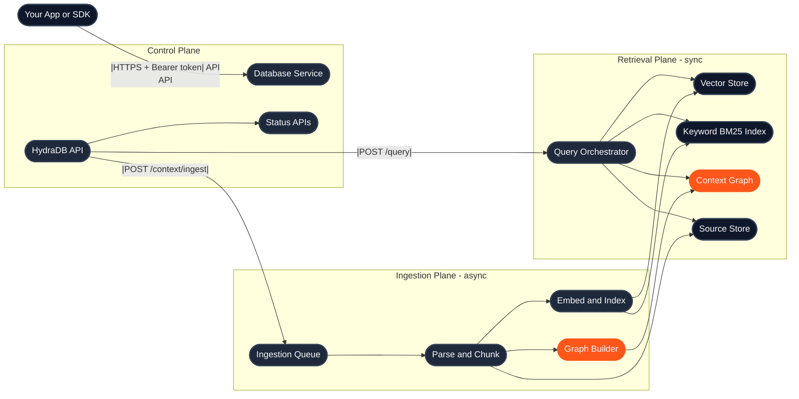
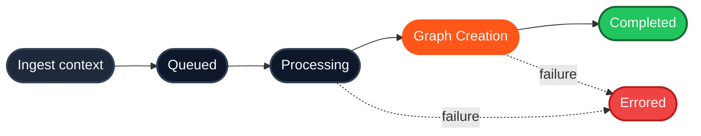

HydraDB is context infrastructure for AI applications. From the outside, you call a small set of HTTP APIs. Inside, HydraDB orchestrates database isolation, asynchronous ingestion, indexing, graph construction, and hybrid retrieval, so your application can store context once and query the right pieces later. This page walks through what happens behind the scenes, and points at the endpoints and concepts you'll touch along the way.

---

## The big picture

HydraDB organizes its work into three logical planes. You interact only with the API; everything else stays behind the service boundary.

| Plane | What it handles | Endpoints |
|---|---|---|
| **Control** | API authentication, database lifecycle, provisioning, and status | [`/databases`](/api-reference/v2/endpoint/tenants-overview) family |
| **Ingestion** | Context writes, connector syncs, parsing, chunking, embedding, and graph construction | [`POST /context/ingest`](/api-reference/v2/endpoint/ingest-context), [`GET /context/status`](/api-reference/v2/endpoint/source-status) |
| **Retrieval** | Hybrid query, attribute filtering, graph context, keyword (BM25) search, and response shaping | [`POST /query`](/api-reference/v2/endpoint/query), [`GET /context/relations`](/api-reference/v2/endpoint/source-relations) |

Two details to notice in the diagram:

- **One ingest endpoint, one database of context.** [`POST /context/ingest`](/api-reference/v2/endpoint/ingest-context) takes a `context` list of text or conversations and writes them to the database. [Connectors](/essentials/v2/connectors) sync provider content into the same database. Collections partition it per user, team or project.
- **One query endpoint, every retrieval method.** [`POST /query`](/api-reference/v2/endpoint/query) is the only retrieval entry point. `collections` decides where to look and `query_by` how to match; see [Query](/essentials/v2/query) for the full picture.

---

## Ingestion lifecycle

Ingestion is asynchronous. A successful upload means HydraDB accepted the work and queued it; it does not mean the content is immediately queryable. Each source moves through a status pipeline before it becomes fully queryable:

Poll [`GET /context/status`](/api-reference/v2/endpoint/source-status) with the returned `id` to follow each context through the pipeline. Two practical notes:

- **`graph_creation` is already queryable.** Chunks become retrievable as soon as embedding finishes; you only need to wait for `completed` when you specifically need full graph context (`graph_context: true` on query).
- **Failures surface with detail.** An `errored` status comes back with an `error_code` and `error_message` so you can distinguish parse failures from validation problems from infrastructure issues.

The full status table and polling pattern lives at [Ingestion Status](/api-reference/v2/endpoint/source-status).

---

## From upload to query

Here's the canonical end-to-end flow. Each step links to the endpoint that owns it:

1. **Create a database** with [`POST /databases`](/api-reference/v2/endpoint/create-tenant): your isolated workspace, optionally with a [metadata schema](/essentials/v2/attributes) declared up front.
2. **Wait for provisioning** by polling [`GET /databases/status`](/api-reference/v2/endpoint/tenant-status) until `infra.ready_for_ingestion` is `true`.
3. **Ingest content** with [`POST /context/ingest`](/api-reference/v2/endpoint/ingest-context): a `context` list of text or conversations, into a shared collection or a person's own. See [Ingest context](/essentials/v2/ingest) for every field.
4. **Watch indexing finish** by polling [`GET /context/status`](/api-reference/v2/endpoint/source-status) until each `id` reaches `completed` (or `graph_creation` if you don't need graph traversal).
5. **Query** with [`POST /query`](/api-reference/v2/endpoint/query). Name the collections to search, weighted if you like, and pair with `query_by: "hybrid"` (default) or `"text"` (BM25, with `operator`). Inject the returned `llm_prompt` into your model call. The mechanics live in [Query](/essentials/v2/query).

That's the whole loop. Most of what changes between integrations is *what* you put in the attributes, *which* collections you query, and *which* `query_by` and `mode` combination fits the task.

---

## Database isolation

A `database` (formerly `tenant_id`, still accepted as a deprecated alias) is the top-level isolation boundary: no database can read another database's data. Within a database, `collection` (formerly `sub_tenant_id`) carves out logical partitions: users, teams, workspaces, or projects. Omitting `collection` on any call resolves to the database's default collection, which is created on the first write; no collection exists until then.

The right mapping depends on your product shape:

| Product shape | Database pattern | Collection pattern |
|---|---|---|
| **B2B SaaS** | One database per customer organization | One collection per team, workspace, or end user |
| **B2C app** | One database for your application | One collection per end user |
| **Internal tools** | One database per company or environment | One collection per department or project |

The deeper trade-offs (when to spin up a new database vs. a new collection, how scoping interacts with [attribute filters](/essentials/v2/attributes), and how collections keep each person's context apart from shared context) are covered in [Databases and collections](/essentials/v2/databases-and-collections).

---

## Retrieval pipeline

[`POST /query`](/api-reference/v2/endpoint/query) is the single retrieval endpoint. Two parameters describe the request: `collections` picks where to look, `query_by` picks the method. From there, every call goes through the same pipeline:

1. **Authenticate and scope.** Validate `database`, resolve the database, and apply the requested `collection`.
2. **Filter before ranking.** Apply `attributes` to narrow the candidate set (see [Attributes](/essentials/v2/attributes)).
3. **Retrieve.** Run hybrid retrieval over the semantic vector store and the keyword (BM25) index, or BM25-only retrieval when `query_by: "text"`.
4. **Blend.** Use `alpha` to weight semantic vs. keyword (BM25) contributions (`1.0` = pure semantic, `0.0` = pure BM25).
5. **Enrich.** With `graph_context` on (the default), traverse the [context graph](/essentials/v2/context-graphs) and attach related paths. When `mode: "thinking"`, expand the query, rerank, and pull in the relations declared at ingest.
6. **Shape the response.** Return ranked `chunks`, graph paths in `graph`, declared links in `forceful_relations`, and `llm_prompt`, the same context as one prompt-ready string with citation labels.

The response is *retrieved context*, not a final LLM answer. You inject `llm_prompt` into your own agent or model prompt; see [How to Use API Results](/essentials/v2/api-results).

---

## Key controls

A short cheat sheet for the parameters you'll touch most often, and where each one lives:

| Field | Used in | What it does |
|---|---|---|
| `database` | Every call | Selects the isolated workspace. Required on every request. |
| `collection` | Ingest + query | Narrows data to a user, team, or workspace inside the database. Use a single collection for writes and single-scope queries. |
| `collections` | Query | Preferred query-time collection selector. Use a one-element list, a multi-scope list with equal weights, or a weighted object for fanout ranking. |
| `attributes` | [Ingest](/api-reference/v2/endpoint/ingest-context) | Declared, filterable fields on a context. Must match the [database metadata schema](/essentials/v2/attributes) declared at database creation. |
| `custom_attributes` | [Ingest](/api-reference/v2/endpoint/ingest-context) | Free-form fields per context. Stored with the context; not filterable with `attributes`. |
| `attributes` | [Query](/api-reference/v2/endpoint/query) | Deterministic narrowing with operators (`$eq`, `$in`, `$gte`, `$and`, ...) on declared attributes. |
| `alpha` | [Query](/api-reference/v2/endpoint/query) | Blends semantic vs. keyword (BM25) scores in `query_by: "hybrid"`. |
| `graph_context` | [Query](/api-reference/v2/endpoint/query) | On by default: returns relation paths from the [context graph](/essentials/v2/context-graphs) in `graph[]`. |
| `mode` | [Query](/api-reference/v2/endpoint/query) | `"fast"` for low-latency single-pass retrieval; `"thinking"` for multi-query expansion and reranking. |

---

## Operational mental model

HydraDB separates **write-time** work from **query-time** work. Uploads return quickly and run in the background; query stays synchronous and reads only indexed content. When results look incomplete, walk the chain in order:

1. **Status first.** Did every `id` reach `completed` (or at least `graph_creation`)? Check [Ingestion Status](/api-reference/v2/endpoint/source-status).
2. **Scope second.** Is the `database` correct? Did you write under one `collection` and read under another? See [Databases and collections](/essentials/v2/databases-and-collections).
3. **Filters third.** Is the key declared? `attributes` filters only match fields declared in `database_metadata_schema` and sent as `attributes` at ingest; `custom_attributes` cannot be filtered with `attributes`. See [Attributes](/essentials/v2/attributes).

---

## Related

- [Core Concepts](/get-started/v2/core-concepts): the primitives, from databases and collections to the context graph
- [Quickstart](/get-started/v2/quickstart): build your first integration in five minutes
- [Ingest context](/essentials/v2/ingest): one database of context, text or conversations
- [Query](/essentials/v2/query): deep dive on `POST /query`
- [Databases and collections](/essentials/v2/databases-and-collections): scoping patterns and pitfalls
- [Context Graphs](/essentials/v2/context-graphs): how the graph layer enriches retrieval
- [Attributes](/essentials/v2/attributes): designing filterable fields
