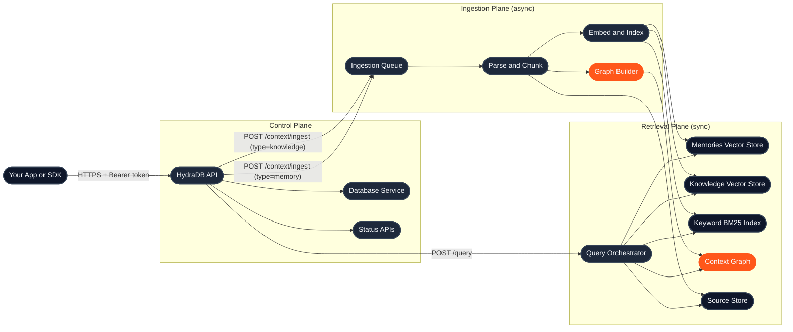
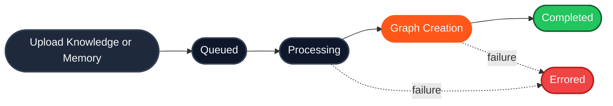

From the outside, HydraDB is a handful of HTTP endpoints. Behind them, it isolates databases, ingests content in the background, builds a context graph, and runs hybrid retrieval. This page shows how those pieces fit together, and what to check when a query comes back empty.

---

## The big picture

HydraDB organizes its work into three logical planes. You interact only with the API; everything else stays behind the service boundary.

| Plane | What it handles | Endpoints |
|---|---|---|
| **Control** | API authentication, database lifecycle, provisioning, and status | [`/databases`](/api-reference/v2/endpoint/tenants-overview) family |
| **Ingestion** | File and app-source uploads, memory writes, parsing, chunking, embedding, and graph construction | [`POST /context/ingest`](/api-reference/v2/endpoint/ingest-context), [`GET /context/status`](/api-reference/v2/endpoint/source-status) |
| **Retrieval** | Hybrid query, metadata filtering, graph context, BM25 keyword search, and response shaping | [`POST /query`](/api-reference/v2/endpoint/query), [`GET /context/relations`](/api-reference/v2/endpoint/source-relations) |

```mermaid
flowchart LR
  Client([Your App or SDK])
  style Client fill:#0f172a,stroke:#334155,stroke-width:2px,color:#f8fafc,stroke-linecap:round

  subgraph Control[Control Plane]
    direction LR
    API([HydraDB API])
    Databases([Database Service])
    Status([Status APIs])
    style API fill:#1e293b,stroke:#334155,stroke-width:2px,color:#f8fafc,stroke-linecap:round
    style Databases fill:#1e293b,stroke:#334155,stroke-width:2px,color:#f8fafc,stroke-linecap:round
    style Status fill:#1e293b,stroke:#334155,stroke-width:2px,color:#f8fafc,stroke-linecap:round
  end

  subgraph Ingestion["Ingestion Plane (async)"]
    direction LR
    Queue([Ingestion Queue])
    Parser([Parse and Chunk])
    Embed([Embed and Index])
    Graph([Graph Builder])
    style Queue fill:#1e293b,stroke:#334155,stroke-width:2px,color:#f8fafc,stroke-linecap:round
    style Parser fill:#1e293b,stroke:#334155,stroke-width:2px,color:#f8fafc,stroke-linecap:round
    style Embed fill:#1e293b,stroke:#334155,stroke-width:2px,color:#f8fafc,stroke-linecap:round
    style Graph fill:#FF571A,stroke:#FF571A,stroke-width:2px,color:#f8fafc,stroke-linecap:round
  end

  subgraph Retrieval["Retrieval Plane (sync)"]
    direction LR
    Query([Query Orchestrator])
    MemVec([Memories Vector Store])
    KnowVec([Knowledge Vector Store])
    KeywordBM25([Keyword BM25 Index])
    ContextGraph([Context Graph])
    Sources([Source Store])
    style Query fill:#1e293b,stroke:#334155,stroke-width:2px,color:#f8fafc,stroke-linecap:round
    style MemVec fill:#0f172a,stroke:#334155,stroke-width:2px,color:#f8fafc,stroke-linecap:round
    style KnowVec fill:#0f172a,stroke:#334155,stroke-width:2px,color:#f8fafc,stroke-linecap:round
    style KeywordBM25 fill:#0f172a,stroke:#334155,stroke-width:2px,color:#f8fafc,stroke-linecap:round
    style ContextGraph fill:#FF571A,stroke:#FF571A,stroke-width:2px,color:#f8fafc,stroke-linecap:round
    style Sources fill:#0f172a,stroke:#334155,stroke-width:2px,color:#f8fafc,stroke-linecap:round
  end

  Client -->|HTTPS + Bearer token| API
  API --> Databases
  API --> Status
  API -->|"POST /context/ingest (type=knowledge)"| Queue
  API -->|"POST /context/ingest (type=memory)"| Queue
  Queue --> Parser
  Parser --> Sources
  Parser --> Embed
  Embed --> MemVec
  Embed --> KnowVec
  Embed --> KeywordBM25
  Parser --> Graph
  Graph --> ContextGraph

  API -->|POST /query| Query
  Query --> MemVec
  Query --> KnowVec
  Query --> KeywordBM25
  Query --> ContextGraph
  Query --> Sources
```

Two details to notice in the diagram:

- **Two vector stores, one ingest endpoint:** [`POST /context/ingest`](/api-reference/v2/endpoint/ingest-context) routes to the [Knowledge](/essentials/v2/knowledge) store when `type=knowledge` and to the [Memories](/essentials/v2/memories) store when `type=memory`. Same endpoint, different bucket.
- **One query endpoint, every retrieval method:** [`POST /query`](/api-reference/v2/endpoint/query) is the only retrieval entry point. The `type` and `query_by` parameters decide what gets queried and how. See [Query](/essentials/v2/query) for the full picture.

---

## Ingestion lifecycle

Ingestion is asynchronous. A successful upload means HydraDB accepted the work and queued it; it does not mean the content is immediately queryable. Each source moves through a status pipeline before it becomes fully queryable:

```mermaid
flowchart LR
  Upload([Upload Knowledge or Memory])
  Queued([Queued])
  Processing([Processing])
  Graph([Graph Creation])
  Completed([Completed])
  Errored([Errored])

  Upload --> Queued
  Queued --> Processing
  Processing --> Graph
  Graph --> Completed
  Processing -.failure.-> Errored
  Graph -.failure.-> Errored

  style Upload fill:#1e293b,stroke:#334155,stroke-width:2px,color:#f8fafc,stroke-linecap:round
  style Queued fill:#0f172a,stroke:#334155,stroke-width:2px,color:#f8fafc,stroke-linecap:round
  style Processing fill:#0f172a,stroke:#334155,stroke-width:2px,color:#f8fafc,stroke-linecap:round
  style Graph fill:#FF571A,stroke:#FF571A,stroke-width:2.5px,color:#f8fafc,stroke-linecap:round
  style Completed fill:#22c55e,stroke:#166534,stroke-width:2px,color:#f8fafc,stroke-linecap:round
  style Errored fill:#ef4444,stroke:#b91c1c,stroke-width:2px,color:#f8fafc,stroke-linecap:round
```

Poll [`GET /context/status`](/api-reference/v2/endpoint/source-status) with the returned `id` to follow each item through the pipeline. Two practical notes:

- **`graph_creation` is already queryable:** Chunks become retrievable as soon as embedding finishes; you only need to wait for `completed` when you specifically need full graph context (`graph_context: true` on query).
- **Failures surface with detail:** An `errored` status comes back with an `error_code` and `error_message` so you can distinguish parse failures from validation problems from infrastructure issues.

The full status table and polling pattern lives at [Ingestion Status](/api-reference/v2/endpoint/source-status).

---

## From upload to query

Here's the canonical end-to-end flow. Each step links to the endpoint that owns it:

1. **Create a database** with [`POST /databases`](/api-reference/v2/endpoint/create-tenant) (your isolated workspace, optionally with a [metadata schema](/essentials/v2/metadata) declared up front).
2. **Wait for provisioning** by polling [`GET /databases/status`](/api-reference/v2/endpoint/tenant-status) until `infra.ready_for_ingestion` is `true`, which means `scheduler_status`, `graph_status`, `vectorstore_status.knowledge`, and `vectorstore_status.memories` are all `true`.
3. **Ingest content** with [`POST /context/ingest`](/api-reference/v2/endpoint/ingest-context): pick `type=knowledge` for shared documents or `type=memory` for per-user context. See [Knowledge](/essentials/v2/knowledge) and [Memories](/essentials/v2/memories) for the content models.
4. **Watch indexing finish** by polling [`GET /context/status`](/api-reference/v2/endpoint/source-status) until each `id` reaches `completed` (or `graph_creation` if you don't need graph traversal).
5. **Query** with [`POST /query`](/api-reference/v2/endpoint/query). Pick `type: "knowledge"` for Knowledge, `type: "memory"` for Memories, or `type: "all"` for both. Pair with `query_by: "hybrid"` (default) or `"text"` (BM25, with `operator`). The mechanics live in [Query](/essentials/v2/query).

---

## Database isolation

A `database` (formerly `tenant_id`, still accepted as a deprecated alias) is the top-level isolation boundary: no database can read another database's data. Within a database, `collection` (formerly `sub_tenant_id`) carves out logical partitions: users, teams, workspaces, or projects. Omitting `collection` on any call resolves to the database's default collection, which is created on the first write; no collection exists until then.

The right mapping depends on your product shape:

| Product shape | Database pattern | Collection pattern |
|---|---|---|
| **B2B SaaS** | One database per customer organization | One collection per team, workspace, or end user |
| **B2C app** | One database for your application | One collection per end user |
| **Internal tools** | One database per company or environment | One collection per department or project |

The deeper trade-offs (when to spin up a new database vs. a new collection, how scoping interacts with [metadata filters](/essentials/v2/metadata), and how this affects [Memories](/essentials/v2/memories)) are covered in [Multi-Tenant Support](/essentials/v2/multi-tenant).

---

## Retrieval pipeline

[`POST /query`](/api-reference/v2/endpoint/query) is the single retrieval endpoint. Two parameters describe the request: `type` picks the store, `query_by` picks the method. From there, every call goes through the same pipeline:

1. **Authenticate and scope:** Validate `database`, resolve the database, and apply the requested `collection` or `collections` (the default collection when neither is sent).
2. **Filter before ranking:** Apply `metadata_filters` to narrow the candidate set (see [Metadata](/essentials/v2/metadata)).
3. **Retrieve:** Run hybrid retrieval over the semantic vector store and the BM25 keyword index, or BM25-only retrieval when `query_by: "text"`.
4. **Blend:** Use `alpha` to weight semantic vs. BM25 keyword contributions (`1.0` = pure semantic, `0.0` = pure BM25).
5. **Enrich:** When `graph_context: true` (the default), traverse the [context graph](/essentials/v2/context-graphs) and attach related paths; thinking mode always does, so `graph_context: false` takes effect only in fast mode. When `mode: "thinking"`, expand the query, rerank, and pull in author-declared forceful relations. `mode: "auto"` (the default) picks fast or thinking per query.
6. **Shape the response:** Return ranked `chunks`, deduplicated `sources`, optional `graph_context`, and any `additional_context`.

The response is *retrieved context*, not a final LLM answer. You pass the chunks (and any graph context) into your own agent or model prompt. See [How to Use API Results](/essentials/v2/api-results) for the helper that formats it.

---

## Key controls

A short cheat sheet for the parameters you'll touch most often, and where each one lives:

| Field | Used in | What it does |
|---|---|---|
| `database` | Every call | Selects the isolated workspace. Required on every request. |
| `collection` | Ingest + query | Narrows data to a user, team, or workspace inside the database. Use a single collection for writes and single-scope queries. |
| `collections` | Query | Preferred query-time collection selector. Use a single-item list, a multi-scope list with equal weights, or a weighted object for fanout ranking. |
| `metadata` | [Ingest](/api-reference/v2/endpoint/ingest-context) | Schema-aligned metadata indexed at ingest. Must match the [database metadata schema](/essentials/v2/metadata) declared at database creation (fields can be added later). |
| `additional_metadata` | [Ingest](/api-reference/v2/endpoint/ingest-context) | Free-form per-document metadata. Stored alongside the source; filterable at query via `metadata_filters.additional_metadata`. |
| `metadata_filters` | [Query](/api-reference/v2/endpoint/query) | Deterministic narrowing before ranking. Top-level keys match `metadata`; nested `additional_metadata` filters free-form fields. |
| `alpha` | [Query](/api-reference/v2/endpoint/query) | Blends semantic vs. BM25 keyword scores in `query_by: "hybrid"`. |
| `graph_context` | [Query](/api-reference/v2/endpoint/query) | When `true` (the default), attaches the relevant slice of the [context graph](/essentials/v2/context-graphs) to the response. `false` takes effect only in fast mode. |
| `mode` | [Query](/api-reference/v2/endpoint/query) | `"fast"` for low-latency single-pass retrieval; `"thinking"` for multi-query expansion and reranking; `"auto"` (the default) picks one per query. |

---

## Operational mental model

HydraDB separates **write-time** work from **query-time** work. Uploads return quickly and run in the background; query stays synchronous and reads only indexed content. When results look incomplete, walk the chain in order:

1. **Status first:** Did every `id` reach `completed` (or at least `graph_creation`)? Check [Ingestion Status](/api-reference/v2/endpoint/source-status).
2. **Scope second:** Is the `database` correct? Did you write under one `collection` and read under another? See [Multi-Tenant](/essentials/v2/multi-tenant).
3. **Filters third:** Are you using the right namespace? Top-level `metadata_filters` keys match `metadata`; free-form fields belong under `additional_metadata`. For hot top-level filters, declare the field in `database_metadata_schema`. See [Metadata](/essentials/v2/metadata).

---

## Related

- [Core Concepts](/get-started/v2/core-concepts): the five primitives (Knowledge, Memories, Query, Databases, Metadata)
- [Quickstart](/get-started/v2/quickstart): build your first integration in five minutes
- [Knowledge](/essentials/v2/knowledge) and [Memories](/essentials/v2/memories): the two content models
- [Query](/essentials/v2/query): deep dive on `POST /query`
- [Multi-Tenant Support](/essentials/v2/multi-tenant): scoping patterns and pitfalls
- [Context Graphs](/essentials/v2/context-graphs): how the graph layer enriches retrieval
- [Metadata](/essentials/v2/metadata): designing filterable fields
