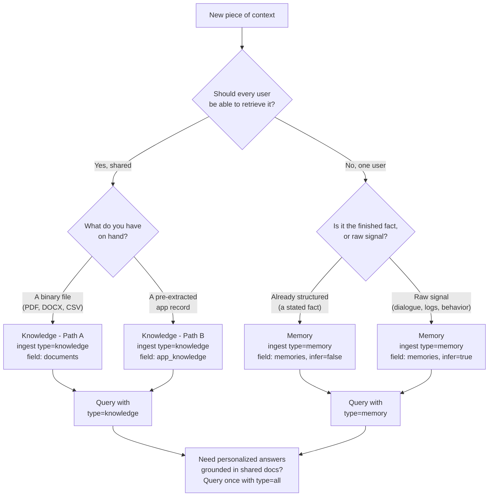

Every HydraDB integration starts with the same fork in the road. You have a piece of context - a Slack thread, a PDF, a user preference, a raw chat log - and four questions to answer before a single line of code:

1. Is this a **[Memory](/essentials/v2/memories)** or **[Knowledge](/essentials/v2/knowledge)**?
2. Should `infer` be `true` or `false`?
3. Which **ingest** field carries it, and which **query** `type` reads it back?
4. How do shared org context and per-user context combine?

The individual pages answer each question in depth. This page is the map that ties them together, so you can go from *"I have this data"* to *"here is the exact call"* in one pass.

---

## The one question that decides everything

Before anything else, ask:

> **Should every user in this database be able to retrieve this?**

That single question splits the entire product into two stores.

<CardGroup cols={2}>
  <Card title="Yes - it's shared" icon="book" href="/essentials/v2/knowledge">
    Store it as **Knowledge**. Documents, policies, wikis, Slack threads, Notion pages - anything reusable across the workspace. Retrieved with `type: "knowledge"`.
  </Card>
  <Card title="No - it's personal" icon="user" href="/essentials/v2/memories">
    Store it as a **Memory**. One user's preferences, traits, history, or facts. Scoped by `collection`. Retrieved with `type: "memory"`.
  </Card>
</CardGroup>

<Info>
  **Both at once?** For a personalized answer grounded in shared documents, you do not pick one - you query both stores in a single call with `type: "all"`. HydraDB merges and re-ranks the results for you. See [combining both stores](#combine-shared-knowledge-with-user-memory) below.
</Info>

---

## The decision tree

Walk it top to bottom. Every leaf lands you on an exact ingest shape and the query `type` that reads it back.



---

## The routing table

The same logic as a lookup. Find the row that matches your data; the columns give you the store, the `infer` value, the ingest field, and the query `type` - the endpoints that belong together, end to end.

| Your data | Store as | Ingest `type` | Ingest field | `infer` | Query `type` |
|---|---|---|---|---|---|
| Product PDF, policy doc, runbook | Knowledge | `knowledge` | `documents` (Path A) | n/a | `knowledge` / `all` |
| Slack thread, Notion page, Gmail message | Knowledge | `knowledge` | `app_knowledge` (Path B) | n/a | `knowledge` / `all` |
| Internal wiki markdown you already have as text | Knowledge | `knowledge` | `documents` or `app_knowledge` | n/a | `knowledge` / `all` |
| "User's plan tier is Pro" (a fact about one user) | Memory | `memory` | `memories` | `false` | `memory` / `all` |
| "I prefer short answers" (stated preference) | Memory | `memory` | `memories` | `false` | `memory` / `all` |
| Raw chat transcript where the preference is implied | Memory | `memory` | `memories` (`user_assistant_pairs`) | `true` | `memory` / `all` |
| Behavior log / UI event stream to derive a trait from | Memory | `memory` | `memories` | `true` | `memory` / `all` |

<Note>
  **`infer` is a Memory-only decision.** Knowledge is always parsed and chunked as-is - there is no `infer` flag on knowledge ingestion. The next section is only about the Memory rows above.
</Note>

---

## infer: true vs infer: false

For **Memories**, `infer` is the one design choice that trips people up. It decides *who does the extraction* - you, or HydraDB.

| | `infer: false` *(default)* | `infer: true` |
|---|---|---|
| **What you send** | The finished memory, already phrased | Raw signal: dialogue, logs, behavior, feedback |
| **What HydraDB does** | Stores and indexes it verbatim | Extracts the underlying preference, trait, or fact |
| **`custom_instructions`** | Ignored | Guides the extraction |
| **Behavior** | Deterministic, faster | Derived, handles messy input |
| **Use when** | You already captured the fact | The useful memory is buried in noise |

### See it side by side

Send the **same raw signal** two ways and you get two very different stored memories:

<Tabs>
  <Tab title="infer: true (extract)">
    ```json
    {
      "text": "User opened the app 14 times this week. Switched to dark mode on day one, briefly toggled to light, then back to dark within minutes. Has not changed it since.",
      "infer": true,
      "custom_instructions": "Focus on display and theme preferences."
    }
    ```
    **Stored memory:** `"User prefers dark mode."` - a clean, queryable preference. A later query like *"what UI settings does this user like?"* returns the trait, not the log.
  </Tab>
  <Tab title="infer: false (verbatim)">
    ```json
    {
      "text": "User opened the app 14 times this week. Switched to dark mode on day one, briefly toggled to light, then back to dark within minutes. Has not changed it since.",
      "infer": false
    }
    ```
    **Stored memory:** the event log, word for word. Useful only if you actually want to retrieve the raw log later - not the preference inside it.
  </Tab>
</Tabs>

<Warning>
  **The most common mistake:** `infer` defaults to `false`. If you send raw conversation or behavior expecting HydraDB to derive a preference and forget to set `infer: true`, it silently stores the raw text instead. No error - just an unhelpful memory. Likewise, `custom_instructions` set with `infer: false` is ignored.
</Warning>

**Rule of thumb:** if the sentence you send *is already the memory you want back*, use `infer: false`. If the memory has to be **derived** from what you send, use `infer: true`.

---

## End to end: both paths in full

Two complete journeys - ingest, then query - so you can see which endpoints pair up. Every call uses `POST /context/ingest` to write and `POST /query` to read. Ingestion is asynchronous, so both paths poll [`GET /context/status`](/api-reference/v2/endpoint/source-status) before querying.

### Path 1 - Shared Knowledge (a policy document)

<Steps>
  <Step title="Ingest as Knowledge">
    ```bash
    curl -X POST 'https://api.hydradb.com/context/ingest' \
      -H "Authorization: Bearer $HYDRA_DB_API_KEY" \
      -H "API-Version: 2" \
      -F "type=knowledge" \
      -F "database=acme_corp" \
      -F "documents=@/path/to/refund-policy.pdf" \
      -F 'document_metadata=[{ "id": "refund_policy_v2", "metadata": { "document_type": "policy" } }]'
    ```
  </Step>
  <Step title="Wait for indexing">
    Poll [`GET /context/status`](/api-reference/v2/endpoint/source-status) with `id=refund_policy_v2` until `indexing_status` reaches `graph_creation` (queryable) or `completed` (full graph traversal).
  </Step>
  <Step title="Query it back">
    ```bash
    curl -X POST 'https://api.hydradb.com/query' \
      -H "Authorization: Bearer $HYDRA_DB_API_KEY" \
      -H "API-Version: 2" \
      -H "Content-Type: application/json" \
      -d '{
        "database": "acme_corp",
        "query": "What is our refund window?",
        "type": "knowledge",
        "query_by": "hybrid",
        "mode": "thinking"
      }'
    ```
  </Step>
</Steps>

### Path 2 - Personal Memory (a preference from a conversation)

<Steps>
  <Step title="Ingest as Memory">
    ```bash
    curl -X POST 'https://api.hydradb.com/context/ingest' \
      -H "Authorization: Bearer $HYDRA_DB_API_KEY" \
      -H "API-Version: 2" \
      -F "type=memory" \
      -F "database=acme_corp" \
      -F "collection=user_john_123" \
      -F 'memories=[{ "user_assistant_pairs": [{ "user": "Keep answers short please", "assistant": "Got it." }], "infer": true }]'
    ```
    Note the `collection` - it scopes the memory to one user. And `infer: true`, because the preference is implied by dialogue rather than stated as a finished fact.
  </Step>
  <Step title="Wait for indexing">
    Poll [`GET /context/status`](/api-reference/v2/endpoint/source-status) with the returned `id` until it is queryable, exactly as in Path 1.
  </Step>
  <Step title="Query it back">
    ```bash
    curl -X POST 'https://api.hydradb.com/query' \
      -H "Authorization: Bearer $HYDRA_DB_API_KEY" \
      -H "API-Version: 2" \
      -H "Content-Type: application/json" \
      -d '{
        "database": "acme_corp",
        "collection": "user_john_123",
        "query": "How does this user like their answers?",
        "type": "memory",
        "mode": "thinking"
      }'
    ```
  </Step>
</Steps>

<Note>
  Same ingest endpoint, same query endpoint. The only things that change between the two journeys are `type`, the field that carries the payload, and - for memory - `infer`. That is the whole decision, made concrete.
</Note>

---

## Combine shared knowledge with user memory

The reason the two stores share one query endpoint: most real answers need **both**. A support agent should pull the refund policy (Knowledge) *and* remember that this user prefers short answers (Memory). One call does it:

<CodeGroup>
```python Python SDK
result = client.query(
    database="acme_corp",
    collection="user_john_123",
    query="Can I get a refund on my Pro plan?",
    type="all",          # Knowledge + Memories, merged and re-ranked
    query_by="hybrid",
    mode="thinking",
)
```
```typescript TypeScript SDK
const result = await client.query({
  database: "acme_corp",
  collection: "user_john_123",
  query: "Can I get a refund on my Pro plan?",
  type: "all",          // Knowledge + Memories, merged and re-ranked
  queryBy: "hybrid",
  mode: "thinking",
});
```
```bash cURL
curl -X POST 'https://api.hydradb.com/query' \
  -H "Authorization: Bearer $HYDRA_DB_API_KEY" \
  -H "API-Version: 2" \
  -H "Content-Type: application/json" \
  -d '{
    "database": "acme_corp",
    "collection": "user_john_123",
    "query": "Can I get a refund on my Pro plan?",
    "type": "all",
    "query_by": "hybrid",
    "mode": "thinking"
  }'
```
</CodeGroup>

`type: "all"` runs both stores in parallel and returns a single ranked result set - the shared policy and the personal preference already interleaved. See [Query](/essentials/v2/query#4-minimal-working-example) for how to turn that result into an LLM prompt.

---

## Edge cases and gotchas

<AccordionGroup>
  <Accordion title="It's a Slack export - Memory or Knowledge?">
    Knowledge. A Slack thread is shared workspace context, not one user's private preference. Use **Path B** (`app_knowledge`) so HydraDB preserves the app structure (author, thread, channel), and set `query_apps: true` at query time for thread-aware retrieval. See [App Sources](/essentials/v2/app-sources).
  </Accordion>
  <Accordion title="A user told me a fact about themselves. infer true or false?">
    If it is already a clean fact - `"User's plan tier is Pro"` - use `infer: false`; there is nothing to extract. If it is buried in conversation - `"ugh, I keep hitting limits on my current plan"` - use `infer: true` and let HydraDB derive the trait.
  </Accordion>
  <Accordion title="I stored a shared doc as a Memory by mistake. Why can't users find it?">
    Memories are scoped per `collection`, so a doc stored as a Memory only surfaces for that one user and never appears under `type: "knowledge"`. Re-ingest it as Knowledge. This is the single most common cross-store mistake.
  </Accordion>
  <Accordion title="Do forceful relations work across the two stores?">
    No. Relations only link items within the **same** store - knowledge to knowledge, memory to memory. Pointing a Memory at a Knowledge `id` silently returns nothing. See [Memories](/essentials/v2/memories#connect-related-memories-with-forceful-relations).
  </Accordion>
</AccordionGroup>

---

## Coming from v1? Endpoint name map

HydraDB v1 split ingestion and retrieval across several named endpoints. v2 unifies them behind two: `POST /context/ingest` and `POST /query`. If you are reading a v1 page, this is where each concept now lives:

| v1 concept | v2 equivalent |
|---|---|
| Upload Knowledge | `POST /context/ingest` with `type: "knowledge"` |
| Add Memory | `POST /context/ingest` with `type: "memory"` |
| Full Recall | `POST /query` with `type: "all"` |
| Recall Preferences | `POST /query` with `type: "memory"` |
| `tenant_id` | `database` |
| `sub_tenant_id` | `collection` |

<Info>
  The old `tenant_id` / `sub_tenant_id` names still work as deprecated aliases, so existing code keeps running. New integrations should use `database` and `collection`.
</Info>

---

## Related

- [Memories](/essentials/v2/memories) - the per-user store and the `infer` flag in depth
- [Knowledge](/essentials/v2/knowledge) - the shared store and its two ingestion paths
- [App Sources](/essentials/v2/app-sources) - structuring Slack, Notion, Gmail, and other app records
- [Query](/essentials/v2/query) - retrieval parameters and the `type: "all"` merge
- [Core Concepts](/get-started/v2/core-concepts) - the five primitives at a glance
- [Multi-tenant](/essentials/v2/multi-tenant) - how `database` and `collection` scope everything
