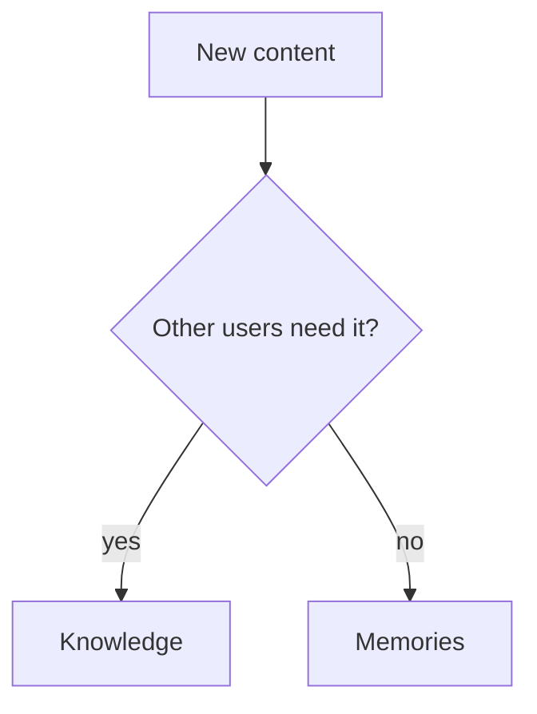
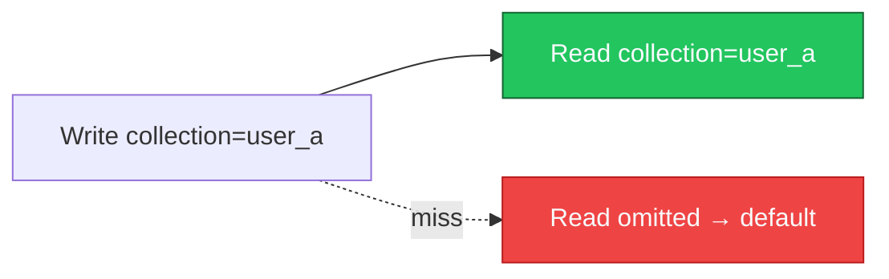
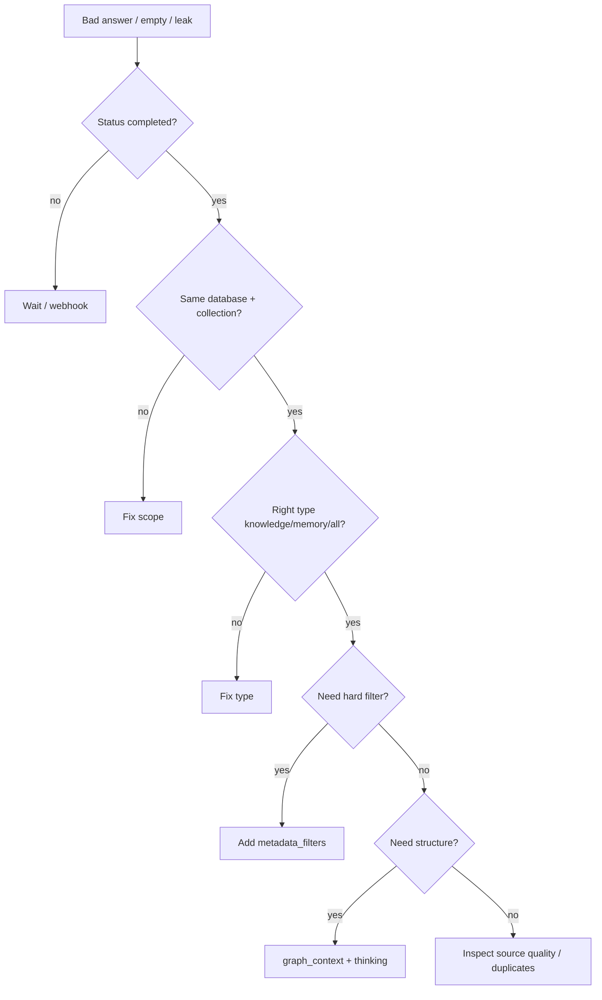

Most context bugs are **design mistakes**, not API misuse. This page catalogs the patterns that quietly destroy retrieval quality, isolation, or cost — and the architectures that replace them.

---

## How to read each anti-pattern

| Field | Meaning |
| --- | --- |
| **Problem** | What breaks in production |
| **Why it happens** | The shortcut that felt reasonable |
| **Better solution** | The HydraDB-aligned design |

---

## 1. Everything becomes Memory

<AccordionGroup>
  <Accordion title="Problem">
    Shared policies, help docs, and Slack exports are ingested as `type=memory`. Retrieval becomes user-scoped when it should be org-wide — or the default collection becomes a junk drawer of "memories" that are really documents.
  </Accordion>
  <Accordion title="Why it happens">
    Memories feel like the "AI-native" store. Teams discover `infer` and put everything through it. Or an early prototype used only Memories and never split stores.
  </Accordion>
  <Accordion title="Better solution">
    Ask: *Would another user benefit from this exact content?* If yes → [Knowledge](/essentials/v2/knowledge). If no → [Memories](/essentials/v2/memories). Use `POST /query` with `type: "all"` when you need both — do not collapse the stores.
  </Accordion>
</AccordionGroup>

---

## 2. Everything becomes Knowledge

<AccordionGroup>
  <Accordion title="Problem">
    Preferences, private chat, and per-seat secrets land in Knowledge. Personalization is weak; privacy risk is high; the graph fills with user-specific noise.
  </Accordion>
  <Accordion title="Why it happens">
    One ingest path was built for files and never extended. Or "we'll filter by user_id metadata later" substitutes for collections.
  </Accordion>
  <Accordion title="Better solution">
    User-specific state → Memories with `collection = user_id`. Shared docs → Knowledge. Metadata filters are for attributes *inside* a partition, not a replacement for [collections](/essentials/v2/multi-tenant).
  </Accordion>
</AccordionGroup>

---

## 3. No metadata

<AccordionGroup>
  <Accordion title="Problem">
    Every query is pure semantic search. You cannot restrict to `status=approved`, `region=eu`, or `department=legal`. Wrong documents leak into prompts.
  </Accordion>
  <Accordion title="Why it happens">
    Schema felt optional at prototype time. Teams planned to "add filters later," but schema-backed fields should be declared early for hot paths.
  </Accordion>
  <Accordion title="Better solution">
    Design `database_metadata_schema` before bulk ingest. Put hot equality filters in `metadata` with `enable_match: true`. Keep ad-hoc fields in `additional_metadata`. Always send `metadata_filters` for safety-critical gates. See [Metadata](/essentials/v2/metadata).
  </Accordion>
</AccordionGroup>

---

## 4. No namespaces (wrong or missing collections)

<AccordionGroup>
  <Accordion title="Problem">
    All users share one collection. Preferences mix. Or writes use `user_123` and reads omit `collection` (default) — "I ingested but query is empty."
  </Accordion>
  <Accordion title="Why it happens">
    Collection treated as optional decoration. Default collection used for convenience everywhere.
  </Accordion>
  <Accordion title="Better solution">
    Pick an explicit collection map (user / workspace / team) and **use the same values on ingest and query**. Separate customers with separate `database`s. See [Multi-tenant](/essentials/v2/multi-tenant).
  </Accordion>
</AccordionGroup>

---

## 5. Duplicate ingestion

<AccordionGroup>
  <Accordion title="Problem">
    Nightly jobs re-upload the same docs with new random IDs. Index bloats; citations duplicate; ranking degrades.
  </Accordion>
  <Accordion title="Why it happens">
    No stable ID strategy. Upsert left unset or IDs regenerated each sync.
  </Accordion>
  <Accordion title="Better solution">
    Derive stable `id`s from upstream primary keys / `external_id`. Re-ingest with `upsert: true`. On true deletes, call [`DELETE /context`](/api-reference/v2/endpoint/delete-source). For app sources, follow [App Sources](/essentials/v2/app-sources) identity rules.
  </Accordion>
</AccordionGroup>

---

## 6. Missing inference (when you need it)

<AccordionGroup>
  <Accordion title="Problem">
    Raw chat logs stored with `infer: false`. Retrieval returns transcripts instead of preferences. The agent "remembers" noise.
  </Accordion>
  <Accordion title="Why it happens">
    Default `infer: false` is correct for structured facts — teams apply it to raw behavioral signal too.
  </Accordion>
  <Accordion title="Better solution">
    Raw dialogue / event streams → `infer: true` (optionally with `custom_instructions`). Already-clean facts → `infer: false`. See [Memories](/essentials/v2/memories).
  </Accordion>
</AccordionGroup>

---

## 7. Wrong graph relationships

<AccordionGroup>
  <Accordion title="Problem">
    Forceful `relations` link unrelated sources, or graph context is enabled on every latency-sensitive query. Prompts fill with irrelevant paths — or you skip graph when multi-hop is required.
  </Accordion>
  <Accordion title="Why it happens">
    "Graph always on" cargo cult, or manual relations copied from UI without a product model.
  </Accordion>
  <Accordion title="Better solution">
    Use automatic graph for general enrichment. Reserve forceful `relations` for **known product links** (policy ↔ runbook). Set `graph_context: false` when you only need chunks. Pair deep graph with `mode: "thinking"`. See [Context Graphs](/essentials/v2/context-graphs).
  </Accordion>
</AccordionGroup>

---

## 8. Wrong recall (query) scope

<AccordionGroup>
  <Accordion title="Problem">
    Query uses `type: "knowledge"` when the answer needs user prefs — or `type: "memory"` when it needs the policy PDF. Or `collections` fanout includes the wrong workspaces.
  </Accordion>
  <Accordion title="Why it happens">
    One default query client shared by all features. Scope derived from UI state incorrectly.
  </Accordion>
  <Accordion title="Better solution">
    Per feature, decide `type`, `collection`/`collections`, and `metadata_filters` explicitly. Personalized grounded answers → `type: "all"` with the user collection. Document-only tools → `type: "knowledge"`. See [Query](/essentials/v2/query).
  </Accordion>
</AccordionGroup>

---

## 9. No lifecycle

<AccordionGroup>
  <Accordion title="Problem">
    Context only grows. Expired projects still retrieve. Prefs contradict each other. Cost and noise climb for months.
  </Accordion>
  <Accordion title="Why it happens">
    Ingest shipped; delete/TTL/archive never did.
  </Accordion>
  <Accordion title="Better solution">
    Adopt the [Context Lifecycle](/essentials/v2/context-architecture/lifecycle): stable IDs, upsert refresh, `expiry_time` for ephemeral memories, archive filters, scheduled deletes, controlled learning write-back.
  </Accordion>
</AccordionGroup>

---

## 10. Filters as access control (alone)

<AccordionGroup>
  <Accordion title="Problem">
    Two customers share one database; "security" is `metadata_filters: { customer_id }`. A missing filter leaks data.
  </Accordion>
  <Accordion title="Why it happens">
    Faster than provisioning databases. Feels like row-level security.
  </Accordion>
  <Accordion title="Better solution">
    **Customer isolation = `database`.** Metadata filters refine *within* a trusted boundary. Your app must resolve tenant → database before calling HydraDB. See [Multi-tenant](/essentials/v2/multi-tenant).
  </Accordion>
</AccordionGroup>

---

## 11. Ignoring async ingestion

<AccordionGroup>
  <Accordion title="Problem">
    App queries immediately after ingest and assumes emptiness means "HydraDB failed."
  </Accordion>
  <Accordion title="Why it happens">
    Sync mental model from toy vector DBs.
  </Accordion>
  <Accordion title="Better solution">
    Treat ingest as async. Poll [status](/api-reference/v2/endpoint/source-status) or subscribe to [webhooks](/essentials/v2/webhooks). Chunks may be available at `graph_creation`; wait for `completed` when full graph is required.
  </Accordion>
</AccordionGroup>

---

## 12. Treating Query as the LLM

<AccordionGroup>
  <Accordion title="Problem">
    Engineers expect `/query` to return a final chatbot answer. Integration stalls or prompts get double-wrapped incorrectly.
  </Accordion>
  <Accordion title="Why it happens">
    Naming confusion with "recall" / answer APIs in other products.
  </Accordion>
  <Accordion title="Better solution">
    `/query` returns **retrieved context** (chunks, sources, optional graph). Your app formats and calls the model. Use [API Results](/essentials/v2/api-results).
  </Accordion>
</AccordionGroup>

---

## Quick diagnostic

Operational order also appears in [Architecture → Operational mental model](/essentials/v2/architecture#operational-mental-model).

---

## Next

- [Scaling Context](/essentials/v2/context-architecture/scaling)
- [Production Checklist](/essentials/v2/context-architecture/checklist)
- [Decision Matrix](/essentials/v2/context-architecture/decision-matrix)
