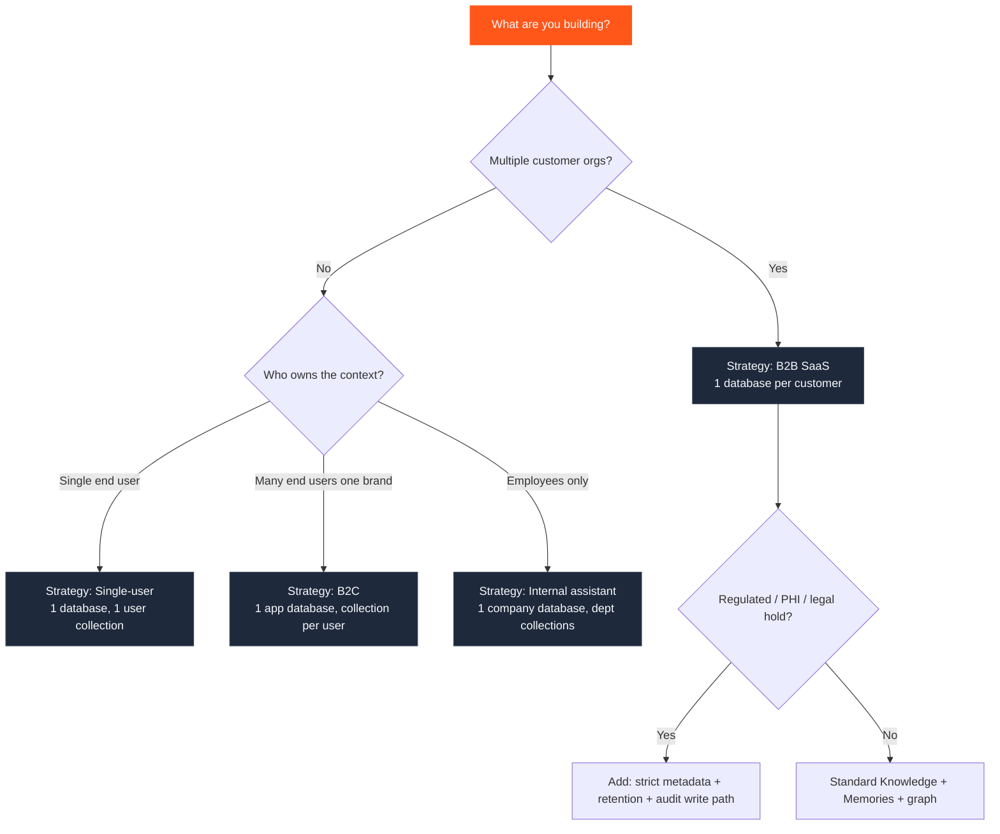
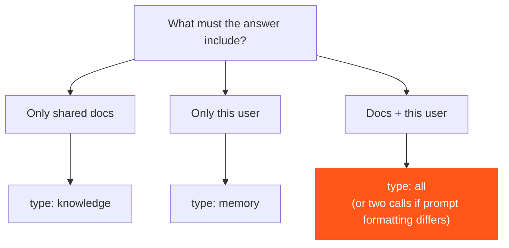

Different products need different **context strategies**. The primitives stay the same; the composition changes. Use this page to pick a strategy before you invent a custom schema.

Cross-check scopes with [Multi-tenant](/essentials/v2/multi-tenant) and the [Decision Matrix](/essentials/v2/context-architecture/decision-matrix).

---

## Decision tree



---

## Strategy dimensions

Before choosing a template, answer four questions:

| Question | If yes… | Primitive lean |
| --- | --- | --- |
| Must customer A never see customer B's data? | Separate `database` per customer | Hard isolation |
| Is most content shared inside one org? | Knowledge in default / team collections | Shared Knowledge |
| Does quality depend on knowing *this* user? | Memories under `collection = user_id` | Personalization |
| Do answers need multi-hop structure? | `graph_context: true`, `mode: "thinking"` | Graph enrichment |

---

## Strategy catalog

<Tabs>
  <Tab title="Single-user apps">
    **Shape:** One human, one agent (personal research tool, side-project copilot).

    | Layer | Choice |
    | --- | --- |
    | Database | One `database` for the app (or per environment) |
    | Collection | Single user collection — or default if truly solo |
    | Knowledge | User's uploaded docs, bookmarks, exports |
    | Memories | Preferences + session summaries; `infer: true` on chat |
    | Query | Usually `type: "all"` |
    | Graph | Optional; enable when notes are highly cross-linked |

    ```mermaid
    flowchart LR
      U[User] --> A[App]
      A -->|ingest knowledge| K[Knowledge]
      A -->|ingest memory| M[Memories]
      A -->|query type all| Q[Query]
      Q --> A
    ```

    **Architecture difference:** Minimal tenancy. Your risk is lifecycle noise (never deleting temp notes), not cross-tenant leakage.
  </Tab>

  <Tab title="Enterprise SaaS">
    **Shape:** Multi-tenant product where each customer org is a hard boundary.

    | Layer | Choice |
    | --- | --- |
    | Database | **One `database` per customer org** (+ separate DBs for staging/prod) |
    | Collection | Workspace / team / user inside the org |
    | Knowledge | Customer docs, connected Slack/Notion via [Connectors](/essentials/v2/connectors) or [App Sources](/essentials/v2/app-sources) |
    | Memories | Per-seat preferences under user collections |
    | Metadata | `plan`, `region`, `department`, `status` in schema |
    | Query | Knowledge for org RAG; `type: "all"` for personalized features |

    **Architecture difference:** Tenancy is the product. Wrong collection mapping is a security bug. Provision databases via [`POST /databases`](/api-reference/v2/endpoint/create-tenant) and wait for [status](/api-reference/v2/endpoint/tenant-status) before first ingest.
  </Tab>

  <Tab title="Customer Support">
    **Shape:** Shared help center + per-customer history.

    | Layer | Choice |
    | --- | --- |
    | Database | One support `database` (B2C) or per-tenant DB (B2B help desk) |
    | Collection | `collection = customer_id` for Memories |
    | Knowledge | Help articles, macros, resolved-ticket write-ups |
    | Memories | Plan, past issues, channel preference, failed fixes |
    | Query | Often two logical streams: Knowledge FAQ + Memory history (or one `type: "all"`) |
    | Metadata | `product_area`, `severity`, `language` |

    See also: [Customer Support cookbook](/cookbooks/v2/customer-support-agent).

    **Architecture difference:** Write-back every ticket turn into Memories; refresh Knowledge when macros change (`upsert` same `id`).
  </Tab>

  <Tab title="Coding Agents">
    **Shape:** Repo-aware assistant with per-developer preferences.

    | Layer | Choice |
    | --- | --- |
    | Database | Per product / per customer (B2B IDE) or one app DB |
    | Collection | `user_id` or `repo_id` depending on whether prefs are personal or project-local |
    | Knowledge | Docs, ADRs, runbooks; optional repo exports as Knowledge |
    | Memories | Style prefs, "don't use library X", prior decisions (`infer: true`) |
    | Graph | High value — ownership and dependency questions |
    | Relations | Link PR ↔ ADR ↔ service runbook with forceful `relations` |

    **Architecture difference:** Project Knowledge changes often — stable IDs + upsert. Session scratch should use `expiry_time` so temporary debug notes die.
  </Tab>

  <Tab title="Research Agents">
    **Shape:** Long-running investigation across papers, web clips, notes.

    | Layer | Choice |
    | --- | --- |
    | Database | Per workspace or per investigation program |
    | Collection | Per project / corpus |
    | Knowledge | Papers, PDFs, saved pages |
    | Memories | Hypotheses, user steering ("prefer primary sources") |
    | Query | `mode: "thinking"`, `graph_context: true` for synthesis |
    | Metadata | `source_type`, `year`, `trust_tier` |

    **Architecture difference:** Corpus growth dominates. Invest in metadata schema and recency bias; archive stale corpora by deleting or isolating collections.
  </Tab>

  <Tab title="Healthcare">
    **Shape:** Clinical or care-ops assistants with strict isolation and retention.

    | Layer | Choice |
    | --- | --- |
    | Database | Per health system / environment; never mix tenants |
    | Collection | Patient / encounter / care-team as product requires — **prefer the narrowest safe partition** |
    | Knowledge | Protocols, formulary, approved guidelines |
    | Memories | Encounter-scoped notes with aggressive TTL where appropriate |
    | Metadata | `facility`, `specialty`, `document_class`, `status=approved` |
    | Query | Always pair with hard `metadata_filters`; never rely on semantics for access control |

    <Warning>
      HydraDB scopes (`database` / `collection` / metadata filters) are necessary for isolation design, but **your application** remains responsible for authorization, consent, and regulatory controls. Do not treat retrieval filters as a complete compliance program.
    </Warning>

    **Architecture difference:** Lifecycle and auditability dominate. Prefer explicit IDs, deletion paths ([`DELETE /context`](/api-reference/v2/endpoint/delete-source)), and approved-only Knowledge.
  </Tab>

  <Tab title="Internal Knowledge Assistant">
    **Shape:** Company "second brain" across Slack, Notion, Drive — Glean-like.

    | Layer | Choice |
    | --- | --- |
    | Database | One company database (or per region) |
    | Collection | Department or workspace; employee Memories per user |
    | Knowledge | Connector-synced apps + curated wiki |
    | Memories | Role, team, "I own billing," search preferences |
    | Query | `query_apps: true` when app sources matter; `type: "all"` for personalized search |
    | Graph | High value for "who owns X" / "what depends on Y" |

    See also: [Glean Clone](/cookbooks/v2/glean-clone) · [Internal Search](/cookbooks/v2/internal-search-perplexity).

    **Architecture difference:** Ingestion volume and ACL-shaped metadata matter more than exotic query params. Align connector sync with upsert IDs from `external_id`.
  </Tab>
</Tabs>

---

## Side-by-side comparison

| Strategy | Database pattern | Collection pattern | Dominant store | Graph | Main risk |
| --- | --- | --- | --- | --- | --- |
| Single-user | 1 app DB | 1 user / default | Both | Optional | Unbounded Memories |
| Enterprise SaaS | 1 DB / customer | workspace + user | Knowledge + Memories | Medium | Cross-tenant mistakes |
| Customer Support | 1 DB (or /tenant) | customer_id | Knowledge + Memories | Medium | Stale macros |
| Coding Agents | app or /customer | user or repo | Knowledge + Memories | High | Session noise |
| Research Agents | /workspace | /project | Knowledge | High | Corpus sprawl |
| Healthcare | /org /env | narrow clinical scope | Knowledge + short Memories | Medium | Over-broad collections |
| Internal Assistant | 1 company DB | dept + employee | Knowledge | High | Missing metadata ACLs |

---

## Choosing Query shape



Use two separate [`POST /query`](/api-reference/v2/endpoint/query) calls only when Knowledge and Memories need different prompt formatting. Otherwise prefer `type: "all"`. Details: [Query](/essentials/v2/query) · [API Results](/essentials/v2/api-results).

---

## Next

- [Reference Architectures](/essentials/v2/context-architecture/reference-architectures) — six production topologies
- [Scaling Context](/essentials/v2/context-architecture/scaling) — how the strategy evolves with load
- [Production Examples](/essentials/v2/context-architecture/production-examples) — end-to-end walks
