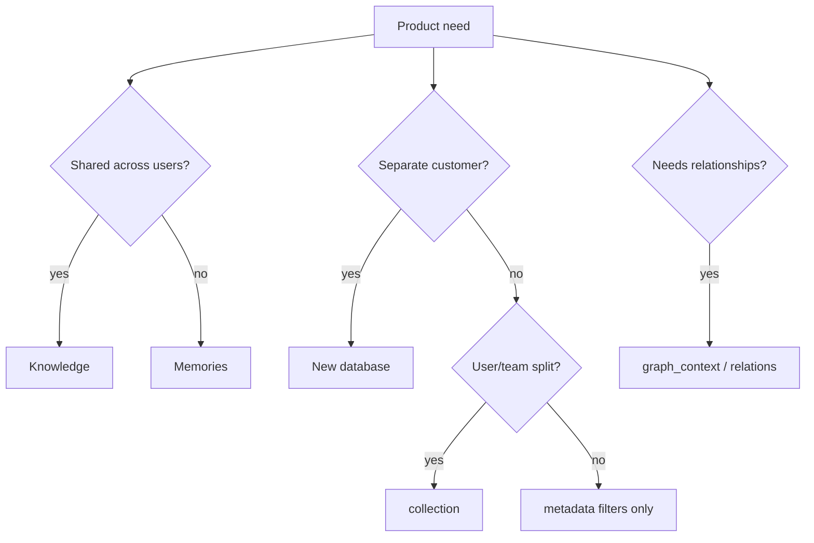

Use this matrix when a product requirement arrives and you need a **primitive-level answer** quickly. Deep strategy notes live in [Choosing a Strategy](/essentials/v2/context-architecture/choosing-strategy).

---

## When should I…

| Need | Recommended primitives | Scope pattern | Query posture | Notes |
| --- | --- | --- | --- | --- |
| **Persistent user preferences** | Memories (`infer: true/false` as appropriate), stable memory `id`, upsert | `collection = user_id` | `type: "memory"` or `"all"` | Prefer upsert overwrite for the same preference key |
| **Company docs** | Knowledge (files), metadata schema | Shared / default or dept `collection` | `type: "knowledge"`, filters on `status`/`dept` | Upsert on doc edit |
| **Conversations** | Memories via `user_assistant_pairs` or text; optional `infer: true` | User `collection` | `type: "memory"` / `"all"` | Use `expiry_time` for session-only threads |
| **Slack** | Knowledge [App Sources](/essentials/v2/app-sources) or [Connectors](/essentials/v2/connectors), graph | Company DB; channel via metadata or collection | `type: "knowledge"`, `query_apps: true` | Stable `external_id` → `id` |
| **Notion** | Knowledge app sources / connectors | Company or workspace collection | `type: "knowledge"`, `query_apps: true` | Re-ingest on page update |
| **Ephemeral context** | Memories with `expiry_time` | User or session collection | `type: "memory"` | Do not upsert into durable preference ids |
| **Audit history** | Versioned Knowledge ids **or** app-side event log + source ids; metadata `effective_at` / `version` | Narrow collections; avoid mixing tenants | Filtered `type: "knowledge"` | HydraDB stores context — your app stores compliance audit trails |
| **Retrieval (RAG)** | Knowledge + [`POST /query`](/api-reference/v2/endpoint/query) | Match ingest scope | `query_by: "hybrid"`, often `mode: "thinking"` | Format via [API Results](/essentials/v2/api-results) |
| **Personalization** | Memories + Knowledge together | User collection on the memory side | `type: "all"` | Dual query only if prompt formatting differs |
| **Multi-hop "who owns / depends"** | Context graph, optional forceful `relations` | Same DB as corpus | `graph_context: true`, `mode: "thinking"` | Skip graph on pure FAQ |
| **Hard compliance gate** | Schema `metadata` + `metadata_filters` | Inside an already-trusted DB | Filters **before** ranking | Filters ≠ tenant isolation |
| **Customer tenancy** | Separate `database` per customer | Collections inside for users/workspaces | Always resolve DB from session | See [Multi-tenant](/essentials/v2/multi-tenant) |
| **Team / workspace partition** | `collection` | `collection = workspace_id` | Same on write/read | Don't use metadata as the only partition |
| **Literal SKU / error-code lookup** | Knowledge + BM25 | Appropriate collection | `query_by: "text"`, tune `operator` | Lower `alpha` if hybrid |
| **Fresh connector sync** | Connectors / app sources + upsert | Per-tenant DB | After status ready | Delete on upstream delete |
| **Label-only correction** | [PATCH source metadata](/api-reference/v2/endpoint/update-source-metadata) | Same scope as source | — | Content changes need upsert ingest |
| **Remove poisoned content** | [`DELETE /context`](/api-reference/v2/endpoint/delete-source) | Same `collection` as ingest | — | Verify with follow-up query |
| **Agent learning loop** | Memory write-back after turns | User collection | Later `type: "all"` | Cap growth with ids + TTL |
| **BYO entities/edges** | [Bring Your Own Graph](/essentials/v2/bring-your-own-graph) | Same as Knowledge | `graph_context: true` | When extraction is insufficient |
| **Cite sources in UI** | Query `sources` + [fetch content](/api-reference/v2/endpoint/fetch-content) as needed | — | Keep `max_results` sane | Don't invent citations |

---

## Primitive picker (compact)

---

## Store × scope × query

| Content class | Store | Scope | Typical `type` |
| --- | --- | --- | --- |
| Policy PDF | Knowledge | dept or default collection | `knowledge` |
| Help center article | Knowledge | default | `knowledge` |
| Slack decision thread | Knowledge (app) | company DB | `knowledge` |
| "Prefers dark mode" | Memory | user collection | `memory` / `all` |
| Last ticket outcome | Memory | customer collection | `memory` / `all` |
| Session scratchpad | Memory + TTL | user/session collection | `memory` |
| Service ownership edge | Graph (+ Knowledge nodes) | company DB | `knowledge` + graph |

---

## Anti-choices (explicit)

| Temptation | Prefer instead |
| --- | --- |
| One database for all SaaS customers + `customer_id` metadata | Database per customer |
| Put prefs in Knowledge "so one query works" | Memories + `type: "all"` |
| New random id every sync | Stable id + upsert |
| Graph on every request "for quality" | Opt-in when multi-hop matters |
| Filters instead of collections for users | `collection = user_id` |

More: [Anti-Patterns](/essentials/v2/context-architecture/anti-patterns)

---

## Next

- [Production Examples](/essentials/v2/context-architecture/production-examples)
- [Reference Architectures](/essentials/v2/context-architecture/reference-architectures)
- [Mental Model](/essentials/v2/context-architecture/mental-model)
