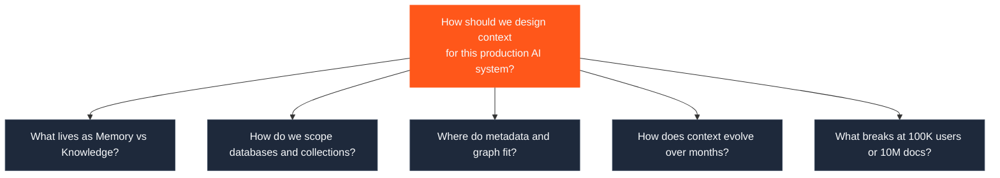
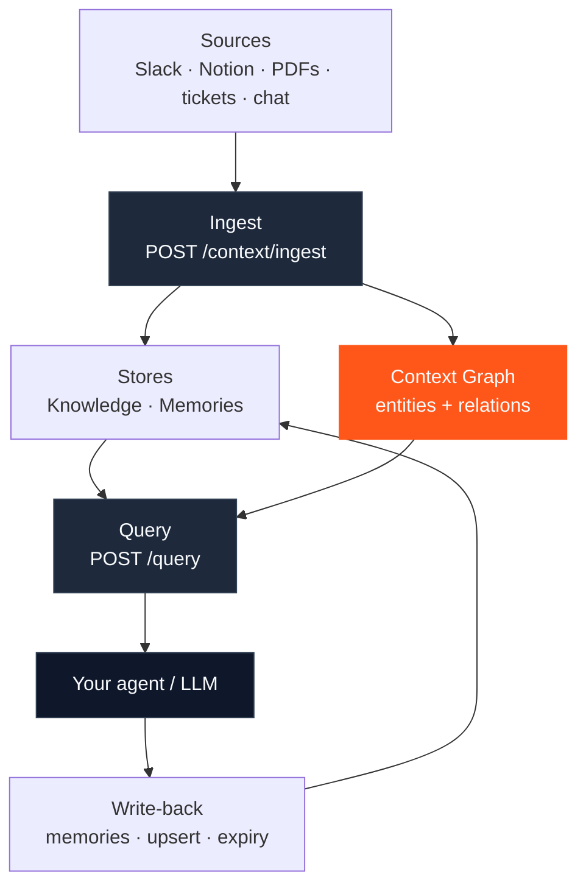

This playbook teaches you how to **design** context for a production AI system — not how to call individual endpoints.

HydraDB gives you [Knowledge](/essentials/v2/knowledge), [Memories](/essentials/v2/memories), [Query](/essentials/v2/query), [databases and collections](/essentials/v2/multi-tenant), [metadata](/essentials/v2/metadata), and [context graphs](/essentials/v2/context-graphs). The hard part is deciding **which primitives to compose**, **how to scope them**, and **how they evolve over months**.

If you are looking for API mechanics, start with [Architecture](/essentials/v2/architecture) and [Quickstart](/get-started/v2/quickstart). If you are designing a system that must stay correct at scale, stay here.

<Info>
  **What this is not.** This is not a Memory vs Knowledge primer, beginner onboarding, migration guide, webhook guide, or query-parameter tuning guide. Those journeys are covered elsewhere. This playbook is the **architecture layer** above them.
</Info>

---

## The question this playbook answers

Production AI systems fail less often because the model is weak, and more often because context is unstructured: the wrong store, the wrong scope, no lifecycle, and no way to isolate tenants.

---

## Playbook map

<CardGroup cols={2}>
  <Card title="1. Mental Model" icon="brain" href="/essentials/v2/context-architecture/mental-model">
    Why each HydraDB primitive exists as an architecture building block — Memory, Knowledge, Inference, Query, Metadata, Scopes, Graph, Relationships.
  </Card>
  <Card title="2. Choosing a Strategy" icon="compass" href="/essentials/v2/context-architecture/choosing-strategy">
    Decision framework for single-user apps, enterprise SaaS, support, coding agents, research, healthcare, and internal assistants.
  </Card>
  <Card title="3. Reference Architectures" icon="sitemap" href="/essentials/v2/context-architecture/reference-architectures">
    Six complete production architectures with Mermaid diagrams — from Slack ingestion to LLM response.
  </Card>
  <Card title="4. Context Lifecycle" icon="arrows-rotate" href="/essentials/v2/context-architecture/lifecycle">
    How context evolves over months: creation, updates, versioning, expiry, refresh, archive, delete, replay, learning.
  </Card>
  <Card title="5. Anti-Patterns" icon="triangle-exclamation" href="/essentials/v2/context-architecture/anti-patterns">
    Mistakes teams make — everything as Memory, no namespaces, duplicate ingestion, wrong recall scope — and the better designs.
  </Card>
  <Card title="6. Scaling Context" icon="chart-line" href="/essentials/v2/context-architecture/scaling">
    How architecture changes from 10 users to 100K users and 10M documents — boundaries, collections, isolation.
  </Card>
  <Card title="7. Production Checklist" icon="list-check" href="/essentials/v2/context-architecture/checklist">
    Fifty-plus readiness items across security, observability, retrieval quality, RBAC, lifecycle, and deployment.
  </Card>
  <Card title="8. Decision Matrix" icon="table" href="/essentials/v2/context-architecture/decision-matrix">
    When should I… — map product needs to recommended HydraDB primitives.
  </Card>
  <Card title="9. Production Examples" icon="building" href="/essentials/v2/context-architecture/production-examples">
    End-to-end walks through coding, healthcare, support, CRM, legal, sales, and research assistants.
  </Card>
</CardGroup>

---

## One-page architecture sketch

Every serious HydraDB deployment looks like a variation of this loop:

| Layer | Job | HydraDB surface |
| --- | --- | --- |
| **Boundary** | Isolate customers and environments | `database` — [Multi-tenant](/essentials/v2/multi-tenant) |
| **Partition** | Isolate users, teams, workspaces | `collection` |
| **Shared facts** | Org docs, tickets, wiki, Slack | [Knowledge](/essentials/v2/knowledge) via `type=knowledge` |
| **Personal state** | Preferences, traits, session history | [Memories](/essentials/v2/memories) via `type=memory` |
| **Structure** | Multi-hop relationships | [Context Graphs](/essentials/v2/context-graphs) |
| **Hard filters** | Department, region, status, plan | [Metadata](/essentials/v2/metadata) |
| **Retrieval** | Ranked context for the LLM | [`POST /query`](/api-reference/v2/endpoint/query) |

---

## How to use this playbook

<Steps>
  <Step title="Internalize the primitives">
    Read [Mental Model](/essentials/v2/context-architecture/mental-model). Treat each primitive as a design choice with a cost, not a checkbox.
  </Step>
  <Step title="Pick a strategy for your product shape">
    Use [Choosing a Strategy](/essentials/v2/context-architecture/choosing-strategy) and the [Decision Matrix](/essentials/v2/context-architecture/decision-matrix) before writing ingest code.
  </Step>
  <Step title="Copy a reference architecture">
    Start from the closest [reference architecture](/essentials/v2/context-architecture/reference-architectures) or [production example](/essentials/v2/context-architecture/production-examples), then adapt scopes and metadata.
  </Step>
  <Step title="Design the lifecycle early">
    Decide IDs, upsert rules, `expiry_time`, refresh cadence, and deletion before you hit production volume — see [Lifecycle](/essentials/v2/context-architecture/lifecycle).
  </Step>
  <Step title="Ship against the checklist">
    Walk [Production Readiness](/essentials/v2/context-architecture/checklist) before you call the system "done."
  </Step>
</Steps>

---

## Related docs

- [Core Concepts](/get-started/v2/core-concepts) — the five primitives at a glance
- [Architecture](/essentials/v2/architecture) — control, ingestion, and retrieval planes
- [Ingest Context](/api-reference/v2/endpoint/ingest-context) · [Query](/api-reference/v2/endpoint/query) · [Delete Context](/api-reference/v2/endpoint/delete-source)
- Cookbooks for implementation patterns: [Customer Support Agent](/cookbooks/v2/customer-support-agent), [Glean Clone](/cookbooks/v2/glean-clone), [AI Chief of Staff](/cookbooks/v2/ai-chief-of-staff)
