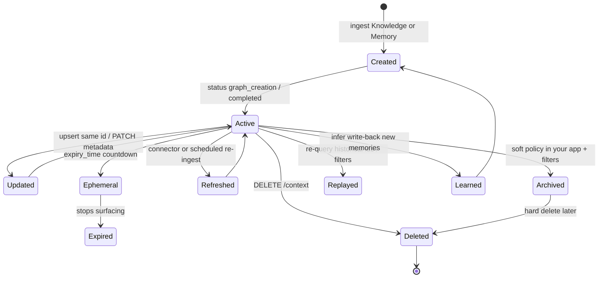
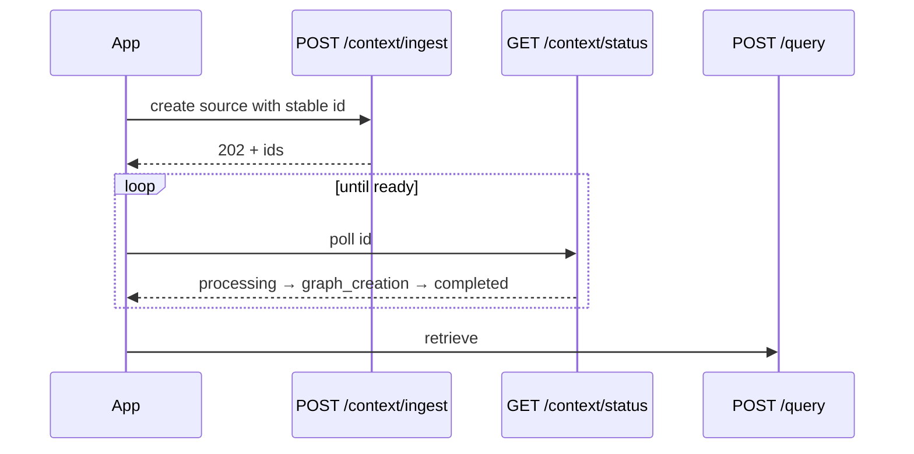
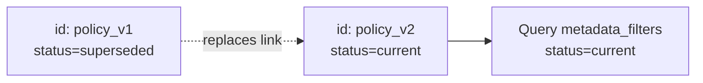
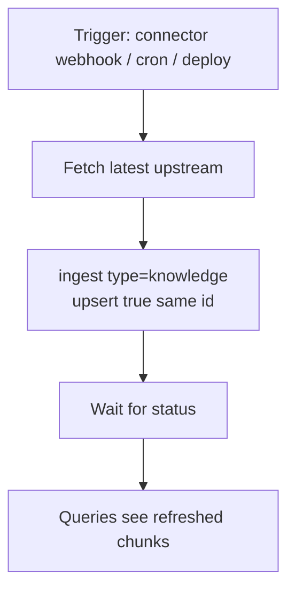
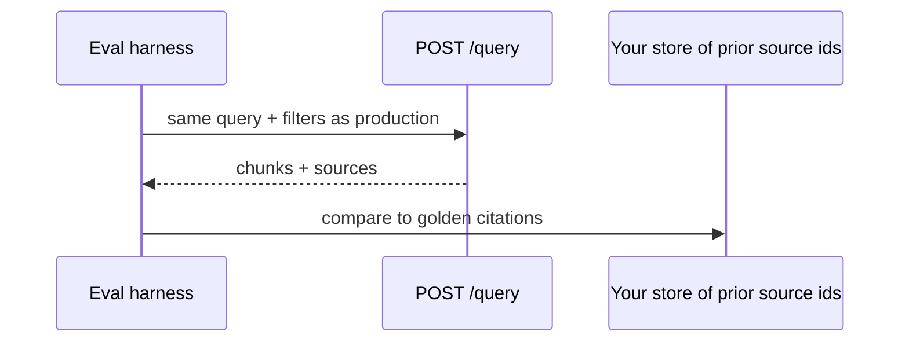
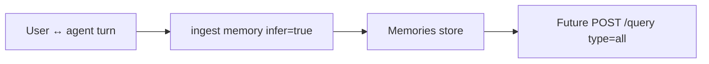

Context is not a one-time upload. Production systems win or lose on **how context changes** after month three. This page is the lifecycle architecture — mapped to real HydraDB operations, not invented APIs.

Related mechanics: [Ingest](/api-reference/v2/endpoint/ingest-context) · [Status](/api-reference/v2/endpoint/source-status) · [Update Source Metadata](/api-reference/v2/endpoint/update-source-metadata) · [Delete Context](/api-reference/v2/endpoint/delete-source) · [Memories](/essentials/v2/memories)

---

## Lifecycle at a glance



---

## 1. Creation

**What happens:** Your app (or a [connector](/essentials/v2/connectors)) calls [`POST /context/ingest`](/api-reference/v2/endpoint/ingest-context) with `type=knowledge` or `type=memory`. HydraDB accepts work asynchronously (`202`) and returns `id`s.

**Architecture rules:**

- Assign **stable IDs** at creation for anything you will update or delete later.
- Set `database` + `collection` correctly on first write — wrong scope is expensive to unwind.
- Declare [metadata schema](/essentials/v2/metadata) before hot filters are needed.
- Do not query until [`GET /context/status`](/api-reference/v2/endpoint/source-status) reaches at least `graph_creation` (chunks) or `completed` (full graph).



---

## 2. Updates

Two update paths exist — pick by what changed:

| Change | Mechanism |
| --- | --- |
| Content changed (new PDF body, edited Notion page, new memory text) | Re-ingest with **same `id`** and `upsert: true` |
| Only metadata / labels changed | [`PATCH /context/sources/{source_id}/metadata`](/api-reference/v2/endpoint/update-source-metadata) merge |

<Note>
  Schema-backed `metadata` and `additional_metadata` on ingest are treated as locked for content replacement workflows — full content changes go through upsert re-ingest. Point metadata edits use the PATCH endpoint. See [Metadata](/essentials/v2/metadata).
</Note>

---

## 3. Versioning

HydraDB upserts replace the source with the same `id`. **Versioning is an architecture choice you own:**

| Pattern | How |
| --- | --- |
| Latest-wins | Same `id`, `upsert: true` (default posture) |
| Immutable versions | New `id` per version (`policy_v3`); keep `additional_metadata.replaces = policy_v2`; filter `status=current` |
| Dual-read migration | Ingest v2 alongside v1; flip `metadata_filters` when ready; delete v1 |



---

## 4. Ephemeral memories

Session scratch, temporary debug context, and short-lived campaign state should not live forever.

Use Memory field `expiry_time` (TTL in seconds). After expiry, the memory **stops surfacing** in retrieval.

**Architecture pattern:**

- Long-lived prefs → no TTL (or long TTL) + stable `id`
- Session notes → `expiry_time` measured in hours/days
- "Remember this for the call" → short TTL, do not upsert into the permanent preference id

Deep dive: [Memories fields](/essentials/v2/memories#memories-item-fields)

---

## 5. Knowledge refresh

Shared Knowledge drifts as wikis and tickets change.



**Rules of thumb:**

- Prefer connector or app-source sync with stable `external_id` → HydraDB `id`.
- Refresh cadence should match how wrong a stale answer can be (pricing pages ≠ evergreen handbook).
- After major schema/filter changes, plan re-ingest — see metadata caveats in [Metadata](/essentials/v2/metadata).

---

## 6. Archiving

HydraDB deletion is hard removal via [`DELETE /context`](/api-reference/v2/endpoint/delete-source). **Soft archive** is typically your policy:

1. PATCH or upsert metadata `status=archived` / `visibility=archived`
2. Default queries filter `status=published` (or equivalent)
3. Hard-delete later when retention expires

This keeps replay/audit possible until legal retention allows deletion.

---

## 7. Deletion

```bash
# Conceptual shape — see API reference for full contract
DELETE /context
{ "database": "...", "collection": "...", "ids": ["..."], "type": "knowledge" | "memory" }
```

Delete when:

- Upstream source was deleted
- User exercises erasure / retention expiry
- Duplicate or poisoned content must leave the index

Always delete with the **same `collection`** used at ingest.

---

## 8. Replay

Replay means **re-answering with historical context**, not a special HydraDB endpoint.

| Replay goal | Approach |
| --- | --- |
| Re-run an eval set | Store query fixtures; call `POST /query` with fixed params |
| Explain a past answer | Persist returned `sources` / chunk ids in your app; fetch content via [Fetch Content](/api-reference/v2/endpoint/fetch-content) / list APIs |
| Time-travel policies | Versioned Knowledge ids + filters on `doc_version` / `effective_at` in metadata |



---

## 9. Learning

Learning is the write-back loop: agent interactions become better Memories.



**Architecture guardrails:**

- Learn into the correct user `collection`
- Prefer `infer: true` for raw dialogue; `infer: false` for curated facts you already structured
- Cap growth with upsert keys for durable prefs + `expiry_time` for transient lessons
- Do not "learn" secrets into Knowledge shared across users

---

## Month-scale timeline

| Time | What good teams do |
| --- | --- |
| Week 1 | Stable IDs, schema, scopes, status polling |
| Month 1 | Upsert refresh path + memory write-back |
| Month 3 | TTL policy, archive filters, delete automation |
| Month 6 | Version strategy for policies; eval replay harness |
| Month 12 | Scale partitions; prune dead collections; revisit graph usage |

---

## Lifecycle checklist (short)

- [ ] Every durable source has a stable `id`
- [ ] Upsert path tested for Knowledge and Memories
- [ ] Metadata PATCH path known for label-only edits
- [ ] Ephemeral memories use `expiry_time`
- [ ] Archive filter convention documented
- [ ] Delete job exists for retention / erasure
- [ ] Learning write-back scoped per user collection
- [ ] Replay/eval stores source ids, not only answer text

Full list: [Production Readiness Checklist](/essentials/v2/context-architecture/checklist)

---

## Next

- [Anti-Patterns](/essentials/v2/context-architecture/anti-patterns) — lifecycle failures in the wild
- [Scaling Context](/essentials/v2/context-architecture/scaling) — lifecycle under growth
