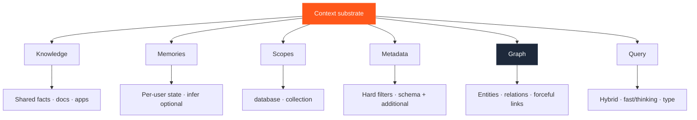
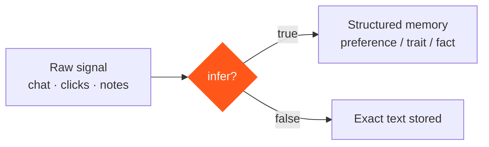
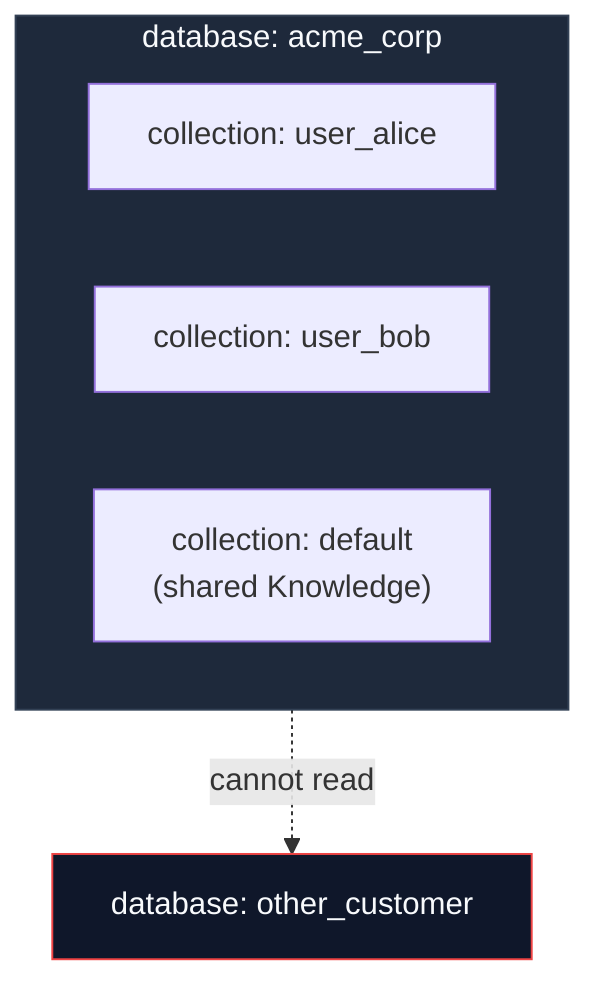
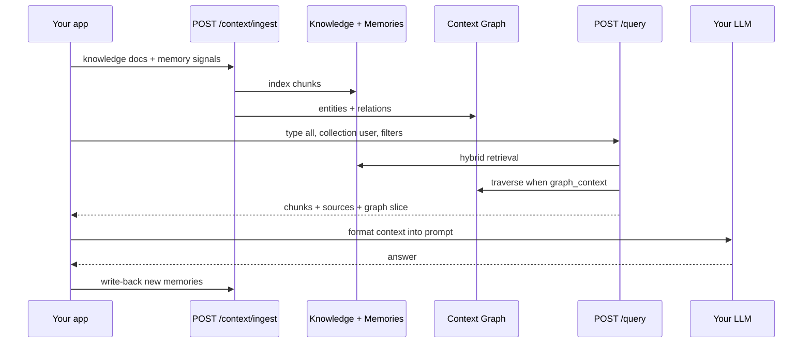

Architecture starts with **why**, not with schemas. Each HydraDB primitive exists because a specific failure mode shows up in production AI systems. This page maps primitives to the problems they solve.

For API-level definitions, see [Core Concepts](/get-started/v2/core-concepts). For how planes fit together, see [Architecture](/essentials/v2/architecture).

---

## The building blocks

---

## Knowledge — shared working context

**Why it exists:** Agents need a shared source of truth — policies, product docs, Slack decisions, Notion pages — that every authorized user can retrieve. Without a Knowledge store, teams paste the same PDFs into every prompt or build a one-off vector DB per feature.

**Architecture role:** The org's durable context. Ingest with [`POST /context/ingest`](/api-reference/v2/endpoint/ingest-context) `type=knowledge`. Query with [`POST /query`](/api-reference/v2/endpoint/query) `type: "knowledge"` or `"all"`.

**Design implication:** Prefer Knowledge when a different user would benefit from the same content. Prefer stable `id`s and `upsert: true` so refreshes replace, not duplicate.

Deep dive: [Knowledge](/essentials/v2/knowledge) · [App Sources](/essentials/v2/app-sources) · [Connectors](/essentials/v2/connectors)

---

## Memories — personalized state

**Why it exists:** Shared docs alone produce generic answers. Users expect the agent to remember preferences, plan tier, past failures, and conversation history. Memories are the per-user (or per-workspace) store that makes retrieval personal.

**Architecture role:** Dynamic, user-scoped context. Ingest with `type=memory`. Merge via dual query or `type: "all"` whose `collections` include every partition you need. Scope Memories with `collection` so one user's preferences never leak into another's retrieval.

**Design implication:** Memories compound. Without lifecycle controls (`expiry_time`, upsert IDs, deletion), they become noisy. Plan TTL and write-back from day one.

Deep dive: [Memories](/essentials/v2/memories)

---

## Inference — extract signal from raw behavior

**Why it exists:** Product telemetry and chat logs are rarely clean preference statements. `infer: true` on memory ingest asks HydraDB to extract the underlying preference, trait, or fact from raw text or `user_assistant_pairs`. `infer: false` (default) stores exactly what you send.

**Architecture role:** A write-time transform, not a separate product. Use inference when the input is raw signal; skip it when you already have a structured fact.

<Warning>
  Inference is for **Memories**, not Knowledge. Knowledge is parsed and chunked; it is not preference extraction. Do not set `infer` expecting document Q&A to "learn" user intent.
</Warning>

Deep dive: [Memories → infer](/essentials/v2/memories#choose-whether-hydradb-should-infer-the-memory)

---

## Query (Recall) — turn stores into the right context

**Why it exists:** Storage is easy; knowing *what* to retrieve for *this* task is hard. HydraDB exposes one retrieval endpoint — [`POST /query`](/api-reference/v2/endpoint/query) — that blends semantic vectors, BM25, metadata filters, and optional graph traversal.

In older docs and product language you may see **Recall**; in v2 the canonical surface is **Query**. Same job: retrieve ranked context for your LLM. HydraDB does not generate the final answer — your app does. See [How to Use API Results](/essentials/v2/api-results).

**Architecture role:** The read path. Key knobs for architects:

| Knob | Architectural meaning |
| --- | --- |
| `type` | Which store(s): `knowledge`, `memory`, or `all` |
| `collection` / `collections` | Which partition(s) to search |
| `metadata_filters` | Hard constraints before ranking |
| `graph_context` | Attach relational structure |
| `mode` | `fast` vs `thinking` (depth vs latency) |
| `query_by` | `hybrid` vs `text` (BM25) |

Deep dive: [Query](/essentials/v2/query)

---

## Metadata — deterministic narrowing

**Why it exists:** Semantic search alone cannot enforce "only approved SOC2 policies in `us`." Production systems need hard filters that never silently widen.

**Architecture role:** Two layers:

- `metadata` — schema-backed fields declared on the database; fast filter path
- `additional_metadata` — free-form per-source fields for citations, external IDs, occasional filters

Declare hot filters in `database_metadata_schema` before first ingest. Undeclared scope keys are ignored at query time.

Deep dive: [Metadata](/essentials/v2/metadata) · [Create Database](/api-reference/v2/endpoint/create-tenant)

---

## Scopes — databases and collections

**Why it exists:** Isolation is a security and product requirement, not a nice-to-have. Mixing customer data in one bag and filtering later is how incidents happen.

**Architecture role:**

| Identifier | Boundary | Typical use |
| --- | --- | --- |
| `database` | Hard isolation — no cross-read | Customer org, environment (`prod` / `staging`) |
| `collection` | Logical partition inside a database | User, workspace, team, project |

**Design implication:** Environments get separate databases. Users get collections. Metadata filters *inside* a partition — they do not replace `collection`.

Deep dive: [Multi-tenant](/essentials/v2/multi-tenant)

---

## Graph — structure beyond similarity

**Why it exists:** Vector similarity answers "what looks like this query?" Multi-hop questions need "what is connected to this?" The [context graph](/essentials/v2/context-graphs) stores triplets (`source → relation → target`) extracted at ingest and traversed at query when `graph_context: true`.

**Architecture role:** Enrichment layer on top of retrieval. Enable for ownership, dependency, policy-governs-process questions. Disable (`graph_context: false`) when you only need ranked chunks and latency matters.

Deep dive: [Context Graphs](/essentials/v2/context-graphs) · [Bring Your Own Graph](/essentials/v2/bring-your-own-graph)

---

## Relationships — author-declared links

**Why it exists:** Automatic extraction misses links you already know — "this runbook supersedes that policy," "this ticket relates to that RFC." At ingest, `relations: { "ids": [...] }` forcefully connects sources. At query (in `mode: "thinking"`), `query_forceful_relations` can pull those into `additional_context`.

**Architecture role:** Explicit edges for high-trust connections your product already models. Use when the graph must reflect product truth, not only NLP guesses.

Deep dive: [Ingest Context](/api-reference/v2/endpoint/ingest-context) · [Source Relations](/api-reference/v2/endpoint/source-relations)

---

## How the primitives compose

---

## Architect's cheat sheet

| Primitive | Exists so you can… | Fail if you… |
| --- | --- | --- |
| Knowledge | Share durable org context | Stuff personal prefs into docs |
| Memories | Personalize without polluting shared stores | Never expire or upsert |
| Inference | Turn raw logs into structured prefs | Infer on already-clean facts (waste) |
| Query | Retrieve the right slice for one task | Treat HydraDB as a chat completion API |
| Metadata | Enforce hard business constraints | Use filters instead of collections |
| Scopes | Isolate tenants and users | Share one collection across customers |
| Graph | Answer multi-hop relational questions | Enable everywhere "just in case" |
| Relationships | Encode known product links | Duplicate every auto-extracted edge |

---

## Next

- [Choosing a Strategy](/essentials/v2/context-architecture/choosing-strategy) — map product shape to primitive mix
- [Reference Architectures](/essentials/v2/context-architecture/reference-architectures) — full system diagrams
- [Anti-Patterns](/essentials/v2/context-architecture/anti-patterns) — common mis-compositions
