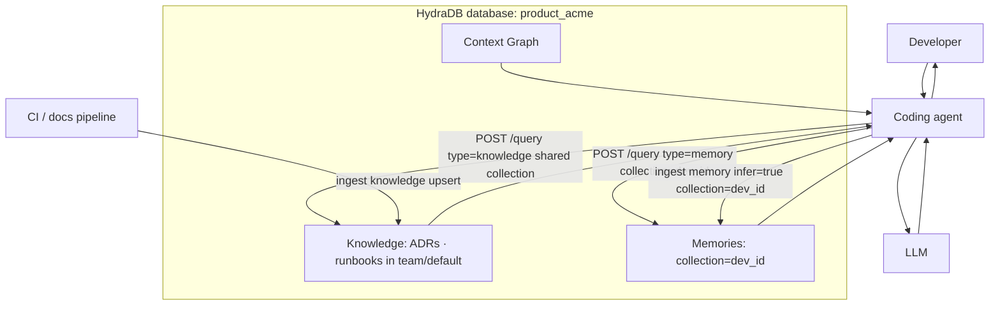
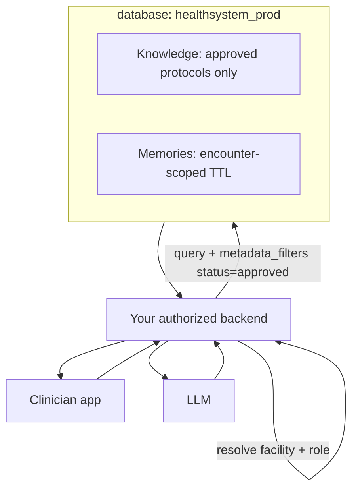
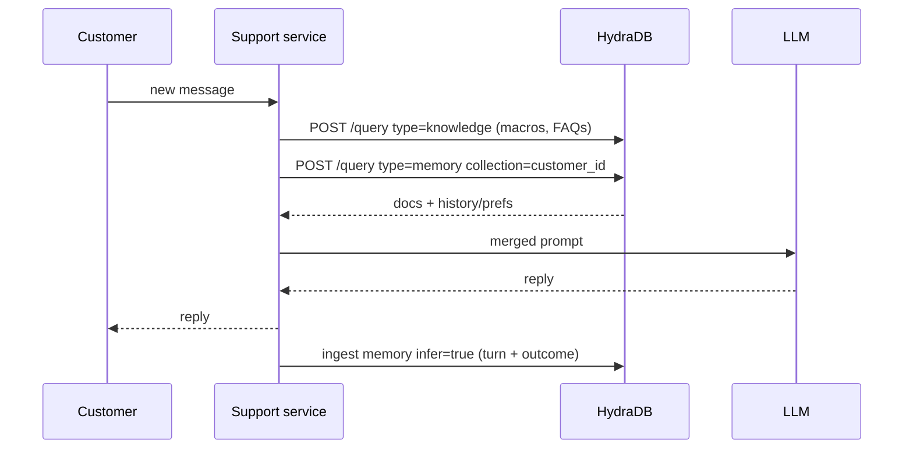
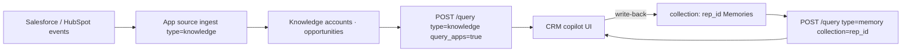
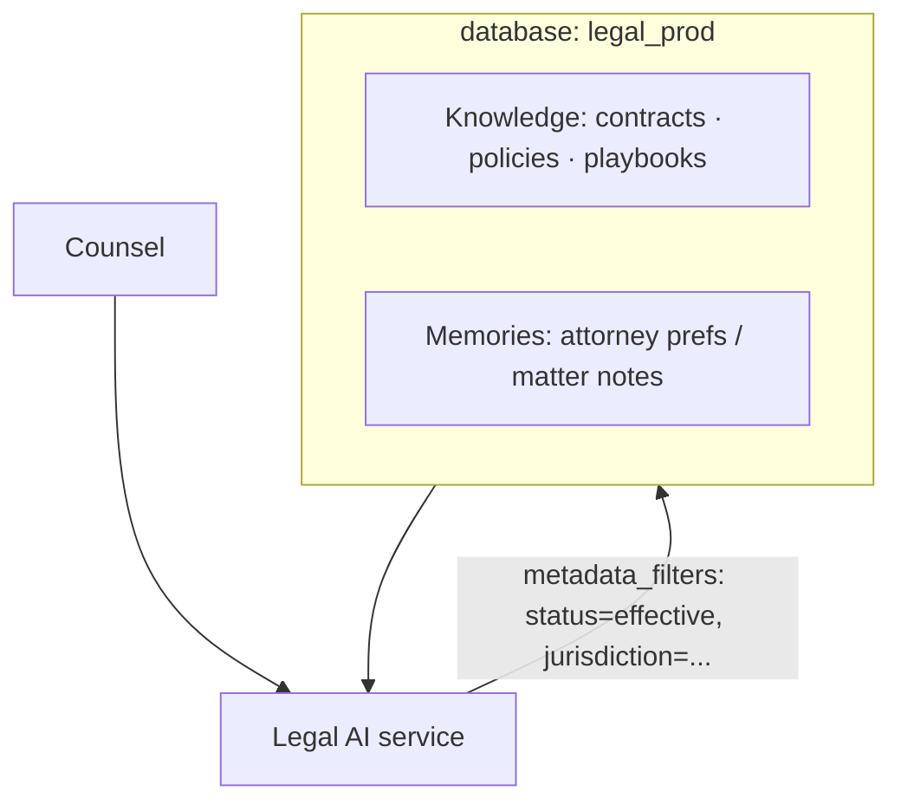
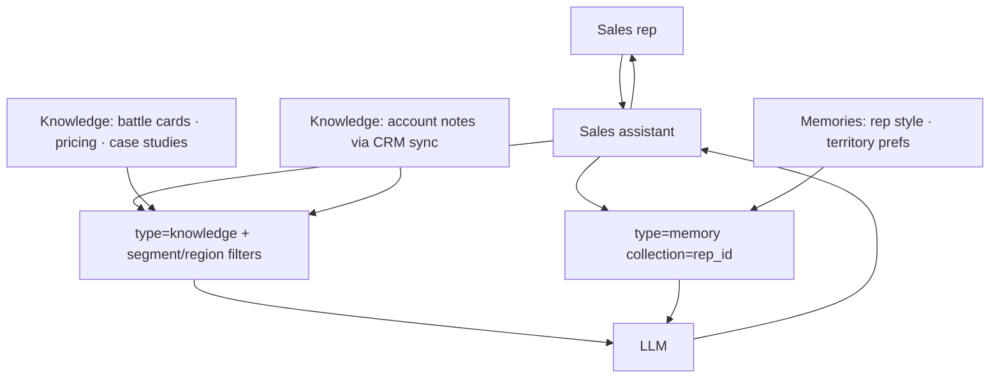
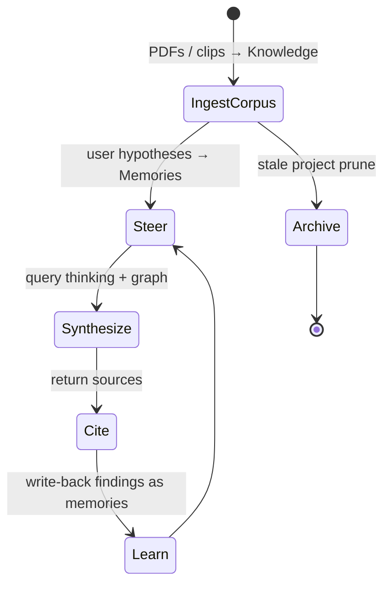
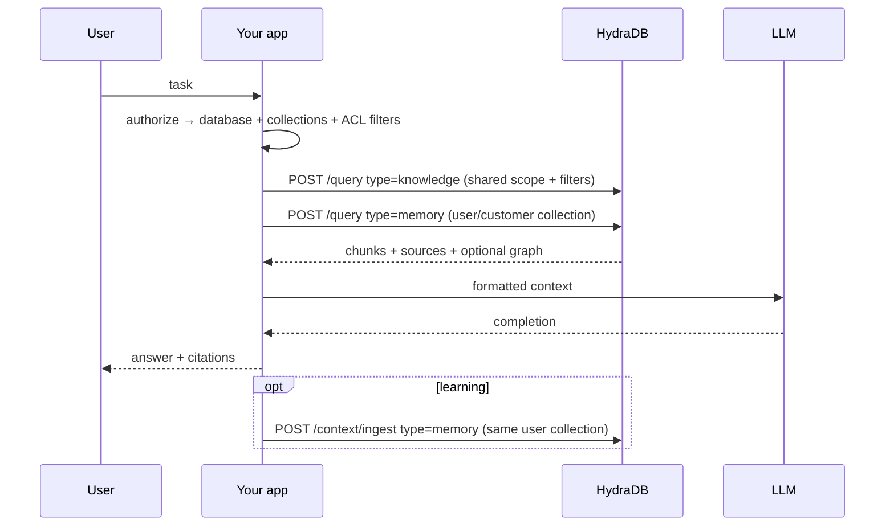

Each example is an **architecture walk**, not a full cookbook. Implementation recipes live under [Cookbooks](/cookbooks/v2/index). APIs referenced here are real v2 surfaces only.

---

## 1. AI Coding Assistant

**Goal:** Answer with repo/runbook Knowledge plus per-developer Memories (style, prior decisions).

| Layer | Choice |
| --- | --- |
| Database | Per product or per customer (B2B IDE) |
| Collections | Shared docs in team/default; `dev_id` for Memories only |
| Knowledge | ADRs, runbooks; upsert on merge |
| Memories | Style prefs + decisions; debug notes with `expiry_time` |
| Query | Dual query (or `type: "all"` with `collections` = [shared, `dev_id`]); never `type: "all"` with only `dev_id` if Knowledge is shared |
| Graph | On for ownership / dependency questions on the Knowledge call |

**Related:** [Choosing Strategy → Coding Agents](/essentials/v2/context-architecture/choosing-strategy) · [Plugins](/plugins/claude-code)

---

## 2. Healthcare Assistant

**Goal:** Protocol-grounded answers with narrow partitions and strict filters.

| Layer | Choice |
| --- | --- |
| Database | Per health system / environment |
| Collections | Narrowest safe clinical partition your product defines |
| Knowledge | Approved guidelines only (`status=approved`) |
| Memories | Encounter notes with aggressive `expiry_time` where appropriate |
| Metadata | `facility`, `specialty`, `document_class` |
| Query | Always filtered; never semantic-only for access |

<Warning>
  Application-layer authorization, consent, and retention policies are mandatory. HydraDB scopes and filters support isolation design — they do not replace a compliance program.
</Warning>

---

## 3. Customer Support Assistant

**Goal:** Help-center Knowledge + per-customer Memories on every ticket.

| Layer | Choice |
| --- | --- |
| Knowledge | Articles, macros, resolved-ticket write-ups |
| Memories | Plan, channel prefs, prior failures |
| Metadata | `product_area`, `severity`, `language` |
| Lifecycle | Upsert macros; TTL on temporary holds |

**Cookbook:** [Customer Support Agent](/cookbooks/v2/customer-support-agent)

---

## 4. CRM Copilot

**Goal:** Account Knowledge (CRM records, call notes as app sources) + rep Memories.

| Layer | Choice |
| --- | --- |
| Database | Per CRM customer org (B2B) or one DB with strict collections |
| Knowledge | Accounts, opportunities, notes as app sources (shared / account collection) |
| Memories | Rep preferences under `collection = rep_id` |
| Query | Dual query (or `type: "all"` with both collections); `query_apps: true` on the Knowledge call |
| Relations | Link opportunity ↔ account ↔ note via forceful relations when known |

**Related:** [App Sources](/essentials/v2/app-sources)

---

## 5. Legal Assistant

**Goal:** Versioned policies and contracts with hard metadata gates.

| Layer | Choice |
| --- | --- |
| Versioning | `policy_vN` ids + `status=effective` / `superseded` |
| Metadata | `jurisdiction`, `practice_area`, `confidentiality` |
| Memories | Matter-scoped collections; careful TTL |
| Graph | Clause ↔ definition links; BYO graph when extraction is weak |
| Delete | Matter close → retention job |

**Related:** [Lifecycle → Versioning](/essentials/v2/context-architecture/lifecycle#3-versioning) · [BYOG](/essentials/v2/bring-your-own-graph)

---

## 6. Sales Assistant

**Goal:** Battle cards + account context + rep personalization.

| Layer | Choice |
| --- | --- |
| Knowledge | Battle cards (upsert on enablement publish) + account corpus in shared collections |
| Memories | Rep collection |
| Metadata | `segment`, `region`, `product_line`, `stage` |
| Query | Dual query; filter Knowledge by account segment; personalize via Memories |

Enablement refresh is a Knowledge lifecycle problem — treat battle card titles as stable ids.

---

## 7. Research Assistant

**Goal:** Long-horizon synthesis across a growing corpus.

| Layer | Choice |
| --- | --- |
| Collections | Per research project |
| Metadata | `trust_tier`, `year`, `source_type` |
| Query | `mode: "thinking"`, `graph_context: true` |
| Lifecycle | Archive/delete dead projects; TTL on scratch notes |

**Related:** [Reference Architecture #5](/essentials/v2/context-architecture/reference-architectures#5-research-corpus-synthesizer)

---

## Cross-example comparison

| Example | DB pattern | Memory collection | Knowledge emphasis | Graph | Special flag |
| --- | --- | --- | --- | --- | --- |
| Coding | product / customer | developer | runbooks, ADRs | high | — |
| Healthcare | health system | encounter / patient* | approved protocols | medium | hard filters |
| Support | app or tenant | customer | macros, FAQs | medium | write-back |
| CRM | customer org | rep | CRM app sources | medium | `query_apps` |
| Legal | legal org | matter / attorney | versioned policies | medium–high | version filters |
| Sales | company / tenant | rep | battle cards + accounts | low–medium | segment filters |
| Research | workspace | project + user | corpus PDFs | high | trust_tier |

\*Use the narrowest partition your product and policy allow.

---

## Shared sequence (all examples)

<Note>
  When shared Knowledge and user Memories use different collections, prefer dual query (shown above) or one `type: "all"` with `collections` covering both. Do not pass only the user collection and expect default-collection Knowledge to appear.
</Note>
---

## Next

- [Production Checklist](/essentials/v2/context-architecture/checklist) — ship gate
- [Decision Matrix](/essentials/v2/context-architecture/decision-matrix) — primitive picker
- [Playbook home](/essentials/v2/context-architecture/index) — full map
