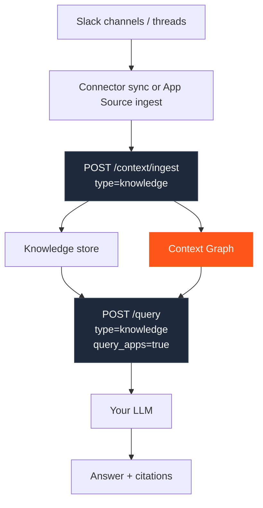
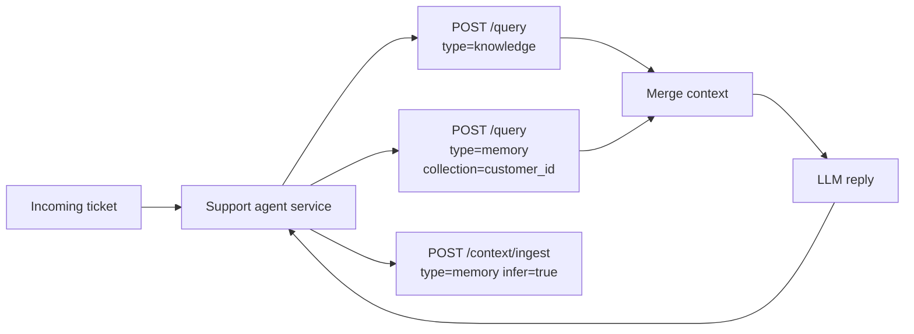
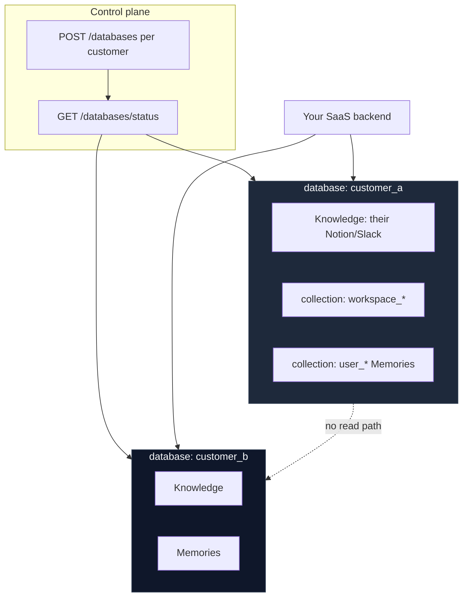
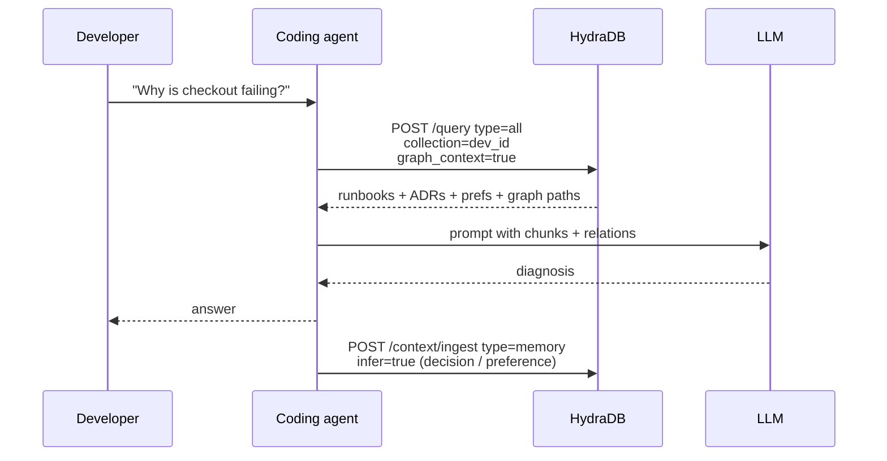
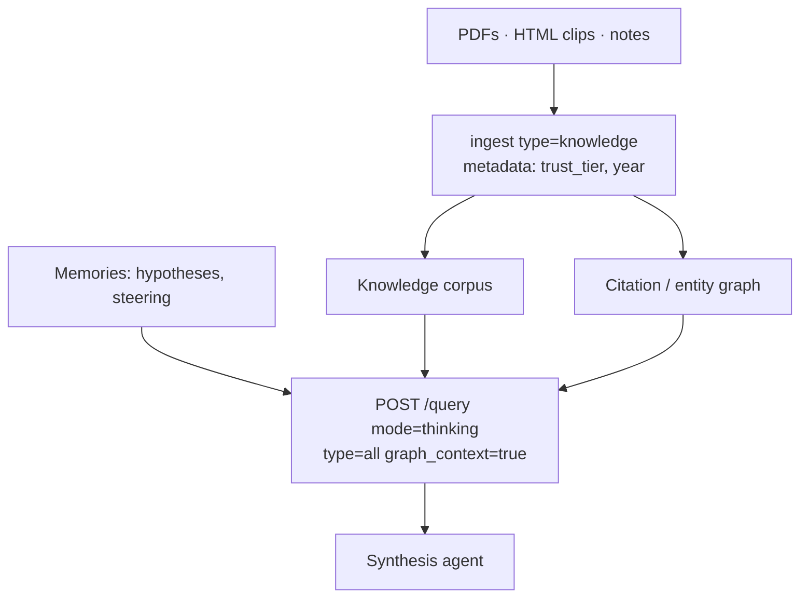
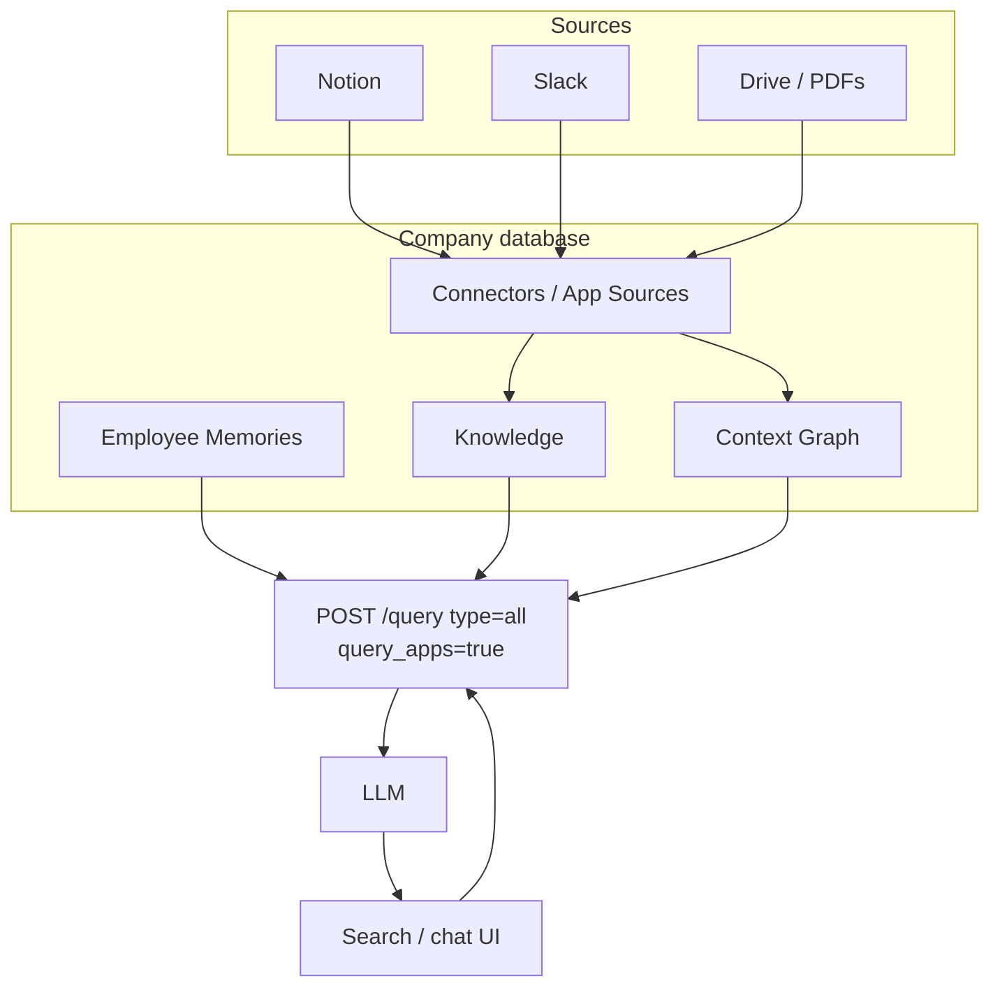
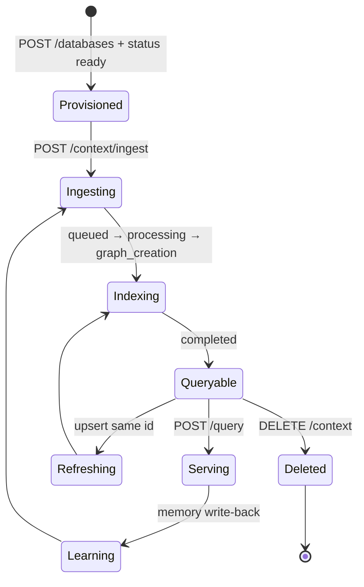

These are **complete system shapes**, not endpoint tutorials. Each architecture shows how sources flow through ingestion, stores, graph, query, and the LLM — using only real HydraDB surfaces: [`POST /context/ingest`](/api-reference/v2/endpoint/ingest-context), [`POST /query`](/api-reference/v2/endpoint/query), databases/collections, metadata, and graph context.

---

## 1. Slack → Knowledge → Graph → Query → LLM

Canonical team-knowledge loop for channels that hold decisions.

| Concern | Design |
| --- | --- |
| IDs | Stable `id` / `external_id` per message or thread snapshot |
| Scope | Company `database`; optional channel → `collection` or metadata `channel` |
| Query | `query_apps: true`, `mode: "thinking"` for thread reconstruction |
| Refresh | Re-ingest upserts on edit; [`DELETE /context`](/api-reference/v2/endpoint/delete-source) on delete events |

Related: [App Sources](/essentials/v2/app-sources) · [Connectors](/essentials/v2/connectors)

---

## 2. Personalized Support Desk

Help Knowledge is shared; customer state is Memories.

Alternatively use a single `type: "all"` query scoped to the customer `collection` when prompt formatting can be unified — see [Query](/essentials/v2/query).

Cookbook: [Customer Support Agent](/cookbooks/v2/customer-support-agent)

---

## 3. Enterprise SaaS Multi-Tenant Brain

Hard isolation per customer org; collections for workspaces and seats.

| Concern | Design |
| --- | --- |
| Isolation | Never put two customers in one `database` |
| Env | `customer_a_prod` vs `customer_a_staging` as separate databases |
| Metadata | Per-customer schema fields: `department`, `region`, `classification` |
| AuthZ | Resolve `database` + `collection` from your session before any HydraDB call |

Related: [Multi-tenant](/essentials/v2/multi-tenant) · [Create Database](/api-reference/v2/endpoint/create-tenant)

---

## 4. Coding Agent with Repo Knowledge + Dev Memory

| Store | Content |
| --- | --- |
| Knowledge | ADRs, runbooks, service docs (upsert on merge to main) |
| Memories | Style prefs, prior incident conclusions, tool constraints |
| Graph | Service ownership and dependency questions |
| Ephemeral | Debug paste memories with `expiry_time` |

---

## 5. Research Corpus Synthesizer

**Design notes:** Prefer `metadata_filters` for `trust_tier` / year gates. Use `recency_bias` when newer literature should win. Archive dead projects by isolating or deleting the project `collection`'s sources.

---

## 6. Internal Knowledge Assistant (Notion + Slack + Drive)

| Concern | Design |
| --- | --- |
| ACL-shaped data | Encode visibility in `metadata` (`department`, `confidentiality`) and always filter |
| Personalization | Employee `collection` Memories for role and search prefs |
| Sync | Connector-driven refresh; treat `external_id` as upsert key |

Related: [Glean Clone](/cookbooks/v2/glean-clone) · [Connectors](/essentials/v2/connectors)

---

## Architecture selection matrix

| If you need… | Start from architecture |
| --- | --- |
| Channel decision search | #1 Slack → Knowledge → Graph |
| Ticket personalization | #2 Support Desk |
| Multi-customer SaaS | #3 Enterprise Multi-Tenant |
| IDE / coding agent | #4 Coding Agent |
| Long-form synthesis | #5 Research Corpus |
| Company-wide search | #6 Internal Assistant |

---

## Shared production spine

Every architecture above shares the same operational spine from [Architecture](/essentials/v2/architecture):

Poll [`GET /context/status`](/api-reference/v2/endpoint/source-status) (or use [webhooks](/essentials/v2/webhooks)) before treating new sources as fully graph-ready.

---

## Next

- [Context Lifecycle](/essentials/v2/context-architecture/lifecycle) — months-long evolution
- [Anti-Patterns](/essentials/v2/context-architecture/anti-patterns) — how these architectures go wrong
- [Production Examples](/essentials/v2/context-architecture/production-examples) — domain walkthroughs
