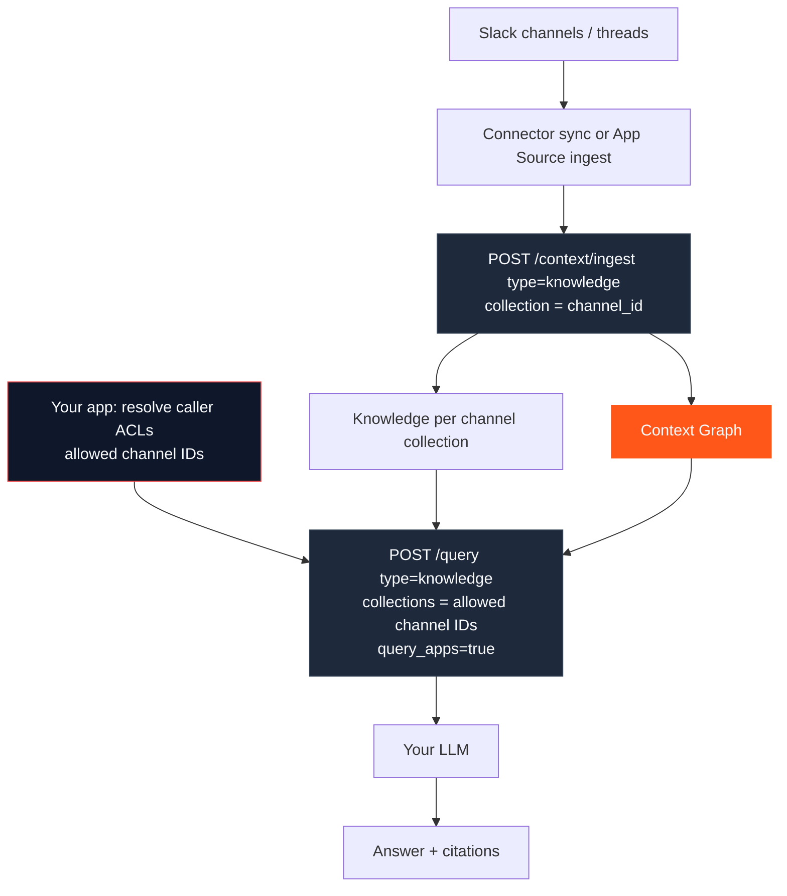
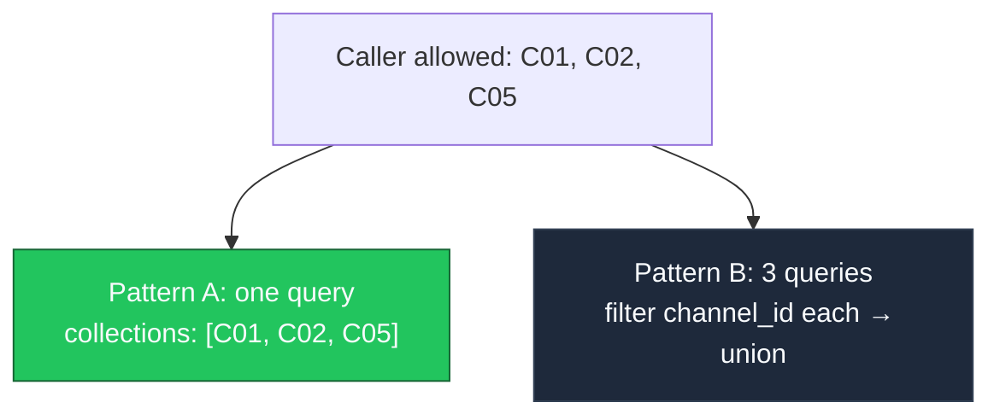
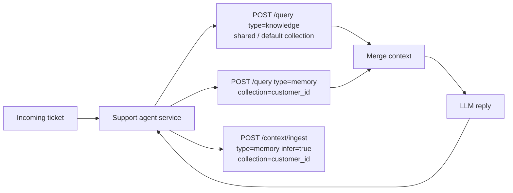
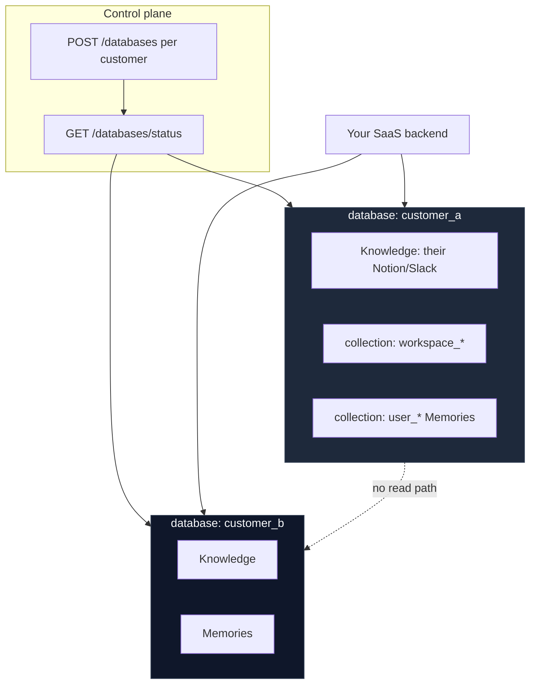
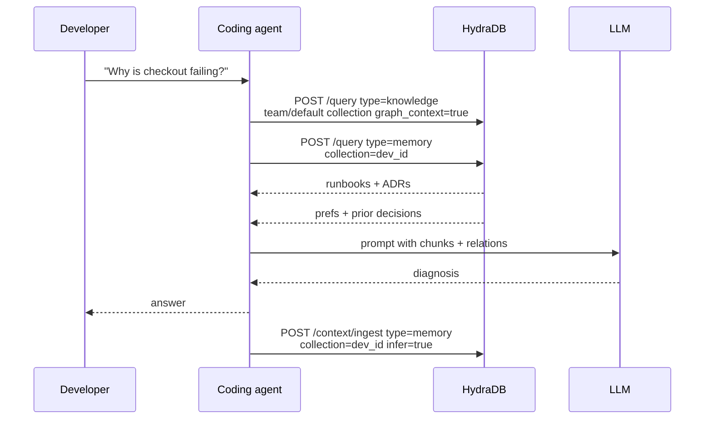
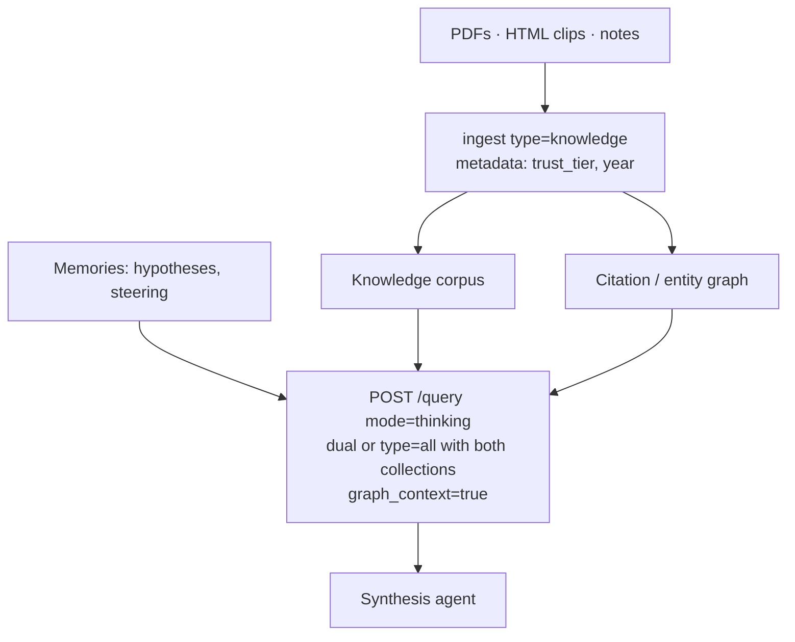
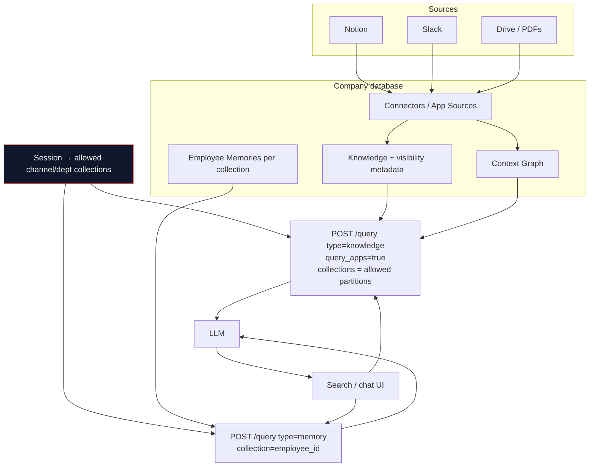
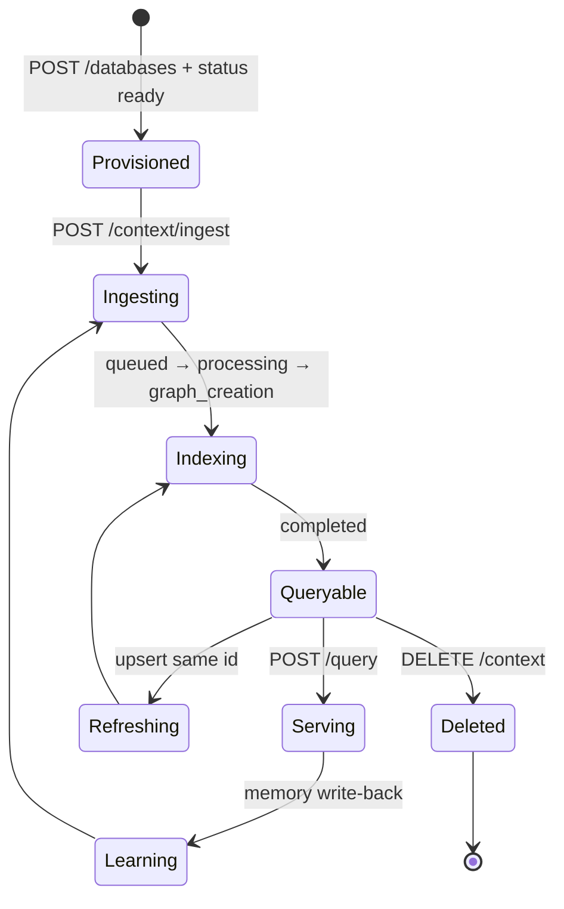

These are **complete system shapes**, not endpoint tutorials. Each architecture shows how sources flow through ingestion, stores, graph, query, and the LLM — using only real HydraDB surfaces: [`POST /context/ingest`](/api-reference/v2/endpoint/ingest-context), [`POST /query`](/api-reference/v2/endpoint/query), databases/collections, metadata, and graph context.

---

## 1. Slack → Knowledge → Graph → Query → LLM

Canonical team-knowledge loop for channels that hold decisions.

| Concern | Design |
| --- | --- |
| IDs | Stable `id` / `external_id` per message or thread snapshot |
| Ingest scope | **One HydraDB `collection` per Slack channel** (`collection = channel_id`). Do not dump every channel into one workspace collection if membership differs by channel |
| Query scope | Resolve the caller's allowed channel IDs in **your app**, then call [`POST /query`](/api-reference/v2/endpoint/query) with `collections: [<allowed channel ids>]` (max 100). That is the supported multi-channel fanout |
| Query extras | `query_apps: true`, `mode: "thinking"` for thread reconstruction — only after `collections` is restricted to allowed channels |
| Refresh | Re-ingest upserts on edit; [`DELETE /context`](/api-reference/v2/endpoint/delete-source) on delete events |

### Multi-channel ACL (implementable pattern)

`metadata_filters` are **exact equality** (lists are exact set match, not `IN` / `OR`). You cannot encode “channel is C01 **or** C02 **or** C03” in a single filter value — see [Metadata filter semantics](/essentials/v2/metadata#filter-semantics).

Use one of these safe patterns:

| Pattern | When to use | How |
| --- | --- | --- |
| **A. Channel = collection (recommended)** | User may access many channels | Ingest each channel into `collection = channel_id`. Query once with `collections: […allowed channel ids…]` |
| **B. Parallel queries + union** | You already stamped `metadata.channel_id` in one shared collection | For each allowed channel, `POST /query` with `metadata_filters: { "channel_id": "C0…" }`, then **union and re-rank in your app** (the documented OR path) |
| **C. Single-channel session** | UI is already scoped to one channel | One `collection` or one equality filter is enough |

<Warning>
  **Unsafe patterns:** (1) unscoped company-wide `query_apps: true`, (2) one workspace `collection` for all channels when private-channel membership differs, (3) `metadata_filters: { "channel_id": ["C01","C02"] }` expecting OR/IN — that is exact set equality and will not match single-channel sources. HydraDB does not infer Slack membership; your app must resolve ACLs before query.
</Warning>

Related: [App Sources](/essentials/v2/app-sources) · [Connectors](/essentials/v2/connectors) · [Metadata](/essentials/v2/metadata) · [Query `collections`](/essentials/v2/query#scope)

---

## 2. Personalized Support Desk

Help Knowledge is shared; customer state is Memories.

**Why two queries (default):** Shared help articles live in the default (or team) Knowledge collection; customer Memories live under `collection = customer_id`. A single `type: "all"` call with only the customer collection **does not** retrieve Knowledge written under a different collection — see [Multi-tenant](/essentials/v2/multi-tenant).

**One-call alternative:** If you want a single [`POST /query`](/api-reference/v2/endpoint/query), pass `type: "all"` with `collections` covering **both** partitions (e.g. shared Knowledge collection + `customer_id`), or ingest shared macros into every customer collection (usually worse). Prefer dual query when Knowledge and Memories need different prompt formatting — see [Query](/essentials/v2/query).

Cookbook: [Customer Support Agent](/cookbooks/v2/customer-support-agent)

---

## 3. Enterprise SaaS Multi-Tenant Brain

Hard isolation per customer org; collections for workspaces and seats.

| Concern | Design |
| --- | --- |
| Isolation | Never put two customers in one `database` |
| Env | `customer_a_prod` vs `customer_a_staging` as separate databases |
| Metadata | Per-customer schema fields: `department`, `region`, `classification` |
| AuthZ | Resolve `database` + `collection` from your session before any HydraDB call |

Related: [Multi-tenant](/essentials/v2/multi-tenant) · [Create Database](/api-reference/v2/endpoint/create-tenant)

---

## 4. Coding Agent with Repo Knowledge + Dev Memory

| Store | Content |
| --- | --- |
| Knowledge | ADRs, runbooks, service docs in the **shared** team/default collection (upsert on merge to main) |
| Memories | Style prefs, prior incident conclusions, tool constraints under `collection = dev_id` |
| Query | Dual query (recommended) or one `type: "all"` with `collections` listing **both** the shared Knowledge collection and `dev_id` |
| Graph | Service ownership and dependency questions on the Knowledge query |
| Ephemeral | Debug paste memories with `expiry_time` |

---

## 5. Research Corpus Synthesizer

**Design notes:** Prefer `metadata_filters` for `trust_tier` / year gates. Keep corpus Knowledge and steering Memories in explicit collections — dual query or `collections` fanout when they differ. Use `recency_bias` when newer literature should win. Archive dead projects by isolating or deleting the project `collection`'s sources.

---

## 6. Internal Knowledge Assistant (Notion + Slack + Drive)

| Concern | Design |
| --- | --- |
| ACL-shaped data | Prefer **one collection per ACL boundary** (Slack channel, Notion space, dept). Query with `collections: […allowed…]`. For a single equality attribute in one shared collection, run parallel queries and union — do not expect `metadata_filters` arrays to mean OR/IN ([filter semantics](/essentials/v2/metadata#filter-semantics)) |
| Personalization | Employee Memories under `collection = employee_id`; query Memories separately (or `type: "all"` with `collections` that include both the allowed Knowledge partitions and the employee collection) |
| Sync | Connector-driven refresh; treat `external_id` as upsert key; map Slack channels to collections as in [architecture #1](#1-slack--knowledge--graph--query--llm) |

Related: [Glean Clone](/cookbooks/v2/glean-clone) · [Connectors](/essentials/v2/connectors) · [Metadata](/essentials/v2/metadata)

---

## Architecture selection matrix

| If you need… | Start from architecture |
| --- | --- |
| Channel decision search | #1 Slack → Knowledge → Graph |
| Ticket personalization | #2 Support Desk |
| Multi-customer SaaS | #3 Enterprise Multi-Tenant |
| IDE / coding agent | #4 Coding Agent |
| Long-form synthesis | #5 Research Corpus |
| Company-wide search | #6 Internal Assistant |

---

## Shared production spine

Every architecture above shares the same operational spine from [Architecture](/essentials/v2/architecture):

Poll [`GET /context/status`](/api-reference/v2/endpoint/source-status) (or use [webhooks](/essentials/v2/webhooks)) before treating new sources as fully graph-ready.

---

## Next

- [Context Lifecycle](/essentials/v2/context-architecture/lifecycle) — months-long evolution
- [Anti-Patterns](/essentials/v2/context-architecture/anti-patterns) — how these architectures go wrong
- [Production Examples](/essentials/v2/context-architecture/production-examples) — domain walkthroughs
