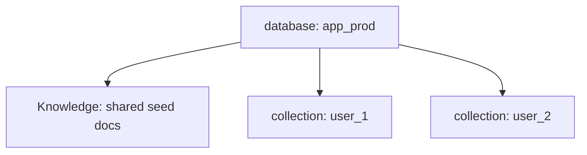
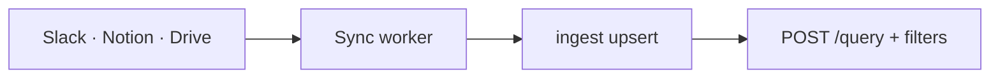
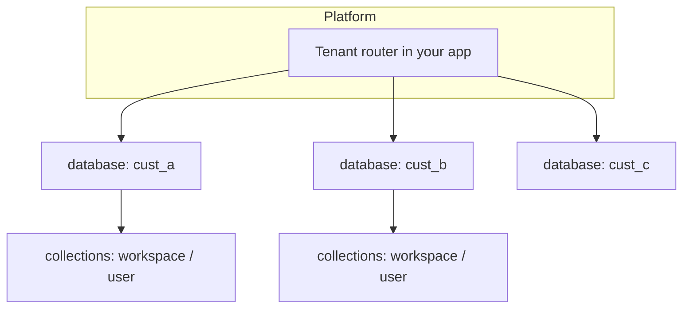
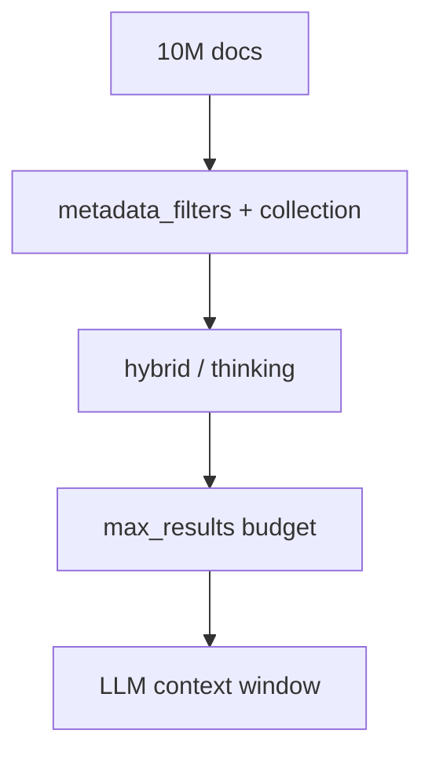
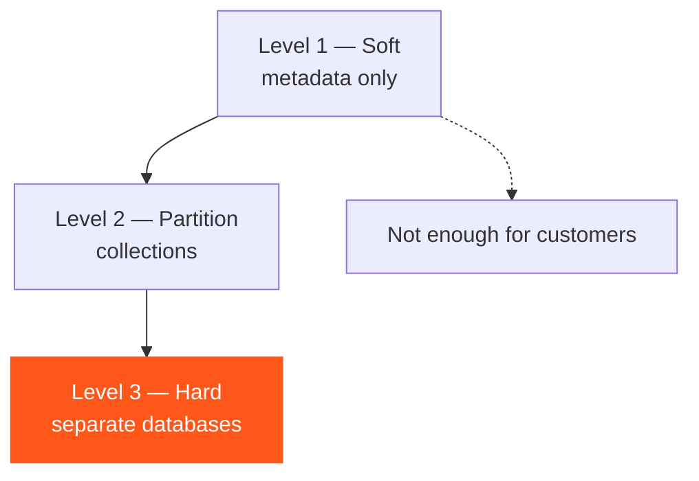

Scale changes **boundaries**, not the API. The same primitives ([databases](/essentials/v2/multi-tenant), collections, Knowledge, Memories, metadata, query) recompose as user count and corpus size grow.

---

## Scale ladder

| Stage | Dominant constraint | Architecture move |
| --- | --- | --- |
| 10 users | Correctness of the model | One DB; learn ID + scope discipline |
| 100 users | Preference isolation | `collection` per user; stop using default for Memories |
| 1,000 users | Shared Knowledge quality | Metadata schema; upsert sync; graph for "who owns" |
| 100K users | Tenant + workspace fanout | DB-per-customer (B2B) or careful B2C partitions; weighted `collections` sparingly |
| 10M documents | Retrieval precision + ops | Strict filters, lifecycle prune, connector-driven refresh, eval harness |

---

## 10 users — establish the spine

**Organization boundary:** Usually one `database` for the product (plus staging).

**Collections:** Introduce `collection = user_id` even if it feels early — retrofitting is painful.

**Metadata:** Declare the 3–5 filters you know you will need (`status`, `doc_type`).

**Isolation:** Still mostly social trust; practice as if you already have tenants.

---

## 100 users — personalization becomes real

**What changes:** Memory write-back volume rises. Cross-user leakage shows up if collections were sloppy.

| Do | Don't |
| --- | --- |
| Memory ingest/query with explicit user collection | Stuff `user_id` only into metadata and share one collection |
| `type: "all"` for personalized features | Query Knowledge-only and hope the LLM "knows" the user |
| `expiry_time` on session notes | Keep every chat forever |

---

## 1,000 users — Knowledge ops dominate

**What changes:** Human uploads cannot keep the corpus fresh. Connectors / app sources matter. Duplicate IDs appear without upsert discipline.

**Architecture upgrades:**

1. Stable IDs from upstream keys
2. Scheduled or event-driven refresh ([Connectors](/essentials/v2/connectors))
3. `metadata_filters` on every productized query path
4. Graph enabled for relational internal questions; disabled on hot low-latency paths when unused

---

## 100K users — organization boundaries harden

### B2B SaaS

- **One database per customer organization** — hard isolation ([Multi-tenant](/essentials/v2/multi-tenant))
- Collections for workspaces and seats inside the customer
- Provision on signup; gate traffic on [database status](/api-reference/v2/endpoint/tenant-status)
- Never "filter" your way across customers in one DB

### B2C at this scale

- Still often one app `database` (or sharded by region/environment as *your* ops require)
- `collection` per user remains the personalization boundary
- Shared Knowledge stays in a well-known collection (often default) queried with `type: "knowledge"` or `"all"`

### Query fanout

[`collections`](/essentials/v2/query) can search multiple partitions (list or weighted object, max 100). Use for intentional workspace fanout — not as a substitute for missing tenancy design.

---

## 10M documents — precision and lifecycle

At this corpus size, **architecture is mostly negative space**: what you refuse to retrieve.

| Pressure | Response |
| --- | --- |
| Semantic collisions | Strong `metadata_filters`; prefer schema-backed `metadata` for hot gates |
| Stale content | Upsert refresh + archive status + delete jobs |
| Graph payload size | `graph_context: false` when unused; `mode: "fast"` on simple lookups |
| Eval blindness | Replay harness with golden citations ([Lifecycle → Replay](/essentials/v2/context-architecture/lifecycle#8-replay)) |
| Cost | Prune ephemeral memories; drop duplicate sources |

---

## Organization boundaries cheat sheet

| Boundary | Prefer | Example |
| --- | --- | --- |
| Legal / billing customer | `database` | `acme_corp` vs `globex` |
| Environment | `database` | `acme_prod` vs `acme_staging` |
| Workspace / team | `collection` | `ws_42` |
| End user prefs | `collection` | `user_9f3a` |
| Doc attributes | `metadata` | `department=legal` |
| Citation / external ids | `additional_metadata` | `notion_page_id` |

**Collections** partition. **Metadata** narrows. **Databases** isolate. Mixing these responsibilities is the most common scaling failure — see [Anti-Patterns](/essentials/v2/context-architecture/anti-patterns).

---

## Isolation levels

| Level | Mechanism | Use when |
| --- | --- | --- |
| Soft | `metadata_filters` | Attributes inside a trusted tenant |
| Partition | `collection` | Users/teams inside one org |
| Hard | `database` | Separate customers or environments |

---

## Scaling query posture

| Stage | Typical `mode` | Graph | Notes |
| --- | --- | --- | --- |
| Early | `thinking` OK | on | Optimize for quality |
| Mid | Split paths | selective | Fast FAQ vs deep research |
| Large | Explicit `fast` / `thinking` | opt-in | Avoid auto surprises on SLOs |

Parameter reference: [Query](/essentials/v2/query)

---

## Next

- [Production Checklist](/essentials/v2/context-architecture/checklist)
- [Reference Architectures](/essentials/v2/context-architecture/reference-architectures)
- [Multi-tenant](/essentials/v2/multi-tenant)
