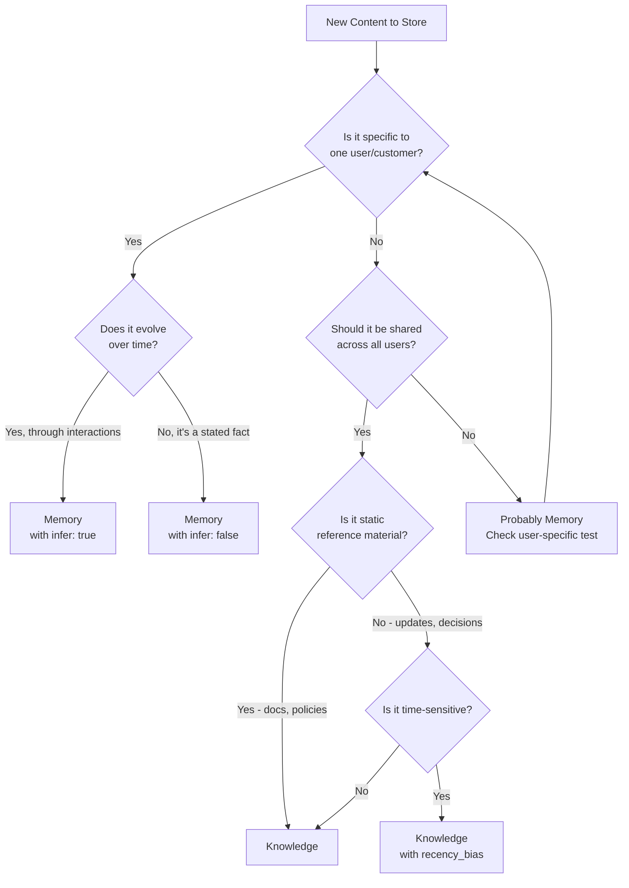

Memory or Knowledge? This is the first decision every HydraDB integration makes. Get it wrong and you'll store user preferences in shared docs or leak private data across users. Get it right and your retrieval becomes fast, relevant, and secure.

This guide gives you a decision framework, visual decision trees, and real patterns for the most common scenarios.

## When to Read This Guide

**Read this if:**
- ✅ You're deciding how to structure your data in HydraDB
- ✅ You're confused about Memory vs Knowledge
- ✅ You don't know when to use `infer: true` or `false`
- ✅ You have multiple data sources (Slack, docs, CRM, etc.)
- ✅ You need to design a multi-tenant architecture

**Skip this if:**
- ❌ You've already structured your data and it's working well
- ❌ You only have one simple data source

## What You'll Learn

1. **How to decide Memory vs Knowledge** - Clear criteria with examples
2. **When to use `infer: true` vs `false`** - What each does and when to use it
3. **Architecture patterns** - B2C, B2B, and internal tool structures
4. **Multi-source strategy** - Combining Slack, docs, CRM, email, etc.
5. **Common mistakes and how to avoid them**

---

## The Core Decision

Every piece of content you store needs to answer these three questions:

### 1. Is this Memory or Knowledge?

**The one-question test:** Should every user in this database be able to retrieve this?

- **Yes** → Store as [Knowledge](/essentials/v2/knowledge)
- **No** → Store as [Memory](/essentials/v2/memories)

### 2. Should I use `infer: true` or `false`?

**For Memories only:**

- **Raw behaviors, logs, conversations** → `infer: true` (let HydraDB extract meaning)
- **Already clean facts, stated preferences** → `infer: false` (store verbatim)

### 3. Which query `type` should I use?

**When retrieving:**

- Shared docs only → `type: "knowledge"`
- User context only → `type: "memory"`
- Personalized + grounded → `type: "all"`

---

## Quick Reference Table

| Content Type | Store As | Collection Scope | Example |
|--------------|----------|------------------|---------|
| User preferences | Memory | `user-{user_id}` | "Prefers dark mode, email notifications off" |
| Product documentation | Knowledge | Shared | API docs, user guides |
| Chat history | Memory | `user-{user_id}` | Support conversation turns |
| Slack threads | Knowledge | Shared | #engineering discussions |
| 1-on-1 meeting notes | Memory | `user-{user_id}` | Personal action items |
| Team meeting notes | Knowledge | Shared | Stand-up decisions |
| Customer account data | Memory | `customer-{customer_id}` | Account details, tier, usage |
| Company policies | Knowledge | Shared | HR handbook, security policies |
| User behavior logs | Memory (with `infer: true`) | `user-{user_id}` | "Opened settings 5x, enabled dark mode" |
| Email threads | Depends | See decision tree | Could be either |


---

## Memory vs Knowledge Decision Tree

Use this flowchart to decide where your content belongs:



### Decision Examples

**Example 1: Slack message in #engineering**
- User-specific? **No** (whole team sees it)
- Should be shared? **Yes**
- **Result:** Knowledge

**Example 2: User's notification preferences**
- User-specific? **Yes**
- Evolves over time? **No** (explicit setting)
- **Result:** Memory with `infer: false`

**Example 3: Chat conversation with support**
- User-specific? **Yes**
- Evolves over time? **Yes** (conversation builds context)
- **Result:** Memory with `infer: true`

**Example 4: Company handbook PDF**
- User-specific? **No**
- Should be shared? **Yes**
- Static reference? **Yes**
- **Result:** Knowledge

**Example 5: User opened app 10 times this week**
- User-specific? **Yes**
- Evolves over time? **Yes** (behavior pattern)
- **Result:** Memory with `infer: true` (let HydraDB extract "power user" trait)

---

## The `infer` Flag Explained

The `infer` parameter (Memories only) controls whether HydraDB extracts meaning from your input or stores it verbatim.

### What happens with `infer: true`

HydraDB analyzes the input and extracts:
- **Preferences** from behavior ("opened settings 5x" → "prefers customization")
- **Traits** from patterns ("always replies fast" → "values responsiveness")
- **Facts** from conversations ("I'm in PST" → timezone preference)
- **Intentions** from actions ("disabled email notif" → communication preference)

**Use when:** You have raw signal and want HydraDB to extract the useful memory.

### What happens with `infer: false`

HydraDB stores exactly what you send, with no interpretation.

**Use when:** You've already extracted the clean fact and just want to store it.

### Decision Matrix

| Input Type | Use | Example |
|------------|-----|---------|
| Raw behavior logs | `infer: true` | "User opened settings 14 times this month" |
| Conversation turns | `infer: true` | User/assistant dialogue with implicit preferences |
| Already clean preferences | `infer: false` | "User prefers dark mode" |
| Structured facts | `infer: false` | "User tier: Enterprise, Account: Acme Corp" |
| Mixed behavior + context | `infer: true` | "In 3 sessions, user enabled dark mode, disabled notifications, set language to ES" |


### Side-by-Side Examples

<CodeGroup>
```python Python - infer: true (extract meaning)
# Raw behavior - let HydraDB extract preferences
client.context.ingest(
    type='memory',
    database="app",
    collection="user-alice",
    memories=[{
        "text": "User opened app at 6am every day this week. "
                "Enabled dark mode on first login. "
                "Disabled email notifications but kept push enabled. "
                "Set timezone to US/Pacific.",
        "infer": True,  # HydraDB extracts: early riser, prefers dark mode, 
                        # values push over email, works in PST
        "user_name": "alice"
    }]
)
```

```python Python - infer: false (store verbatim)
# Already clean facts - store as-is
client.context.ingest(
    type='memory',
    database="app",
    collection="user-alice",
    memories=[{
        "text": "User prefers dark mode. "
                "User has email notifications disabled. "
                "User timezone: US/Pacific. "
                "User is an early riser (active 6-8am).",
        "infer": False,  # Store exactly as written
        "user_name": "alice"
    }]
)
```

```typescript TypeScript - infer: true
// Raw conversation - extract implicit preferences
await client.context.ingest({
  type: 'memory',
  database: "support",
  collection: "customer-bob",
  memories: [{
    user_assistant_pairs: [
      {
        user: "I need help urgently, this is blocking my team",
        assistant: "I'll prioritize this. What's the issue?"
      },
      {
        user: "Thanks for the quick response!",
        assistant: "Happy to help!"
      }
    ],
    infer: true,  // Extracts: values fast response, has team dependencies
    user_name: "bob"
  }]
});
```

```typescript TypeScript - infer: false
// Explicit preferences - store directly
await client.context.ingest({
  type: 'memory',
  database: "support",
  collection: "customer-bob",
  memories: [{
    text: "Customer prefers urgent response times. " +
          "Customer has team dependencies. " +
          "Customer account: Enterprise tier.",
    infer: false,  // Store verbatim
    user_name: "bob"
  }]
});
```
</CodeGroup>

> **Performance tip:** `infer: true` adds processing time but creates richer, more queryable memories. Use it when you need HydraDB to extract patterns from raw data. Use `infer: false` when you've already done the extraction and want faster ingestion.

---

## Architecture Patterns

Different application types need different data structures. Here are the three most common patterns:

### Pattern 1: B2C App (Consumer Application)

**Use when:** Each user has their own isolated data, minimal sharing between users.

**Structure:**
```
database: "app_name"
collection: "user-{user_id}"

Memory: User preferences, chat history, behavior patterns
Knowledge: Help docs, FAQs, product info (shared across all users)
```

**Query strategy:**
- User-specific queries: `type: "memory"`, `collection: "user-{user_id}"`
- Help/docs queries: `type: "knowledge"`
- Personalized help: `type: "all"`, `collection: "user-{user_id}"`

**Complete example:**

<CodeGroup>
```python Python SDK
# B2C App - Personal Assistant
from hydra_db import HydraDB
import os

client = HydraDB(token=os.environ["HYDRA_DB_API_KEY"])
DATABASE = "personal_assistant"

# 1. Ingest shared knowledge (once, for all users)
with open("help_docs.pdf", "rb") as f:
    client.context.ingest(
        type="knowledge",
        database=DATABASE,
        documents=[("help_docs.pdf", f, "application/pdf")]
    )

# 2. Ingest user-specific memory (per user)
def add_user_memory(user_id: str, user_behavior: str):
    client.context.ingest(
        type='memory',
        database=DATABASE,
        collection=f"user-{user_id}",
        memories=[{
            "text": user_behavior,
            "infer": True,
            "user_name": user_id
        }]
    )

# 3. Query with personalization
def personalized_query(user_id: str, question: str):
    return client.query(
        query=question,
        database=DATABASE,
        collection=f"user-{user_id}",
        type="all",  # Get both Memory + Knowledge
        mode="thinking"
    )
```
</CodeGroup>


### Pattern 2: B2B SaaS (Team Workspace)

**Use when:** Organizations have shared workspace data, but users still need personalization.

**Structure:**
```
database: "{org_id}"
collection: "workspace-{workspace_id}" OR "user-{user_id}"

Memory: User preferences, personal notes, working context
Knowledge: Org docs, policies, meeting notes, Slack archives
```

**Query strategy:**
- Workspace-wide queries: `type: "knowledge"`
- User personalized: `type: "memory"`, `collection: "user-{user_id}"`
- Full context: `type: "all"`, multiple collections with weights

**Complete example:**

<CodeGroup>
```python Python SDK
# B2B SaaS - Team Collaboration Platform
from hydra_db import HydraDB
import os

client = HydraDB(token=os.environ["HYDRA_DB_API_KEY"])

# Structure: database per org, collections for users/workspaces
def get_database(org_id: str) -> str:
    return f"org-{org_id}"

# 1. Ingest org-wide knowledge (shared by all users in org)
def add_org_knowledge(org_id: str, content: str, source_type: str):
    client.context.ingest(
        type="knowledge",
        database=get_database(org_id),
        app_knowledge=json.dumps([{
            "id": f"{source_type}-{timestamp}",
            "database": get_database(org_id),
            "collection": get_database(org_id),
            "title": f"{source_type} content",
            "type": source_type,  # "slack", "notion", "confluence"
            "content": {"text": content}
        }])
    )

# 2. Ingest user-specific memory
def add_user_memory(org_id: str, user_id: str, memory_text: str):
    client.context.ingest(
        type='memory',
        database=get_database(org_id),
        collection=f"user-{user_id}",
        memories=[{
            "text": memory_text,
            "infer": True,
            "user_name": user_id
        }]
    )

# 3. Query with user + workspace context
def team_query(org_id: str, user_id: str, workspace_id: str, question: str):
    # Weight user context higher than workspace context
    return client.query(
        query=question,
        database=get_database(org_id),
        collections={
            f"user-{user_id}": 2.0,      # User context weighted higher
            f"workspace-{workspace_id}": 1.0  # Workspace context
        },
        type="all",
        mode="thinking"
    )
```

```typescript TypeScript SDK
// B2B SaaS - Team Collaboration Platform
import { HydraDBClient } from "@hydradb/sdk";

const client = new HydraDBClient({ 
  token: process.env.HYDRA_DB_API_KEY! 
});

const getDatabase = (orgId: string) => `org-${orgId}`;

// 1. Ingest org-wide knowledge
async function addOrgKnowledge(
  orgId: string, 
  content: string, 
  sourceType: string
) {
  await client.context.ingest({
    type: "knowledge",
    database: getDatabase(orgId),
    appKnowledge: JSON.stringify([{
      id: `${sourceType}-${Date.now()}`,
      database: getDatabase(orgId),
      collection: getDatabase(orgId),
      title: `${sourceType} content`,
      type: sourceType,
      content: { text: content }
    }])
  });
}

// 2. Ingest user memory
async function addUserMemory(
  orgId: string, 
  userId: string, 
  memoryText: string
) {
  await client.context.ingest({
    type: 'memory',
    database: getDatabase(orgId),
    collection: `user-${userId}`,
    memories: [{
      text: memoryText,
      infer: true,
      user_name: userId
    }]
  });
}

// 3. Query with weighted collections
async function teamQuery(
  orgId: string,
  userId: string,
  workspaceId: string,
  question: string
) {
  return await client.query({
    query: question,
    database: getDatabase(orgId),
    collections: {
      [`user-${userId}`]: 2.0,          // User context
      [`workspace-${workspaceId}`]: 1.0  // Workspace context
    },
    type: "all",
    mode: "thinking"
  });
}
```
</CodeGroup>


### Pattern 3: Internal Tool (Company-Wide Search)

**Use when:** Building internal search across company data (Slack, email, docs, wikis).

**Structure:**
```
database: "company"
collection: "shared" (Knowledge) + "user-{user_id}" (Memory)

Memory: Personal notes, search history, viewed documents, preferences
Knowledge: Slack, Confluence, GitHub, Gmail, calendar, file storage
```

**Query strategy:**
- Company-wide search: `type: "knowledge"`
- Personalized ranking: `type: "all"` with user collection
- User's personal notes: `type: "memory"`, `collection: "user-{user_id}"`

**Complete example:**

<CodeGroup>
```python Python SDK
# Internal Tool - Company Knowledge Search
from hydra_db import HydraDB
import os

client = HydraDB(token=os.environ["HYDRA_DB_API_KEY"])
DATABASE = "company_search"

# 1. Ingest company-wide knowledge from multiple sources
def ingest_slack_thread(thread_content: str, channel: str):
    client.context.ingest(
        type="knowledge",
        database=DATABASE,
        app_knowledge=json.dumps([{
            "id": f"slack-{channel}-{timestamp}",
            "database": DATABASE,
            "collection": DATABASE,
            "title": f"Slack thread from #{channel}",
            "type": "slack",
            "content": {"text": thread_content},
            "metadata": {"channel": channel, "source": "slack"}
        }])
    )

def ingest_confluence_page(page_content: str, space: str):
    client.context.ingest(
        type="knowledge",
        database=DATABASE,
        app_knowledge=json.dumps([{
            "id": f"confluence-{space}-{timestamp}",
            "database": DATABASE,
            "collection": DATABASE,
            "title": f"Confluence page from {space}",
            "type": "confluence",
            "content": {"text": page_content},
            "metadata": {"space": space, "source": "confluence"}
        }])
    )

# 2. Store user's personal search context
def track_user_activity(user_id: str, activity: str):
    client.context.ingest(
        type='memory',
        database=DATABASE,
        collection=f"user-{user_id}",
        memories=[{
            "text": activity,
            "infer": True,  # Extract patterns from user behavior
            "user_name": user_id
        }]
    )

# 3. Query with personalized ranking
def company_search(user_id: str, query: str, source_filter: str = None):
    kwargs = {
        "query": query,
        "database": DATABASE,
        "type": "all",  # Knowledge + user's Memory
        "collections": {
            DATABASE: 1.0,           # Company knowledge
            f"user-{user_id}": 0.5   # User context for personalization
        },
        "mode": "fast",
        "max_results": 15
    }
    
    # Optional: filter by source
    if source_filter:
        kwargs["metadata_filters"] = {"source": source_filter}
    
    return client.query(**kwargs)
```

```typescript TypeScript SDK
// Internal Tool - Company Knowledge Search
import { HydraDBClient } from "@hydradb/sdk";

const client = new HydraDBClient({ 
  token: process.env.HYDRA_DB_API_KEY! 
});
const DATABASE = "company_search";

// 1. Ingest from multiple sources
async function ingestSlackThread(
  threadContent: string, 
  channel: string
) {
  await client.context.ingest({
    type: "knowledge",
    database: DATABASE,
    appKnowledge: JSON.stringify([{
      id: `slack-${channel}-${Date.now()}`,
      database: DATABASE,
      collection: DATABASE,
      title: `Slack thread from #${channel}`,
      type: "slack",
      content: { text: threadContent },
      metadata: { channel, source: "slack" }
    }])
  });
}

async function ingestConfluencePage(
  pageContent: string, 
  space: string
) {
  await client.context.ingest({
    type: "knowledge",
    database: DATABASE,
    appKnowledge: JSON.stringify([{
      id: `confluence-${space}-${Date.now()}`,
      database: DATABASE,
      collection: DATABASE,
      title: `Confluence page from ${space}`,
      type: "confluence",
      content: { text: pageContent },
      metadata: { space, source: "confluence" }
    }])
  });
}

// 2. Track user activity
async function trackUserActivity(
  userId: string, 
  activity: string
) {
  await client.context.ingest({
    type: 'memory',
    database: DATABASE,
    collection: `user-${userId}`,
    memories: [{
      text: activity,
      infer: true,
      user_name: userId
    }]
  });
}

// 3. Personalized search
async function companySearch(
  userId: string,
  query: string,
  sourceFilter?: string
) {
  const params: any = {
    query,
    database: DATABASE,
    type: "all",
    collections: {
      [DATABASE]: 1.0,
      [`user-${userId}`]: 0.5
    },
    mode: "fast",
    maxResults: 15
  };
  
  if (sourceFilter) {
    params.metadataFilters = { source: sourceFilter };
  }
  
  return await client.query(params);
}
```
</CodeGroup>


---

## Common Scenarios with Complete Examples

### Scenario 1: Customer Support Bot

**Context:** Support bot needs help articles (Knowledge) + customer history (Memory)

**Data structure:**
- Knowledge: Help articles, resolved tickets, FAQs
- Memory: Customer account info, past conversations, preferences

<CodeGroup>
```python Python SDK
# Customer Support Bot
def handle_support_query(customer_id: str, question: str):
    # Query both Knowledge (help articles) and Memory (customer context)
    result = client.query(
        query=question,
        database="support",
        collection=f"customer-{customer_id}",
        type="all",  # Get both Knowledge + Memory
        mode="thinking",
        max_results=10
    )
    
    # Result contains:
    # - Relevant help articles (from Knowledge)
    # - Customer's past issues (from Memory)
    # - Customer preferences (from Memory)
    # All ranked together by relevance
    
    return result
```

```typescript TypeScript SDK
// Customer Support Bot
async function handleSupportQuery(
  customerId: string, 
  question: string
) {
  const result = await client.query({
    query: question,
    database: "support",
    collection: `customer-${customerId}`,
    type: "all",  // Knowledge + Memory
    mode: "thinking",
    maxResults: 10
  });
  
  // Combines help articles with customer history
  return result;
}
```
</CodeGroup>

---

### Scenario 2: Personal AI Assistant

**Context:** Assistant learns from user over time, retrieves from documents

**Data structure:**
- Knowledge: User's documents, emails, calendar events
- Memory: User preferences, habits, inferred patterns

<CodeGroup>
```python Python SDK
# Personal AI Assistant
def assistant_query(user_id: str, question: str):
    # Start with user's Memory for highly personalized context
    result = client.query(
        query=question,
        database="assistant",
        collection=f"user-{user_id}",
        type="all",
        mode="thinking",
        recency_bias=0.3  # Slight preference for recent context
    )
    
    return result

# Track user interactions to build Memory
def learn_from_interaction(user_id: str, interaction: str):
    client.context.ingest(
        type='memory',
        database="assistant",
        collection=f"user-{user_id}",
        memories=[{
            "text": interaction,
            "infer": True,  # Extract preferences from interaction
            "user_name": user_id
        }]
    )
```

```typescript TypeScript SDK
// Personal AI Assistant
async function assistantQuery(userId: string, question: string) {
  return await client.query({
    query: question,
    database: "assistant",
    collection: `user-${userId}`,
    type: "all",
    mode: "thinking",
    recencyBias: 0.3
  });
}

async function learnFromInteraction(
  userId: string, 
  interaction: string
) {
  await client.context.ingest({
    type: 'memory',
    database: "assistant",
    collection: `user-${userId}`,
    memories: [{
      text: interaction,
      infer: true,
      user_name: userId
    }]
  });
}
```
</CodeGroup>

---

### Scenario 3: Team Wiki Search

**Context:** Search company wiki with personalized ranking based on user's role

**Data structure:**
- Knowledge: Wiki pages, Confluence, documentation
- Memory: User's frequently viewed pages, expertise areas, role

<CodeGroup>
```python Python SDK
# Team Wiki Search
def wiki_search(user_id: str, query: str, category: str = None):
    kwargs = {
        "query": query,
        "database": "company_wiki",
        "type": "knowledge",  # Only shared docs
        "mode": "fast",
        "max_results": 15
    }
    
    # Filter by category if specified
    if category:
        kwargs["metadata_filters"] = {"category": category}
    
    # For personalized ranking, could use type: "all" and include user Memory
    # to boost docs relevant to user's role
    
    return client.query(**kwargs)

# Track what users view to personalize future searches
def track_page_view(user_id: str, page_title: str, time_spent: int):
    client.context.ingest(
        type='memory',
        database="company_wiki",
        collection=f"user-{user_id}",
        memories=[{
            "text": f"User viewed '{page_title}' for {time_spent} seconds",
            "infer": True,  # Extract: user's interests, expertise areas
            "user_name": user_id
        }]
    )
```

```typescript TypeScript SDK
// Team Wiki Search
async function wikiSearch(
  userId: string,
  query: string,
  category?: string
) {
  const params: any = {
    query,
    database: "company_wiki",
    type: "knowledge",
    mode: "fast",
    maxResults: 15
  };
  
  if (category) {
    params.metadataFilters = { category };
  }
  
  return await client.query(params);
}

async function trackPageView(
  userId: string,
  pageTitle: string,
  timeSpent: number
) {
  await client.context.ingest({
    type: 'memory',
    database: "company_wiki",
    collection: `user-${userId}`,
    memories: [{
      text: `User viewed '${pageTitle}' for ${timeSpent} seconds`,
      infer: true,
      user_name: userId
    }]
  });
}
```
</CodeGroup>

---

### Scenario 4: Document Q&A (RAG)

**Context:** Answer questions from documents, no personalization needed

**Data structure:**
- Knowledge: Documents, PDFs, wikis
- Memory: Not needed (unless tracking user questions for analytics)

<CodeGroup>
```python Python SDK
# Document Q&A - Simple RAG
def document_qa(question: str):
    # Pure document retrieval, no user context
    result = client.query(
        query=question,
        database="docs",
        type="knowledge",  # Only documents
        mode="thinking",   # Best quality for Q&A
        max_results=10
    )
    
    # Pass chunks to LLM for answer generation
    context = "\n\n".join([
        chunk.chunk_content 
        for chunk in result.data.chunks
    ])
    
    # LLM call here with context + question
    return context
```

```typescript TypeScript SDK
// Document Q&A - Simple RAG
async function documentQA(question: string) {
  const result = await client.query({
    query: question,
    database: "docs",
    type: "knowledge",
    mode: "thinking",
    maxResults: 10
  });
  
  const context = result.data.chunks
    .map(chunk => chunk.chunkContent)
    .join("\n\n");
  
  // Pass to LLM for answer generation
  return context;
}
```
</CodeGroup>


---

## Migration & Evolution

### Starting Simple

Most integrations should start with Knowledge only, then add Memory when personalization matters.

**Phase 1: Knowledge only**
```python
# Start with shared documents
client.context.ingest(
    type="knowledge",
    database="app",
    documents=[("docs.pdf", file, "application/pdf")]
)

# Query without personalization
result = client.query(
    query="How do I reset password?",
    database="app",
    type="knowledge"
)
```

**Phase 2: Add Memory later**
```python
# Add user preferences when you need personalization
client.context.ingest(
    type='memory',
    database="app",
    collection=f"user-{user_id}",
    memories=[{"text": "User prefers detailed technical explanations",
                "infer": False, "user_name": user_id}]
)

# Query with personalization
result = client.query(
    query="How do I reset password?",
    database="app",
    collection=f"user-{user_id}",
    type="all"  # Now get Knowledge + Memory
)
```

### When to Migrate

**Knowledge → Memory:**
- You realize content is user-specific, not shared
- You need per-user filtering for privacy
- You want personalization based on user traits

**Memory → Knowledge:**
- Content is actually shared across users
- You want all users to find this content
- You're wasting storage with duplicated data

### Migration Code Example

<CodeGroup>
```python Python SDK
# Migrate Knowledge → Memory
# Note: This is a conceptual example. In practice, you'd need to:
# 1. Export data from your source system with user identification
# 2. Re-ingest as Memory in the correct collection

# Example: Moving user-specific notes to Memory
user_notes = [
    "User's personal project notes",
    "User's saved search preferences"
]

for note in user_notes:
    client.context.ingest(
        type='memory',
        database="app",
        collection=f"user-{user_id}",
        memories=[{
            "text": note,
            "infer": False,  # Already processed
            "user_name": user_id
        }]
    )
```
</CodeGroup>

---

## Troubleshooting

### Common Issues

| Problem | Likely Cause | Solution |
|---------|--------------|----------|
| **Memories not personalizing results** | Using `infer: false` on raw data | Switch to `infer: true` for behavior/conversation data |
| **Knowledge too generic** | Missing Memory context | Use `type: "all"` instead of `"knowledge"` |
| **User sees other users' data** | Wrong `collection` scope | Always use `collection: "user-{user_id}"` for user isolation |
| **Memories are noise, not signal** | Too much raw data with `infer: true` | Either clean data first (`infer: false`) or be selective about what you store |
| **Query returns nothing** | Wrong `type` parameter | Check if you're querying `"knowledge"` but data is in Memory (or vice versa) |
| **Slow Memory ingestion** | Using `infer: true` on large text | `infer: true` adds processing time - use `infer: false` for pre-extracted facts |
| **Knowledge not updating** | Cached old version | Re-ingest with same `id` to update, or delete and re-create |
| **Memory grows too large** | Storing everything | Be selective - not every interaction needs to be a Memory |

### Debugging Checklist

When things aren't working:

1. **Check `type` parameter**
   - Storing as Memory but querying with `type: "knowledge"`? Won't find it.
   - Storing as Knowledge but querying with `type: "memory"`? Won't find it.
   - Solution: Use `type: "all"` to query both, or match your store type.

2. **Check `collection` scope**
   - Did you set `collection` during ingest?
   - Are you querying the same `collection`?
   - For user isolation, always use `collection: "user-{user_id}"`.

3. **Check `infer` flag**
   - Raw behavior but using `infer: false`? HydraDB won't extract meaning.
   - Clean facts but using `infer: true`? Unnecessary processing delay.

4. **Check indexing status**
   - Query `GET /context/status` to verify `indexing_status: "completed"`
   - Content isn't queryable until indexed

5. **Check data isolation**
   - B2C: Use `database` per user OR `collection` per user
   - B2B: Use `database` per org, `collection` per user/workspace
   - Never mix isolation methods (pick one pattern and stick to it)

---

## Related Documentation

**Core concepts:**
- [Memories](/essentials/v2/memories) - Deep dive into Memory ingestion
- [Knowledge](/essentials/v2/knowledge) - Deep dive into Knowledge ingestion
- [Multi-Tenant Architecture](/essentials/v2/multi-tenant) - Database and collection patterns
- [Query](/essentials/v2/query) - How to retrieve Memory and Knowledge

**Optimization:**
- [Query Optimization](/essentials/v2/query-optimization) - Performance tuning guide

**Integration:**
- [App Sources](/essentials/v2/app-sources) - Integrating Slack, Notion, etc.
- [Context Graphs](/essentials/v2/context-graphs) - Entity linking across sources

---

## Next Steps

1. **Decide your pattern:** B2C, B2B, or Internal Tool
2. **Start with Knowledge:** Ingest shared documents first
3. **Add Memory when needed:** User preferences, conversation history
4. **Test isolation:** Verify users only see their own data
5. **Iterate:** Refine what goes where based on usage patterns

**Need help?** Join the [HydraDB Discord](https://discord.gg/t6mE9hCJzr) for architecture advice.
