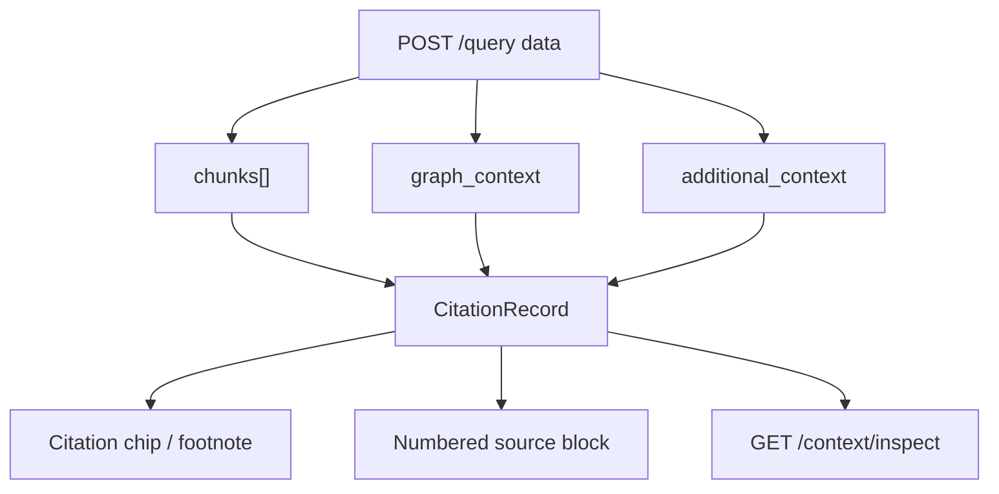
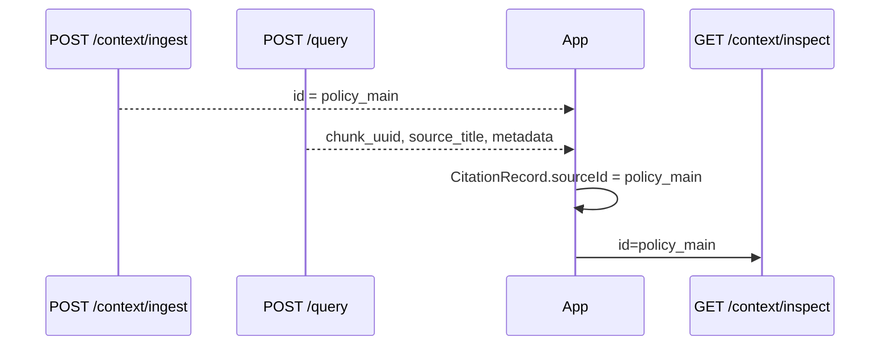

A citation is a **pointer into the retrieval payload**, not a free-form string the model invents. Build citation records in your app the moment [`POST /query`](/api-reference/v2/endpoint/query) returns.

Related: [API Results](/essentials/v2/api-results) · [Inspect Context](/api-reference/v2/endpoint/fetch-content)

---

## Anatomy of evidence



From each chunk, capture at least:

| Field | Role |
| --- | --- |
| `chunk_uuid` | Stable id for this retrieved segment (primary citation key) |
| `source_title` | Human label in UI |
| `chunk_content` | Evidence text (prompt + preview) |
| `relevancy_score` | Optional ranking signal for UI |
| `additional_metadata` | Author, URL, external id, doc version for display |
| `extra_context_ids` | Keys into `additional_context` for related snippets |

---

## Recommended CitationRecord

Keep this in your application layer (not in HydraDB):

```ts
type CitationRecord = {
  n: number;                 // 1-based index in the prompt
  chunkUuid: string;         // chunk_uuid
  sourceTitle: string;       // source_title
  preview: string;           // truncated chunk_content
  score?: number;            // relevancy_score
  sourceId?: string;         // your stable ingest id when known
  metadata?: Record<string, unknown>;
  graphGroupIds?: string[];  // from chunk_id_to_group_ids
};
```

**Numbering rule:** Assign `n` in the same order you will present sources to the LLM. If you use [`build_string`](/essentials/v2/api-results), match that order or stop using the helper and format yourself so UI and prompt stay aligned.

---

## Chunk → source id for inspect

[`GET /context/inspect`](/api-reference/v2/endpoint/fetch-content) needs the source **`id`** you used at ingest (plus `database` / `collection`).

`chunk_uuid` is often derived from the source id (e.g. `policy_main_chunk_0`), but **do not scrape ids with brittle string splits** unless you own that convention. Prefer:

1. Store stable `id` at ingest time ([`POST /context/ingest`](/api-reference/v2/endpoint/ingest-context)).
2. Put the same id in `additional_metadata` (e.g. `source_id`, `external_id`) when useful for UI.
3. Pass that id to inspect when the user opens a citation.



---

## Graph paths as supporting evidence

When `graph_context: true`, HydraDB may return:

- `query_paths` — multi-hop paths from the query
- `chunk_relations` + `chunk_id_to_group_ids` — relations attached to chunks

Use graph data as **secondary evidence** in the UI (“related entities”), not as fake document citations unless a path clearly maps to a source you can inspect.

Attach group ids on the citation:

```text
citation.graphGroupIds = graph_context.chunk_id_to_group_ids[chunk_uuid]
```

Then filter `chunk_relations` by those `group_id`s — same pattern as [API Results](/essentials/v2/api-results).

Deep dive: [Context Graphs](/essentials/v2/context-graphs)

---

## Knowledge vs Memories in citations

| Store | Typical citation UX |
| --- | --- |
| Knowledge | Document / Slack / Notion title + open original |
| Memories | “From your preferences / prior conversation” with softer labeling |
| Both (dual query or multi-`collections`) | Namespace badges: `Knowledge` vs `Memory` so users know which store grounded the claim |

When you run **two** queries (shared Knowledge + user Memories), **merge citation namespaces carefully**:

- Either restart numbering per section (`K1`, `M1`)
- Or use a single sequence but tag `store: "knowledge" | "memory"` on each record

Do not let the model invent a citation that only existed in the other store’s unused payload.

---

## Metadata that belongs on citations

Prefer display fields in `additional_metadata` at ingest:

- `author`, `url`, `external_id`, `updated_at`, `channel_name`, `doc_version`

Schema `metadata` is for **filters** ([Metadata](/essentials/v2/metadata)). You can show filter fields too (`department`, `status`), but keep hot filter keys designed for equality matching — not as a dumping ground for long URLs.

---

## Minimal builder (conceptual)

```python
def citations_from_query(data: dict) -> list[dict]:
    records = []
    graph = (data.get("graph_context") or {})
    id_to_groups = graph.get("chunk_id_to_group_ids") or {}
    for i, chunk in enumerate(data.get("chunks") or [], start=1):
        meta = chunk.get("additional_metadata") or {}
        records.append({
            "n": i,
            "chunk_uuid": chunk.get("chunk_uuid"),
            "source_title": chunk.get("source_title"),
            "preview": (chunk.get("chunk_content") or "")[:280],
            "score": chunk.get("relevancy_score"),
            "source_id": meta.get("source_id"),
            "metadata": meta,
            "graph_group_ids": id_to_groups.get(chunk.get("chunk_uuid") or "", []),
        })
    return records
```

Keep the raw `data` object for prompt formatting; keep `records` for UI and marker validation.

---

## Next

- [Query → UI](/essentials/v2/grounded-answers/query-to-ui) — render chips and inspect drawers
- [Prompt Grounding](/essentials/v2/grounded-answers/prompt-grounding) — force `[n]` usage in the model
