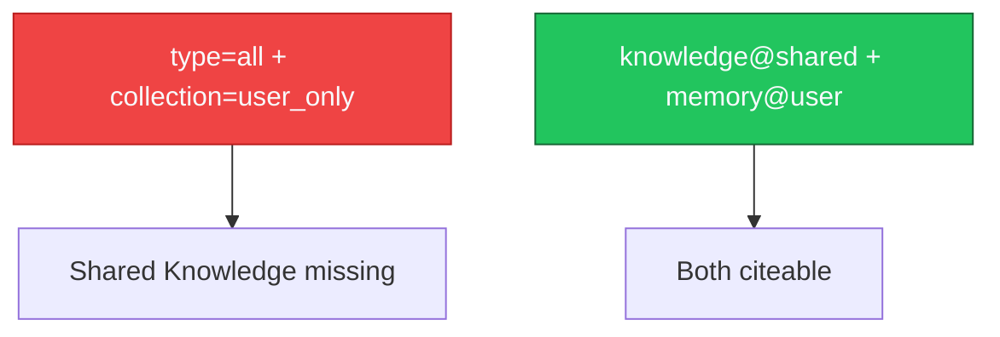
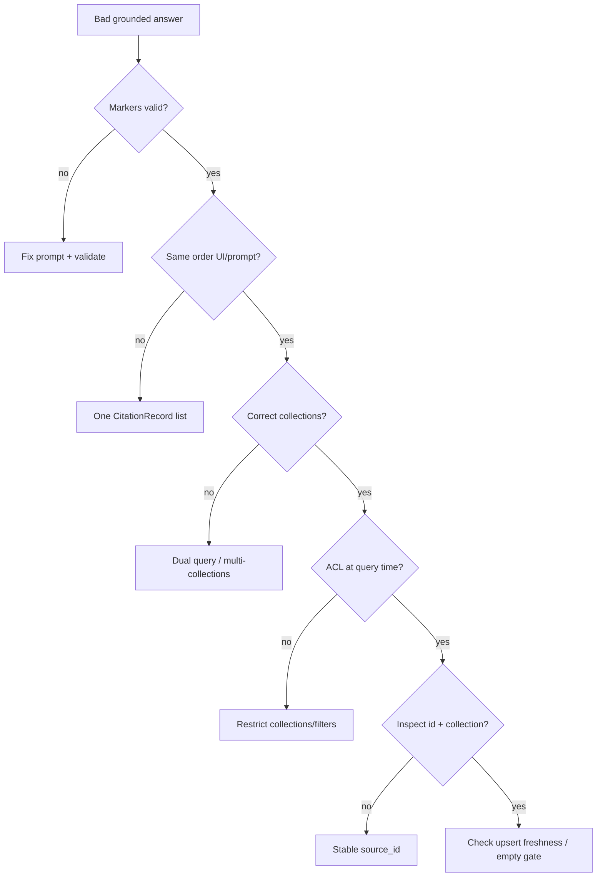

Grounding bugs look like “the AI lied” but usually start as **contract bugs** between query, prompt, and UI.

---

## 1. Hallucinated citations

<AccordionGroup>
  <Accordion title="Problem">
    Answer shows `[7]` but only six chunks were retrieved — or cites a title that never appeared in the payload.
  </Accordion>
  <Accordion title="Why it happens">
    No post-generation validation; prompt didn’t forbid invented markers; UI renders raw model text.
  </Accordion>
  <Accordion title="Better solution">
    Number sources explicitly; instruct quote-or-refuse; **strip/reject** markers outside the citation set before render. See [Prompt Grounding](/essentials/v2/grounded-answers/prompt-grounding) and [Query → UI](/essentials/v2/grounded-answers/query-to-ui).
  </Accordion>
</AccordionGroup>

---

## 2. Prompt / UI number drift

<AccordionGroup>
  <Accordion title="Problem">
    Chip `[2]` opens the wrong document relative to what the model meant.
  </Accordion>
  <Accordion title="Why it happens">
    `build_string` order ≠ UI sort (e.g. UI sorted by score); dual-store merge reordered silently.
  </Accordion>
  <Accordion title="Better solution">
    Single `CitationRecord[]` drives both prompt and chips. Never re-sort for UI without rewriting prompt numbers.
  </Accordion>
</AccordionGroup>

---

## 3. Inspect 404 / empty

<AccordionGroup>
  <Accordion title="Problem">
    Citation opens but [`GET /context/inspect`](/api-reference/v2/endpoint/fetch-content) fails.
  </Accordion>
  <Accordion title="Why it happens">
    Guessing `sourceId` from `chunk_uuid`; wrong `collection`; source deleted; never stored stable ingest `id`.
  </Accordion>
  <Accordion title="Better solution">
    Stable ingest ids; put `source_id` in `additional_metadata` when needed; inspect with the write-time collection. Keep chunk preview as fallback.
  </Accordion>
</AccordionGroup>

---

## 4. Dual-store confusion

<AccordionGroup>
  <Accordion title="Problem">
    Personal preference cited as company policy (or the reverse). Or shared Knowledge missing because `type: "all"` used only the user collection.
  </Accordion>
  <Accordion title="Why it happens">
    One collection on a merged query when Knowledge lives elsewhere; no store badges; weak prompt rules.
  </Accordion>
  <Accordion title="Better solution">
    Dual query or `collections` covering both partitions; badge Knowledge vs Memory; prompt rules for memory tone. See [Multi-tenant](/essentials/v2/multi-tenant).
  </Accordion>
</AccordionGroup>

---

## 5. ACL-blind provenance

<AccordionGroup>
  <Accordion title="Problem">
    User sees or inspects a source they shouldn’t (private Slack channel, other dept).
  </Accordion>
  <Accordion title="Why it happens">
    Broad query then “hide in UI”; workspace collection shared across private channels; `metadata_filters` array treated as OR/IN.
  </Accordion>
  <Accordion title="Better solution">
    Enforce ACLs at query time (`collections` fanout of allowed channel collections, or parallel equality filters + union). Never rely on UI filtering for security. See [Metadata filter semantics](/essentials/v2/metadata#filter-semantics).
  </Accordion>
</AccordionGroup>

---

## 6. Graph treated as a citation

<AccordionGroup>
  <Accordion title="Problem">
    UI footnotes entity names from `query_paths` as if they were documents; inspect fails.
  </Accordion>
  <Accordion title="Why it happens">
    Graph enrichment confused with source list.
  </Accordion>
  <Accordion title="Better solution">
    Cite `chunks` (and resolvable source ids). Show graph as “related entities,” not document citations. [Context Graphs](/essentials/v2/context-graphs).
  </Accordion>
</AccordionGroup>

---

## 7. Stale preview after upsert

<AccordionGroup>
  <Accordion title="Problem">
    Citation preview disagrees with inspect content after a Knowledge refresh.
  </Accordion>
  <Accordion title="Why it happens">
    UI cached an old query payload; upsert replaced source with same `id`.
  </Accordion>
  <Accordion title="Better solution">
    Treat each answer turn’s query payload as immutable for that turn’s citations. On “refresh sources,” re-query. Upsert discipline: [Ingest](/api-reference/v2/endpoint/ingest-context).
  </Accordion>
</AccordionGroup>

---

## 8. Ungrounded fluent answers

<AccordionGroup>
  <Accordion title="Problem">
    Empty retrieval still produces a confident answer.
  </Accordion>
  <Accordion title="Why it happens">
    App always calls the LLM; no empty-evidence gate.
  </Accordion>
  <Accordion title="Better solution">
    If `chunks` is empty and the feature requires grounding, short-circuit with a grounded refusal UI — skip the LLM or use a dedicated “no context” template.
  </Accordion>
</AccordionGroup>

---

## Quick diagnostic

---

## Next

- [Production Checklist](/essentials/v2/grounded-answers/checklist)
- [Citation Model](/essentials/v2/grounded-answers/citation-model)
