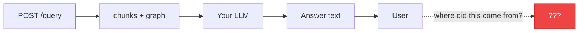
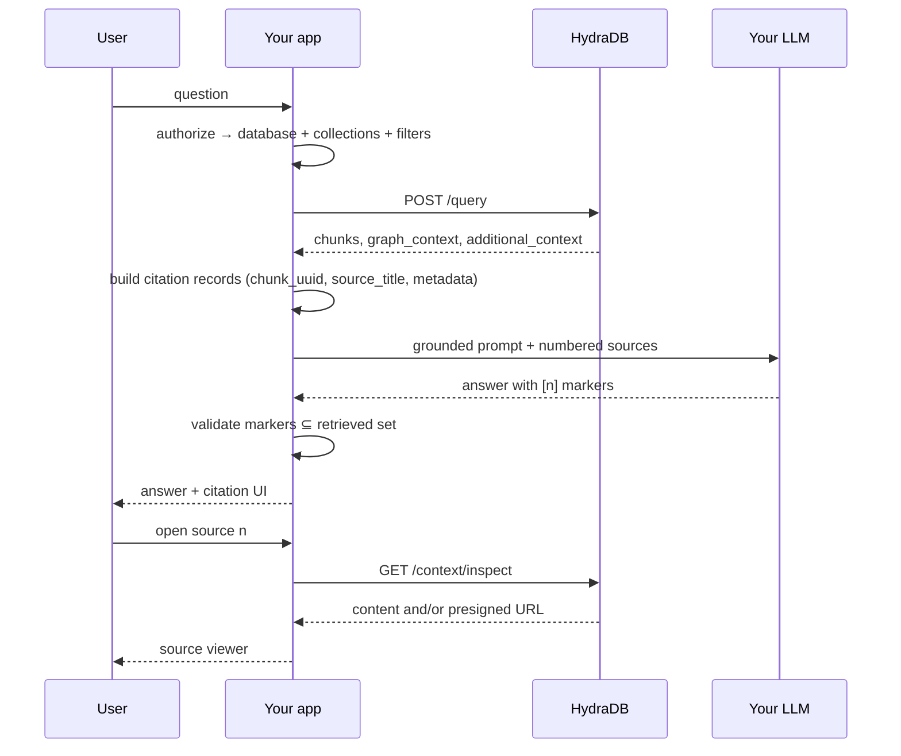

HydraDB retrieves **context**. Your product must turn that context into **grounded answers** users can trust: visible citations, openable sources, and prompts that discourage invention.

This playbook sits above [How to Use API Results](/essentials/v2/api-results). That page formats a prompt string. This page designs the **citation and provenance system** around [`POST /query`](/api-reference/v2/endpoint/query) and [`GET /context/inspect`](/api-reference/v2/endpoint/fetch-content).

<Info>
  **Not in scope here:** Memory vs Knowledge primers, auth guides, rate limits, LangChain wrappers, or query-parameter tuning. Those journeys exist elsewhere. This is the grounding layer.
</Info>

---

## The problem

Without a citation contract, users get fluent answers with no way to verify them — and you cannot debug which source poisoned a reply.

---

## Playbook map

<CardGroup cols={2}>
  <Card title="Citation Model" icon="fingerprint" href="/essentials/v2/grounded-answers/citation-model">
    Stable IDs, chunk → source mapping, metadata for display, and graph paths as evidence.
  </Card>
  <Card title="Query → UI" icon="window" href="/essentials/v2/grounded-answers/query-to-ui">
    Citation chips, source drawers, inspect/download flows, and dual-store grounding.
  </Card>
  <Card title="Prompt Grounding" icon="message" href="/essentials/v2/grounded-answers/prompt-grounding">
    Prompt contracts that force quote-or-refuse behavior using HydraDB context.
  </Card>
  <Card title="Failure Modes" icon="triangle-exclamation" href="/essentials/v2/grounded-answers/failure-modes">
    Hallucinated citations, missing inspect links, graph noise, and ACL-blind provenance.
  </Card>
  <Card title="Production Checklist" icon="list-check" href="/essentials/v2/grounded-answers/checklist">
    Ship gate for grounded answer products.
  </Card>
</CardGroup>

---

## End-to-end spine

---

## Primitives you will use

| Need | HydraDB surface |
| --- | --- |
| Retrieve ranked evidence | [`POST /query`](/api-reference/v2/endpoint/query) |
| Format context for the model | [API Results / `build_string`](/essentials/v2/api-results) |
| Open original / parsed source | [`GET /context/inspect`](/api-reference/v2/endpoint/fetch-content) |
| Relational evidence | `graph_context` when `graph_context: true` — [Context Graphs](/essentials/v2/context-graphs) |
| Display labels & filters | `additional_metadata` / schema `metadata` — [Metadata](/essentials/v2/metadata) |
| Scope | `database` + `collection`/`collections` — [Multi-tenant](/essentials/v2/multi-tenant) |

---

## Design principles

1. **Cite only what you retrieved.** Citation IDs must come from the current `POST /query` response — never from the model's imagination.
2. **Preserve HydraDB rank order** when numbering sources unless you re-rank deliberately and store that mapping.
3. **Separate prompt context from UI provenance.** The LLM sees a compact string; the UI keeps the full citation records.
4. **Inspect is a product feature.** Every citation should be openable via [`GET /context/inspect`](/api-reference/v2/endpoint/fetch-content) when you know the source `id`.
5. **Grounding ≠ authorization.** Provenance UI must not leak sources your ACL scope excluded from query.

---

## Next

Start with the [Citation Model](/essentials/v2/grounded-answers/citation-model), then wire [Query → UI](/essentials/v2/grounded-answers/query-to-ui).
