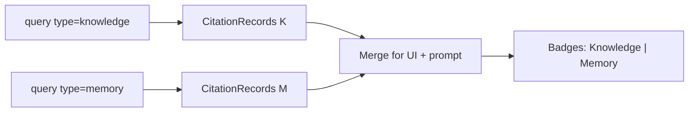

Turn [CitationRecords](/essentials/v2/grounded-answers/citation-model) into a product surface users can trust. HydraDB does not render citations — your app does.

APIs: [`POST /query`](/api-reference/v2/endpoint/query) · [`GET /context/inspect`](/api-reference/v2/endpoint/fetch-content)

---

## Recommended layout

```mermaid
flowchart TB
  Answer["Answer panel<br/>text with [1][2] markers"]
  Rail["Citation rail<br/>chips 1…n"]
  Drawer["Source drawer<br/>preview + Open original"]

  Answer -->|click [n]| Rail
  Rail -->|select n| Drawer
  Drawer -->|inspect| API["GET /context/inspect"]
```

| Region | Job |
| --- | --- |
| Answer | Model text; only markers that exist in the citation set |
| Rail | One chip per `CitationRecord` (`n`, title, store badge) |
| Drawer | Preview (`chunk_content`), metadata, Open / Download via inspect |

---

## Citation chips

Show for every record returned to the prompt:

- **`[n]`** — matches prompt numbering
- **Title** — `source_title`
- **Store badge** — `Knowledge` / `Memory` when dual-query
- **Optional score** — `relevancy_score` for power users / debug mode

Clicking a chip scrolls the answer to the first `[n]` occurrence and opens the drawer.

---

## Source drawer + inspect

When the user opens citation `n`:

1. Show `preview` immediately from the query payload (no extra round trip).
2. If `sourceId` is known, call [`GET /context/inspect`](/api-reference/v2/endpoint/fetch-content) with the same `database` / `collection` used at ingest.
3. Pick mode by UX need:

| `mode` | Use |
| --- | --- |
| `content` | Inline parsed text |
| `url` | “Download original” via `presigned_url` |
| `both` | Preview + download (default for rich drawers) |

```bash
curl -G 'https://api.hydradb.com/context/inspect' \
  -H "Authorization: Bearer $HYDRA_DB_API_KEY" \
  -H "API-Version: 2" \
  --data-urlencode "id=policy_main" \
  --data-urlencode "database=acme_corp" \
  --data-urlencode "collection=team_docs" \
  --data-urlencode "mode=both" \
  --data-urlencode "expiry_seconds=3600"
```

<Warning>
  Inspect with the **same collection** the source was written under. Wrong collection → miss / empty. See [Multi-tenant](/essentials/v2/multi-tenant).
</Warning>

---

## Dual-store grounding UI

When Knowledge and Memories use different collections, prefer **two queries** (or `collections` covering both) — see [Query](/essentials/v2/query) · [Multi-tenant](/essentials/v2/multi-tenant).



**Numbering options:**

| Scheme | Example | Pros |
| --- | --- | --- |
| Prefixed | `[K1]`, `[M1]` | Clear provenance |
| Single sequence | `[1]…[n]` with badge | Simpler reading |

Whichever you choose, validation must use the **same** scheme.

---

## Validate model markers before render

Never trust the model to cite honestly. After generation:

```python
import re

def validate_markers(answer: str, citations: list[dict]) -> str:
    allowed = {c["n"] for c in citations}
    used = {int(x) for x in re.findall(r"\[(\d+)\]", answer)}
    invented = used - allowed
    if invented:
        # Strip or footnote — do not show fake citations
        for bad in sorted(invented, reverse=True):
            answer = answer.replace(f"[{bad}]", "")
    return answer
```

For prefixed schemes, adapt the regex (`K\d+`, `M\d+`).

---

## Graph in the UI

If you requested `graph_context: true`:

- Show a compact “Related entities” panel from `query_paths` / filtered `chunk_relations`
- Tie relations to the selected citation via `graph_group_ids`
- Do **not** invent document footnotes from entity names alone

Details: [Context Graphs](/essentials/v2/context-graphs) · [API Results](/essentials/v2/api-results)

---

## ACL and citation visibility

Citations must only reflect sources inside the **authorized** query scope (`database`, `collections`, `metadata_filters`).

| Unsafe | Safe |
| --- | --- |
| Query wide, filter citations in UI | Restrict query scope, then cite |
| Show inspect for ids outside the result set | Inspect only `sourceId`s from this turn’s citations |

For Slack / connector corpora, use channel-per-collection or parallel equality filters — metadata arrays are not OR/IN ([Metadata](/essentials/v2/metadata#filter-semantics)).

---

## Empty and partial states

| State | UI |
| --- | --- |
| Zero chunks | “No grounded sources” — refuse or ask to clarify; don’t call the LLM with empty evidence if your product requires grounding |
| Chunks but inspect fails | Keep preview; show “Original unavailable” |
| Graph empty | Hide graph panel; chunks still valid |

---

## Next

- [Prompt Grounding](/essentials/v2/grounded-answers/prompt-grounding)
- [Failure Modes](/essentials/v2/grounded-answers/failure-modes)
