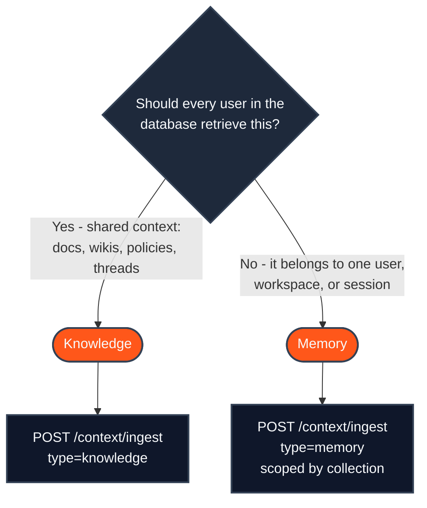
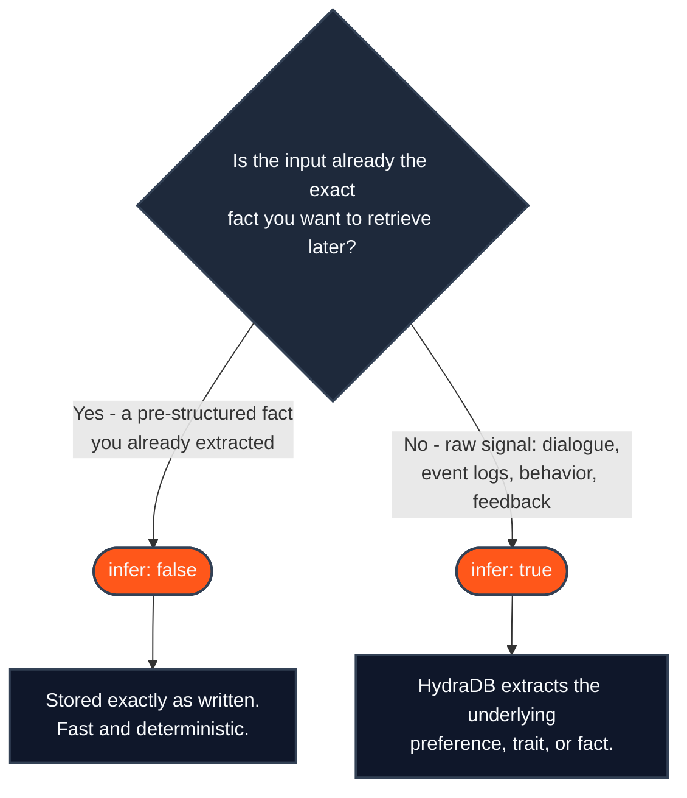
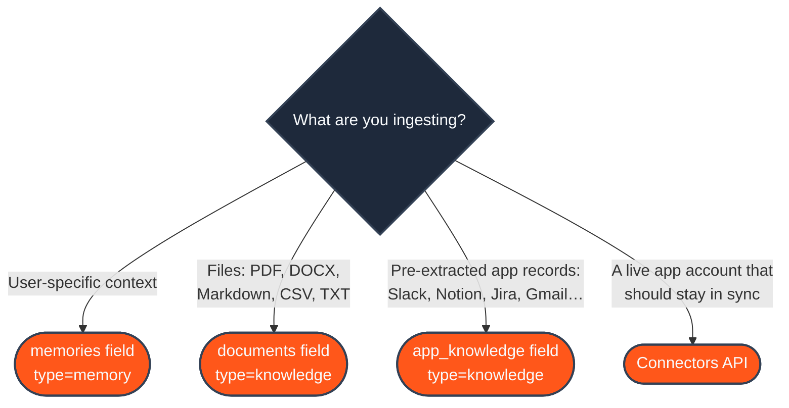

Every HydraDB integration starts with the same three decisions, and getting them wrong is the most common reason retrieval "doesn't work":

1. Should this content be a [Memory](/essentials/v2/memories) or [Knowledge](/essentials/v2/knowledge)?
2. Should `infer` be `true` or `false`?
3. Which ingestion format does my content need  -  files, app sources, connectors, or memories?

This page answers all three with decision trees, so you can pick the right path in under a minute and jump straight to the matching guide.

---

## Decision 1: Memory or Knowledge?

Both stores are ingested through the same endpoint  -  [`POST /context/ingest`](/api-reference/v2/endpoint/ingest-context)  -  and queried through the same endpoint  -  [`POST /query`](/api-reference/v2/endpoint/query). The only question that matters is **who should be able to retrieve this content later**.



When in doubt, ask: *"would a different user benefit from seeing this?"* If yes, it's [Knowledge](/essentials/v2/knowledge). If no, it's a [Memory](/essentials/v2/memories) scoped to that user's `collection`.

Some real examples:

| Content | Store as | Why |
|---|---|---|
| Company refund-policy PDF | Knowledge | Any user's agent may need it |
| "User prefers dark mode and concise answers" | Memory | Belongs to one user |
| Slack thread deciding the pricing tiers | Knowledge | Team-wide decision, reusable across users |
| Chat transcript where a user mentions their timezone | Memory | Personalizes one user's experience |
| Internal runbook for deploys | Knowledge | Shared operational context |
| "User's plan tier is Pro" | Memory | Account-specific fact |

<Note>
  You don't have to choose at query time: [`POST /query`](/api-reference/v2/endpoint/query) with `type: "all"` queries both stores in parallel and returns one merged, re-ranked result set. The Memory/Knowledge decision only controls **where the content lives and who it surfaces for**.
</Note>

---

## Decision 2: `infer: true` or `infer: false`?

This flag only applies to **memories**. It controls whether HydraDB extracts the useful fact from your input, or stores your input exactly as written.



The test is simple: **could you paste your input directly into an LLM prompt as a useful fact?**

- `"User's plan tier is Pro"` → yes, it's already the fact → `infer: false`.
- A log of the user toggling dark mode on and off for a week → no, the fact (*"prefers dark mode"*) is buried in the signal → `infer: true`, and HydraDB derives it for you.

Two things to remember:

- `custom_instructions` (e.g. `"Focus on UI preferences only"`) only takes effect with `infer: true`. With `infer: false` it is ignored.
- Sending an already-clean fact with `infer: true` works, but HydraDB may re-phrase it. Use `infer: false` when the exact wording matters.

See [Memories → Choose whether HydraDB should infer the memory](/essentials/v2/memories#choose-whether-hydradb-should-infer-the-memory) for full examples.

---

## Decision 3: Which ingestion format?

[`POST /context/ingest`](/api-reference/v2/endpoint/ingest-context) accepts different multipart fields depending on the shape of your content:



- **`memories`**  -  a JSON-stringified array of memory items ([Memories](/essentials/v2/memories)). This is the only path where `infer` applies.
- **`documents`**  -  binary or text files HydraDB parses and chunks for you ([Knowledge → Path A](/essentials/v2/knowledge#4-two-ingestion-paths)).
- **`app_knowledge`**  -  records your app or connector already extracted, with app-native structure (`kind`, `provider`, `external_id`, `fields`). HydraDB preserves threads, actors, and hierarchy for app-aware retrieval ([App Sources](/essentials/v2/app-sources)).
- **Connectors**  -  managed OAuth integrations where HydraDB syncs the app for you on a schedule ([Connectors](/essentials/v2/connectors)).

<Info>
  **Files vs app sources in one sentence:** if HydraDB should *parse the content* for you, send `documents`; if you already have the structured fields and want app-aware retrieval (threads, actors, IDs), send `app_knowledge`. If you want HydraDB to *fetch and keep syncing* the content, use a connector.
</Info>

---

## Quick reference

| You have… | Store | Ingest with | Notes |
|---|---|---|---|
| A fact about one user, already clean | Memory | `memories` + `infer: false` | Stored verbatim |
| Raw chat, logs, or behavior for one user | Memory | `memories` + `infer: true` | HydraDB extracts the fact |
| PDFs, DOCX, Markdown, CSV, TXT | Knowledge | `documents` | HydraDB parses and chunks |
| Slack/Notion/Jira/Gmail records you already parsed | Knowledge | `app_knowledge` | Keeps app structure; query with `query_apps: true` |
| An app account to keep in sync automatically | Knowledge | [Connectors](/essentials/v2/connectors) | Managed OAuth + scheduled sync |

After any ingestion path, the loop is the same: ingestion is **asynchronous**, so poll [`GET /context/status`](/api-reference/v2/endpoint/source-status) until the item is indexed, then retrieve with [`POST /query`](/api-reference/v2/endpoint/query) using `type: "memory"`, `"knowledge"`, or `"all"`.

---

## The full loop, end to end

Here is the complete decision applied in code: a per-user fact stored as a **memory** with `infer: false` (it's already clean), then queried back after indexing.

<CodeGroup>

```python Python SDK
import json
import os
import time
from hydra_db import HydraDB

client = HydraDB(token=os.environ["HYDRA_DB_API_KEY"])

# Decision 1: one user's fact -> Memory.
# Decision 2: already a clean fact -> infer: false.
# Decision 3: user-specific context -> the memories field.
ingest = client.context.ingest(
    type="memory",
    database="acme_corp",
    collection="user_john_123",
    memories=json.dumps([
        {"text": "User's plan tier is Pro.", "infer": False}
    ]),
)
memory_id = ingest.data.results[0].id

# Ingestion is async - wait until the memory is queryable.
# graph_creation is already queryable; wait for completed only if
# you need full graph traversal (graph_context: true).
while True:
    status = client.context.status(
        database="acme_corp",
        collection="user_john_123",
        ids=[memory_id],
    ).data.statuses[0]
    if status.indexing_status in ("graph_creation", "completed", "errored"):
        break
    time.sleep(2)

# Retrieve it - type "all" would also merge in shared Knowledge.
results = client.query(
    database="acme_corp",
    collection="user_john_123",
    query="What plan is the user on?",
    type="memory",
)
print(results.data.chunks)
```

```typescript TypeScript SDK
import { HydraDBClient } from "@hydradb/sdk";

const client = new HydraDBClient({ token: process.env.HYDRA_DB_API_KEY });

// Decision 1: one user's fact -> Memory.
// Decision 2: already a clean fact -> infer: false.
// Decision 3: user-specific context -> the memories field.
const ingest = await client.context.ingest({
  type: "memory",
  database: "acme_corp",
  collection: "user_john_123",
  memories: JSON.stringify([
    { text: "User's plan tier is Pro.", infer: false },
  ]),
});
const memoryId = ingest.data.results[0].id;

// Ingestion is async - wait until the memory is queryable.
// graph_creation is already queryable; wait for completed only if
// you need full graph traversal (graph_context: true).
while (true) {
  const status = (await client.context.status({
    database: "acme_corp",
    collection: "user_john_123",
    ids: [memoryId],
  })).data.statuses[0];
  if (["graph_creation", "completed", "errored"].includes(status.indexingStatus)) break;
  await new Promise((r) => setTimeout(r, 2_000));
}

// Retrieve it - type "all" would also merge in shared Knowledge.
const results = await client.query({
  database: "acme_corp",
  collection: "user_john_123",
  query: "What plan is the user on?",
  type: "memory",
});
console.log(results.data.chunks);
```

```bash cURL
# Decision 1: one user's fact -> Memory.
# Decision 2: already a clean fact -> infer: false.
# Decision 3: user-specific context -> the memories field.
curl -X POST 'https://api.hydradb.com/context/ingest' \
  -H "Authorization: Bearer $HYDRA_DB_API_KEY" \
  -H "API-Version: 2" \
  -F "type=memory" \
  -F "database=acme_corp" \
  -F "collection=user_john_123" \
  -F 'memories=[{"text": "User'"'"'s plan tier is Pro.", "infer": false}]'

# Ingestion is async - poll until queryable (graph_creation is already
# queryable; completed is only needed for full graph traversal).
curl -G 'https://api.hydradb.com/context/status' \
  -H "Authorization: Bearer $HYDRA_DB_API_KEY" \
  -H "API-Version: 2" \
  --data-urlencode "database=acme_corp" \
  --data-urlencode "collection=user_john_123" \
  --data-urlencode "ids=<id-from-ingest-response>"

# Retrieve it - type "all" would also merge in shared Knowledge.
curl -X POST 'https://api.hydradb.com/query' \
  -H "Authorization: Bearer $HYDRA_DB_API_KEY" \
  -H "API-Version: 2" \
  -H "Content-Type: application/json" \
  -d '{
    "database": "acme_corp",
    "collection": "user_john_123",
    "query": "What plan is the user on?",
    "type": "memory"
  }'
```

</CodeGroup>

For the Knowledge version of this loop (file upload and app sources), see [Knowledge → Two ingestion paths](/essentials/v2/knowledge#4-two-ingestion-paths).

---

## Related

- [Memories](/essentials/v2/memories)  -  per-user context, `infer`, and memory fields
- [Knowledge](/essentials/v2/knowledge)  -  shared context, files, and app sources
- [App Sources](/essentials/v2/app-sources)  -  the `app_knowledge` model in depth
- [Connectors](/essentials/v2/connectors)  -  managed, continuously synced integrations
- [Query](/essentials/v2/query)  -  retrieving what you ingested
- [Ingest Content  -  API Reference](/api-reference/v2/endpoint/ingest-context)
