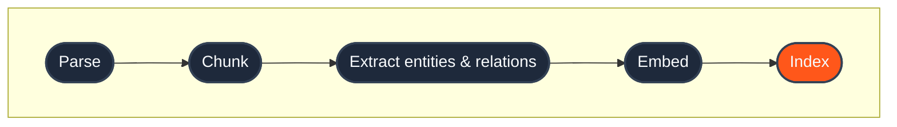
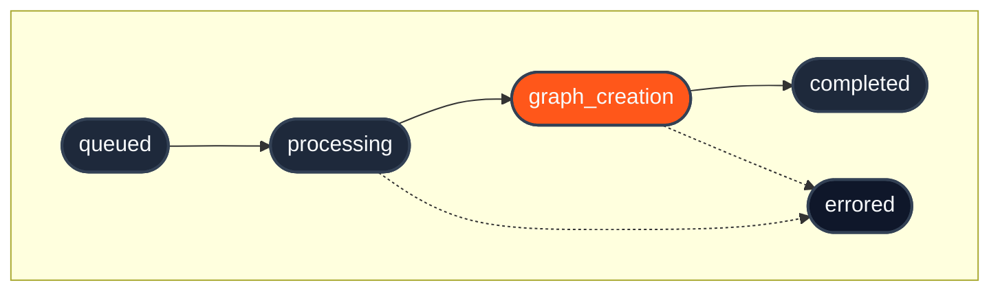

import { Field } from "/snippets/field.jsx";
import { KnowledgeMemoryPlayground } from "/snippets/knowledge-memory-playground.jsx";

## 1. What it is

Knowledge is the shared, database-wide context that every user and agent can query. It covers product documents, internal wikis, policy PDFs, Slack threads, Notion pages, CSVs, emails  -  anything that should be reusable across the whole workspace.

Knowledge is the counterpart to [Memories](/essentials/v2/memories), which holds per-user context instead. Both are retrieved through the same [`POST /query`](/api-reference/v2/endpoint/query) endpoint, but they're stored separately  -  the `type` parameter picks which one you query (see [Query](/essentials/v2/query)).

<Frame>
  
</Frame>

| | Knowledge | Memories |
|---|---|---|
| **Content** | Documents, files, app-generated content | User preferences, conversations, inferred traits |
| **Scope** | Conventionally shared  -  put it in a `collection` every relevant query includes | Per-user, scoped by `collection` (formerly `sub_tenant_id`) |
| **Mutability** | Versioned  -  replaced or deleted explicitly | Dynamic  -  evolves with every interaction |
| **Query via** | `type: "knowledge"` | `type: "memory"` |
| **Status field** | `vectorstore_status.knowledge` | `vectorstore_status.memories` |

Both are queried through the same [`POST /query`](/api-reference/v2/endpoint/query) endpoint; `type` just picks the store. `collection` scopes both identically  -  Knowledge isn't exempt from it. "Shared" means you write it once to a collection (often the default one) that every query needing it also specifies, not that collection filtering skips it. See [Multi-tenant](/essentials/v2/multi-tenant#1-what-it-is) for the full model.

<Info>
  **One endpoint, two stores.** Knowledge and memories are stored separately. A single [`POST /query`](/api-reference/v2/endpoint/query) call can still search both at once with `type: "all"`, and the results come back merged and re-ranked together. Use `type: "knowledge"` for shared-document search, `type: "memory"` for per-user context, or `type: "all"` for personalized answers grounded in both. See [Query](/essentials/v2/query) for the full picture.
</Info>

Still not sure which one you'd reach for? Add something to each store below, then switch "Viewing as" between Alice and Bob and watch what does (and doesn't) follow you.

<KnowledgeMemoryPlayground />

---

## 2. What it does

When you call [`POST /context/ingest`](/api-reference/v2/endpoint/ingest-context) with `type=knowledge`, HydraDB walks each source through a pipeline:

1. **Parses** the input  -  PDF, DOCX, Markdown, CSV, plain text, or app-source JSON.
2. **Chunks** the content into semantically coherent segments.
3. **Extracts entities and relationships**, building graph nodes and edges (see [Context Graphs](/essentials/v2/context-graphs)).
4. **Embeds** every chunk into the dense and sparse vector stores.
5. **Indexes** the result so it becomes queryable via [`POST /query`](/api-reference/v2/endpoint/query).



The pipeline runs **asynchronously**. The ingest call returns `202 Accepted` with `id`s right away, but the content isn't queryable until `indexing_status` reaches at least `graph_creation`. Poll [`GET /context/status`](/api-reference/v2/endpoint/source-status) to track progress  -  see the full status table at [Ingestion Status](/api-reference/v2/endpoint/source-status).

---

## 3. When to use it

Reach for Knowledge ingestion when the content is:

- **Shared across all users** in your database  -  product docs, policy PDFs, runbooks, wikis, internal tooling.
- **Static or infrequently updated**  -  versioned by replacing the source rather than appending.
- **Document-structured** rather than conversational  -  files, threads, pages, articles.

Reach for [Memories](/essentials/v2/memories) instead when the content is:

- User preferences or behavioral signals tied to one person.
- Per-user conversation history that should shape future answers for that user.
- Anything that should personalize a single user's experience.

| If the content is… | Store it as… |
|---|---|
| Shared across all users | Knowledge |
| Specific to one user or session | [Memory](/essentials/v2/memories) |

When in doubt, ask "would a different user benefit from seeing this?"  -  if yes, Knowledge; if no, Memory.

---

## 4. Two ingestion paths

[`POST /context/ingest`](/api-reference/v2/endpoint/ingest-context) with `type=knowledge` accepts two content formats in the same request. You can send either one, or both at once  -  pick the path that matches what you have on hand:

- **Path A** when you have **binary files** HydraDB should parse for you.
- **Path B** when you have **pre-extracted text** from an app or connector and want to skip parsing.

### Path A  -  Files

Binary files HydraDB should parse and chunk: PDF, DOCX, Markdown, CSV, TXT.

<CodeGroup>
```python Python SDK
import json

with open("/path/to/policy.pdf", "rb") as f1, open("/path/to/runbook.pdf", "rb") as f2:
    result = client.context.ingest(
        type="knowledge",
        database="acme_corp",
        documents=[
            ("policy.pdf", f1, "application/pdf"),
            ("runbook.pdf", f2, "application/pdf"),
        ],
        document_metadata=json.dumps([
            {"id": "policy_v2", "metadata": {"document_type": "policy", "status": "approved"}},
            {"id": "runbook_deploy", "metadata": {"document_type": "runbook"}},
        ]),
    )
```
```typescript TypeScript SDK
const result = await client.context.ingest({
  type: "knowledge",
  database: "acme_corp",
  documents: [
    { path: "/path/to/policy.pdf", filename: "policy.pdf", contentType: "application/pdf" },
    { path: "/path/to/runbook.pdf", filename: "runbook.pdf", contentType: "application/pdf" },
  ],
  documentMetadata: JSON.stringify([
    { id: "policy_v2", metadata: { document_type: "policy", status: "approved" } },
    { id: "runbook_deploy", metadata: { document_type: "runbook" } },
  ]),
});
```
```bash cURL
curl -X POST 'https://api.hydradb.com/context/ingest' \
  -H "Authorization: Bearer $HYDRA_DB_API_KEY" \
  -H "API-Version: 2" \
  -F "type=knowledge" \
  -F "database=acme_corp" \
  -F "documents=@/path/to/policy.pdf" \
  -F "documents=@/path/to/runbook.pdf" \
  -F 'document_metadata=[
    { "id": "policy_v2", "metadata": { "document_type": "policy", "status": "approved" } },
    { "id": "runbook_deploy", "metadata": { "document_type": "runbook" } }
  ]'
```
</CodeGroup>

### Path B  -  App sources

Pre-parsed records from connected apps. You supply app-native fields (`kind`, `provider`, `external_id`, and `fields`), [metadata](/essentials/v2/metadata), and optional attachments/comments. Use this when your application already extracts content from Slack messages, Notion pages, Gmail messages, tickets, or CRM records. HydraDB then preserves that app structure instead of treating the item as generic text.

<CodeGroup>
```python Python SDK
import json

result = client.context.ingest(
    type="knowledge",
    database="acme_corp",
    app_knowledge=json.dumps([
        {
            "database": "acme_corp",
            "collection": "default",
            "id": "slack_C01_1716213600_000100",
            "title": "Pricing discussion - Slack #product",
            "type": "slack",
            "kind": "message",
            "provider": "slack",
            "external_id": "1716213600.000100",
            "fields": {
                "kind": "message",
                "body": "We agreed on three tiers: Starter at $29, Pro at $79, Enterprise at $199.",
                "author": "alice",
                "thread_id": "1716213600.000100",
                "created_at": "2026-05-20T10:00:00Z",
            },
            "metadata": {"channel": "product", "status": "finalized"},
            "additional_metadata": {"slack_ts": "1716213600.000100"},
        }
    ]),
)
```
```typescript TypeScript SDK
const result = await client.context.ingest({
  type: "knowledge",
  database: "acme_corp",
  appKnowledge: JSON.stringify([
    {
      database: "acme_corp",
      collection: "default",
      id: "slack_C01_1716213600_000100",
      title: "Pricing discussion - Slack #product",
      type: "slack",
      kind: "message",
      provider: "slack",
      external_id: "1716213600.000100",
      fields: {
        kind: "message",
        body: "We agreed on three tiers: Starter at $29, Pro at $79, Enterprise at $199.",
        author: "alice",
        thread_id: "1716213600.000100",
        created_at: "2026-05-20T10:00:00Z",
      },
      metadata: { channel: "product", status: "finalized" },
      additional_metadata: { slack_ts: "1716213600.000100" },
    },
  ]),
});
```
```bash cURL
curl -X POST 'https://api.hydradb.com/context/ingest' \
  -H "Authorization: Bearer $HYDRA_DB_API_KEY" \
  -H "API-Version: 2" \
  -F "type=knowledge" \
  -F "database=acme_corp" \
  -F 'app_knowledge=[
    {
      "database": "acme_corp",
      "collection": "default",
      "id": "slack_C01_1716213600_000100",
      "title": "Pricing discussion - Slack #product",
      "type": "slack",
      "kind": "message",
      "provider": "slack",
      "external_id": "1716213600.000100",
      "fields": {
        "kind": "message",
        "body": "We agreed on three tiers: Starter at $29, Pro at $79, Enterprise at $199.",
        "author": "alice",
        "thread_id": "1716213600.000100",
        "created_at": "2026-05-20T10:00:00Z"
      },
      "metadata": { "channel": "product", "status": "finalized" },
      "additional_metadata": { "slack_ts": "1716213600.000100" }
    }
  ]'
```
</CodeGroup>

<Info>
Both paths are available. Use Path A for original documents that need parsing. Use Path B for app objects when you already have structured fields and want app-aware query behavior.
</Info>

**Response (both paths):**

```json
{
  "success": true,
  "data": {
    "success": true,
    "message": "Knowledge uploaded successfully",
    "results": [
      { "id": "policy_v2", "filename": "policy.pdf", "status": "queued", "error": null }
    ],
    "success_count": 1,
    "failed_count": 0
  },
  "error": null,
  "meta": {
    "request_id": "9d13aef4-02f4-4e73-8c62-4c2601d04f9d",
    "latency_ms": 12.3
  }
}
```

All endpoints return this envelope shape. Access the payload via `response.data` (e.g. `response.data.results`), not at the top level.

---

## 5. Verifying processing

Ingestion is asynchronous, so a source won't show up in [query](/essentials/v2/query) results until it finishes processing. Poll [`GET /context/status`](/api-reference/v2/endpoint/source-status) with the `id`s you got back from ingestion. The snippets below loop until every item reaches a terminal state (`completed` or `errored`):

<CodeGroup>
```python Python SDK
import time

ids = ["policy_v2", "runbook_deploy"]
terminal = {"completed", "errored"}

while True:
    status = client.context.status(
        database="acme_corp",
        collection="default",
        ids=ids,
    )
    if all(s.indexing_status in terminal for s in status.data.statuses):
        break
    time.sleep(5)
```
```typescript TypeScript SDK
const ids = ["policy_v2", "runbook_deploy"];
const terminal = new Set(["completed", "errored"]);

let status;
while (true) {
  status = await client.context.status({
    database: "acme_corp",
    collection: "default",
    ids: ids,
  });

  const allDone = status.data.statuses.every((s) => terminal.has(s.indexingStatus));
  if (allDone) break;

  await new Promise((r) => setTimeout(r, 5_000));
}
```
```bash cURL
while true; do
  response=$(curl -s -G 'https://api.hydradb.com/context/status' \
    -H "Authorization: Bearer $HYDRA_DB_API_KEY" \
    -H "API-Version: 2" \
    --data-urlencode "database=acme_corp" \
    --data-urlencode "collection=default" \
    --data-urlencode "ids=policy_v2" \
    --data-urlencode "ids=runbook_deploy")

  statuses=$(echo "$response" | jq -r '.data.statuses[].indexing_status')
  if echo "$statuses" | grep -qv '^\(completed\|errored\)$'; then
    sleep 5
    continue
  fi
  echo "$response" | jq
  break
done
```
</CodeGroup>

```json
{
  "statuses": [
    {
      "id": "policy_v2",
      "indexing_status": "completed",
      "success": true
    }
  ]
}
```

Status values move forward through `queued` → `processing` → `graph_creation` → `completed` (or land in `errored` on failure).



`graph_creation` (highlighted above) is already queryable  -  see the note below. Poll every few seconds  -  most documents complete in 1–5 minutes. The full status table, including the `success` alias that sometimes appears in place of `completed`, is on [Ingestion Status](/api-reference/v2/endpoint/source-status).

<Info>
**`graph_creation` is already queryable.** Items in this state are retrievable via [`POST /query`](/api-reference/v2/endpoint/query). Wait for `completed` only when you specifically need full graph traversal (`graph_context: true`).
</Info>

---

## 6. Key parameters

The full schema lives on [`POST /context/ingest`](/api-reference/v2/endpoint/ingest-context). Below are the fields you'll touch most often, grouped by where they live in the request.

### File metadata (`document_metadata` array items)

| Field | Type | Description |
|---|---|---|
| <Field name="id" /> | `string` | Optional stable identifier. Used as upsert key when `upsert: true`. |
| <Field name="metadata" /> | `object` | Filterable fields. Keys must match the database metadata schema. |
| <Field name="additional_metadata" /> | `object` | Free-form fields for display and bookkeeping. Filterable only when nested under `additional_metadata` in `metadata_filters`. |
| <Field name="title" /> | `string` | Override the source title shown in query results. |
| <Field name="type" /> | `string` | Override the source type shown in query results. |
| <Field name="url" /> | `string` | Override the canonical URL. |
| <Field name="timestamp" /> | `ISO-8601 datetime` | Override the source timestamp. |
| <Field name="relations" /> | `object` | Forcefully connect this source to others with `{ "ids": [...] }`. |

### App source model (`app_knowledge` array items)

| Field | Type | Description |
|---|---|---|
| <Field name="id" recommended /> | `string` | Stable ID. Used as the upsert/delete/status key. |
| <Field name="database" recommended /> | `string` | Database that owns the item. Must match form-level `database` (formerly `tenant_id`) when present. |
| <Field name="collection" recommended /> | `string` | Logical partition. Must match form-level `collection` when present. |
| <Field name="title" recommended /> | `string` | Short title, subject, ticket title, or page name. |
| <Field name="type" recommended /> | `string` | Source category for display/analytics, such as `slack`, `notion`, `gmail`, or `jira`. |
| <Field name="kind" recommended /> | `email` \| `message` \| `ticket` \| `knowledge_base` \| `comment` \| `custom` | App object kind. Selects the app parser for `fields`. |
| <Field name="provider" recommended /> | `string` | App namespace such as `slack`, `gmail`, `jira`, `notion`, `salesforce`, or `linear`. |
| <Field name="external_id" recommended /> | `string` | Stable provider ID for this exact item. Enables exact lookup and relation resolution. |
| <Field name="fields" required /> | `object` | App-native content and structure. Put primary text here (`body`, `description`, `title`, or `data` depending on `kind`). |
| <Field name="url" /> | `string` | Canonical URL or reference link. |
| <Field name="timestamp" /> | `ISO-8601 datetime` | Creation, sent, or last-updated time. |
| <Field name="metadata" /> | `object` | Filterable fields matching the database schema. |
| <Field name="additional_metadata" /> | `object` | Free-form fields. Filterable only when nested under `additional_metadata` in `metadata_filters`. |
| <Field name="attachments" /> | `array` | Optional related attachments. Include extracted text in `attachments[].content.text` or `.markdown`. |
| <Field name="comments" /> | `array` | Optional embedded snapshot comments. For live incremental comments, prefer a first-class `kind: "comment"` source. |
| <Field name="relations" /> | `array` | App-native relation array: `[{ "predicate": "linked_to", "target": { "external_id": "AUTH-123", "provider": "jira" } }]`. |

### Request-level fields

| Field | Type | Default | Description |
|---|---|---|---|
| <Field name="database" required /> | `string` |  -  | Target database. |
| <Field name="collection" /> | `string` | none | Scope this knowledge to a collection, same as on Memories. If omitted, it's written to the database's default collection  -  see [Multi-tenant](/essentials/v2/multi-tenant#1-what-it-is). A query only sees knowledge written to the collection(s) it specifies. |
| <Field name="upsert" /> | `boolean` | `true` | Replace existing items with the same `id`. |

---

## 7. Forceful relations

Forceful relations let you **declare** links between Knowledge sources at ingestion time. When a query matches a source that has forceful relations attached, HydraDB adds the linked sources to the `additional_context` field of the response, alongside the primary chunks.

This is different from the entity and relationship [context graph](/essentials/v2/context-graphs) HydraDB builds automatically. Graph extraction is *derived* from content. Forceful relations are *declared* by you instead  -  useful when you already know two documents belong together (a contract and its addendum, a runbook and its troubleshooting guide) even though the text itself doesn't make the connection explicit.

Forceful relations link whole **sources**. To declare the full entity/relation graph *within* a single document instead (replacing extraction for it), use [Bring Your Own Graph](/essentials/v2/bring-your-own-graph).

For file uploads, set `relations.ids` on the matching `document_metadata` item. For app sources, prefer the app-native `relations[]` shape so each link can carry a predicate and provider-aware target:

```json
{
  "relations": [
    {
      "predicate": "linked_to",
      "target": {
        "id": "auth-troubleshooting"
      }
    },
    {
      "predicate": "related_to",
      "target": {
        "external_id": "AUTH-FAQ",
        "provider": "notion"
      }
    }
  ]
}
```

<CodeGroup>
```python Python SDK
client.context.ingest(
    type="knowledge",
    database="acme_corp",
    app_knowledge=json.dumps([
        {
            "database": "acme_corp",
            "collection": "default",
            "id": "auth-guide",
            "title": "Authentication Guide",
            "type": "notion",
            "kind": "knowledge_base",
            "provider": "notion",
            "external_id": "AUTH-GUIDE",
            "fields": {"kind": "knowledge_base", "title": "Authentication Guide", "body": "..."},
            "relations": [
                {"predicate": "linked_to", "target": {"id": "auth-troubleshooting"}},
                {"predicate": "related_to", "target": {"external_id": "AUTH-FAQ", "provider": "notion"}},
            ],
        }
    ]),
)
```
```typescript TypeScript SDK
await client.context.ingest({
  type: "knowledge",
  database: "acme_corp",
  appKnowledge: JSON.stringify([
    {
      id: "auth-guide",
      title: "Authentication Guide",
      type: "notion",
      kind: "knowledge_base",
      provider: "notion",
      external_id: "AUTH-GUIDE",
      fields: { kind: "knowledge_base", title: "Authentication Guide", body: "..." },
      relations: [
        { predicate: "linked_to", target: { id: "auth-troubleshooting" } },
        { predicate: "related_to", target: { external_id: "AUTH-FAQ", provider: "notion" } },
      ],
    },
  ]),
});
```
```bash cURL
curl -X POST 'https://api.hydradb.com/context/ingest' \
  -H "Authorization: Bearer $HYDRA_DB_API_KEY" \
  -H "API-Version: 2" \
  -F "type=knowledge" \
  -F "database=acme_corp" \
  -F 'app_knowledge=[
    {
      "id": "auth-guide",
      "title": "Authentication Guide",
      "type": "notion",
      "kind": "knowledge_base",
      "provider": "notion",
      "external_id": "AUTH-GUIDE",
      "fields": { "kind": "knowledge_base", "title": "Authentication Guide", "body": "..." },
      "relations": [
        { "predicate": "linked_to", "target": { "id": "auth-troubleshooting" } },
        { "predicate": "related_to", "target": { "external_id": "AUTH-FAQ", "provider": "notion" } }
      ]
    }
  ]'
```
</CodeGroup>

At query time, linked sources are returned in the `additional_context` field of the [query response](/api-reference/v2/endpoint/query). `query_forceful_relations` defaults to `true`  -  set it to `false` only if you want to turn off forceful-relation expansion.

<Warning>
**Knowledge items only.** Forceful relations work within the same store. Pointing a Knowledge item at a Memory ID (or vice versa) will silently return nothing at query time.
</Warning>

<Warning>
**`thinking` mode only.** Forceful-relation context is fetched only when `mode: "thinking"` is set on the query request. In `fast` mode, `query_forceful_relations` is ignored even if set to `true`.
</Warning>

## 8. Metadata on knowledge

[Metadata](/essentials/v2/metadata) is how you bridge structured filters and semantic search. Attach `metadata` at ingestion to enable deterministic narrowing at query time:

```json
{
  "metadata": { "document_type": "runbook", "environment": "production" }
}
```

Then at query time:

```json
{
  "query": "How do I rotate API keys?",
  "metadata_filters": { "document_type": "runbook", "environment": "production" }
}
```

For fields you'll filter on often (a "hot" path), declare the `metadata` key in the database metadata schema with `enable_match: true`. Keys that aren't declared there are silently ignored at query time.

`additional_metadata` works differently  -  it's stored alongside the source for display and bookkeeping, not fast filtering. To filter on it anyway, nest the keys under `additional_metadata` in `metadata_filters`, for example `{"metadata_filters": {"additional_metadata": {"author": "Alice"}}}`.

`document_metadata` still works too, but only as a legacy alias for that same nested filter  -  prefer `additional_metadata` in new code.

See [Metadata](/essentials/v2/metadata) for schema design, filter examples, and the `metadata` vs `additional_metadata` decision rule. See [Create Database](/api-reference/v2/endpoint/create-tenant) for the schema field configuration (`enable_match`, `enable_dense_embedding`, `enable_sparse_embedding`).

---

## 9. Common mistakes

| Mistake | Symptom | Fix |
|---|---|---|
| Query with `type: "memory"` | Empty results  -  wrong store | Use `type: "knowledge"` (or `"all"`) |
| Filter on `additional_metadata` for fields you query often | Nested filters only, slower than schema-backed ones | Move those keys to `metadata` and declare them in the [schema](/api-reference/v2/endpoint/create-tenant) |
| Query before indexing finishes | Empty results | Poll [status](/api-reference/v2/endpoint/source-status) until `completed` (or `graph_creation` for partial) |
| Send `document_metadata` as an object | `multipart/form-data` validation fails | JSON-stringify it first |
| Omit `database` | `422` error | Required on every call |
| Point forceful relations across stores | Silently returns nothing | Keep relations same-store: knowledge→knowledge, memory→memory |

---

## Related

- [Memories](/essentials/v2/memories)  -  the per-user counterpart to Knowledge
- [Query](/essentials/v2/query)  -  how [`POST /query`](/api-reference/v2/endpoint/query) retrieves Knowledge
- [Metadata](/essentials/v2/metadata)  -  designing filterable schemas
- [Context Graphs](/essentials/v2/context-graphs)  -  how the graph layer enriches retrieval
- [Ingest Content  -  API Reference](/api-reference/v2/endpoint/ingest-context)
- [Ingestion Status  -  API Reference](/api-reference/v2/endpoint/source-status)
