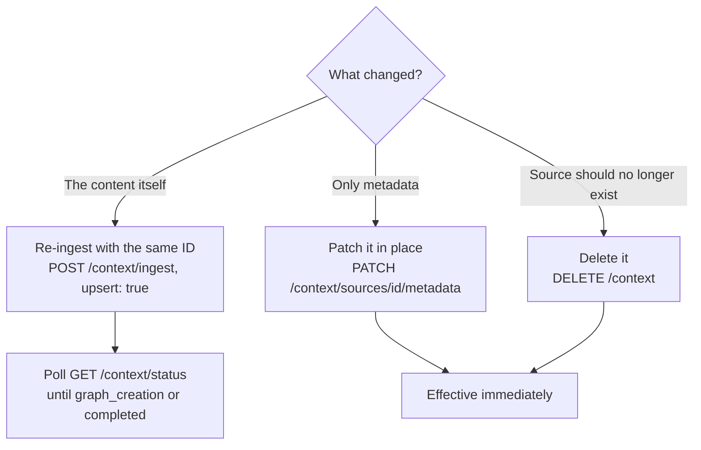

Context changes after you ingest it: a policy PDF gets a new revision, a ticket changes status, a user contradicts a stored preference, a document is retired. HydraDB has no single `PUT /context` call; instead, each kind of change maps to one specific operation. This page connects them into one workflow.

## 1. Pick the right operation



| What changed | Call | Re-processes content? |
|---|---|---|
| Document body, app-source snapshot, or memory text | [`POST /context/ingest`](/api-reference/v2/endpoint/ingest-context) with the same `id` and `upsert: true` | Yes - full pipeline re-runs |
| Filterable or display metadata only | [`PATCH /context/sources/{source_id}/metadata`](/api-reference/v2/endpoint/update-source-metadata) | No - chunks and graph untouched |
| Source is obsolete | [`DELETE /context`](/api-reference/v2/endpoint/delete-source) | n/a |

<Info>
  **Connector-managed sources are different.** Content ingested through [Connectors](/essentials/v2/connectors) is kept fresh by connector sync; you don't re-ingest it manually. This page covers sources you ingest yourself: documents, app sources, and memories.
</Info>

## 2. Replace content: re-ingest with the same ID

`upsert` defaults to `true` on [`POST /context/ingest`](/api-reference/v2/endpoint/ingest-context). Sending a source whose `id` already exists replaces it: the new content is parsed, chunked, embedded, and graphed from scratch, and the old version stops surfacing in queries. Set `upsert: false` if you'd rather get an error on conflict than overwrite.

### A revised document

Upload the new file with the same `id` in `document_metadata`:

<CodeGroup>

```python Python SDK
client.context.ingest(
    type="knowledge",
    database="acme_corp",
    collection="team_docs",
    upsert=True,
    documents=[("policy.pdf", policy_v2, "application/pdf")],
    document_metadata=json.dumps([
        {
            "id": "policy_main",
            "metadata": {"department": "legal"},
            "additional_metadata": {"doc_version": 2},
        }
    ]),
)
```

```typescript TypeScript SDK
await client.context.ingest({
  type: "knowledge",
  database: "acme_corp",
  collection: "team_docs",
  upsert: true,
  documents: [
    { path: "/path/to/policy-v2.pdf", filename: "policy.pdf", contentType: "application/pdf" },
  ],
  documentMetadata: JSON.stringify([
    {
      id: "policy_main",
      metadata: { department: "legal" },
      additional_metadata: { doc_version: 2 },
    },
  ]),
});
```

</CodeGroup>

### A changed app source

Re-ingest the item with the same `id` and `external_id`. Whether an update means *re-ingest this source* or *ingest a new source* depends on the provider event - a ticket edit updates the existing source, but a new comment on that ticket is its own source. The [incremental ingestion table](/essentials/v2/app-sources#4-incremental-ingestion) in App Sources maps the common provider events to the right choice.

### A superseded memory

Memories use the same key: the memory `id` acts as the upsert key. Re-ingesting a memory with an existing `id` replaces it - useful when a user states a new preference that invalidates a stored one:

<CodeGroup>

```python Python SDK
client.context.ingest(
    type="memory",
    database="acme_corp",
    collection="user_alex",
    memories=json.dumps([
        {
            "id": "pref-answer-length",
            "text": "User now prefers detailed answers with examples",
            "infer": False,
        }
    ]),
)
```

```typescript TypeScript SDK
await client.context.ingest({
  type: "memory",
  database: "acme_corp",
  collection: "user_alex",
  memories: JSON.stringify([
    {
      id: "pref-answer-length",
      text: "User now prefers detailed answers with examples",
      infer: false,
    },
  ]),
});
```

</CodeGroup>

<Warning>
  **Upsert replaces the whole source, not part of it.** There is no partial content update. Re-ingesting a ticket with only the newest comment in `comments[]` erases the earlier comments from that snapshot. Send the full current state of the source every time, and model independently-changing items (comments, replies, messages) as separate sources.
</Warning>

If you [brought your own graph](/essentials/v2/bring-your-own-graph) for a source, the stored graph survives re-ingest and is re-applied automatically; include a new `graph_payload` only when the graph itself should change.

## 3. Update metadata without re-ingesting

Re-processing a large PDF because its `priority` changed is wasted work. When only metadata changes, patch it in place with [`PATCH /context/sources/{source_id}/metadata`](/api-reference/v2/endpoint/update-source-metadata) - it updates both the source row and the indexed chunk metadata that query and list filters read, with no re-chunking or re-embedding:

```bash cURL
curl -X PATCH 'https://api.hydradb.com/context/sources/policy_main/metadata' \
  -H "Authorization: Bearer $HYDRA_DB_API_KEY" \
  -H "API-Version: 2" \
  -H "Content-Type: application/json" \
  -d '{
    "database": "acme_corp",
    "collection": "team_docs",
    "tenant_metadata": { "priority": 7 },
    "additional_metadata": { "doc_version": 3 }
  }'
```

Use `tenant_metadata` for schema-defined fields you filter on, and `additional_metadata` for free-form display fields - the same split as at ingest time (see [Metadata](/essentials/v2/metadata)).

## 4. Delete context

[`DELETE /context`](/api-reference/v2/endpoint/delete-source) removes sources by ID. The body wraps the payload in `request` and picks the store with `type`; pass the same `collection` you ingested into, or the call targets the default collection and misses your IDs:

<CodeGroup>

```python Python SDK
client.context.delete(
    type="knowledge",
    database="acme_corp",
    collection="team_docs",
    ids=["policy_main"],
)
```

```typescript TypeScript SDK
await client.context.delete({
  type: "knowledge",
  database: "acme_corp",
  collection: "team_docs",
  ids: ["policy_main"],
});
```

</CodeGroup>

The response reports a per-ID `deleted` flag and `deleted_count`, so a partial failure (one ID missing, others removed) is visible rather than silent. Memories are deleted the same way with `type: "memory"`.

## 5. Know when the change is live

Metadata patches and deletes take effect on completion of the call. **Re-ingestion does not** - it returns `202 Accepted` and the *old* content keeps serving queries while the replacement is processed. Poll [`GET /context/status`](/api-reference/v2/endpoint/source-status) with the source `id` until `indexing_status` reaches `graph_creation` (searchable) or `completed` (fully graphed):

```python Python SDK
status = client.context.status(
    database="acme_corp",
    collection="team_docs",
    ids=["policy_main"],
)
```

For pipelines that update many sources, register a webhook for `indexing.status_changed` instead of polling - see [Webhooks](/essentials/v2/webhooks).

## 6. Stable IDs are what make this possible

Every operation above is keyed by the source `id`. If you omit `id` at ingest time, HydraDB generates one - and you have no handle to update or delete that source later without looking it up.

- **Always set explicit IDs at ingest time**, mirroring your application's own identifiers (`policy_main`, `ticket_ENG-142`, `pref-answer-length`). Updates then need no lookup step.
- **Lost an ID?** Browse the store with [`POST /context/list`](/api-reference/v2/endpoint/list-documents), filtering by metadata to find the source and recover its `id`.

## Common mistakes

| Mistake | What happens | Fix |
|---|---|---|
| Re-ingesting updated content with a *new* ID | Both versions surface in queries and contradict each other | Reuse the original `id` with `upsert: true` |
| Upserting a parent source to add one child item | The snapshot is replaced; earlier comments/replies vanish | Model independently-changing items as separate sources (see [App Sources](/essentials/v2/app-sources#4-incremental-ingestion)) |
| Querying immediately after a re-ingest | Old content is still served; the replacement isn't indexed yet | Wait for `indexing_status` of `graph_creation` or `completed` |
| Full re-ingest for a metadata-only change | Needless re-parse, re-embed, and re-graph of unchanged content | Use [`PATCH /context/sources/{source_id}/metadata`](/api-reference/v2/endpoint/update-source-metadata) |
| Deleting without `collection` | IDs aren't found; the call targets the default collection | Pass the same `collection` used at ingest time |
| Ingesting without explicit IDs | No handle to update or delete the source later | Set `id` at ingest; recover lost IDs via [`POST /context/list`](/api-reference/v2/endpoint/list-documents) |
