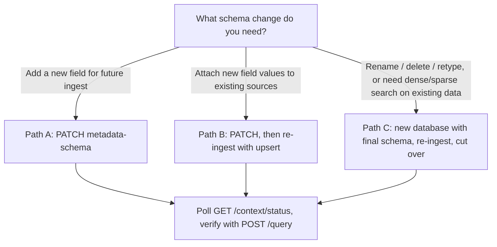

Database metadata schema is largely immutable. There is no single "migrate schema" endpoint. Migration is a deliberate procedure using the additive [`PATCH /databases/{database}/metadata-schema`](/api-reference/v2/endpoint/update-metadata-schema) endpoint, re-ingestion, or a new database with the final schema.

For what metadata is and how filters work, see [Scoping using metadata](/essentials/v2/metadata).

---

## What you can and cannot change

| Change | Supported? | How |
| --- | --- | --- |
| Add a new field | Yes | [`PATCH .../metadata-schema`](/api-reference/v2/endpoint/update-metadata-schema) with `add_fields` |
| Attach new field values to existing sources | Yes | Re-ingest with `upsert: true` and the same `id` |
| Use a new `enable_match` field in filters for newly ingested sources | Yes | PATCH, then ingest with the new key |
| Make a new dense/sparse field participate in semantic/BM25 search over **existing** data | Not via PATCH alone | Create a new database with the final schema and re-ingest (Milvus is not backfilled) |
| Rename, delete, or retype an existing field | No | Rebuild in a new database |
| Change `enable_match` / embedding flags on an existing field | No | Rebuild in a new database |

---

## Decision: in-place add vs re-ingest vs new database



| If you need… | Use… |
| --- | --- |
| A new exact-match filter field going forward | Path A |
| Existing sources to carry new metadata values (and filter on them) | Path B |
| Renames, deletes, type/flag changes, or semantic/BM25 metadata search over data already indexed | Path C |

---

## Path A - Additive change (safe, in place)

Use Path A when you only need to **append** fields. The PATCH is additive only. It cannot delete, rename, or change the type or flags of existing fields.

MongoDB indexes for `enable_match` fields are created when the schema is updated. Existing Milvus collections are **not** altered or backfilled for newly added dense/sparse metadata fields.

<CodeGroup>
```bash cURL
curl -X PATCH 'https://api.hydradb.com/databases/acme_corp/metadata-schema' \
  -H "Authorization: Bearer $HYDRA_DB_API_KEY" \
  -H "API-Version: 2" \
  -H "Content-Type: application/json" \
  -d '{
    "add_fields": [
      {
        "name": "region",
        "data_type": "VARCHAR",
        "enable_match": true
      }
    ]
  }'
```

```python Python
import os
import requests

response = requests.patch(
    "https://api.hydradb.com/databases/acme_corp/metadata-schema",
    headers={
        "Authorization": f"Bearer {os.environ['HYDRA_DB_API_KEY']}",
        "API-Version": "2",
        "Content-Type": "application/json",
    },
    json={
        "add_fields": [
            {"name": "region", "data_type": "VARCHAR", "enable_match": True},
        ]
    },
)
```

```typescript TypeScript
const response = await fetch(
  "https://api.hydradb.com/databases/acme_corp/metadata-schema",
  {
    method: "PATCH",
    headers: {
      Authorization: `Bearer ${process.env.HYDRA_DB_API_KEY}`,
      "API-Version": "2",
      "Content-Type": "application/json",
    },
    body: JSON.stringify({
      add_fields: [
        { name: "region", data_type: "VARCHAR", enable_match: true },
      ],
    }),
  },
);
```
</CodeGroup>

Expected success shape:

```json
{
  "database": "acme_corp",
  "added_fields": ["region"]
}
```

After Path A, new ingestions can send `region` in `metadata`. Existing sources do not automatically gain values for the new field  -  use Path B for that.

---

## Path B - Re-ingest to attach values on existing sources

Ingested `metadata` and `additional_metadata` values are immutable. To add or change values on a source that is already indexed, re-ingest with `upsert: true` and the **same** `id`.

Typical sequence:

1. Add the field with Path A (if it is not already in the schema).
2. Re-ingest each affected source with the new metadata keys populated.
3. Poll status, then verify filters with query.

<CodeGroup>
```bash cURL
curl -X POST 'https://api.hydradb.com/context/ingest' \
  -H "Authorization: Bearer $HYDRA_DB_API_KEY" \
  -H "API-Version: 2" \
  -F "type=knowledge" \
  -F "database=acme_corp" \
  -F "collection=team_docs" \
  -F "upsert=true" \
  -F 'app_knowledge=[
    {
      "database": "acme_corp",
      "collection": "team_docs",
      "id": "auth-controls-001",
      "kind": "knowledge_base",
      "fields": {
        "title": "Authentication controls",
        "body": "Authentication controls are reviewed quarterly for SOC2."
      },
      "metadata": {
        "department": "security",
        "region": "us"
      }
    }
  ]'
```

```python Python SDK
import json
import os
from hydra_db import HydraDB

client = HydraDB(token=os.environ["HYDRA_DB_API_KEY"])

client.context.ingest(
    type="knowledge",
    database="acme_corp",
    collection="team_docs",
    upsert=True,
    app_knowledge=json.dumps([
        {
            "database": "acme_corp",
            "collection": "team_docs",
            "id": "auth-controls-001",
            "kind": "knowledge_base",
            "fields": {
                "title": "Authentication controls",
                "body": "Authentication controls are reviewed quarterly for SOC2.",
            },
            "metadata": {
                "department": "security",
                "region": "us",
            },
        }
    ]),
)
```

```typescript TypeScript SDK
import { HydraDBClient } from "@hydradb/sdk";

const client = new HydraDBClient({
  token: process.env.HYDRA_DB_API_KEY,
});

await client.context.ingest({
  type: "knowledge",
  database: "acme_corp",
  collection: "team_docs",
  upsert: true,
  appKnowledge: JSON.stringify([
    {
      database: "acme_corp",
      collection: "team_docs",
      id: "auth-controls-001",
      kind: "knowledge_base",
      fields: {
        title: "Authentication controls",
        body: "Authentication controls are reviewed quarterly for SOC2.",
      },
      metadata: {
        department: "security",
        region: "us",
      },
    },
  ]),
});
```
</CodeGroup>

<Warning>
  Path B updates metadata values and works for exact-match filtering (`enable_match`). It does not backfill Milvus dense/sparse lanes for fields added after the original index. If existing data must participate in semantic or BM25 metadata search on a newly added field, use Path C.
</Warning>

---

## Path C - Rebuild in a new database

Use Path C when you need to:

- Rename, delete, or retype a field
- Change flags such as `enable_match`, `enable_dense_embedding`, or `enable_sparse_embedding` on an existing field
- Make new dense/sparse metadata fields searchable over data that is already indexed

Procedure:

1. Create a new database with the final `database_metadata_schema` via [`POST /databases`](/api-reference/v2/endpoint/create-tenant).
2. Re-ingest all required sources into the new database (and collections).
3. Cut over clients to the new `database` name.
4. Retire the old database when ready.

Declare every field you will need for filtering and semantic metadata search **before** the first ingest into the new database. Schema field names are immutable after creation; later changes are additive-only.

---

## Verification

After Path B or Path C:

1. Poll [`GET /context/status`](/api-reference/v2/endpoint/source-status) until sources reach at least `graph_creation` (or `completed` if you need full indexing).
2. Confirm behavior with [`POST /query`](/api-reference/v2/endpoint/query):

<CodeGroup>
```bash cURL
curl -X POST 'https://api.hydradb.com/query' \
  -H "Authorization: Bearer $HYDRA_DB_API_KEY" \
  -H "API-Version: 2" \
  -H "Content-Type: application/json" \
  -d '{
    "database": "acme_corp",
    "collection": "team_docs",
    "query": "authentication controls",
    "type": "knowledge",
    "query_by": "hybrid",
    "metadata_filters": {
      "region": "us"
    }
  }'
```

```python Python SDK
result = client.query(
    database="acme_corp",
    collection="team_docs",
    query="authentication controls",
    type="knowledge",
    query_by="hybrid",
    metadata_filters={"region": "us"},
)
```

```typescript TypeScript SDK
const result = await client.query({
  database: "acme_corp",
  collection: "team_docs",
  query: "authentication controls",
  type: "knowledge",
  queryBy: "hybrid",
  metadataFilters: { region: "us" },
});
```
</CodeGroup>

A valid filter with no matching sources returns an empty result set. HydraDB does not silently widen into an unfiltered search.

---

## Pitfalls checklist

- **32-field cap**  -  total custom database metadata fields cannot exceed 32.
- **Reserved names**  -  names such as `source_id`, `chunk_id`, `metadata`, and `document_metadata` are rejected.
- **Embeddings only on `VARCHAR`**  -  `enable_dense_embedding` and `enable_sparse_embedding` are only valid on `VARCHAR` fields.
- **Case-insensitive uniqueness**  -  existing field names cannot be reused, even with different casing.
- **Undeclared keys**  -  when a non-empty schema exists, unknown `metadata` keys are rejected on ingest. Plan fields before you need them.
- **Immutable values**  -  change metadata on an indexed source only by re-ingesting with `upsert: true` and the same `id`.
- **No Milvus backfill**  -  additive PATCH + same-database re-ingest does not enable dense/sparse search over previously indexed collections; use Path C for that.
- **Do not replace `collection` with metadata**  -  partition by user/workspace with `collection`; use metadata filters inside that partition.

---

## Related

- [Scoping using metadata](/essentials/v2/metadata)
- [Update Metadata Schema](/api-reference/v2/endpoint/update-metadata-schema)
- [Create Database](/api-reference/v2/endpoint/create-tenant)
- [Ingest Context](/api-reference/v2/endpoint/ingest-context)
- [Ingestion Status](/api-reference/v2/endpoint/source-status)
- [Query](/api-reference/v2/endpoint/query)
