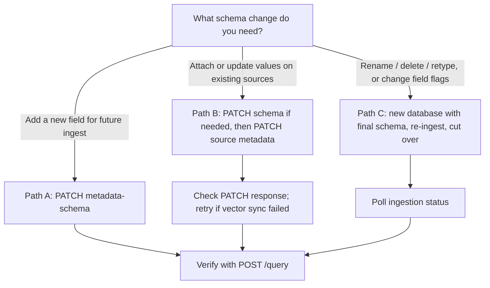

Database metadata schema is largely immutable. There is no single "migrate schema" endpoint. Migration is a deliberate procedure using:

1. Additive [`PATCH /databases/{database}/metadata-schema`](/api-reference/v2/endpoint/update-metadata-schema) to add fields
2. In-place [`PATCH /context/{id}/metadata`](/api-reference/v2/endpoint/update-source-metadata) to merge values onto existing sources
3. A new database with the final schema when you need rename, delete, retype, or flag changes

For what metadata is and how filters work, see [Scoping using metadata](/essentials/v2/metadata).

---

## What you can and cannot change

| Change | Supported? | How |
| --- | --- | --- |
| Add a new field | Yes | [`PATCH .../metadata-schema`](/api-reference/v2/endpoint/update-metadata-schema) with `add_fields` |
| Attach or update field values on existing sources | Yes | [`PATCH /context/{id}/metadata`](/api-reference/v2/endpoint/update-source-metadata) (merge; omitted keys are preserved) |
| Use a new `enable_match` field in filters for newly ingested sources | Yes | Schema PATCH, then ingest with the new key |
| Rename, delete, or retype an existing field | No | Rebuild in a new database |
| Change `enable_match` / embedding flags on an existing field | No | Rebuild in a new database |

<Warning>
  Prefer the source-metadata PATCH for metadata-only edits. A full `upsert: true` re-ingest replaces the source snapshot and can discard content, attachments, comments, or relations omitted from the submitted payload. Reserve full re-ingest for cases where the source content itself must change.
</Warning>

---

## Decision: in-place add vs metadata merge vs new database



| If you need… | Use… |
| --- | --- |
| A new exact-match filter field going forward | Path A |
| Existing sources to carry new or updated metadata values | Path B |
| Renames, deletes, type/flag changes on existing fields | Path C |

---

## Path A - Additive change (safe, in place)

Use Path A when you only need to **append** fields. The schema PATCH is additive only. It cannot delete, rename, or change the type or flags of existing fields.

MongoDB indexes for `enable_match` fields are created when the schema is updated. Existing Milvus collections are **not** altered for newly added dense/sparse metadata field definitions at schema time.

<CodeGroup>
```bash cURL
curl -X PATCH 'https://api.hydradb.com/databases/acme_corp/metadata-schema' \
  -H "Authorization: Bearer $HYDRA_DB_API_KEY" \
  -H "API-Version: 2" \
  -H "Content-Type: application/json" \
  -d '{
    "add_fields": [
      {
        "name": "region",
        "data_type": "VARCHAR",
        "enable_match": true
      }
    ]
  }'
```

```python Python
import os
import requests

response = requests.patch(
    "https://api.hydradb.com/databases/acme_corp/metadata-schema",
    headers={
        "Authorization": f"Bearer {os.environ['HYDRA_DB_API_KEY']}",
        "API-Version": "2",
        "Content-Type": "application/json",
    },
    json={
        "add_fields": [
            {"name": "region", "data_type": "VARCHAR", "enable_match": True},
        ]
    },
)
```

```typescript TypeScript
const response = await fetch(
  "https://api.hydradb.com/databases/acme_corp/metadata-schema",
  {
    method: "PATCH",
    headers: {
      Authorization: `Bearer ${process.env.HYDRA_DB_API_KEY}`,
      "API-Version": "2",
      "Content-Type": "application/json",
    },
    body: JSON.stringify({
      add_fields: [
        { name: "region", data_type: "VARCHAR", enable_match: true },
      ],
    }),
  },
);
```
</CodeGroup>

Expected success shape:

```json
{
  "database": "acme_corp",
  "added_fields": ["region"]
}
```

After Path A, new ingestions can send `region` in `metadata`. Existing sources do not automatically gain values for the new field  -  use Path B for that.

---

## Path B - Merge metadata onto existing sources

Use Path B when the source content is already correct and you only need to attach or change metadata. Call [`PATCH /context/{id}/metadata`](/api-reference/v2/endpoint/update-source-metadata), where `{id}` is the source ID.

This endpoint **merges** metadata:

- Keys present in the request are inserted or overwritten
- Keys omitted from the request are preserved
- Source content, attachments, comments, and relations are left intact

Typical sequence:

1. Add the field with Path A (if it is not already in the schema).
2. PATCH each affected source with the new metadata keys.
3. Inspect the PATCH response envelope before you query (see Verification).
4. Verify filters with query only after the edit has converged.

This edit endpoint uses `tenant_metadata` for schema-backed fields (not the shorter `metadata` key used at ingest). `collection` is required and does not default.

<CodeGroup>
```bash cURL
curl -X PATCH 'https://api.hydradb.com/context/auth-controls-001/metadata' \
  -H "Authorization: Bearer $HYDRA_DB_API_KEY" \
  -H "API-Version: 2" \
  -H "Content-Type: application/json" \
  -d '{
    "database": "acme_corp",
    "collection": "team_docs",
    "tenant_metadata": {
      "region": "us"
    }
  }'
```

```python Python
import os
import requests

response = requests.patch(
    "https://api.hydradb.com/context/auth-controls-001/metadata",
    headers={
        "Authorization": f"Bearer {os.environ['HYDRA_DB_API_KEY']}",
        "API-Version": "2",
        "Content-Type": "application/json",
    },
    json={
        "database": "acme_corp",
        "collection": "team_docs",
        "tenant_metadata": {
            "region": "us",
        },
    },
)
```

```typescript TypeScript
const response = await fetch(
  "https://api.hydradb.com/context/auth-controls-001/metadata",
  {
    method: "PATCH",
    headers: {
      Authorization: `Bearer ${process.env.HYDRA_DB_API_KEY}`,
      "API-Version": "2",
      "Content-Type": "application/json",
    },
    body: JSON.stringify({
      database: "acme_corp",
      collection: "team_docs",
      tenant_metadata: {
        region: "us",
      },
    }),
  },
);
```
</CodeGroup>

If an edited `tenant_metadata` field has `enable_dense_embedding` or `enable_sparse_embedding`, HydraDB refreshes the relevant vector-store metadata search lane as part of the edit. On a successful response, read sync flags from the **`data`** object (not the top-level envelope):

- `data.vector_sync_required: false` — MongoDB-only (`enable_match`) edit; safe to query after `success: true`
- `data.vector_sync_required: true` and `data.vector_synced: true` — dense/sparse lane refreshed; safe to query
- HTTP `500` — MongoDB may already be updated while vector sync failed. Sync fields are **not** present on the error body; **retry the same idempotent PATCH** until you get `success: true` with a converged `data` payload. Do not verify with query yet

Deprecated aliases `data.milvus_sync_required` / `data.milvus_synced` may still appear; prefer `data.vector_*`.

Reserve a full `upsert: true` re-ingest only when the source **content** itself must change. Metadata-only migrations should use this PATCH.

---

## Path C - Rebuild in a new database

Use Path C when you need to:

- Rename, delete, or retype a field
- Change flags such as `enable_match`, `enable_dense_embedding`, or `enable_sparse_embedding` on an existing field

Procedure:

1. Create a new database with the final `database_metadata_schema` via [`POST /databases`](/api-reference/v2/endpoint/create-tenant).
2. Re-ingest all required sources into the new database (and collections).
3. Cut over clients to the new `database` name.
4. Retire the old database when ready.

Declare every field you will need for filtering and semantic metadata search **before** the first ingest into the new database. Schema field names are immutable after creation; later schema changes are additive-only.

---

## Verification

After Path B:

1. Confirm HTTP success and envelope `success: true`. Sync and update fields live under `data` (for example `data.updated`, `data.vector_sync_required`, `data.vector_synced`).
2. On success, if `data.vector_sync_required` is `true`, confirm `data.vector_synced` is `true` before querying.
3. On HTTP `500` (MongoDB write succeeded but vector sync failed), the error body omits sync fields — retry the **same** idempotent PATCH until you receive `success: true` with a converged `data` object. Do not loop on missing top-level sync keys.
4. Only then confirm filters with [`POST /query`](/api-reference/v2/endpoint/query).

Querying before a successful dense/sparse sync can return missing or stale metadata-search results even though MongoDB already has the new values.

After Path C, poll [`GET /context/status`](/api-reference/v2/endpoint/source-status) until sources reach at least `graph_creation` (or `completed` if you need full indexing), then query.

<CodeGroup>
```bash cURL
curl -X POST 'https://api.hydradb.com/query' \
  -H "Authorization: Bearer $HYDRA_DB_API_KEY" \
  -H "API-Version: 2" \
  -H "Content-Type: application/json" \
  -d '{
    "database": "acme_corp",
    "collection": "team_docs",
    "query": "authentication controls",
    "type": "knowledge",
    "query_by": "hybrid",
    "metadata_filters": {
      "region": "us"
    }
  }'
```

```python Python SDK
result = client.query(
    database="acme_corp",
    collection="team_docs",
    query="authentication controls",
    type="knowledge",
    query_by="hybrid",
    metadata_filters={"region": "us"},
)
```

```typescript TypeScript SDK
const result = await client.query({
  database: "acme_corp",
  collection: "team_docs",
  query: "authentication controls",
  type: "knowledge",
  queryBy: "hybrid",
  metadataFilters: { region: "us" },
});
```
</CodeGroup>

A valid filter with no matching sources returns an empty result set. HydraDB does not silently widen into an unfiltered search.

---

## Pitfalls checklist

- **32-field cap**  -  total custom database metadata fields cannot exceed 32.
- **Reserved names**  -  names such as `source_id`, `chunk_id`, `metadata`, and `document_metadata` are rejected.
- **Embeddings only on `VARCHAR`**  -  `enable_dense_embedding` and `enable_sparse_embedding` are only valid on `VARCHAR` fields.
- **Case-insensitive uniqueness**  -  existing field names cannot be reused, even with different casing.
- **Undeclared keys**  -  when a non-empty schema exists, unknown `metadata` keys are rejected on ingest and on source-metadata PATCH. Plan fields before you need them.
- **Use merge PATCH for metadata-only edits**  -  do not replace a whole source with `upsert: true` just to change metadata.
- **Retry failed vector sync**  -  a `500` after MongoDB write means dense/sparse sync failed; retry the same PATCH before verifying with query. Read sync flags from `data.*` on success only.
- **`tenant_metadata` in the edit body**  -  the source-metadata PATCH does not accept the ingest-time `metadata` key; use `tenant_metadata`.
- **`collection` is required** on source-metadata PATCH and does not default.
- **Do not replace `collection` with metadata**  -  partition by user/workspace with `collection`; use metadata filters inside that partition.

---

## Related

- [Scoping using metadata](/essentials/v2/metadata)
- [Update Metadata Schema](/api-reference/v2/endpoint/update-metadata-schema)
- [Update Source Metadata](/api-reference/v2/endpoint/update-source-metadata)
- [Create Database](/api-reference/v2/endpoint/create-tenant)
- [Ingest Context](/api-reference/v2/endpoint/ingest-context)
- [Ingestion Status](/api-reference/v2/endpoint/source-status)
- [Query](/api-reference/v2/endpoint/query)
