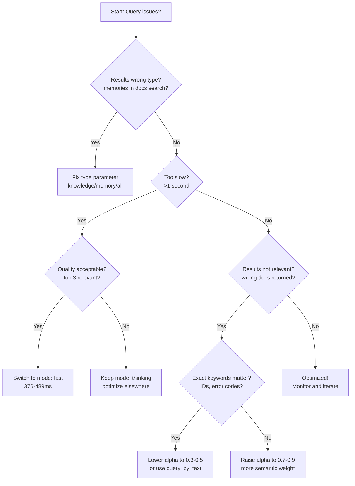

Fast queries feel instant. Slow queries lose users. Irrelevant results break trust. This guide shows you how to optimize HydraDB queries for production workloads - choosing the right parameters, balancing latency vs quality, and debugging issues when results aren't what you expected.

## When to Read This Guide

**Read this if:**
- ✅ You're moving from prototype to production
- ✅ Queries are returning irrelevant results
- ✅ Queries are taking longer than 1 second
- ✅ Query costs are higher than expected
- ✅ You need to balance speed and quality

**Skip this if:**
- ❌ You're just getting started (read [Query Concepts](/essentials/v2/query) first)
- ❌ Your queries are already working well

## What You'll Learn

1. **Which parameters to tune first** - The optimization hierarchy
2. **How to balance latency vs quality** - When to use `fast` vs `thinking` mode
3. **When to use each search strategy** - `hybrid`, `text`, or `vector`
4. **How to tune semantic vs keyword weight** - The `alpha` parameter
5. **How to debug slow or irrelevant queries** - Common mistakes and fixes

## Quick Navigation

| If you want to... | Jump to |
|-------------------|---------|
| Know where to start | [Optimization Hierarchy](#the-optimization-hierarchy) |
| Reduce latency | [Mode Selection](#mode-latency-vs-quality) |
| Improve relevance | [Alpha Tuning](#alpha-semantic-vs-keyword-weight) |
| Fix specific issues | [Common Mistakes](#common-mistakes--fixes) |
| Review before production | [Optimization Checklist](#optimization-checklist) |

---

## The Optimization Hierarchy

Not all parameters have equal impact. Optimize in this order for best results:

### Priority Order

1. **`type`** 🔥 **Highest impact**
   - Choose: `knowledge`, `memory`, or `all`
   - Wrong choice = wrong results, no amount of tuning fixes this
   - Impact: Filters at index level

2. **`mode`** 🔥 **High impact**
   - Choose: `fast` (376-489ms), `thinking` (1.3-1.9s), or `auto`
   - Impact: 3-4x latency difference

3. **`query_by`** ⚡ **Medium impact**
   - Choose: `hybrid` (default), or `text` (keyword-only)
   - Impact: Relevance for different query types

4. **`alpha`** ⚡ **Medium impact**
   - Range: 0.0 (keyword) to 1.0 (semantic), or `"auto"`
   - Impact: Fine-tunes keyword vs semantic balance

5. **`max_results`** ✓ **Low impact**
   - Range: 1-50 chunks
   - Impact: Cost and context window size

6. **Filters** ✓ **Low impact**
   - `metadata_filters`, `query_apps`, `collections`
   - Impact: Hard constraints, slight performance improvement

7. **`recency_bias`** ✓ **Low impact**
   - Range: 0.0-1.0
   - Impact: Time-sensitive queries only

### When to Stop Optimizing

Know when "good enough" is good enough:

**Target thresholds:**
- Latency <500ms for interactive applications
- Latency <2s for background processing
- Top 3 results are relevant to the query
- Cost per query is acceptable for your budget


Avoid premature optimization. Start with defaults (`auto` mode, default parameters), measure, then optimize only what needs it.

### Optimization Decision Flow



> **Tip**: Optimize one parameter at a time. Change multiple parameters simultaneously makes it hard to understand what helped.

---

## Parameter Deep Dive

### `type` - Data Type Selection

Controls whether to search knowledge (documents), memory (user context), or both.


**Decision matrix:**

| Value | Use When | Example Query |
|-------|----------|---------------|
| `knowledge` | Documents, wikis, help articles, FAQs | "What is our refund policy?" |
| `memory` | User preferences, conversation history, personal context | "What did I ask about last time?" |
| `all` | Both knowledge and memory needed | "What's our policy AND have I asked this before?" |

**Default:** `knowledge`  
**Performance impact:** None (filtered at index level)

**Common mistake:** Using `all` when you only need one type

<CodeGroup>
```python Python
# ❌ Wrong - returns both memories and knowledge
result = client.query(
    query="refund policy",
    database="support",
    type="all"  # User memories pollute results
)

# ✅ Right - only knowledge base
result = client.query(
    query="refund policy",
    database="support",
    type="knowledge"  # Clean, focused results
)
```

```typescript TypeScript
// ❌ Wrong - returns both memories and knowledge
const result = await client.query({
  query: "refund policy",
  database: "support",
  type: "all"  // User memories pollute results
});

// ✅ Right - only knowledge base
const result = await client.query({
  query: "refund policy",
  database: "support",
  type: "knowledge"  // Clean, focused results
});
```
</CodeGroup>

---

### `mode` - Latency vs Quality

The biggest lever for latency optimization. Choose based on your speed requirements.


**Measured latencies (production):**

| Mode | p50 | p95 | p99 | How it Works | Quality |
|------|-----|-----|-----|--------------|---------|
| `fast` | 380ms | 489ms | 650ms | Single-query retrieval | Good |
| `auto` | 450ms | 633ms | 800ms | Adaptive based on query | Good-Excellent |
| `thinking` | 1.3s | 1.9s | 2.4s | Multi-query + reranking | Excellent |

**Decision matrix:**

| Your Scenario | Recommended Mode | Why |
|---------------|------------------|-----|
| Live chat, typeahead, real-time | `fast` | Sub-500ms required |
| API responses, web search | `fast` or `auto` | Balance speed & quality |
| Background processing, reports | `thinking` | Quality > speed |
| User-facing search (general) | `auto` | Let HydraDB decide |
| Personalized recommendations | `thinking` | Personalization matters |

**When to use each:**

**`fast`** - Single-query retrieval
- **Use for:** Real-time applications, high QPS workloads, cost-sensitive queries
- **Tradeoff:** Good quality, not excellent
- **Best for:** Chatbots, autocomplete, API endpoints, FAQ lookups

**`thinking`** - Multi-query with reranking
- **Use for:** Personalized search, critical accuracy, complex queries
- **Tradeoff:** 3-4x slower than fast
- **Best for:** Decision support, research, compliance queries, report generation

**`auto`** - Adaptive (default)
- **Use for:** Most applications where you want HydraDB to optimize automatically
- **Behavior:** HydraDB chooses based on query complexity and collection size
- **Best for:** General-purpose search when you're unsure

**Optimization workflow:**

1. Start with `auto` mode
2. Measure p95 latency with real queries
3. If quality is acceptable → switch to `fast`
4. If quality suffers → keep `auto` or use `thinking`


**Example comparison:**

<CodeGroup>
```python Python
# Scenario: Customer support knowledge base search
# Test both modes, measure quality

# Option 1: Fast mode for speed
fast_result = client.query(
    query="how to reset password",
    database="support-kb",
    mode="fast",       # 380-489ms
    max_results=10
)

# If top 3 results are relevant → use fast
# If not → switch to thinking

# Option 2: Thinking mode for quality
thinking_result = client.query(
    query="how to reset password",
    database="support-kb",
    mode="thinking",   # 1.3-1.9s, better ranking
    max_results=10
)
```

```typescript TypeScript
// Scenario: Customer support knowledge base search
// Test both modes, measure quality

// Option 1: Fast mode for speed
const fastResult = await client.query({
  query: "how to reset password",
  database: "support-kb",
  mode: "fast",       // 380-489ms
  maxResults: 10
});

// If top 3 results are relevant → use fast
// If not → switch to thinking

// Option 2: Thinking mode for quality
const thinkingResult = await client.query({
  query: "how to reset password",
  database: "support-kb",
  mode: "thinking",   // 1.3-1.9s, better ranking
  maxResults: 10
});
```
</CodeGroup>

> **Performance tip**: For RAG applications, consider using `mode: "fast"` + app-layer reranking instead of `mode: "thinking"` if you need to optimize cost and latency.

---

### `query_by` - Search Strategy

Controls whether to use hybrid (semantic + keyword), keyword-only, or semantic-only search.


**Options:**

| Value | How it Works | Best For | Example Query |
|-------|--------------|----------|---------------|
| `hybrid` | Semantic + keyword combined (default) | Natural language, most queries | "How do I configure SSO?" |
| `text` | Keyword-only (BM25) | Exact terms, IDs, error codes | "ERROR 404", "order #12345" |

**Default:** `hybrid`  
**Performance:** Similar latency across both modes

**When to switch:**

**Use `text` when:**
- Searching for exact strings ("error code 404", "TypeError")
- Looking up IDs ("order #12345", "ticket-9821")
- Technical terms that must match exactly ("PostgreSQL", "OAuth2")
- Log searching, code searching, command lookup
- You need `operator: "and"` for all terms required

**Use `hybrid` when:**
- Natural language questions ("How do I reset my password?")
- Conceptual search ("authentication best practices")
- Most user-facing queries
- Default choice for general-purpose search

**Example - Log search:**

<CodeGroup>
```python Python
# ❌ Wrong - semantic search misses exact error code
result = client.query(
    query="TypeError: undefined is not a function",
    database="logs",
    query_by="hybrid"  # May return related but not exact matches
)

# ✅ Right - keyword search finds exact string
result = client.query(
    query="TypeError: undefined is not a function",
    database="logs",
    query_by="text",   # Exact match required
    operator="and"      # All terms must be present
)
```


```typescript TypeScript
// ❌ Wrong - semantic search misses exact error code
const result = await client.query({
  query: "TypeError: undefined is not a function",
  database: "logs",
  queryBy: "hybrid"  // May return related but not exact matches
});

// ✅ Right - keyword search finds exact string
const result = await client.query({
  query: "TypeError: undefined is not a function",
  database: "logs",
  queryBy: "text",   // Exact match required
  operator: "and"     // All terms must be present
});
```
</CodeGroup>

---

### `alpha` - Semantic vs Keyword Weight

Fine-tunes the balance between semantic similarity and keyword matching in hybrid search.

**Range:** `0.0` to `1.0`  
**Default:** Varies by API (check current defaults in [API Reference](/api-reference/v2/endpoint/query))

**What it controls:**
- `0.0` = Pure keyword matching
- `0.5` = Balanced semantic and keyword
- `1.0` = Pure semantic matching

**Tuning guide:**

| Query Type | Recommended Alpha | Why | Example |
|------------|------------------|-----|---------|
| Exact lookup | 0.0 - 0.3 | Keyword precision critical | "error code 500" |
| Technical docs | 0.3 - 0.5 | Terms matter, some context | "PostgreSQL connection pooling" |
| Balanced | 0.4 - 0.6 | Mix of exact + conceptual | "how to configure SAML" |
| User questions | 0.6 - 0.8 | Intent matters most | "why isn't my login working" |
| Conceptual | 0.7 - 1.0 | Semantic similarity | "alternatives to JWT" |

**How to tune:**

1. Start with default value or 0.5 (balanced)
2. Run 5-10 sample queries
3. If results miss exact terms → **lower** alpha (0.3-0.5)
4. If results too literal → **raise** alpha (0.7-0.9)
5. Measure top-3 relevance before/after


**Alpha tuning visual:**

```
alpha=0.0  ←───────────── 0.5 ────────────→  1.0
Keyword only      Balanced         Semantic only

"Tesla Model 3"   "electric sedan"  "eco-friendly car"
matches exactly   matches M3        matches EVs broadly
```

**Before/after example:**

<CodeGroup>
```python Python
# Before: Missing exact product names
result = client.query(
    query="Tesla Model 3 vs Model Y",
    database="cars",
    alpha=0.5  # Returns generic EV comparisons
)
# Top results: "Best electric cars 2024", "EV comparison guide"
# Missing: Specific Model 3 and Model Y docs

# After: Exact models prioritized
result = client.query(
    query="Tesla Model 3 vs Model Y",
    database="cars",
    alpha=0.3  # Keyword weight → exact model names rank higher
)
# Top results: "Model 3 specs", "Model Y review", "Model 3 vs Y"
```

```typescript TypeScript
// Before: Missing exact product names
const result = await client.query({
  query: "Tesla Model 3 vs Model Y",
  database: "cars",
  alpha: 0.5  // Returns generic EV comparisons
});
// Top results: "Best electric cars 2024", "EV comparison guide"
// Missing: Specific Model 3 and Model Y docs

// After: Exact models prioritized
const result = await client.query({
  query: "Tesla Model 3 vs Model Y",
  database: "cars",
  alpha: 0.3  // Keyword weight → exact model names rank higher
});
// Top results: "Model 3 specs", "Model Y review", "Model 3 vs Y"
```
</CodeGroup>

> **Performance note**: `alpha` does not impact latency - it only changes ranking. You can tune freely without worrying about speed.

---

### `max_results` - Result Count

Controls how many chunks are returned. Tradeoff between cost and context completeness.


**Range:** 1-50  
**Default:** 10

**Tradeoffs:**

| max_results | Latency Impact | Cost Impact | Use Case |
|-------------|----------------|-------------|----------|
| 5 | Minimal | Low (0.5x) | Quick lookups, simple FAQs |
| 10 | Baseline | Medium (1x) | Default, most queries |
| 20 | +15-20% | High (2x) | RAG context assembly |
| 30 | +25-30% | Very high (3x) | Comprehensive search |
| 50 | +30-40% | Highest (5x) | Research, reranking |

**When to increase:**
- Building RAG context (need 20-30 chunks for LLM)
- Doing app-layer reranking
- Comprehensive research queries
- You need more context diversity

**When to decrease:**
- Cost-sensitive applications
- Simple lookups (FAQ, exact match)
- Mobile/bandwidth constrained clients
- Most results aren't relevant anyway

**Example:**

<CodeGroup>
```python Python
# Scenario: RAG chatbot needs context for LLM

# ❌ Too few - incomplete context
result = client.query(
    query="How do I configure SSO with Okta?",
    database="docs",
    max_results=5  # Not enough for comprehensive answer
)

# ✅ Right amount for RAG
result = client.query(
    query="How do I configure SSO with Okta?",
    database="docs",
    max_results=20  # Enough context for LLM to synthesize answer
)
# Pass result.data.chunks to your LLM as context
```

```typescript TypeScript
// Scenario: RAG chatbot needs context for LLM

// ❌ Too few - incomplete context
const result = await client.query({
  query: "How do I configure SSO with Okta?",
  database: "docs",
  maxResults: 5  // Not enough for comprehensive answer
});

// ✅ Right amount for RAG
const result = await client.query({
  query: "How do I configure SSO with Okta?",
  database: "docs",
  maxResults: 20  // Enough context for LLM to synthesize answer
});
// Pass result.data.chunks to your LLM as context
```
</CodeGroup>

---

### `recency_bias` - Time Weighting

Boosts recent content in ranking. Use for time-sensitive queries only.


**Range:** `0.0` to `1.0`  
**Default:** `0.0` (no recency bias)

**What it does:**
Boosts recent documents in ranking. Higher values = stronger preference for recent content.

**When to use:**

| recency_bias | Use Case | Example Query |
|--------------|----------|---------------|
| 0.0 | Timeless content | "API documentation", "SQL syntax" |
| 0.2-0.4 | Moderate recency | "product updates", "team announcements" |
| 0.5-0.7 | High recency | "this week's incidents", "recent decisions" |
| 0.8-1.0 | Recent-only | "today's logs", "live monitoring" |

**Common mistake:** Using recency bias on timeless content

- API documentation doesn't become outdated quickly
- Help articles and tutorials are evergreen
- Reference material is time-agnostic
- Architecture decisions from 6 months ago are still relevant

**Example:**

<CodeGroup>
```python Python
# Scenario 1: Company wiki search (timeless)

# ❌ Wrong - old but correct docs ranked lower
result = client.query(
    query="authentication architecture",
    database="wiki",
    recency_bias=0.7  # New docs aren't necessarily better
)

# ✅ Right - relevance only
result = client.query(
    query="authentication architecture",
    database="wiki",
    recency_bias=0.0  # Timeless technical content
)

# Scenario 2: Recent decisions (time-sensitive)

# ✅ Right use case - recent discussions more relevant
result = client.query(
    query="why did we choose PostgreSQL over MongoDB",
    database="decisions",
    recency_bias=0.5,  # Recent discussions more relevant
    metadata={"type": "decision"}
)
```


```typescript TypeScript
// Scenario 1: Company wiki search (timeless)

// ❌ Wrong - old but correct docs ranked lower
const result = await client.query({
  query: "authentication architecture",
  database: "wiki",
  recencyBias: 0.7  // New docs aren't necessarily better
});

// ✅ Right - relevance only
const result = await client.query({
  query: "authentication architecture",
  database: "wiki",
  recencyBias: 0.0  // Timeless technical content
});

// Scenario 2: Recent decisions (time-sensitive)

// ✅ Right use case - recent discussions more relevant
const result = await client.query({
  query: "why did we choose PostgreSQL over MongoDB",
  database: "decisions",
  recencyBias: 0.5,  // Recent discussions more relevant
  metadata: { type: "decision" }
});
```
</CodeGroup>

---

### `metadata_filters` - Hard Constraints

Apply filters to narrow results within your selected database and collection scope.

**Use for:**
- **Data segmentation**: Filter by category, environment, or document type within your scope
- **Business logic**: Filter by status, tags, or custom metadata fields
- **Narrowing search**: Reduce results to specific subsets of your data

> **Important**: Metadata filters work *within* your selected database/collection. They are not a replacement for proper access control. Use `database` and `collection` parameters to enforce user-level data isolation, then use metadata filters for additional refinement.

**Performance:** Filters at index level (fast, may reduce latency slightly)

**Example:**

<CodeGroup>
```python Python
# Multi-tenant app - combine collection isolation + metadata filtering
result = client.query(
    query="my recent orders",
    database="commerce",
    collection=f"user-{current_user.id}",  # Primary isolation boundary
    metadata_filters={                      # Additional filtering within user's data
        "status": ["completed", "shipped"]
    }
)

# Support bot - filter by product line within docs collection
result = client.query(
    query="installation guide",
    database="docs",
    collection="help-articles",
    metadata_filters={
        "product": "enterprise",
        "doc_type": "guide"
    }
)
```

```typescript TypeScript
// Multi-tenant app - combine collection isolation + metadata filtering
const result = await client.query({
  query: "my recent orders",
  database: "commerce",
  collection: `user-${currentUser.id}`,  // Primary isolation boundary
  metadataFilters: {                      // Additional filtering within user's data
    status: ["completed", "shipped"]
  }
});

// Support bot - filter by product line within docs collection
const result = await client.query({
  query: "installation guide",
  database: "docs",
  collection: "help-articles",
  metadataFilters: {
    product: "enterprise",
    doc_type: "guide"
  }
});
```
</CodeGroup>

> **Learn more**: See [Metadata Filtering](/essentials/v2/metadata) for advanced filtering patterns and [Multi-Tenant Architecture](/essentials/v2/multi-tenant) for proper data isolation strategies.

---

## Query Pattern Examples

Copy-paste optimized configurations for common scenarios.

### Document Q&A

**Scenario:** FAQ bot, help documentation search, knowledge base lookup

**Optimal configuration:**
- `mode: "fast"` - Sub-500ms response required
- `alpha: 0.6` - Balanced, slightly semantic (or `"auto"`)
- `max_results: 10` - Standard default
- `graph_context: false` - Not needed for simple Q&A

<CodeGroup>
```python Python
result = client.query(
    query="How do I reset my password?",
    database="help-docs",
    type="knowledge",
    mode="fast",
    alpha=0.6,
    max_results=10
)
```

```typescript TypeScript
const result = await client.query({
  query: "How do I reset my password?",
  database: "help-docs",
  type: "knowledge",
  mode: "fast",
  alpha: 0.6,
  maxResults: 10
});
```

```bash cURL
curl -X POST 'https://api.hydradb.com/query' \
  -H "Authorization: Bearer YOUR_API_KEY" \
  -H "Content-Type: application/json" \
  -d '{
    "query": "How do I reset my password?",
    "database": "help-docs",
    "type": "knowledge",
    "mode": "fast",
    "alpha": 0.6,
    "max_results": 10
  }'
```
</CodeGroup>

---

### Exact Keyword Search

**Scenario:** Log search, error code lookup, ID search, technical terms

**Optimal configuration:**
- `query_by: "text"` - Keyword-only matching
- `operator: "and"` - All terms required
- `mode: "fast"` - Speed matters for logs
- `alpha: 0.0` - No semantic weighting (if using hybrid)


<CodeGroup>
```python Python
result = client.query(
    query="ERROR 500 /api/users",
    database="logs",
    query_by="text",
    operator="and",
    mode="fast",
    max_results=20
)
```

```typescript TypeScript
const result = await client.query({
  query: "ERROR 500 /api/users",
  database: "logs",
  queryBy: "text",
  operator: "and",
  mode: "fast",
  maxResults: 20
});
```

```bash cURL
curl -X POST 'https://api.hydradb.com/query' \
  -H "Authorization: Bearer YOUR_API_KEY" \
  -H "Content-Type: application/json" \
  -d '{
    "query": "ERROR 500 /api/users",
    "database": "logs",
    "query_by": "text",
    "operator": "and",
    "mode": "fast",
    "max_results": 20
  }'
```
</CodeGroup>

---

### Time-Sensitive Queries

**Scenario:** Recent decisions, news, updates, event logs, incident reports

**Optimal configuration:**
- `recency_bias: 0.5` - Strong recency preference
- `mode: "fast"` or `"auto"` - Speed for time-sensitive data
- `alpha: 0.6` - Balanced semantic + keyword

<CodeGroup>
```python Python
result = client.query(
    query="recent security incidents",
    database="incidents",
    recency_bias=0.5,
    mode="auto",
    alpha=0.6,
    max_results=15
)
```

```typescript TypeScript
const result = await client.query({
  query: "recent security incidents",
  database: "incidents",
  recencyBias: 0.5,
  mode: "auto",
  alpha: 0.6,
  maxResults: 15
});
```

```bash cURL
curl -X POST 'https://api.hydradb.com/query' \
  -H "Authorization: Bearer YOUR_API_KEY" \
  -H "Content-Type: application/json" \
  -d '{
    "query": "recent security incidents",
    "database": "incidents",
    "recency_bias": 0.5,
    "mode": "auto",
    "alpha": 0.6,
    "max_results": 15
  }'
```
</CodeGroup>

---

### Personalized User Search

**Scenario:** User-specific context, personal memory, conversation history

**Optimal configuration:**
- `type: "memory"` or `"all"` - Include user memories
- `collection: user_id` - Per-user data isolation
- `mode: "thinking"` - Personalized ranking matters
- `graph_context: true` - Connect related memories


<CodeGroup>
```python Python
result = client.query(
    query="my meeting notes from last week",
    database="workspace",
    collection=f"user-{user_id}",
    type="memory",
    mode="thinking",
    graph_context=True,
    recency_bias=0.4
)
```

```typescript TypeScript
const result = await client.query({
  query: "my meeting notes from last week",
  database: "workspace",
  collection: `user-${userId}`,
  type: "memory",
  mode: "thinking",
  graphContext: true,
  recencyBias: 0.4
});
```

```bash cURL
curl -X POST 'https://api.hydradb.com/query' \
  -H "Authorization: Bearer YOUR_API_KEY" \
  -H "Content-Type: application/json" \
  -d '{
    "query": "my meeting notes from last week",
    "database": "workspace",
    "collection": "user-alice",
    "type": "memory",
    "mode": "thinking",
    "graph_context": true,
    "recency_bias": 0.4
  }'
```
</CodeGroup>

---

### RAG Context Assembly

**Scenario:** Building context for LLM, need comprehensive relevant chunks

**Optimal configuration:**
- `max_results: 20-30` - Enough context for LLM
- `mode: "fast"` - Then rerank in app if needed
- `alpha: 0.7` - Slightly semantic for broader context
- `graph_context: true` - Connect related entities

<CodeGroup>
```python Python
result = client.query(
    query="How do I configure SAML SSO with Okta?",
    database="docs",
    type="knowledge",
    mode="fast",
    alpha=0.7,
    max_results=25,
    graph_context=True
)

# Pass to LLM
context = "\n\n".join([chunk.chunk_content for chunk in result.data.chunks])
llm_response = llm.complete(f"Context: {context}\n\nQuestion: {query}")
```

```typescript TypeScript
const result = await client.query({
  query: "How do I configure SAML SSO with Okta?",
  database: "docs",
  type: "knowledge",
  mode: "fast",
  alpha: 0.7,
  maxResults: 25,
  graphContext: true
});

// Pass to LLM
const context = result.data.chunks
  .map(chunk => chunk.chunkContent)
  .join("\n\n");
const llmResponse = await llm.complete(
  `Context: ${context}\n\nQuestion: ${query}`
);
```
</CodeGroup>

---

## Performance Benchmarks

Concrete numbers to guide your optimization decisions.

### Latency by Configuration

**Measured in production (p50/p95/p99):**

| Configuration | p50 | p95 | p99 | Quality |
|---------------|-----|-----|-----|---------|
| `fast` + 10 results | 380ms | 489ms | 650ms | Good |
| `auto` + 10 results | 450ms | 633ms | 800ms | Good-Excellent |
| `thinking` + 10 results | 1.3s | 1.9s | 2.4s | Excellent |
| `fast` + 50 results | 450ms | 600ms | 800ms | Good |
| `thinking` + 50 results | 1.5s | 2.2s | 2.8s | Excellent |


**Impact of parameters on latency:**

| Parameter Change | Latency Impact | Notes |
|-----------------|---------------|-------|
| `mode: fast` → `thinking` | +3-4x | Biggest impact |
| `max_results: 10` → `50` | +30-40% | More chunks = more processing |
| `graph_context: false` → `true` | +10-15% | Entity linking overhead |
| `alpha` tuning | No impact | Only affects ranking |
| `metadata_filters` added | -5-10% | Reduces search space |
| `recency_bias` tuning | No impact | Only affects ranking |

### Cost vs Quality Analysis

**Relative cost** (baseline = `fast` mode, `max_results: 10`):

| Configuration | Relative Cost | Quality | Best For |
|---------------|--------------|---------|----------|
| `fast` + 10 | 1x | Good | Default starting point |
| `auto` + 10 | 1.2x | Better | General-purpose |
| `thinking` + 10 | 2.5x | Excellent | Critical accuracy |
| `fast` + 30 | 3x | Good | RAG with many chunks |
| `fast` + 50 | 5x | Good | Comprehensive search |
| `thinking` + 30 | 7.5x | Excellent | Research queries |
| `thinking` + 50 | 12x | Excellent | Maximum quality |

**Optimization example:**

```
Scenario: 1M queries/month, need RAG context

Option 1: thinking + 50 results
- Cost: 12x baseline = $1,200/mo (hypothetical)
- Quality: Excellent
- Latency: 1.5-2.2s

Option 2: fast + 20 results + app-layer reranking
- Cost: 2x baseline = $200/mo
- Quality: Good-excellent (app reranks top 20 → top 5)
- Latency: 450ms + reranking (50ms) = 500ms total
- Savings: $1,000/mo

Recommendation: Start with Option 2, upgrade if quality suffers
```

---

## Common Mistakes & Fixes

Quick debug guide for typical issues.

| Problem | Symptom | Solution |
|---------|---------|----------|
| **Wrong `type`** | Irrelevant results (memories mixed with docs) | Set `type: "knowledge"` or `"memory"` explicitly (default is `"knowledge"`) |
| **`alpha` too high** | Missing exact terms ("PostgreSQL" returns "databases") | Lower `alpha` to 0.3-0.5 for keyword precision |
| **`alpha` too low** | Too literal, missing concepts | Raise `alpha` to 0.7-0.9 for semantic similarity |
| **Using `thinking` everywhere** | Queries slow (>1s), costs high | Use `fast` for real-time, `thinking` only when critical |
| **`recency_bias` on timeless content** | Old but correct docs ranked low | Set `recency_bias: 0.0` for evergreen content |
| **Too few results** | Incomplete RAG context, missing relevant docs | Increase `max_results` to 20-30 |
| **Too many results** | High cost, slower queries | Reduce to 10-15, or add `metadata_filters` |
| **Metadata filters as access control** | Security boundary not enforced | Use `collection` parameter for user isolation, `metadata_filters` for refinement only |
| **Using `hybrid` for exact match** | Fuzzy results, missing exact strings | Switch to `query_by: "text"` + `operator: "and"` |
| **No collection scope on multi-tenant** | Users see other users' data | Always use `collection` parameter for user-level isolation |


### Debugging Workflow

When queries aren't working as expected:

1. **Check result type**
   - Are you getting memories when you want knowledge? → Set `type: "knowledge"`
   - Are you getting the wrong collection? → Check `collection` parameter

2. **Check latency**
   - Is query >1s? → Consider `mode: "fast"`
   - Is quality acceptable with fast mode? → Keep fast
   - Do you really need thinking mode? → Test both, measure top-3 relevance

3. **Check relevance**
   - Missing exact terms? → Lower `alpha` (0.3-0.5) or use `query_by: "text"`
   - Too literal? → Raise `alpha` (0.7-0.9)
   - Wrong documents entirely? → Check `metadata_filters`

4. **Check time sensitivity**
   - Old docs ranking too high? → Add `recency_bias: 0.3-0.5`
   - Recent docs ranking too high? → Remove recency bias or lower it

5. **Check cost**
   - Too expensive per query? → Reduce `max_results` or switch to `fast`
   - Not getting enough context? → Increase `max_results` to 20-30

6. **Check security**
   - Wrong user's data appearing? → Add `metadata: {user_id: ...}` filter
   - Wrong environment data? → Add `metadata: {env: "production"}`

---

## Optimization Checklist

Use this checklist before going to production.

### Parameters Configured

- [ ] **`type`** set correctly (`knowledge`, `memory`, or `all`)
- [ ] **`mode`** chosen based on latency requirements
  - `fast` for <500ms
  - `auto` for general-purpose
  - `thinking` for personalized/critical queries
- [ ] **`alpha`** tuned for your use case (or left as `"auto"`)
- [ ] **`max_results`** set based on cost/quality needs
- [ ] **`metadata_filters`** applied for security/segmentation
- [ ] **`recency_bias`** set only if time-sensitive

### Testing Done

- [ ] Tested with 10+ representative sample queries
- [ ] Measured p50/p95 latency with real traffic patterns
- [ ] Checked top-3 result relevance (are they correct?)
- [ ] Verified correct data isolation (multi-tenant check)
- [ ] Load tested at expected QPS (queries per second)
- [ ] Calculated cost per 1,000 queries

### Performance Validated

- [ ] Latency meets requirements
  - <500ms for real-time/interactive
  - <2s for background/batch
- [ ] Quality acceptable (top-3 results are relevant)
- [ ] Cost per query is within budget
- [ ] Graph context needed? (adds 10-15% latency)
- [ ] Security filters in place (no data leaks)

### Monitoring Setup

- [ ] Track query latency (p50, p95, p99)
- [ ] Track result relevance (clickthrough rate, user feedback)
- [ ] Track cost per query and monthly spend
- [ ] Alert on slow queries (>2s)
- [ ] Alert on failed queries or errors
- [ ] Dashboard for query patterns and usage

### Optimization Opportunities

- [ ] Can you switch `thinking` → `fast` without quality loss?
- [ ] Can you reduce `max_results` with app-layer reranking?
- [ ] Can you add `metadata_filters` to reduce search space?
- [ ] Can you cache frequent queries?
- [ ] Can you batch similar queries?


---

## Related Documentation

**Core concepts:**
- [Query Concepts](/essentials/v2/query) - Parameter reference and basic usage
- [Metadata Filtering](/essentials/v2/metadata) - Advanced filtering patterns
- [Context Graphs](/essentials/v2/context-graphs) - Entity linking and relationships
- [Multi-Tenant Architecture](/essentials/v2/multi-tenant) - Data isolation patterns

**API reference:**
- [Query API](/api-reference/v2/endpoint/query) - Full API documentation with examples

**Cookbooks:**
- [Build Glean Clone](/cookbooks/v2/glean-clone) - Universal workplace search
- [Internal Search (Perplexity)](/cookbooks/v2/internal-search-perplexity) - Cross-source synthesis
- [Customer Support Agent](/cookbooks/v2/customer-support-agent) - Personalized support with memory

---

## Next Steps

1. **Start with defaults**
   - Use `mode: "auto"` and default parameters
   - Don't optimize prematurely

2. **Measure baseline**
   - Run real queries through your application
   - Measure latency (p50, p95, p99)
   - Check top-3 relevance

3. **Optimize one parameter at a time**
   - Start with `mode` if latency is an issue
   - Tune `alpha` if relevance needs improvement
   - Adjust `max_results` if cost is a concern

4. **Test with real queries**
   - Use actual user queries, not synthetic ones
   - Measure before/after for each change
   - A/B test when possible

5. **Monitor in production**
   - Track latency, relevance, and cost
   - Set up alerts for degradation
   - Iterate based on real usage patterns

6. **Iterate continuously**
   - User needs change over time
   - Data distributions shift
   - Re-evaluate parameters quarterly

**Need help?** Join the [HydraDB Discord](https://discord.gg/t6mE9hCJzr) to ask questions and share optimization tips with the community.
