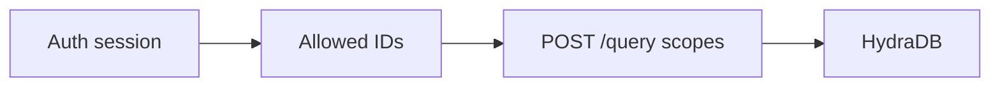
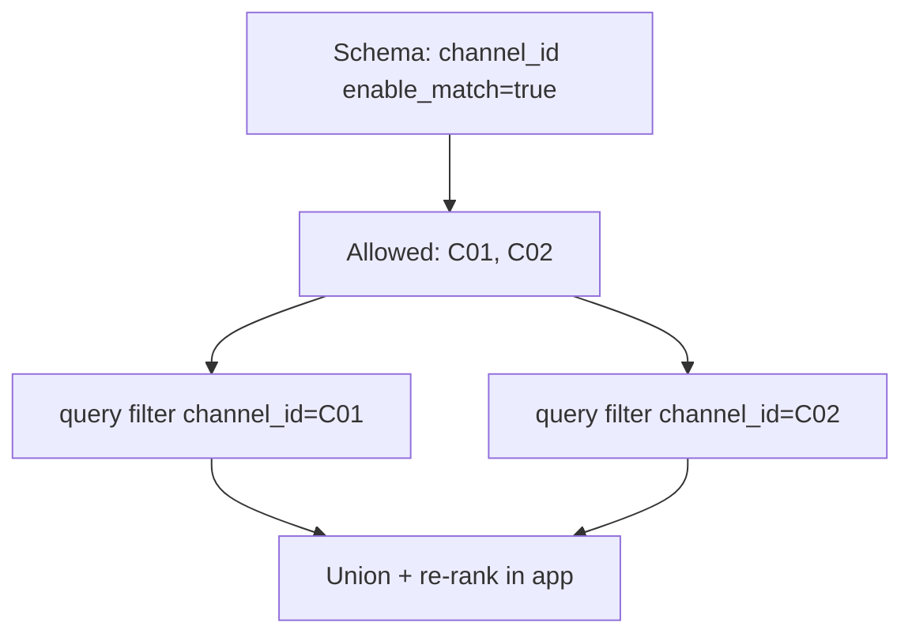

Authorization lives in **your app**. HydraDB enforces the scopes you send. This page shows compositions that match real ACL sets without fighting filter semantics.

Related: [Metadata](/essentials/v2/metadata) · [Collections Fanout](/essentials/v2/scope-composition/collections-fanout) · [App Sources](/essentials/v2/app-sources)

---

## Principle

Resolve the caller’s allowed partition IDs **before** `POST /query`. Pass only those IDs into `collections` (or into per-value equality queries). Never query wide and hide rows in the UI.



---

## Pattern 1 — Partition per ACL boundary (recommended)

**Example:** each Slack channel → `collection = channel_id` at ingest.

**Query:** `collections: […channel ids the user may read…]` (max 100).

| Pros | Cons |
| --- | --- |
| One round trip; matches fanout API | Many collections to manage |
| No metadata OR/IN limitation | Cap at 100 per call |

```json
{
  "database": "company",
  "collections": ["C01", "C02", "C05"],
  "query": "What did we decide about pricing?",
  "type": "knowledge",
  "query_apps": true,
  "query_by": "hybrid",
  "mode": "thinking"
}
```

---

## Pattern 2 — Parallel equality filters + union

**When:** everything already lives in one shared collection with schema-backed `metadata.channel_id` (or `department`).

**Prefer Pattern 1 for authorization.** Use Pattern 2 only when you cannot remap to per-boundary collections — and only after the schema prerequisites below are met.

### Schema prerequisite (mandatory)

Undeclared top-level `metadata_filters` keys are **silently ignored** at query time ([Metadata](/essentials/v2/metadata)). If `channel_id` is missing from `database_metadata_schema` or lacks `enable_match: true`, a filter like `{ "channel_id": "C01" }` does **nothing** — the query searches the **entire** shared collection and can return unauthorized channels.

Before any ACL-shaped ingest or query:

1. Declare the field on the database (at [`POST /databases`](/api-reference/v2/endpoint/create-tenant) or additive [`PATCH .../metadata-schema`](/api-reference/v2/endpoint/update-metadata-schema)):

```json
{
  "name": "channel_id",
  "data_type": "VARCHAR",
  "enable_match": true
}
```

2. Ingest every source with schema `metadata.channel_id` set to that channel’s id (not only `additional_metadata`).
3. **Verify** in a non-prod database: query with a channel id that has **no** sources → expect **empty** results. If you still see other channels’ content, the filter is not active — stop and fix the schema before shipping.

`metadata_filters` also cannot express `channel_id IN (C01,C02)` — arrays are **exact set equality**, not OR/IN ([semantics](/essentials/v2/metadata#filter-semantics)).

### Query shape



```json
{
  "database": "company",
  "collection": "slack_export",
  "query": "pricing decision",
  "type": "knowledge",
  "metadata_filters": { "channel_id": "C01" }
}
```

Repeat per allowed id; merge results client-side. Never omit `metadata_filters` on these calls.

<Warning>
  **Silent-filter hazard:** An undeclared or non-`enable_match` ACL field turns Pattern 2 into an unscoped shared-collection search. Treat schema + empty-result verification as part of the security boundary — same severity as forgetting the filter entirely.
</Warning>

---

## Pattern 3 — Single-partition session

If the UI is already inside one channel / workspace / dept, pass that one collection (or one equality filter). Simplest and fastest.

---

## Unsafe patterns

| Pattern | Why it fails |
| --- | --- |
| Unscoped company-wide `query_apps: true` | Private channels in the same DB surface |
| One workspace collection for all channels with mixed membership | Over-shares private channels |
| `metadata_filters: { "channel_id": ["C01","C02"] }` as OR | Exact set match; won’t match single-id sources |
| ACL field not in schema / `enable_match` false | Filter **silently ignored** → full shared collection searched |
| Filter in UI after broad query | Authorization bypass if any code path skips the filter |

---

## Departments and projects

Same recipes:

- **Dept = collection** → fan out allowed depts with `collections` (preferred for ACL)
- **Dept = metadata** on a shared collection → declare `department` with `enable_match: true`, verify empty-result behavior, then parallel equality queries + union
- **Project + user Memories** → dual-store composition ([Dual-Store Scope](/essentials/v2/scope-composition/dual-store))

---

## Next

- [Anti-Patterns](/essentials/v2/scope-composition/anti-patterns)
- [Checklist](/essentials/v2/scope-composition/checklist)
