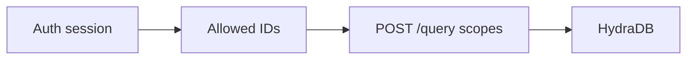
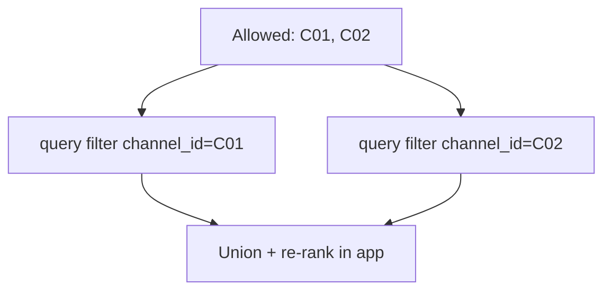

Authorization lives in **your app**. HydraDB enforces the scopes you send. This page shows compositions that match real ACL sets without fighting filter semantics.

Related: [Metadata](/essentials/v2/metadata) · [Collections Fanout](/essentials/v2/scope-composition/collections-fanout) · [App Sources](/essentials/v2/app-sources)

---

## Principle

Resolve the caller’s allowed partition IDs **before** `POST /query`. Pass only those IDs into `collections` (or into per-value equality queries). Never query wide and hide rows in the UI.



---

## Pattern 1 — Partition per ACL boundary (recommended)

**Example:** each Slack channel → `collection = channel_id` at ingest.

**Query:** `collections: […channel ids the user may read…]` (max 100).

| Pros | Cons |
| --- | --- |
| One round trip; matches fanout API | Many collections to manage |
| No metadata OR/IN limitation | Cap at 100 per call |

```json
{
  "database": "company",
  "collections": ["C01", "C02", "C05"],
  "query": "What did we decide about pricing?",
  "type": "knowledge",
  "query_apps": true,
  "query_by": "hybrid",
  "mode": "thinking"
}
```

---

## Pattern 2 — Parallel equality filters + union

**When:** everything already lives in one shared collection with `metadata.channel_id` (or `department`).

`metadata_filters` cannot express `channel_id IN (C01,C02)` — arrays are **exact set equality**, not OR/IN ([semantics](/essentials/v2/metadata#filter-semantics)).

**Do this instead:**



```json
{
  "database": "company",
  "collection": "slack_export",
  "query": "pricing decision",
  "type": "knowledge",
  "metadata_filters": { "channel_id": "C01" }
}
```

Repeat per allowed id; merge results client-side.

---

## Pattern 3 — Single-partition session

If the UI is already inside one channel / workspace / dept, pass that one collection (or one equality filter). Simplest and fastest.

---

## Unsafe patterns

| Pattern | Why it fails |
| --- | --- |
| Unscoped company-wide `query_apps: true` | Private channels in the same DB surface |
| One workspace collection for all channels with mixed membership | Over-shares private channels |
| `metadata_filters: { "channel_id": ["C01","C02"] }` as OR | Exact set match; won’t match single-id sources |
| Filter in UI after broad query | Authorization bypass if any code path skips the filter |

---

## Departments and projects

Same recipes:

- **Dept = collection** → fan out allowed depts with `collections`
- **Dept = metadata** on a shared collection → parallel equality queries + union
- **Project + user Memories** → dual-store composition ([Dual-Store Scope](/essentials/v2/scope-composition/dual-store))

---

## Next

- [Anti-Patterns](/essentials/v2/scope-composition/anti-patterns)
- [Checklist](/essentials/v2/scope-composition/checklist)
