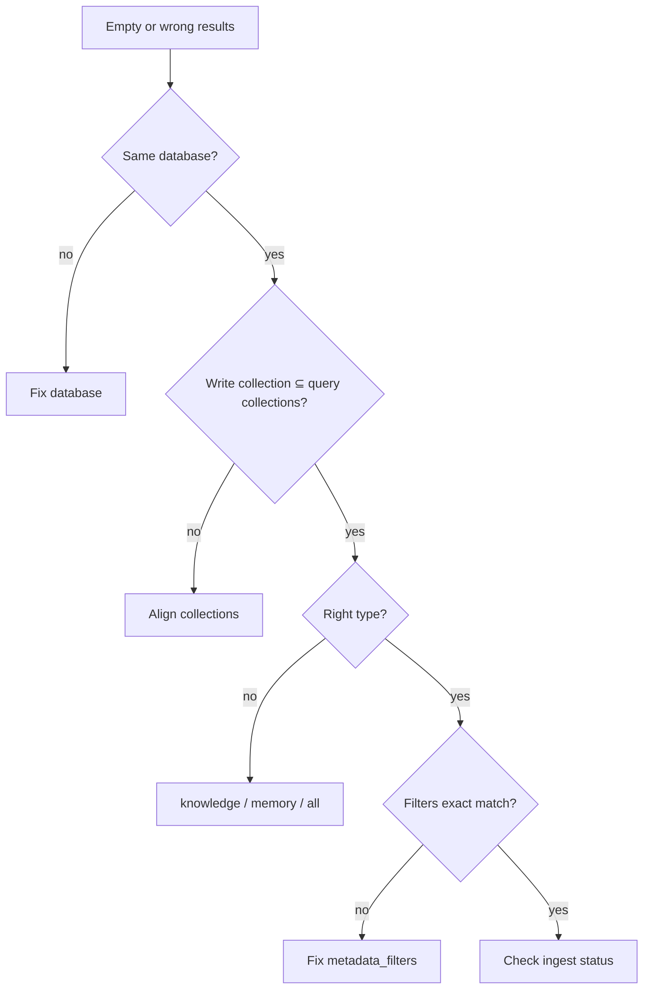

---

## 1. Write `user_a`, read default

<AccordionGroup>
  <Accordion title="Problem">
    Ingest succeeded; query returns empty.
  </Accordion>
  <Accordion title="Why">
    Memory/Knowledge written with `collection=user_a`; query omitted `collection` (default) or used another id.
  </Accordion>
  <Accordion title="Fix">
    Same collection on write and read. Log both sides. See [Multi-tenant](/essentials/v2/multi-tenant).
  </Accordion>
</AccordionGroup>

---

## 2. `type: "all"` with only the user collection

<AccordionGroup>
  <Accordion title="Problem">
    Personalization works; shared docs never appear.
  </Accordion>
  <Accordion title="Why">
    Knowledge lives in `default` / team collection; query scoped only to `user_id`.
  </Accordion>
  <Accordion title="Fix">
    Dual query or `collections: ["default", "user_id"]`. See [Dual-Store Scope](/essentials/v2/scope-composition/dual-store).
  </Accordion>
</AccordionGroup>

---

## 3. Metadata as customer isolation

<AccordionGroup>
  <Accordion title="Problem">
    Cross-tenant leak when a filter is forgotten.
  </Accordion>
  <Accordion title="Why">
    Two customers share one `database`; “security” is `customer_id` metadata.
  </Accordion>
  <Accordion title="Fix">
    One `database` per customer. Metadata only refines inside that boundary.
  </Accordion>
</AccordionGroup>

---

## 4. Fanout includes unauthorized collections

<AccordionGroup>
  <Accordion title="Problem">
    User sees another workspace’s Knowledge.
  </Accordion>
  <Accordion title="Why">
    App builds `collections` from a stale cache or “all workspaces in org” without membership checks.
  </Accordion>
  <Accordion title="Fix">
    Derive the list from the authenticated session every request. Treat `collections` as an allowlist.
  </Accordion>
</AccordionGroup>

---

## 5. Metadata array as OR/IN

<AccordionGroup>
  <Accordion title="Problem">
    Empty results or wrong matches for multi-channel ACL.
  </Accordion>
  <Accordion title="Why">
    `metadata_filters: { channel_id: ["C01","C02"] }` is exact set equality, not IN.
  </Accordion>
  <Accordion title="Fix">
    Channel-per-collection fanout, or parallel equality queries + union. [ACL Partitions](/essentials/v2/scope-composition/acl-partitions).
  </Accordion>
</AccordionGroup>

---

## 6. Staging database in production agents

<AccordionGroup>
  <Accordion title="Problem">
    Prod traffic hits `*_staging` data (or the reverse).
  </Accordion>
  <Accordion title="Why">
    Environment encoded in collection/metadata instead of separate databases; config mixup.
  </Accordion>
  <Accordion title="Fix">
    Separate `database` per environment. Pin config in deployment.
  </Accordion>
</AccordionGroup>

---

## 7. Oversized fanout

<AccordionGroup>
  <Accordion title="Problem">
    Slow queries, mushy ranking, approaching the 100-collection cap.
  </Accordion>
  <Accordion title="Why">
    Passing every channel the user ever joined.
  </Accordion>
  <Accordion title="Fix">
    Rank/truncate allowed set; prefer session-scoped single collection when the UI allows.
  </Accordion>
</AccordionGroup>

---

## Diagnostic flow

Also walk [Architecture → Operational mental model](/essentials/v2/architecture#operational-mental-model): status → scope → filters.

---

## Next

[Checklist](/essentials/v2/scope-composition/checklist)
