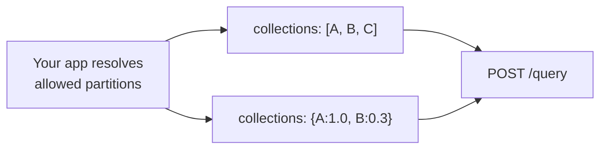
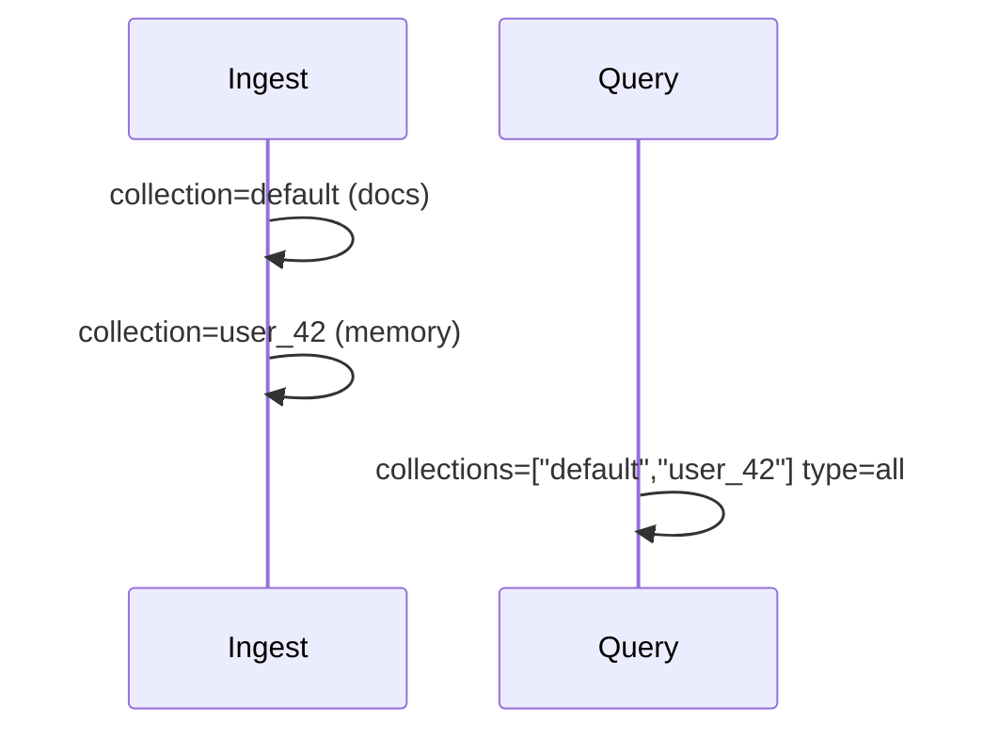

At query time, prefer **`collections`** over a lone `collection` when you need one call across multiple partitions. Full parameter notes: [Query → Scope](/essentials/v2/query#scope).

---

## Three shapes

| Shape | Example | Behavior |
| --- | --- | --- |
| Single-item list | `["user_42"]` | One partition (same idea as `collection`) |
| Multi-item list | `["default", "user_42"]` | Fan out; equal normalized weights |
| Weighted object | `{ "ws_a": 1.0, "ws_b": 0.5 }` | Fan out with relative ranking weights (max one decimal place) |

**Maximum:** 100 collections per query.



---

## Equal fanout (list)

Use when every listed partition is equally trusted for this request — e.g. shared Knowledge default **plus** the user Memory collection:

```json
{
  "database": "acme_corp",
  "collections": ["default", "user_42"],
  "query": "refund policy",
  "type": "all",
  "query_by": "hybrid",
  "mode": "thinking"
}
```

This is the one-call alternative to dual query when you want a merged ranking and both partitions hold the data you need.

---

## Weighted fanout (object)

Use when one workspace should outrank another but both remain eligible:

```json
{
  "database": "acme_corp",
  "collections": { "ws_primary": 1.0, "ws_archive": 0.3 },
  "query": "Q3 pricing decision",
  "type": "knowledge",
  "query_by": "hybrid"
}
```

Weights are relative ranking hints (at most one decimal place), not access control. **Unauthorized partitions must not appear in the object at all.**

---

## Fanout vs multiple HTTP calls

| Approach | When |
| --- | --- |
| One query + `collections` | Same `type` / prompt formatting; merged ranking is fine |
| Multiple queries | Different prompt sections (Knowledge vs Memory), different `metadata_filters`, or OR over metadata equality values |
| Client union | Documented path when metadata needs OR/IN semantics |

---

## Limits and practical caps

- Hard cap: **100** collections.
- Slack channel ACLs with hundreds of memberships: page the allowed set, query the top-N relevant channels, or keep session UI single-channel (`collections: ["C0…"]`).
- Huge fanouts increase latency and dilute ranking — prefer the smallest allowed set.

---

## Ingest still uses singular `collection`

Fanout is a **query** feature. Each ingest call writes to one `collection` (or default). Plan IDs so query-time lists can name those partitions.



---

## Next

- [Dual-Store Scope](/essentials/v2/scope-composition/dual-store)
- [ACL Partitions](/essentials/v2/scope-composition/acl-partitions)
